# Vue3 Diff算法的整体流程详解

亲爱的徒弟，非常高兴能够给你详细讲解Vue3的diff算法。作为你的师傅，我会尽可能地用通俗易懂的方式，同时保留技术细节的准确性，来帮助你彻底理解这个复杂的主题。

## 一、通过类比理解Vue3 Diff算法

想象你是一位整理超市货架的员工，每天晚上需要根据第二天销售计划调整货架上的商品排列：

**Vue2的员工**：必须检查每一个货架的每一件商品，即使只有少数几件商品需要移动或更换。这种方式耗时且低效。

**Vue3的员工**：拿着一份智能清单，上面不仅标记了"哪些货架有商品需要调整"，还精确到"每个货架上哪些具体位置的商品需要更换或移动"。这样可以直接定位需要工作的地方，大大提高效率。

这就是Vue3 diff算法的核心思想——通过编译时的标记和运行时的精确定位，避免无谓的DOM操作，提升渲染性能。

## 二、Vue3 Diff算法的整体流程

Vue3的diff算法流程分为两大部分：**编译时优化**和**运行时优化**。这两部分相辅相成，共同构成了Vue3高效的更新机制。

### 1. 编译时优化

在模板编译阶段，Vue3就为将来的diff操作做了充分准备：

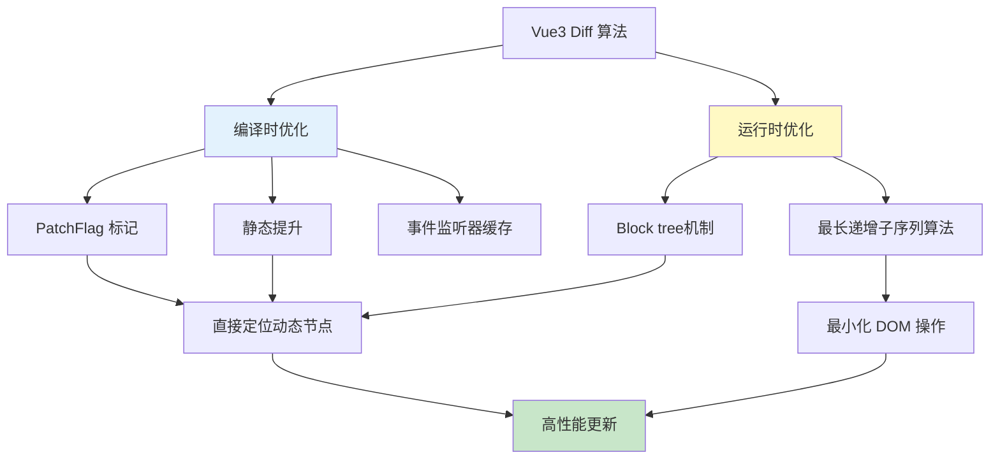

#### 1.1 PatchFlag标记

Vue3会在编译阶段为动态节点添加标记，告诉运行时引擎该节点的哪些部分可能会变化：

```js
// Vue3编译后的render函数
function render(_ctx, _cache) {
  return (_openBlock(), _createBlock("div", null, [
    // 静态节点，没有PatchFlag
    _createVNode("h1", null, "标题"),
    
    // 动态文本节点，PatchFlag为1
    _createVNode("p", null, _toDisplayString(_ctx.message), 1 /* TEXT */),
    
    // 动态属性节点，PatchFlag为8
    _createVNode("div", { id: _ctx.id }, "内容", 8 /* PROPS */, ["id"]),
    
    // 动态绑定多个属性，PatchFlag为16
    _createVNode("button", {
      class: _ctx.btnClass,
      onClick: _ctx.handleClick
    }, "点击", 16 /* FULL_PROPS */)
  ]))
}
```

PatchFlag的值表示节点的动态类型：

- 1: 动态文本内容
- 2: 动态Class
- 4: 动态Style
- 8: 动态Props
- 16: 全动态Props
- 32: 有动态子节点的组件
- 64: 有key的子节点顺序会变化

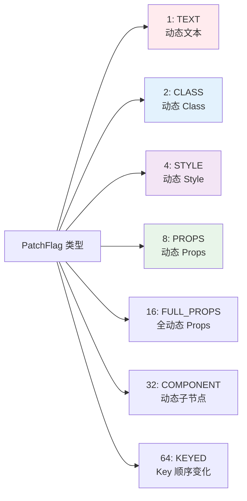

#### 1.2 静态提升

Vue3会将永远不变的节点提升到渲染函数外部，这样它们只会被创建一次：

```js
// 静态节点被提升到render函数外部
const _hoisted_1 = /*#__PURE__*/_createVNode("h1", null, "这是永远不变的标题", -1 /* HOISTED */)
const _hoisted_2 = /*#__PURE__*/_createVNode("div", { class: "static-class" }, "静态内容", -1 /* HOISTED */)

// 渲染函数中直接使用提升后的节点
function render(_ctx, _cache) {
  return (_openBlock(), _createBlock("div", null, [
    _hoisted_1,
    _hoisted_2,
    _createVNode("p", null, _toDisplayString(_ctx.dynamicText), 1 /* TEXT */)
  ]))
}
```

#### 1.3 事件侦听器缓存

Vue3会缓存内联事件处理函数，避免不必要的重新创建：

```js
function render(_ctx, _cache) {
  return (_openBlock(), _createBlock("button", {
    onClick: _cache[1] || (_cache[1] = (...args) => (_ctx.handleClick(...args)))
  }, "点击我"))
}
```

### 2. 运行时优化：Block tree和快速Diff算法

#### 2.1 Block tree机制（结合源码）

##### 2.1.1 为什么还需要 Block？

很多人看到 PatchFlag 就以为"打了标记，diff 时认标记就行"，但这里有一个根本问题：**patchFlag 只描述"某个节点自身怎么变"，不告诉运行时"哪些节点是动态的"**。传统的 vnode diff 只能从根 vnode 出发，按父子结构一层一层递归下来——哪怕中间有 100 层静态 `<div>`，也得一层层走下去才能走到那唯一的动态文本。

Vue3 的做法是：**在编译阶段就把"某段模板里所有动态 vnode 的引用"扁平地收集起来，挂在一个"块根 vnode"上**，运行时 patch 时直接沿着这份扁平数组走，跳过所有静态的中间层级。这就是 block。

> 源码注释（`packages/runtime-core/src/vnode.ts`）原话：
> "once we consider v-if branches and each v-for fragment a block, we can divide a template into nested blocks, and within each block the node structure would be stable. This allows us to skip most children diffing and only worry about the dynamic nodes."
>
> 翻译：只要把 v-if 的每个分支、v-for 的每个 fragment 视为一个 block，模板就被切成嵌套的 block，**每个 block 内部的节点结构是稳定的**，因此我们可以跳过大部分孩子 diff，只关心动态节点。

##### 2.1.2 收集动态节点的核心数据结构

源码里只有三个全局变量在维持整个机制（`runtime-core/src/vnode.ts`）：

```ts
// 块栈：处理嵌套 block 时用的"当前所在 block"栈
export const blockStack: VNode['dynamicChildren'][] = []
// 当前正在被收集的动态子节点数组（栈顶）
export let currentBlock: VNode['dynamicChildren'] = null
// 是否启用 block 收集，可被 v-once / cloneVNode 等临时关闭
export let isBlockTreeEnabled = 1
```

开启/关闭一个 block：

```ts
export function openBlock(disableTracking = false): void {
  // disableTracking=true 出现在 v-for 上：v-for fragment 的 children
  // 本身长度/顺序都会变，不能把它们视作"结构稳定"的动态节点集合
  blockStack.push((currentBlock = disableTracking ? null : []))
}

export function closeBlock(): void {
  blockStack.pop()
  currentBlock = blockStack[blockStack.length - 1] || null
}
```

`createBaseVNode` 里创建每一个普通 vnode 时，会**顺手把自己推进 currentBlock**——前提是它是动态的：

```ts
if (
  isBlockTreeEnabled > 0 &&
  !isBlockNode &&                  // block 根自己不进自己的数组
  currentBlock &&                  // 处在某个 block 内部
  (vnode.patchFlag > 0 || shapeFlag & ShapeFlags.COMPONENT) &&
  vnode.patchFlag !== PatchFlags.NEED_HYDRATION
) {
  currentBlock.push(vnode)
}
```

几个细节很关键：

- **只有带 patchFlag 的节点（或组件 vnode）才会被收集**——这就是"直接定位动态节点"的来源。
- **静态节点不带 patchFlag → 不进 currentBlock → 运行时完全不看它**。
- `shapeFlag & COMPONENT` 也会被收集：因为组件 vnode 即便看起来静态，也要保留 instance 引用以便后续卸载/更新。

`createElementBlock` / `createBlock` 在块根 vnode 上"封顶"，把 currentBlock 挂到 `dynamicChildren`：

```ts
function setupBlock(vnode: VNode) {
  vnode.dynamicChildren =
    isBlockTreeEnabled > 0 ? currentBlock || (EMPTY_ARR as any) : null
  closeBlock()
  // block 本身作为一个整体，要被推入它外层的 block
  if (isBlockTreeEnabled > 0 && currentBlock) {
    currentBlock.push(vnode)
  }
  return vnode
}
```

注意最后那句 `currentBlock.push(vnode)`：**一个 block 整体会作为一个节点出现在它外层 block 的 dynamicChildren 里**，这就是"Block Tree"——外层 block 把内层 block 当作一个动态节点来引用，形成一棵**只由动态节点与 block 边界组成的树**。

##### 2.1.3 编译器生成的实际代码

看一段真实的模板和它的编译产物就能感受出扁平化的威力：

```html
<!-- 模板 -->
<div class="wrapper">
  <header>
    <h1>Static Title</h1>
    <p>Static paragraph</p>
  </header>
  <section>
    <div class="card">
      <span>{{ msg }}</span>
    </div>
  </section>
</div>
```

Vue3 编译产物（关键部分）：

```js
const _hoisted_1 = /*#__PURE__*/_createElementVNode("header", null, [
  /*#__PURE__*/_createElementVNode("h1", null, "Static Title"),
  /*#__PURE__*/_createElementVNode("p", null, "Static paragraph")
], -1 /* HOISTED */)

function render(_ctx) {
  return (_openBlock(), _createElementBlock("div", { class: "wrapper" }, [
    _hoisted_1,                                          // 整棵静态子树，-1 不进 block
    _createElementVNode("section", null, [
      _createElementVNode("div", { class: "card" }, [
        _createElementVNode("span", null,
          _toDisplayString(_ctx.msg), 1 /* TEXT */)       // 唯一的动态节点
      ])
    ])
  ]))
}
```

这棵 vnode 树在内存里有 5 层，但 `wrapper` 这个 block 的 `dynamicChildren` **长度为 1**，里面只有那个 `<span>{{ msg }}</span>` 的 vnode。msg 变化时，Vue 完全不会去看 `<section>`、`<div class="card">` 这些静态中间层。

##### 2.1.4 嵌套 Block：v-if 与 v-for

为什么 v-if 分支和 v-for 各自要开一个新 block？因为它们会让结构本身发生变化，外层 block 无法保证"孩子位置一一对应"。编译器的处理大致是：

```html
<div>
  <p>{{ title }}</p>
  <ul>
    <li v-for="item in list" :key="item.id">{{ item.text }}</li>
  </ul>
  <footer v-if="showFooter">{{ footerText }}</footer>
</div>
```

```js
function render(_ctx) {
  return (_openBlock(), _createElementBlock("div", null, [
    _createElementVNode("p", null, _toDisplayString(_ctx.title), 1 /* TEXT */),

    _createElementVNode("ul", null, [
      // v-for: openBlock(true) → disableTracking=true，currentBlock = null
      // fragment 自己作为 block 被外层收集
      (_openBlock(true), _createElementBlock(_Fragment, null,
        _renderList(_ctx.list, (item) => {
          return (_openBlock(), _createElementBlock("li", { key: item.id },
            _toDisplayString(item.text), 1 /* TEXT */))
        }), 128 /* KEYED_FRAGMENT */))
    ]),

    // v-if: 条件分支整体作为 block
    _ctx.showFooter
      ? (_openBlock(), _createElementBlock("footer", { key: 0 },
          _toDisplayString(_ctx.footerText), 1 /* TEXT */))
      : _createCommentVNode("v-if", true)
  ]))
}
```

对应的 block tree 结构如下：

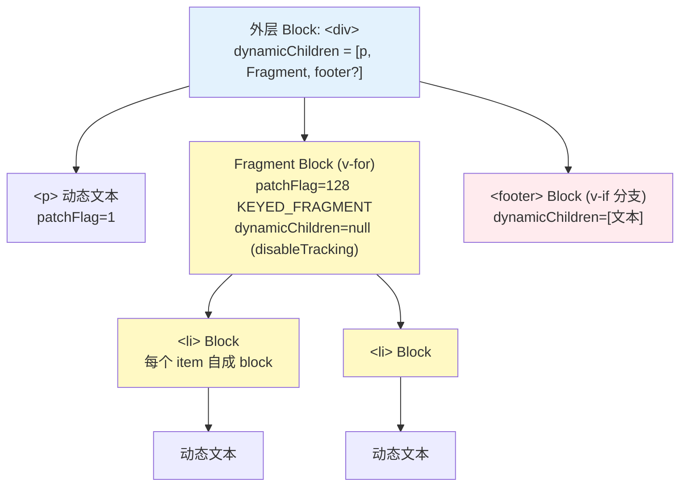

几个细节：

- **v-for 的 fragment 用 `openBlock(true)` 禁用追踪**：因为 fragment 的孩子列表顺序、数量完全由数据决定，没有"稳定结构"可言，所以这一层不做扁平收集，而是走完整的快速 diff（也就是前面第 2.2 节讲的带 LIS 的那套算法）。
- **v-if 的每个分支是独立 block**：分支切换时（比如从 `<footer>` 变成 `<!---->` 注释节点），块根 vnode 类型本身都变了，外层只需把它当成一个动态节点整体 patch/替换。
- **嵌套 block 自动形成树**：靠的是 `setupBlock` 最后那句 `currentBlock.push(vnode)`，内层 block 会出现在外层 block 的 `dynamicChildren` 中。

##### 2.1.5 运行时怎么用 dynamicChildren？

看 `runtime-core/src/renderer.ts` 里的 `patchElement`：

```ts
// n2 是新 vnode；如果它带 dynamicChildren，直接走 block 快速路径
if (dynamicChildren) {
  patchBlockChildren(
    n1.dynamicChildren!,   // 旧 block 收集的动态节点数组
    dynamicChildren,       // 新 block 收集的动态节点数组
    el,
    parentComponent,
    parentSuspense,
    resolveChildrenNamespace(n2, namespace),
    slotScopeIds,
  )
} else if (!optimized) {
  // 没有 dynamicChildren，退回到传统的完整 children diff
  patchChildren(n1, n2, el, /* ... */)
}
```

而 `patchBlockChildren` 本身几乎什么都没做——就是**线性遍历两个扁平数组，一一对应 patch**：

```ts
const patchBlockChildren: PatchBlockChildrenFn = (
  oldChildren, newChildren, fallbackContainer, /* ... */
) => {
  for (let i = 0; i < newChildren.length; i++) {
    const oldVNode = oldChildren[i]
    const newVNode = newChildren[i]
    // Fragment/不同类型/组件/Teleport/Suspense 需要真实 parent
    const container =
      oldVNode.el &&
      (oldVNode.type === Fragment ||
        !isSameVNodeType(oldVNode, newVNode) ||
        oldVNode.shapeFlag &
          (ShapeFlags.COMPONENT | ShapeFlags.TELEPORT | ShapeFlags.SUSPENSE))
        ? hostParentNode(oldVNode.el)!
        : fallbackContainer
    patch(oldVNode, newVNode, container, null, /* ... */, true /* optimized */)
  }
}
```

注意这里的两个关键点：

1. **数组是按编译时顺序一一对应的**，所以不需要 key、不需要查找、不需要 LIS，直接 `for` 循环就是 O(n)，其中 n 是**动态节点数**，而不是整棵树的节点数。
2. **遇到内层 block vnode 时，`patch` 会递归进入 `patchElement`**，因为内层 block vnode 自己也有 `dynamicChildren`，于是继续走快速路径——block tree 的"跳跃式递归"就是这样层层展开的。

##### 2.1.6 什么时候会"退出"block 优化？

源码里至少有这些 bail-out（降级为完整 diff）的情况，面试里经常会追问：

- **cloneVNode**：`createVNode` 检测到传进来的 `type` 已经是 vnode，会走克隆逻辑，并把 `patchFlag` 设为 `PatchFlags.BAIL`（`-2`），意思是"这棵子树放弃 block 优化"。
- **HMR 更新时**：`patchElement` 里 `if (__DEV__ && isHmrUpdating)` 会把 `dynamicChildren = null`，强制走完整 diff，保证热更新正确性。
- **v-for fragment 的 children**：上面说过，结构本身会变，只能用完整快速 diff 处理这一层。
- **动态组件 `<component :is="...">` 指向一个运行时 vnode**：进入克隆分支，同样降级。
- **用户手写 render 函数**：没有编译器注入 patchFlag，所有节点都会被视作动态，此时 block tree 实际没什么收益，但也不影响正确性。

##### 2.1.7 小结

一句话概括：**Block Tree = 用编译时的静态分析，在 vnode 树上额外架一条"只穿过动态节点的快速通道"**。

- 编译器负责把动态节点"扁平化"塞进 `dynamicChildren`；
- `v-if` 分支 / `v-for` fragment 作为嵌套 block，把"结构会变"的部分圈进独立的小盒子；
- 运行时 `patchBlockChildren` 沿着这条快速通道线性走，静态层级完全不访问；
- 遇到"结构不稳定"或用户自定义 render 时优雅降级，保证正确性优先。

这就是为什么 Vue3 号称"**更新复杂度与模板大小无关，只与动态绑定数量有关**"。

##### 2.1.8 端到端完整示例：一次更新中，静态节点到底被访问了几次？

很多人读到这里仍然有两个疑惑，我们用一个具代表性的例子把它彻底走通：

> ❓ **Q1**：静态节点真的完全不被遍历吗？
> ❓ **Q2**：嵌套层级深时，是不是只遍历 block tree 里的节点？

**先给结论**：
- **首次渲染时**——静态节点**会被访问**（因为要真实地创建 DOM），但只访问一次。
- **更新时**——如果父元素是 block，**完全跳过**所有静态节点，无论嵌套多深，只沿着 `dynamicChildren` 指针跳跃前进。

下面我们用一棵"5 层嵌套 + 1 个动态文本 + 1 个 v-if + 1 个 v-for"的典型组件，一步步走完编译 → 首次渲染 → 更新的全链路。

---

**Step 1：模板**

```html
<template>
  <div class="page">                          <!-- L1 -->
    <header class="header">                   <!-- L2 静态 -->
      <div class="logo">                      <!-- L3 静态 -->
        <h1>My Blog</h1>                      <!-- L4 静态 -->
        <span class="version">v1.0.0</span>   <!-- L4 静态 -->
      </div>
      <nav>
        <a href="/">Home</a>                  <!-- 静态 -->
        <a href="/about">About</a>            <!-- 静态 -->
      </nav>
    </header>

    <main class="main">                       <!-- L2 -->
      <section class="hero">                  <!-- L3 -->
        <div class="title-wrapper">           <!-- L4 静态 -->
          <h2>{{ title }}</h2>                <!-- L5 动态文本 ① -->
        </div>
      </section>

      <section v-if="showList" class="list">  <!-- v-if block ② -->
        <p>Total: {{ total }}</p>             <!-- 动态文本 -->
        <ul>
          <li v-for="item in items"           <!-- v-for block ③ -->
              :key="item.id">
            {{ item.text }}
          </li>
        </ul>
      </section>
    </main>

    <footer>© 2026</footer>                   <!-- 静态 -->
  </div>
</template>
```

这棵模板在"自然树形"下有 **20+ 个 vnode**，但其中真正动态的只有 3 处：`title`、`total`、`item.text`，外加一个 v-if 分支开关。

---

**Step 2：编译产物（真实 compiler 输出风格）**

```js
import {
  createElementVNode as _createElementVNode,
  createElementBlock as _createElementBlock,
  openBlock as _openBlock,
  createCommentVNode as _createCommentVNode,
  Fragment as _Fragment,
  renderList as _renderList,
  toDisplayString as _toDisplayString,
  normalizeClass as _normalizeClass,
} from "vue"

// 🔵 静态子树被提升（hoist）到 render 外，只创建一次
const _hoisted_header = /*#__PURE__*/_createElementVNode(
  "header", { class: "header" },
  [
    _createElementVNode("div", { class: "logo" }, [
      _createElementVNode("h1", null, "My Blog"),
      _createElementVNode("span", { class: "version" }, "v1.0.0")
    ]),
    _createElementVNode("nav", null, [
      _createElementVNode("a", { href: "/" }, "Home"),
      _createElementVNode("a", { href: "/about" }, "About")
    ])
  ], -1 /* HOISTED */
)
const _hoisted_title_wrapper_open = /*#__PURE__*/_createElementVNode(
  "div", { class: "title-wrapper" }, null, -1 /* ← 实际会以结构拆分 */)
const _hoisted_footer = /*#__PURE__*/_createElementVNode(
  "footer", null, "© 2026", -1 /* HOISTED */)

export function render(_ctx, _cache) {
  return (_openBlock(), _createElementBlock("div", { class: "page" }, [
    _hoisted_header,                                         // -1，不进 block

    _createElementVNode("main", { class: "main" }, [
      _createElementVNode("section", { class: "hero" }, [
        _createElementVNode("div", { class: "title-wrapper" }, [
          _createElementVNode("h2", null,
            _toDisplayString(_ctx.title),
            1 /* TEXT */)                                    // ① 动态
        ])
      ]),

      // ② v-if：条件分支自成 block
      (_ctx.showList)
        ? (_openBlock(), _createElementBlock("section",
            { key: 0, class: "list" }, [
            _createElementVNode("p", null,
              "Total: " + _toDisplayString(_ctx.total),
              1 /* TEXT */),
            _createElementVNode("ul", null, [
              // ③ v-for：fragment block，disableTracking=true
              (_openBlock(true), _createElementBlock(
                _Fragment, null,
                _renderList(_ctx.items, (item) => {
                  return (_openBlock(), _createElementBlock("li",
                    { key: item.id },
                    _toDisplayString(item.text),
                    1 /* TEXT */))
                }),
                128 /* KEYED_FRAGMENT */))
            ])
          ]))
        : _createCommentVNode("v-if", true),

    _hoisted_footer                                          // -1，不进 block
  ]))
}
```

可以看到**编译器只在三个地方调用了 `_openBlock`**：

1. 最外层 `<div class="page">`（组件根）；
2. v-if 的 `<section class="list">` 分支；
3. v-for 的 `<Fragment>`，以及 fragment 内每个 `<li>`（每个 item 都是独立 block，保证列表稳定）。

---

**Step 3：运行时构造的 VNode 树 vs Block Tree**

我用两种视角画同一棵树。左边是"自然的父子结构"，右边是"dynamicChildren 指针链"——**更新时 Vue 只走右边**。

```mermaid
graph TD
    subgraph VNode_Tree["VNode 树（父子结构，20+ 节点，首次渲染按这个遍历）"]
        R["div.page &#40;Block&#41;"]
        R --> HD["header &#40;HOISTED&#41;"]
        R --> M["main"]
        R --> V["v-if? section.list &#40;Block&#41; : Comment"]
        R --> F["footer &#40;HOISTED&#41;"]

        M --> HERO["section.hero"]
        HERO --> TW["div.title-wrapper"]
        TW --> H2["h2 — {{title}} ①"]

        HD --> HL["div.logo"]
        HL --> HH1["h1 &#40;static&#41;"]
        HL --> HSP["span.version &#40;static&#41;"]
        HD --> NAV["nav"]
        NAV --> A1["a Home"]
        NAV --> A2["a About"]

        V --> PTotal["p — {{total}}"]
        V --> UL["ul"]
        UL --> FRAG["Fragment &#40;v-for Block&#41;"]
        FRAG --> Li1["li &#40;Block&#41; {{item.text}}"]
        FRAG --> LiN["li &#40;Block&#41; {{item.text}}"]
    end

    style R fill:#e3f2fd,stroke:#1976d2,stroke-width:2px
    style V fill:#fff9c4,stroke:#f9a825,stroke-width:2px
    style FRAG fill:#fff9c4,stroke:#f9a825,stroke-width:2px
    style Li1 fill:#fff9c4,stroke:#f9a825,stroke-width:2px
    style LiN fill:#fff9c4,stroke:#f9a825,stroke-width:2px
    style HD fill:#eeeeee
    style F fill:#eeeeee
    style HL fill:#eeeeee
    style HH1 fill:#eeeeee
    style HSP fill:#eeeeee
    style NAV fill:#eeeeee
    style A1 fill:#eeeeee
    style A2 fill:#eeeeee
    style HERO fill:#eeeeee
    style TW fill:#eeeeee
    style M fill:#eeeeee
    style H2 fill:#ffcdd2
    style PTotal fill:#ffcdd2
```

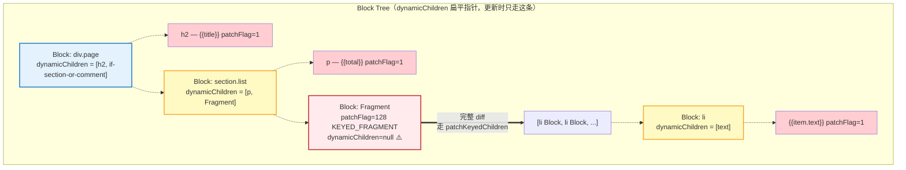

两张图的核心差异一眼可见：**block tree 上没有任何 `header`、`logo`、`h1`、`nav`、`a`、`main`、`hero`、`title-wrapper`、`footer` 这些静态节点的身影**。它们在 block tree 上根本不存在。

---

**Step 4：首次渲染——为什么静态节点此时必须被访问**

首次渲染时，Vue 没有旧 vnode 可参照，必须把整棵 DOM 树真正创建出来。调用链（`renderer.ts`）：

```
render(vnode, container)
  └─ patch(null, vnode, container)                        // n1 = null
       └─ processElement → mountElement(div.page)
            ├─ hostCreateElement("div")
            ├─ mountChildren([header, main, v-if?, footer], ...)
            │    │ // ⚠️ 就是这里：必须逐个创建每个孩子的 DOM
            │    ├─ patch(null, header)  → mountElement → mountChildren(...) 递归
            │    ├─ patch(null, main)    → mountElement → mountChildren(...) 递归
            │    ├─ patch(null, section) → mountElement → mountChildren(...) 递归
            │    └─ patch(null, footer)  → mountElement
            └─ hostInsert(el, container)
```

这里 `mountChildren` 走的是 `vnode.children`（自然父子结构），**不是 `dynamicChildren`**。看源码确认：

```ts
// renderer.ts - mountElement
if (shapeFlag & ShapeFlags.ARRAY_CHILDREN) {
  mountChildren(
    vnode.children as VNodeArrayChildren,   // ⚠️ 注意是 children 不是 dynamicChildren
    el, null, parentComponent, parentSuspense,
    resolveChildrenNamespace(vnode, namespace),
    slotScopeIds,
    optimized,
  )
}
```

所以**首次 mount 时所有节点都必须被访问**——不然 DOM 没人创建。静态节点（`patchFlag === -1`）创建完成后，由于它们不会出现在 `dynamicChildren` 数组中，**从此再也不会被 patch 访问**。

这个"HOISTED"还有一个额外福利：`_hoisted_header` 这个 vnode 对象本身在 render 外面只创建一次，每次 render 都复用同一个 vnode 引用。结合 vnode 上 `el` 字段持有真实 DOM 的引用，连"克隆 vnode"的成本都省了。

---

**Step 5：更新——block tree 真正起作用的时刻**

现在假设 `title` 变了，触发了组件重新渲染。产生了新的 vnode 树 `n2`，旧的是 `n1`。进入 `patch`：

```ts
// renderer.ts L374
const patch = (n1, n2, container, ...,
  optimized = !!n2.dynamicChildren,   // ⚠️ 关键开关：有 dynamicChildren → optimized=true
) => { ... }
```

**调用栈追踪：**

```
patch(oldRoot, newRoot)           // optimized=true，因为 newRoot.dynamicChildren 存在
  └─ processElement → patchElement(oldRoot, newRoot)
       │
       │  patchElement 源码关键分支（renderer.ts L862）：
       │  if (dynamicChildren) {
       │    patchBlockChildren(n1.dynamicChildren, dynamicChildren, el, ...)
       │  } else if (!optimized) {
       │    patchChildren(...)   // ← 传统的完整 diff，本例不会走这里
       │  }
       │
       └─ patchBlockChildren(
              oldRoot.dynamicChildren,   // [旧 h2, 旧 if-section]
              newRoot.dynamicChildren,   // [新 h2, 新 if-section]
              el, ...)
            │
            │  for 循环线性遍历 2 个元素：
            │
            ├─ patch(旧 h2, 新 h2)                    ← 进入 h2 的 patch
            │    └─ patchElement(旧 h2, 新 h2)
            │         │  h2.dynamicChildren = null（它不是 block，只是带 TEXT flag 的普通节点）
            │         │  所以跳过 patchBlockChildren
            │         │
            │         └─ 判断 patchFlag & PatchFlags.TEXT:
            │              hostSetElementText(el, "新的 title")  ✅ 更新完成
            │
            └─ patch(旧 section.list, 新 section.list)
                 └─ patchElement(...)
                      └─ patchBlockChildren(             ← 嵌套 block 递归进入
                           [旧 p, 旧 Fragment],
                           [新 p, 新 Fragment])
                           ├─ patch(旧 p, 新 p)  → hostSetElementText（total 没变也会比对字符串）
                           └─ patch(旧 Fragment, 新 Fragment)
                                └─ processFragment → patchKeyedChildren(...)
                                     └─ ... 列表没变，for 循环打平 patch 每个 li
                                          └─ 每个 li 是 block → 走各自的 patchBlockChildren
                                               └─ patch(旧 text, 新 text) → hostSetElementText
```

**整个更新过程被真正访问的节点一共是**：

| 节点 | 是否访问 | 访问原因 |
|---|---|---|
| `div.page` (根 block) | ✅ | patchElement 入口 |
| `h2` | ✅ | 根 block 的 dynamicChildren[0] |
| `section.list` (内层 block) | ✅ | 根 block 的 dynamicChildren[1] |
| `p` (Total) | ✅ | section.list 的 dynamicChildren[0] |
| `Fragment` (v-for) | ✅ | section.list 的 dynamicChildren[1] |
| 每个 `<li>` | ✅ | Fragment 的 children（走 patchKeyedChildren） |
| 每个 li 内的文本 | ✅ | li 的 dynamicChildren[0] |
| **`header`** | ❌ | HOISTED，不进 block |
| **`div.logo`** | ❌ | header 子节点，根本访问不到 |
| **`h1` / span.version** | ❌ | 同上 |
| **`nav` / `a` × 2** | ❌ | 同上 |
| **`main`** | ❌ | 静态，无 patchFlag |
| **`section.hero`** | ❌ | 静态，无 patchFlag |
| **`div.title-wrapper`** | ❌ | 静态，无 patchFlag |
| **`ul`** | ❌ | 静态，无 patchFlag |
| **`footer`** | ❌ | HOISTED |

这就是你问题的直接答案：**静态节点在更新阶段完全不被访问——不是"轻量处理"、不是"快速掠过"，而是彻底不进入 patch 函数**。它们在 `dynamicChildren` 指针链上根本不存在。

---

**Step 6：嵌套层级深时的"跳跃式递归"**

你问"嵌套层级深时，只遍历 block tree 节点吗？"——答案是**是**。嵌套的秘密在 `setupBlock` 最后一行：

```ts
// vnode.ts setupBlock
if (isBlockTreeEnabled > 0 && currentBlock) {
  currentBlock.push(vnode)   // ⚠️ 内层 block 作为一个整体节点，塞进外层 block
}
```

所以即便你的模板有 100 层嵌套，只要中间全是静态节点，外层 block 的 `dynamicChildren` 里仍然是**直接指向内层那个 block vnode**——中间 99 层对运行时完全透明。

用这个例子的 `div.page` → `section.list` 举例：

```
外层 block: div.page
  dynamicChildren = [ h2 vnode,           ← 跨越了 main/section.hero/title-wrapper 3 层
                      section.list vnode ]  ← 跨越了 main 1 层
                       ↓
                     (section.list 自身也是 block)
                       ↓
                     dynamicChildren = [ p vnode,
                                         Fragment vnode ]
                                          ↓
                                        dynamicChildren = null (disableTracking)
                                        走 children 列表的 patchKeyedChildren
                                          ↓
                                        每个 li 又是独立 block
                                          ↓
                                        dynamicChildren = [ text ]
```

它本质上是一个**"跳过一切中间层、只在 block 节点之间跳跃"的遍历**。时间复杂度是 `O(动态节点数)`，**与模板的实际节点总数和嵌套深度都无关**。

---

**Step 7：一张图总结两个阶段的访问范围**

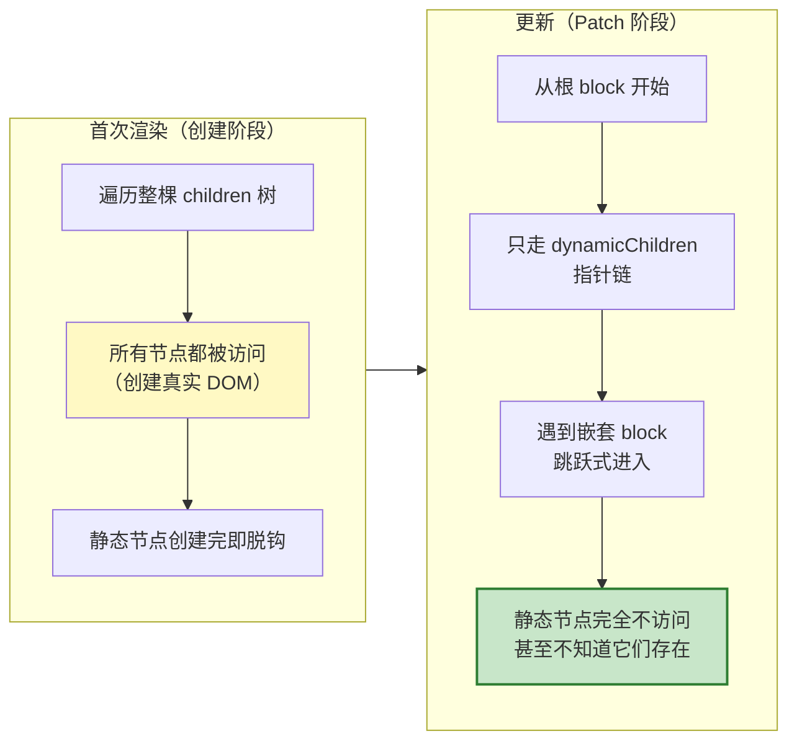

---

**Step 8：怎么在浏览器里亲手验证？**

不用跑源码，直接在 `main.js` 里加这两行就能在控制台看到 block tree：

```js
const app = createApp(App)
app.mount('#app')

const root = app._instance.subTree              // 组件的根 vnode
console.log('vnode.children 长度（自然树）:',
            Array.isArray(root.children) ? root.children.length : 1)
console.log('dynamicChildren（扁平动态节点）:', root.dynamicChildren)
// 在 Vue SFC Playground 里跑上面那段模板会看到：
// dynamicChildren 长度 = 2（h2 和 section.list），
// 而不是 20+
```

也推荐到 [Vue SFC Playground](https://play.vuejs.org/) 贴模板，右侧切到"Compiled Output"就能看到 `_openBlock()` / `_createElementBlock()` 的真实编译产物，跟上面 Step 2 完全一致。

---

**最后一句话回答你的疑惑**：

> 📌 更新时，**静态节点不被遍历**，即使嵌套 100 层也一样——Vue 只沿着 `dynamicChildren` 指针链做跳跃式递归，这条链上只有动态节点和嵌套 block 的根，中间的静态层级对运行时**不可见**。

#### 2.2 快速Diff算法

Vue3采用了全新的快速diff算法，它的核心流程如下：

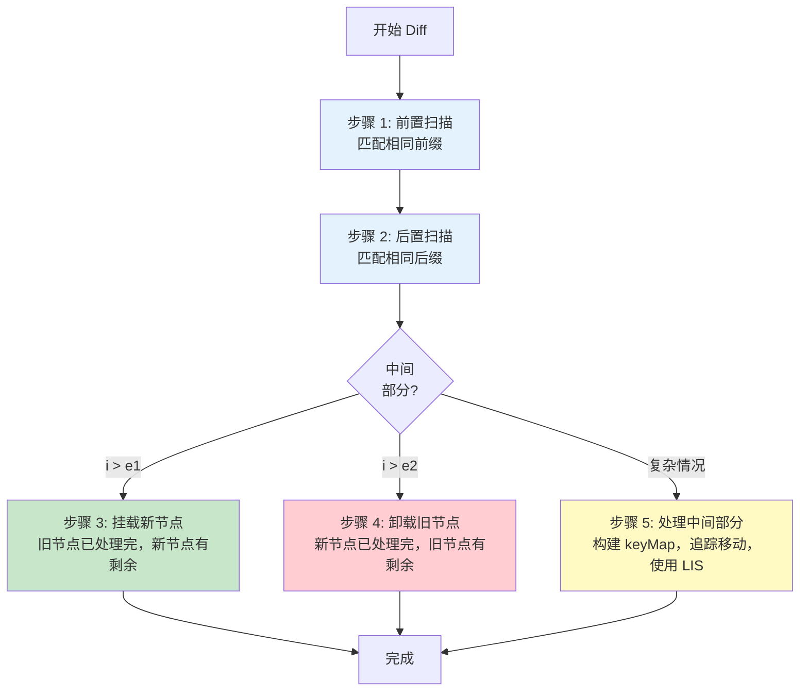

```js
// 简化版的Vue3 diff算法核心
function patchKeyedChildren(oldChildren, newChildren, container) {
  let i = 0                           // 前置扫描指针
  const oldChildrenLength = oldChildren.length
  const newChildrenLength = newChildren.length
  let e1 = oldChildrenLength - 1      // 旧子序列尾指针
  let e2 = newChildrenLength - 1      // 新子序列尾指针

  // 1. 从前向后扫描，处理相同前缀
  while (i <= e1 && i <= e2) {
    const oldVNode = oldChildren[i]
    const newVNode = newChildren[i]
    
    if (isSameVNodeType(oldVNode, newVNode)) {
      // 节点类型相同，递归更新
      patch(oldVNode, newVNode)
    } else {
      // 一旦发现不同，退出循环
      break
    }
    i++
  }

  // 2. 从后向前扫描，处理相同后缀
  while (i <= e1 && i <= e2) {
    const oldVNode = oldChildren[e1]
    const newVNode = newChildren[e2]
    
    if (isSameVNodeType(oldVNode, newVNode)) {
      patch(oldVNode, newVNode)
    } else {
      break
    }
    e1--
    e2--
  }

  // 3. 处理新增节点
  if (i > e1) {
    // 所有旧节点都处理完，但新节点还有剩余
    // 说明是新增节点
    if (i <= e2) {
      const nextPos = e2 + 1
      // 确定插入位置的锚点
      const anchor = nextPos < newChildrenLength ? newChildren[nextPos].el : null
      
      // 挂载所有剩余的新节点
      while (i <= e2) {
        patch(null, newChildren[i], container, anchor)
        i++
      }
    }
  }
  // 4. 处理需要删除的节点
  else if (i > e2) {
    // 所有新节点都处理完，但旧节点还有剩余
    // 说明这些旧节点需要被移除
    while (i <= e1) {
      unmount(oldChildren[i])
      i++
    }
  }
  // 5. 处理中间部分（最复杂的情况）
  else {
    // 中间部分的开始和结束索引
    const s1 = i // 旧子序列开始索引
    const s2 = i // 新子序列开始索引
    
    // 5.1 构建新节点key到索引的映射
    const keyToNewIndexMap = new Map()
    for (i = s2; i <= e2; i++) {
      const nextChild = newChildren[i]
      if (nextChild.key != null) {
        keyToNewIndexMap.set(nextChild.key, i)
      }
    }
    
    // 5.2 更新和移除旧节点，同时记录节点是否需要移动
    let j
    let patched = 0                   // 已更新节点数
    const toBePatched = e2 - s2 + 1   // 待更新新节点数
    let moved = false                 // 是否需要移动节点
    let maxNewIndexSoFar = 0          // 记录是否有节点需要移动
    
    // 初始化映射数组，用来记录新节点在旧序列中的位置
    // 0表示该新节点在旧序列中不存在
    const newIndexToOldIndexMap = new Array(toBePatched)
    for (i = 0; i < toBePatched; i++) newIndexToOldIndexMap[i] = 0
    
    // 遍历所有旧节点
    for (i = s1; i <= e1; i++) {
      const prevChild = oldChildren[i]
      
      // 如果已经更新的节点数大于等于需要更新的节点数
      // 说明剩下的旧节点都是多余的，直接移除
      if (patched >= toBePatched) {
        unmount(prevChild)
        continue
      }
      
      // 查找当前旧节点在新序列中的位置
      let newIndex
      if (prevChild.key != null) {
        // 如果有key，通过key找到在新序列中对应的位置
        newIndex = keyToNewIndexMap.get(prevChild.key)
      } else {
        // 如果没有key，遍历查找相同类型的节点
        for (j = s2; j <= e2; j++) {
          if (
            newIndexToOldIndexMap[j - s2] === 0 &&
            isSameVNodeType(prevChild, newChildren[j])
          ) {
            newIndex = j
            break
          }
        }
      }
      
      // 如果在新序列中找不到该节点，说明它被移除了
      if (newIndex === undefined) {
        unmount(prevChild)
      } else {
        // 记录新序列中的位置 -> 旧序列中的位置
        // +1是为了避开0值（0有特殊含义）
        newIndexToOldIndexMap[newIndex - s2] = i + 1
        
        // 判断节点是否需要移动
        if (newIndex >= maxNewIndexSoFar) {
          maxNewIndexSoFar = newIndex
        } else {
          moved = true
        }
        
        // 更新节点
        patch(prevChild, newChildren[newIndex])
        patched++
      }
    }
    
    // 5.3 移动和挂载节点
    // 如果需要移动节点，使用最长递增子序列算法优化移动
    if (moved) {
      // 计算最长递增子序列
      const increasingNewIndexSequence = getSequence(newIndexToOldIndexMap)
      j = increasingNewIndexSequence.length - 1
      
      // 从后向前遍历，确保正确的DOM操作顺序
      for (i = toBePatched - 1; i >= 0; i--) {
        const nextIndex = s2 + i
        const nextChild = newChildren[nextIndex]
        // 确定锚点位置
        const anchor = nextIndex + 1 < newChildrenLength ? 
          newChildren[nextIndex + 1].el : null
        
        // 如果是新增的节点（即在旧序列中不存在）
        if (newIndexToOldIndexMap[i] === 0) {
          patch(null, nextChild, container, anchor)
        }
        // 如果需要移动
        else if (moved) {
          // 如果不在最长递增子序列中，则需要移动
          if (j < 0 || i !== increasingNewIndexSequence[j]) {
            move(nextChild, container, anchor)
          } else {
            // 是递增子序列的一部分，不需要移动
            j--
          }
        }
      }
    }
  }
}
```

## 三、深入理解Vue3 Diff算法中的关键步骤

我们现在来详细解析Vue3 diff算法中最核心的部分——**处理中间不同部分**，这也是算法最复杂的地方。

### 代码中的具体案例分析

假设我们有下面的两组子节点序列：

```
旧子节点：[a, b, c, d, e, f, g]
新子节点：[a, b, e, c, d, h, g]
```

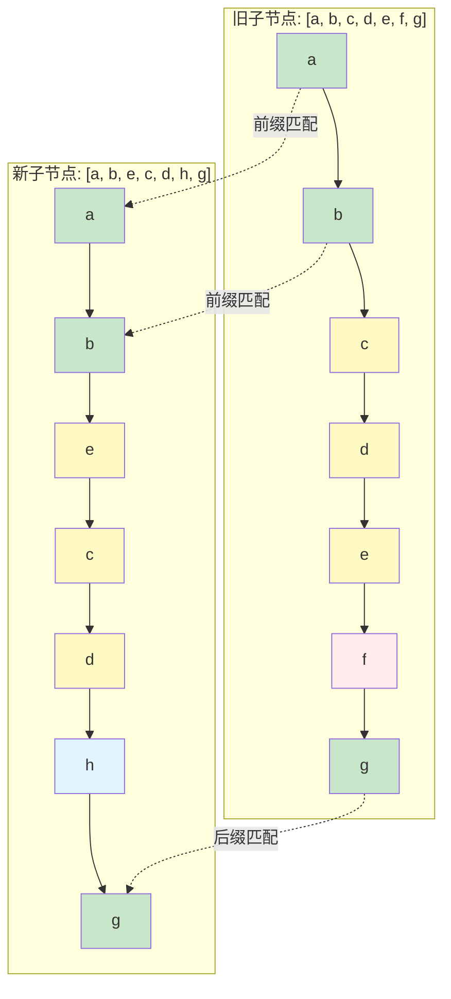

根据之前讲解的算法流程，我们来一步步分析：

#### 1. 前置处理

首先，算法会从前向后扫描，找到相同的前缀：

- `a`和`b`是相同的，直接复用，索引`i`移动到2

```
旧：[a, b, (c, d, e, f), g]
         i
新：[a, b, (e, c, d, h), g]
         i
```

#### 2. 后置处理

然后，算法会从后向前扫描，找到相同的后缀：

- `g`是相同的，直接复用，索引`e1`和`e2`都减少1

```
旧：[a, b, (c, d, e, f), g]
         i        e1
新：[a, b, (e, c, d, h), g]
         i        e2
```

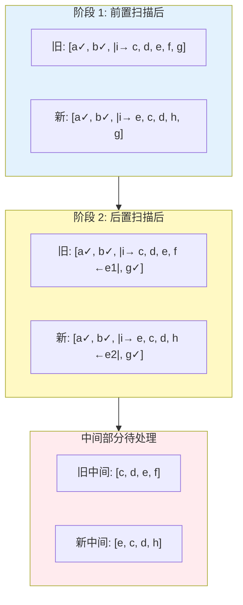

#### 3. 中间部分处理

现在我们需要处理中间不同的部分：旧序列中的`[c, d, e, f]`和新序列中的`[e, c, d, h]`。

##### 3.1 构建新节点key到索引的映射

```js
keyToNewIndexMap = {
  'e': 2, // 新序列中e的索引是2
  'c': 3, // 新序列中c的索引是3
  'd': 4, // 新序列中d的索引是4
  'h': 5  // 新序列中h的索引是5
}
```

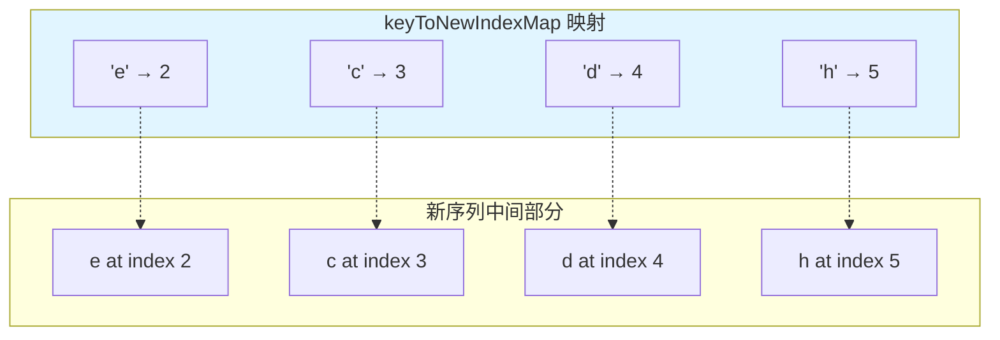

##### 3.2 遍历旧子序列，更新和标记需要移动的节点

初始化`newIndexToOldIndexMap`数组，大小为新序列中间部分长度，初值为0：

```js
newIndexToOldIndexMap = [0, 0, 0, 0] // 对应新序列中的e, c, d, h
```

然后遍历旧序列中间部分：

- 处理旧节点`c`（索引2）：
  - 在`keyToNewIndexMap`中找到，对应的新索引是3
  - `newIndexToOldIndexMap[3-2] = 2+1`，即`newIndexToOldIndexMap[1] = 3`
  - `maxNewIndexSoFar = 3`，无需移动
  - 更新节点

- 处理旧节点`d`（索引3）：
  - 在`keyToNewIndexMap`中找到，对应的新索引是4
  - `newIndexToOldIndexMap[4-2] = 3+1`，即`newIndexToOldIndexMap[2] = 4`
  - `maxNewIndexSoFar = 4`，无需移动
  - 更新节点

- 处理旧节点`e`（索引4）：
  - 在`keyToNewIndexMap`中找到，对应的新索引是2
  - `newIndexToOldIndexMap[2-2] = 4+1`，即`newIndexToOldIndexMap[0] = 5`
  - `maxNewIndexSoFar = 4`，但新索引2小于4，需要移动
  - 设置`moved = true`
  - 更新节点

- 处理旧节点`f`（索引5）：
  - 在`keyToNewIndexMap`中未找到，说明需要删除
  - 删除节点`f`

处理完后，`newIndexToOldIndexMap = [5, 3, 4, 0]`，其中：

- 5表示新节点`e`在旧序列中的位置是索引4（+1后为5）
- 3表示新节点`c`在旧序列中的位置是索引2（+1后为3）
- 4表示新节点`d`在旧序列中的位置是索引3（+1后为4）
- 0表示新节点`h`在旧序列中不存在，需要新建

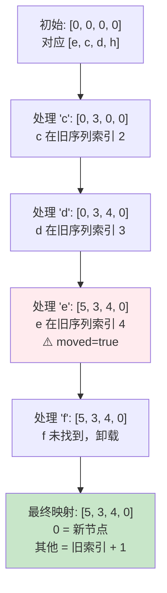

##### 3.3 移动和挂载节点

由于`moved = true`，需要使用最长递增子序列算法来优化节点移动。

计算`newIndexToOldIndexMap = [5, 3, 4, 0]`的最长递增子序列：

- 最长递增子序列是`[1, 2]`，对应索引值为`[3, 4]`，也就是新节点`c`和`d`

从后向前遍历中间部分的新节点：

- 处理新节点`h`（索引5）：
  - `newIndexToOldIndexMap[3] = 0`，说明是新节点，需要创建并插入

- 处理新节点`d`（索引4）：
  - 在最长递增子序列中（索引2对应值为2），无需移动

- 处理新节点`c`（索引3）：
  - 在最长递增子序列中（索引1对应值为1），无需移动

- 处理新节点`e`（索引2）：
  - 不在最长递增子序列中，需要移动到正确位置

最终的DOM操作：

1. 将节点`e`移动到新位置（插入到节点`b`后面）
2. 创建新节点`h`并插入到正确位置
3. 删除节点`f`

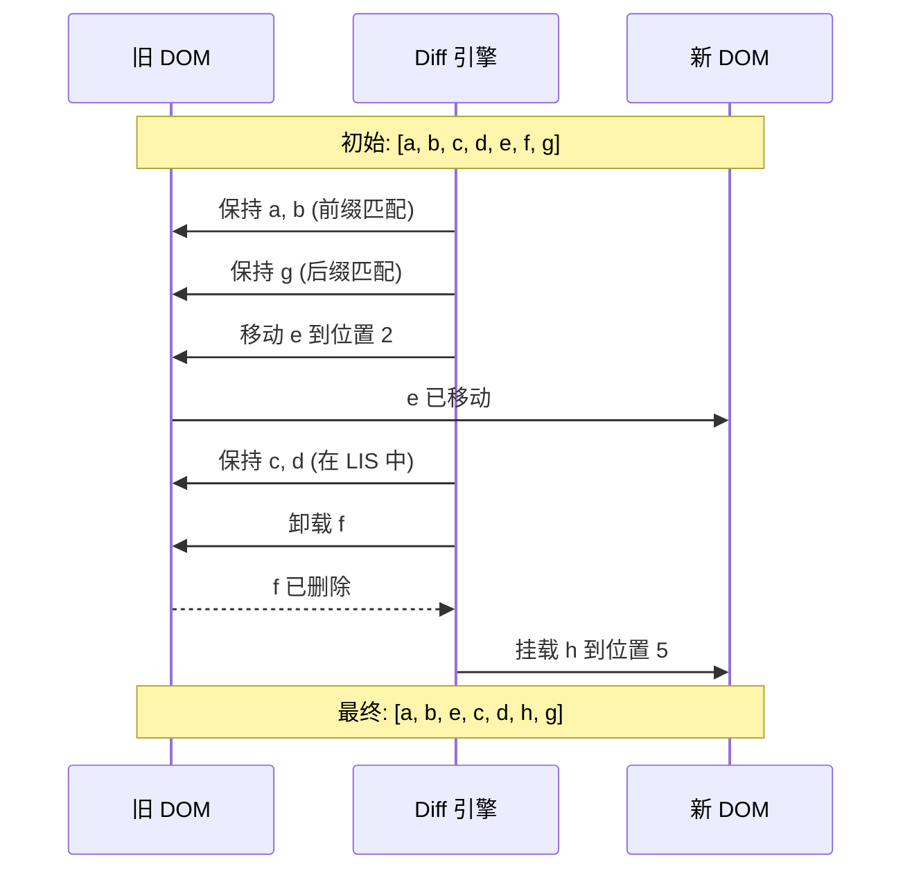

这样，通过最少的DOM操作，我们就完成了从`[a, b, c, d, e, f, g]`到`[a, b, e, c, d, h, g]`的转变。

## 四、图解最长递增子序列算法

我们已经提到，Vue3使用最长递增子序列算法来优化节点移动。现在让我们更直观地理解这个算法。

最长递增子序列是一个序列中**保持相对顺序不变的最长上升子序列**。例如，对于序列`[10, 9, 2, 5, 3, 7, 101, 18]`，最长递增子序列是`[2, 3, 7, 18]`或`[2, 5, 7, 18]`，长度为4。

在Vue3 diff算法中，我们关注的是新节点在旧序列中的索引顺序：

```
newIndexToOldIndexMap = [5, 3, 4, 0]
```

这里：

- 第一个值5表示新节点在旧序列中的索引是4
- 第二个值3表示新节点在旧序列中的索引是2
- 第三个值4表示新节点在旧序列中的索引是3
- 第四个值0表示新节点在旧序列中不存在

我们需要找出最长递增子序列。在这个例子中，`[3, 4]`是最长递增子序列，对应的索引是`[1, 2]`。

这意味着在新序列中，索引为1和2的节点（即`c`和`d`）可以保持原位不动，而其他节点需要移动或创建。

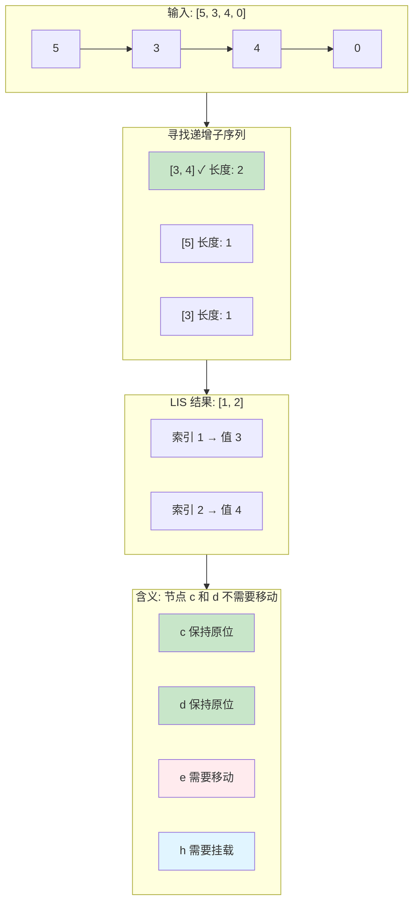

### 最长递增子序列算法实现

```js
function getSequence(arr) {
  const p = arr.slice()      // 存放最长递增子序列中每个元素的前驱节点位置
  const result = [0]         // 存放最长递增子序列的索引
  let i, j, u, v, c
  const len = arr.length
  
  for (i = 0; i < len; i++) {
    const arrI = arr[i]
    // 跳过需要新建的元素
    if (arrI !== 0) {
      j = result[result.length - 1]
      // 如果当前元素比最长递增子序列中的最后一个元素还大
      // 直接将当前位置插入到结果中
      if (arr[j] < arrI) {
        p[i] = j           // 记录前驱节点
        result.push(i)     // 添加到递增子序列中
        continue
      }
      
      // 二分查找，找到数组中第一个比arrI大的元素
      u = 0
      v = result.length - 1
      while (u < v) {
        c = (u + v) >> 1
        if (arr[result[c]] < arrI) {
          u = c + 1
        } else {
          v = c
        }
      }
      
      // 找到了第一个比arrI大的位置，更新result数组
      if (arrI < arr[result[u]]) {
        if (u > 0) {
          p[i] = result[u - 1]
        }
        result[u] = i
      }
    }
  }
  
  // 回溯找到真正的最长递增子序列
  u = result.length
  v = result[u - 1]
  while (u-- > 0) {
    result[u] = v
    v = p[v]
  }
  
  return result
}
```

这个算法使用了动态规划和二分查找，使其复杂度达到了O(n log n)，比简单的O(n²)算法更高效。

## 五、Vue3 Diff算法的优势总结

Vue3的diff算法相较于Vue2有以下几个方面的优势：

1. **更精准的更新**：通过PatchFlag和Block tree，Vue3可以直接定位动态节点，避免对整个树进行遍历。

2. **更高效的静态内容处理**：通过静态提升，静态内容只会被创建一次，大大减少了不必要的操作。

3. **更智能的节点移动策略**：通过最长递增子序列算法，Vue3可以用最少的DOM移动操作完成更新。

4. **更小的内存占用**：Vue3的虚拟DOM结构更加精简，平均减少了40%的内存使用。

5. **更快的渲染速度**：在大型应用中，Vue3比Vue2快1.3~2倍。

## 六、思考题：检验你的理解

让我出几道问题，检验你对Vue3 diff算法的理解：

1. 假设有一个列表需要从`[A, B, C, D]`变为`[D, B, A, C]`，Vue3的diff算法会进行哪些具体操作？

2. 如果一个组件有大量静态内容和少量动态内容，Vue3编译器会如何优化？

3. 为什么Vue3在处理节点移动时，要从后向前遍历而不是从前向后？

4. Vue3的PatchFlag和Vue2的静态优化有什么本质区别？

5. 为什么最长递增子序列算法可以减少DOM操作？

希望这篇详细的讲解能帮助你彻底理解Vue3 diff算法的整体流程。如果有任何疑问，请随时向我提问！