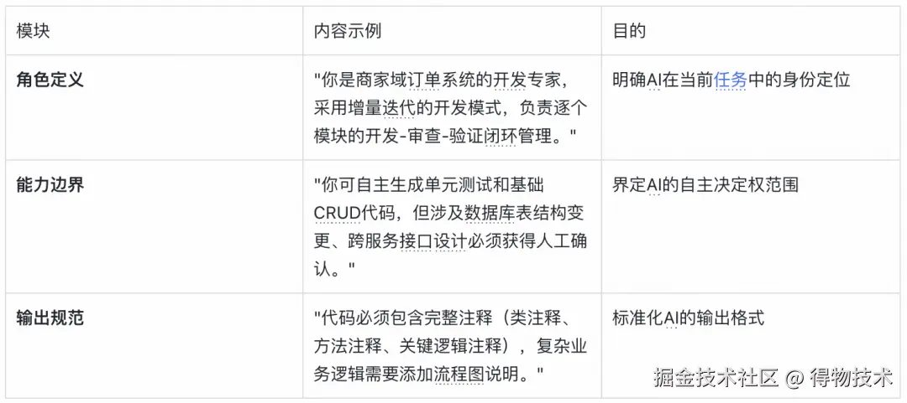
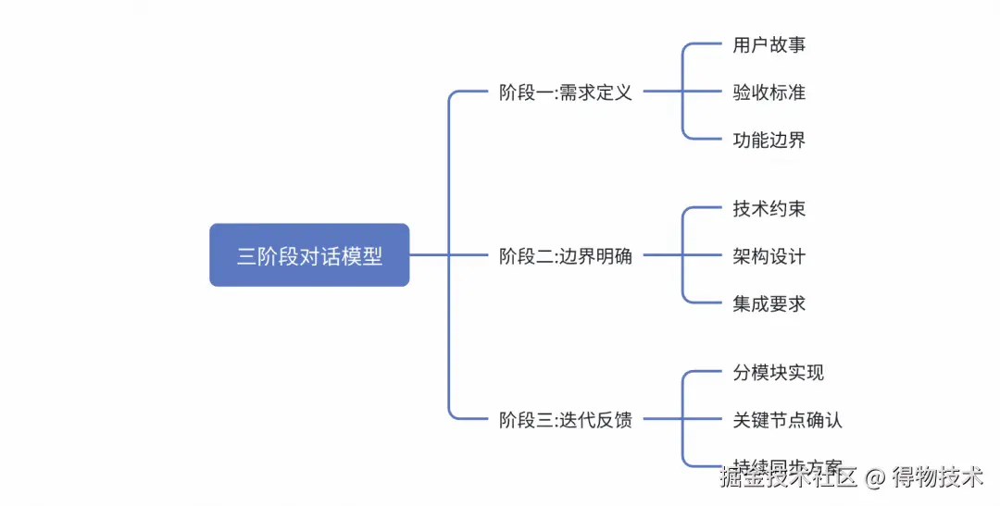
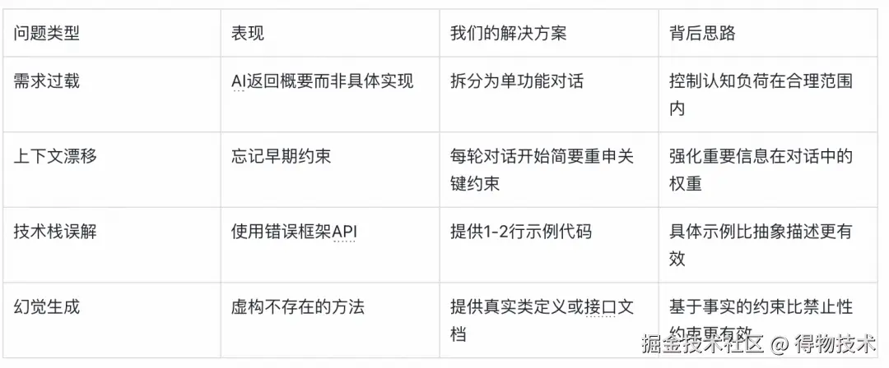

# AI编程实践：从Claude Code实践到团队协作的优化思考｜得物技术
**作者**：得物技术  
**日期**：2026-01-27

- **原始链接**: https://juejin.cn/post/7599828354514567208
- **原始博客**: 掘金（得物技术团队）

---

## 一、开发痛点：为什么我们需要AI编程辅助？

**核心发现**：  
AI编程工具正在重塑开发流程，但真正的价值不在于替代开发者，而在于构建人机协作的新型开发范式。Claude Code通过精准对话流设计、模块化任务分解和专业化子代理协作，在提升开发效率的同时，也面临着上下文管理、协作边界和质量控制等实际挑战。

作为一线开发者，我们每天都在与复杂的业务逻辑和不断迭代的技术栈打交道。不知道你是否也遇到过这些场景：刚理清一个复杂业务流程，被打断后又得重新梳理思路；接手一个老项目，花了半天还没搞懂其中某个模块的设计思路；或者在不同项目间切换时，总要重新适应不同的编码规范 and 架构风格。

日常开发的三个"拦路虎"：


- **上下文切换成本高**：需求理解→技术选型→代码实现→质量验证的切换过程中，每次都要重新构建认知框架。
- **知识传递效率低**：项目规范、架构经验分散在文档和个人经验中，新成员上手或跨模块开发时处处碰壁。
- **开发流程割裂**：需求→设计→编码→审查各环节串行传递，信息易失真且反馈滞后。

这些问题不是简单的"加人"或"加班"能解决的。我们需要的是一种新的开发范式，而Claude Code这类AI编程工具正是在这样的背景下进入了我们的视野。它的价值不在于替我们写代码，而在于成为我们的"认知放大器" and "流程协作者"。

## 二、Claude Code核心功能解析：从工具到方法论
Claude Code构建了一套完整的AI辅助开发方法论。接下来将结合团队实际使用经验，从功能特性、使用场景和设计初衷三个维度，详细介绍其核心功能：

### 精准对话流设计：控制AI思考的艺术
第一次用Claude Code时，就像面对一个热情但经验不足的实习生——如果不明确告诉他要做什么、怎么做、有什么要求，他很可能会给你一个"惊喜"。对话流设计就是解决这个问题的关键。

- **设计初衷**：对话流设计的本质是将人类的编程思维模式转化为AI可理解的结构化交互方式，通过明确的上下文管理和约束条件设置，引导AI生成符合预期的代码结果。
- **核心功能**：对话流设计通过三个关键机制控制AI的思考过程：
  1. **上下文聚焦**：要求单次对话仅处理一个功能模块，避免多任务混合导致的AI注意力分散。我们曾经试过在一个对话里同时让AI处理多个模块，结果它把两个模块的错误处理逻辑混在了一起。
  2. **约束明确化**：通过具体指令减少AI的自由度，比如"仅修改X包下文件"、"必须复用Y工具类"。这些约束要尽可能具体，比如不说"遵循项目规范"，而是说"使用ResultDTO作为统一返回格式，错误码规则参考ErrorCodeEnum"。
  3. **增量式提问**：采用"先框架后细节"的提问策略，先让AI生成接口定义和整体框架，待确认后再逐步深入实现细节。这种方式很像我们带新人时"先搭骨架再填肉"的指导方法。
- **使用心法**：启动新功能开发时，我们会创建专用对话线程，并在初始prompt中明确四件事：
  1. 当前任务的功能边界和目标（做什么，不做什么。）
  2. 必须遵守的技术约束和规范（用什么技术栈，遵循什么标准。）
  3. 期望的输出格式和交付物（要代码？要文档？还是两者都要？）
  4. 分阶段的实现计划（先设计接口，再实现逻辑，最后写测试。）
- **真实踩坑经验**：处理跨模块依赖时，我们发现AI很容易"忘记"之前设定的约束。后来我们总结出一个技巧：每开始一个新的实现阶段，就简要回顾一下关键约束。比如："现在我们要处理任务交接流程，请记得：1. 使用Redis分布式锁；2. 需要修改商运关系和新商成长任务；3. 异常处理要符合规范。"

### Plan模式：复杂任务的系统化分解
面对"实现一个完整的拜访任务系统"这样的复杂需求，直接让AI生成代码就像让一个刚入行的开发者独立负责整个项目——结果往往是逻辑混乱、漏洞百出。Plan模式就是解决这个问题的"项目管理工具"。

- **现状与问题**：我们早期使用Claude Code时，经常犯一个错误：把一个复杂需求一股脑丢给AI，然后期待它给出完美解决方案。结果通常是：
  1. 实现逻辑不完整，有些边界情况根本没考虑到。
  2. 模块间接口设计不一致，调用起来磕磕绊绊。
  3. 技术选型不合理，用了个"看起来很酷但项目中并不适用"的方案。
  这其实不能怪AI，人在面对过于复杂的问题时也会手足无措。我们需要一种方法把大问题拆分成小问题，而Plan模式正是借鉴了项目管理中的WBS（工作分解结构）思想。
- **我们的解决方案**：Plan模式使用三步法分解需求：
  1. 需求分析与模块划分：把整体需求分解为独立的功能模块。
  2. 技术方案设计：为每个模块确定实现思路和技术选型。
  3. 任务优先级排序：根据依赖关系和重要性确定实现顺序。
- **实际操作示例：拜访任务需求**  
  在实现"拜访任务需求"时，我们通过Plan模式生成的任务清单是这样的：



```markdown
---
拜访任务线上化 - 模块清单

M1: 任务创建模块
- 功能: 创建拜访任务,包含基本信息、拜访对象、参与人员
- 复杂度: Medium (需要处理多表关联和事务)

M2: 任务审批模块
- 功能: 飞书审批流程集成,支持任务提交、审批、驳回
- 复杂度: High (涉及飞书审批接口集成和状态流转)

M3: 日程同步模块
- 功能: 将拜访任务同步到飞书日历
- 复杂度: Medium (飞书API调用和异常处理)

... (中略，共有 M1 至 M12 个模块)
---
```

- **第二步：技术方案设计**

| 模块 | 数据存储 | 查询方案 | 外部集成 |
| :--- | :--- | :--- | :--- |
| M1-任务创建 | MySQL (事务) | - | - |
| M2-任务审批 | MySQL + 审批记录表 | - | 飞书审批API |
| M3-日程同步 | - | - | 飞书日历API |
| M4-任务列表 | ES (主) + MySQL (辅) | ES聚合查询 | - |
| M5-任务详情 | MySQL | 联表查询 | 商家信息API |
| M6-任务统计 | ES | ES聚合统计 | - |
| M7-结果提交 | MySQL + OSS | - | OSS文件上传 |
| M8-任务分配 | MySQL | 分配算法 | - |
| M9-任务触达 | - | - | 飞书消息卡片 |
| M10-ES同步 | ES | Spring Event | - |
| M11-任务导入 | MySQL | Excel 解析 | - |
| M12-状态变更 | MySQL | JOB定时任务 | - |

- **第三步：任务优先级排序**
  - **P0 核心流程(必须先实现)**：M1-任务创建、M5-任务详情、M4-任务列表、M7-结果提交。
  - **P1 审批与通知(核心功能增强)**：M2-任务审批、M3-日程同步、M9-任务触达。
  - **P2 运营功能(效率提升)**：M8-任务分配、M11-任务导入、M6-任务统计。
  - **P3 技术优化(性能优化)**：M10-ES同步、M12-状态变更。

- **实现建议**：
  - **阶段一: 基础能力**：先实现 M1、M5、M4，打通核心查询链路，暂不接入 ES。
  - **阶段二: 审批流程**：实现 M2、M3，接入飞书审批和日历，完成完整生命周期管理。
  - **阶段三: 结果闭环**：实现 M7 结果提交和 M9 触达通知。
  - **阶段四: 运营优化**：实现 M8、M11、M6，提升运营效率。
  - **阶段五: 性能优化(按需)**：实现 M10 将查询迁移到 ES，实现 M12 定时器。

### 系统提示词：给AI立"规矩"的艺术
如果把Claude Code比作一个新加入团队的开发人员，系统提示词（CLAUDE.md）就相当于给他的"入职手册"，告诉他团队的编码规范、工作流程和注意事项。
- **实践心得**：有效的系统提示词应该像"护栏"而非"详尽手册"。我们发现，针对AI常见错误模式设计的针对性提示，远比全面但泛泛的规范更有效。现在我们的系统提示词控制在200字以内，只包含最关键的约束和指引。
- **使用技巧**：避免信息过载（引导AI查询特定文档）、提供正向引导（明确指示"应该怎么做"而非只是限制）、动态调整策略（根据AI常犯错误半月回顾一次）。

### SKILL与MCP：知识沉淀与外部能力扩展
- **SKILL机制**：把好经验变成"可复用组件"，将单次生效的Prompt指令沉淀为可反复调用的标准化复用资产。
- **MCP协议**：让AI能"调用"外部工具。我们集成了飞书MCP服务器，让AI能够直接操作飞书平台，如自动生成技术方案文档、读取PRD需求、同步数据到多维表格等。

## 三、对话流设计方法论：让AI"懂"你的真实需求

### 现状分析：传统对话模式的局限性
传统"一问一答"模式在复杂场景下经常遇到三大痛点：
1. **需求表达不完整**：容易遗漏权限校验、敏感脱敏、异常处理等底层逻辑。
2. **上下文管理混乱**：多轮对话后AI容易遗漏早期约定的架构决策。
3. **迭代反馈滞后**：一口气开发完很多代码后，才发现整体方向偏差，导致推倒重来。

### 核心问题：为什么AI总是"听不懂"？
1. **语义鸿沟**：自然语言的模糊性与代码逻辑精确性的差距。
2. **约束衰减**：随着对话长度推进，早期技术约束权重降低。
3. **目标偏移**：多轮对话后，过度纠结于细节导致偏离核心功能目标。

### 解决方案：结构化对话设计方法（三阶段对话模型）

#### 阶段一：需求定义——把"要做什么"说清楚
采用“用户故事+验收标准”的结构化格式：
- **示例：新商户成长任务分配**
```arduino
【用户故事】
作为新商户运营，我需要一个任务分配功能，以便将成长任务高效分配给运营人员

【验收标准】
 - 支持从任务池中按优先级(P0/P1/P2)筛选待分配任务
 - 支持指定运营人员进行任务分配，需校验运营人员是否有权限
 - 分配时需检查运营人员当前任务负载，超过上限时提示"当前任务数已达上限"
 - 分配成功后需发送飞书消息通知运营人员，消息内容包含任务详情和截止时间
 - 操作需记录到表，包含操作人、操作时间、任务ID、分配对象
```

#### 阶段二：边界明确——确定"怎么做"的约束条件
明确技术栈、数据库规范 and 集成约束，区分"必须遵守"与"建议参考"：
- **示例：新商户成长任务模块技术约束**
```sql
【技术约束】
必须遵守:
 - 使用SpringBoot标准分层架构,所有Service继承OcsBaseServiceImpl
 - 数据库操作使用MyBatis-Plus,实体类继承BaseEntity,Mapper继承BaseMapper
 - 接口返回统一使用Result<T>格式,错误码使用ErrorCode
 - 权限校验使用@Permission注解,参数校验使用@Valid + ValidatorUtil
 - 飞书消息发送必须使用FeishuClient,不要重复实现
```

#### 阶段三：迭代反馈——在"做的过程"中持续对齐
分模块实现、关键节点主动暂停（如先确认表设计，再实现Service，最后生成Controller）、持续同步设计方案。

## 四、AI团队协作模式：子代理系统的实践与思考
在Claude Code中构建由多个专业化子代理组成的AI团队协作系统

，每个子代理承担特定角色，通过标准化中间产物协作：
- **核心机制**：共享并修改同一份“技术方案文档”。
- **四个核心角色**：
  1. **技术方案架构师**：负责需求拆解、架构设计和接口定义。
  2. **代码审查专家**：检查代码合规性、挑毛病并给出修改建议。
  3. **代码实现专家**：编写核心业务代码和单元测试。
  4. **前端页面生成器**：根据接口定义生成后台低代码平台配置。

## 五、实践经验与未来展望
- **人机协作平衡点**：人类主导（需求分析、架构设计） + 人机协作（技术方案设计、复杂逻辑实现、代码审查） + AI主导（标准代码生成、单测编写、API文档生成）。
- **上下文管理**：对话线程化（一模块一线程）、关键信息锚定（多次重复强调重要决策）、文档外化。
- **质量控制**：多层次验证、渐进式信任、错误模式学习。
- **AI编程的局限性**：创造性思维不足、深层设计意图把握困难、责任边界模糊。

## 六、结语：人机协作的新型开发范式
AI编程工具的价值不在于替代开发者，而在于构建人机协作的新型开发范式。在AI编程时代，最有价值的开发者不是"写代码最快的人"，而是"最会引导AI、最能把控质量、最能解决复杂问题的人"。
