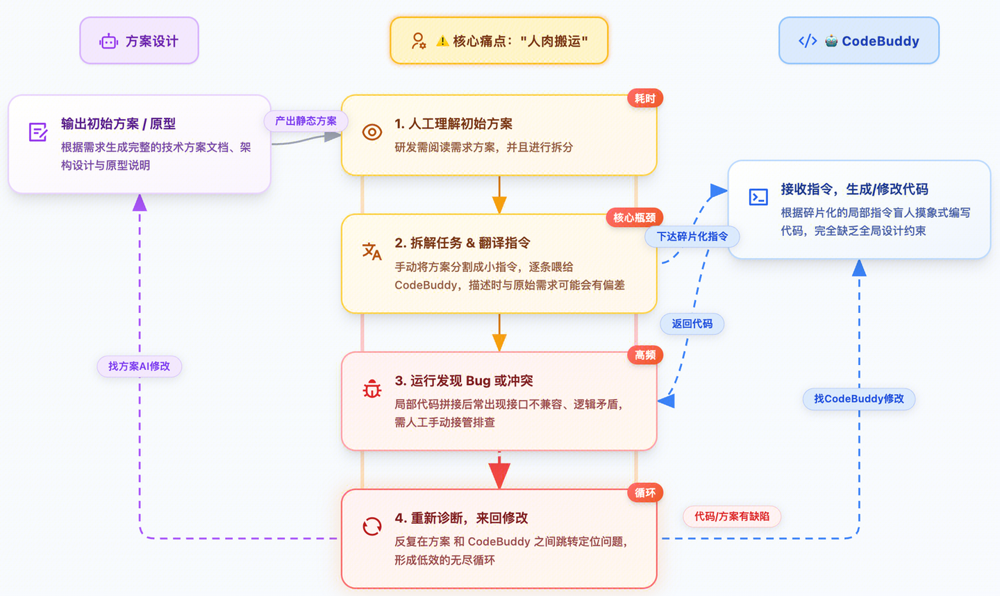
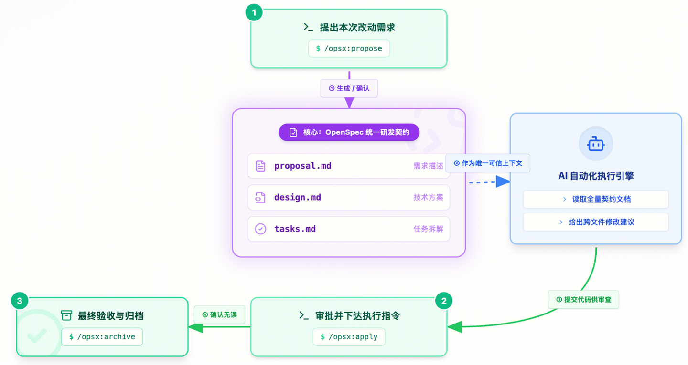
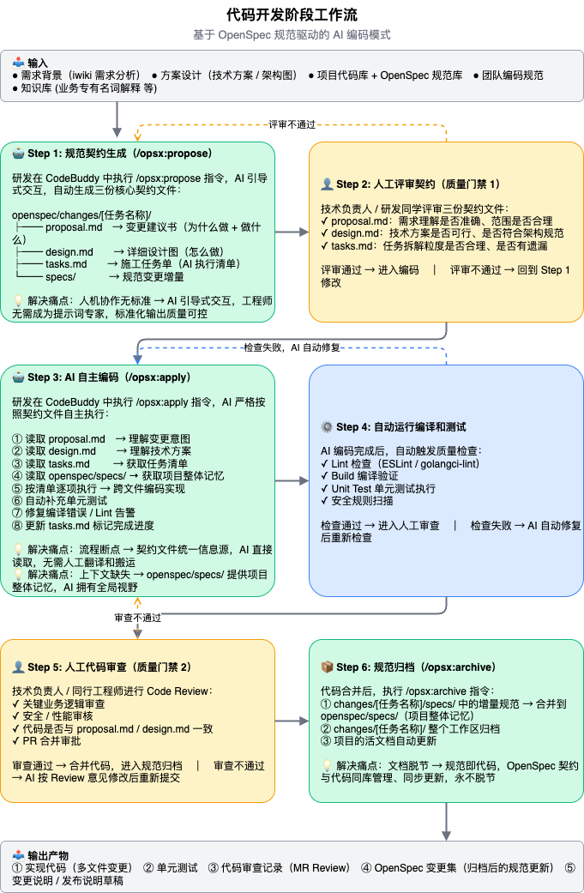
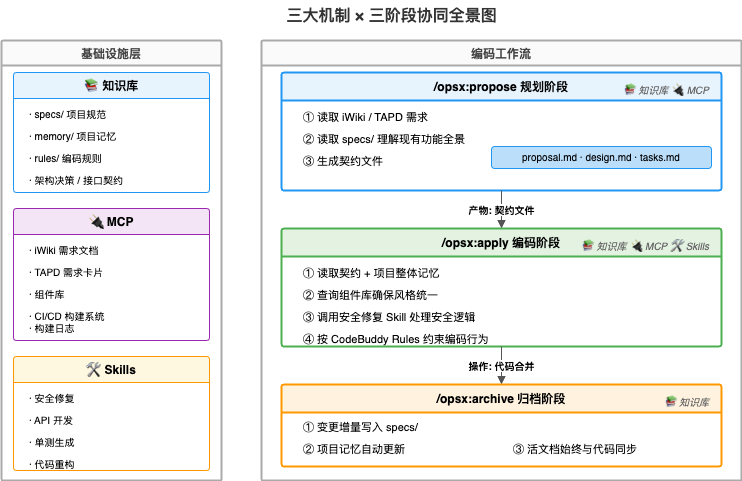

# 当整个团队开始0-Coding：一份万字 AI Native 研发实战手册

- **原始链接**: /Users/neoyuan/.gemini/antigravity/brain/c53fab5f-6632-440c-a635-1f7d375441c9/.system_generated/steps/65/content.md
- **原始博客**: https://zhuanlan.zhihu.com/

---

作者：binxiong

> **导语**：2023年我们开始用 AI 辅助解决问题，2025 年我们验证了 AI Coding 的可行性，2026 年我们决定更进一步——不再让 AI 当"打字员"，而是让它当"施工队长"。这篇文章记录了我们团队在 AI Native 研发模式落地过程中的思考、踩坑和最终形成的一套可复制的方法论。

### 写在前面

如果你也在用 AI 写代码，你大概率经历过这样的场景：

打开 CodeBuddy，对着对话框敲下一段需求描述，AI "唰唰唰"吐出一段代码。你看了看，好像对？复制粘贴，跑一下——报错了。于是开始新一轮的"对话-调试-再对话"循环。

运气好的话，折腾半小时能搞定。运气不好，你发现 AI 写的代码和项目架构完全不搭，甚至用了一个你们团队根本没有的库。

**这不是 AI 的问题，是我们"用法"的问题。**

我们团队在 2025 年就开始大规模使用 AI 辅助编码，标准软件、产品市场、极光平台都跑通了实际案例。但随着使用深入，一个共识越来越清晰：

> 把 AI 当打字员用，天花板很低。把 AI 当施工队用，才有真正的效率革命。

2026 年初，我们正式决定——\*\*全面转向 AI Native 研发模式，目标是"0 人工 Coding"\*\*。

这篇文章，就是这段旅程的全记录。

### 一、为什么要搞 AI Native？"辅助编码"到底差在哪？

先说个残酷的事实：即便团队里的 AI 老手，用 AI 辅助编码的效率提升也很难超过 **50%。原因不是模型不够聪明，而是我们的协作方式**有结构性缺陷。

### 当前研发用 AI 的真实画面



我总结了**四大痛点**，几乎每个用 AI 写代码的人都会踩到：

| 痛点 | 具体表现 | 根因 |
| --- | --- | --- |
| 人机协作无标准 | 效果完全取决于个人"提示词"功力，老手提效明显，新手反而更慢 | 没有统一的 AI 交互规范，输入质量因人而异 |
| 流程断点 | 工程师变成了"人肉翻译器"，在方案文档和 IDE 之间来回搬运信息 | 设计工具和编码工具之间数据隔离，无法自动传递上下文 |
| 上下文缺失 | AI 不认识你的项目，可能重复造轮子、违反架构规范 | AI 无法主动读取项目代码库和技术规范，只能看到你手动喂的片段 |
| 文档脱节 | 方案写进 iWiki 就再没更新过，新人入职只能"考古"代码 | 文档和代码不在同一个版本控制系统里，天然失同步 |

**核心矛盾就一句话：人与 AI 的交互缺乏规范，导致输出质量不可控。**

所以我们需要的不是"更好的提示词技巧"，而是**一套系统性的方法**。

### 二、我们的回答：OpenSpec + CodeBuddy 全链路方案

### 什么是 OpenSpec？

如果把开发一个功能比作**盖一栋房子**：

* **以前的做法**：你（工程师）像个包工头，脑子里装着模糊的房子样子，跑到砖厂（AI）喊"来100块砖"，再跑到水泥厂（另一个 AI）喊"来两袋水泥"。AI 不知道你要盖什么，只能听你零散的指令，盖出来的东西千奇百怪。
* **OpenSpec 的做法**：你的核心工作是和 AI 一起**把建筑图纸画清楚**。图纸审批通过后，AI 施工队就能根据这份**唯一的、标准的图纸**，全自动、高质量地完成施工。

本质上，OpenSpec 是一套\*\*机器和人都能理解的"研发契约"\*\*。

### 目标态：人做什么，AI 做什么？

我们重新定义了 AI 时代研发人员的角色——**从执行者变成指挥者**：

| 阶段 | AI 负责 | 人负责 |
| --- | --- | --- |
| 需求分析 | 提炼需求、发现遗漏、结构化输出需求文档 | 优先级判断，审批需求边界 |
| 方案设计 | 生成技术方案、架构图、接口定义、风险清单 | 技术选型拍板，安全审查 |
| 代码开发 | 根据设计方案进行多文件编码、补充注释和单测 | 评审关键代码，控制合并门禁 |
| 测试验证 | 生成测试脚本、执行回归测试、分析失败原因 | 审核高风险场景，最终放行决策 |
| 发布上线 | 校验实现是否与需求一致，提供发布清单 | 审批发布窗口，处理事故升级 |

**人的核心角色只有三个：决策、审批、把关。**

其他的？让 AI 去干。

### 三、代码开发阶段的落地实践（我们是怎么做到"0-Coding"的）

### 3.1 核心工作流：三步走

我们把整个代码开发流程压缩到了**三个指令**：



### Step 1：/opsx:propose — 先想清楚，再动手

> **原则：严禁直接让 AI 写大段业务代码，必须先生成规划文档。**

```
/opsx:propose 帮我生成一个关于 [新增用户权限控制模块] 的变更
```

AI 会自动在 `openspec/changes/[变更名]/` 目录下生成：

| 文件 | 作用 | 通俗理解 |
| --- | --- | --- |
| proposal.md | 需求背景与目标 | "为什么做"和"做什么" |
| design.md | 技术方案与架构决策 | "怎么做" |
| tasks.md | 带复选框的实施清单 | AI 的"施工单" |
| specs/ | 规范增量 | 本次变更的"差异记录" |

**为什么这一步至关重要？** 因为这些文件就是 AI 编码时的**全部上下文**。你在这里多花 10 分钟审查，编码阶段能省 2 小时的返工。

### Step 2：/opsx:apply — 让 AI 按图施工

```
/opsx:apply [变更名称]
```

这一步 AI 会：

* 读取 `tasks.md` 中的清单
* 结合 `design.md` 和 `proposal.md` 的完整上下文
* 跨文件批量生成/修改代码
* 每完成一项自动在 `tasks.md` 里打钩 ✓

**开发者此时只需要做一件事：Code Review。**

### Step 3：/opsx:archive — 让规范活起来

MR 通过后执行：

```
/opsx:archive [变更名称]
```

系统自动将本次规范增量合并到 `openspec/specs` 主目录，清空变更草稿。

**这意味着什么？** 你的项目文档永远和代码保持同步。没有"僵尸 Wiki"，没有"代码才是文档"的无奈。

### 3.2 完整六步工作流

实际项目中，我们把核心三步扩展成了更严谨的六步：



**关键卡点**：Step 2 的 Review 是质量的生命线。`tasks.md` 建议控制在 **15 项以内**，避免 AI 因上下文过长产生幻觉。

### 3.3 前端页面开发的额外一步

如果变更涉及前端页面，我们在 Step 2 和 Step 4 之间加了一个**原型审查**环节：

在 With 平台上画好原型 → 团队确认 → 截图/链接贴回 `design.md` → 再执行 `/opsx:apply`

**为什么？** Proposal 和 Design 解决的是"做什么"和"怎么做"，但对前端来说还缺"页面长什么样"。跳过这步直接让 AI 写 UI，返工成本远大于提前画一版原型。

### 四、让 AI "懂"你的项目：三大武器库

光有工作流还不够。AI 再聪明，如果不了解你的项目，写出来的代码也只是"通用代码"，不是"你的代码"。

我们围绕 CodeBuddy 的三大机制，构建了一套完整的**统一规范体系**：

```
知识库 → 让 AI "知道"我们的项目
MCP   → 让 AI "连接"我们的工具  
Skills → 让 AI "掌握"我们的方法
```

### 4.1 知识库：AI 的项目记忆

知识库分两个通道注入 AI：

\*\*通道一：OpenSpec specs/\*\*（核心记忆）

这就是项目的"活文档"。AI 执行 `/opsx:apply` 时会自动读取，了解系统当前所有功能。每次 `/opsx:archive` 后自动更新，**始终与代码保持同步**。

**通道二：MCP 外部知识**（辅助记忆）

通过 MCP 协议连接 Knot 知识库平台，存放无法用 specs 文件表达的内容：业务术语表、架构决策历史、踩坑记录等。

| 知识类别 | 具体内容 | 来源 |
| --- | --- | --- |
| 业务知识 | 产品功能说明、核心业务流程 | iWiki 文档 |
| 架构知识 | 系统架构图、模块依赖、技术选型说明 | iWiki + Git |
| 项目规范 | 目录结构约定、数据模型定义、接口契约 | OpenSpec specs/ |
| 历史决策 | 技术选型原因、已知限制 | iWiki + OpenSpec |
| 常见问题 | 高频问题及解决方案、排错指南 | iWiki 文档 |

### 4.2 MCP：AI 的工具连接层

MCP 让 AI 能直接访问团队的内部工具，消除"复制粘贴"式的跨工具搬运。

我们团队配置了以下 MCP：

| MCP 工具 | 连接目标 | AI 获得的能力 |
| --- | --- | --- |
| TCS Component | 前端组件库 | 查询组件使用规则，确保风格统一 |
| TAPD MCP | TAPD 需求平台 | 直接查询原始需求/Bug 单 |
| iWiki MCP | 文档平台 | 直接检索设计文档、架构文档 |
| 极光流水线 MCP | 部署平台 | 触发构建、查看部署状态 |

**实际效果举例**：以前工程师需要先打开 TAPD 看需求 → 理解 → 切到 IDE 描述给 AI。现在 AI 通过 MCP 直接读 TAPD 原始需求，信息**零损耗传递**。

### 4.3 Skills：AI 的专业技能包

Skills 是团队沉淀的标准化操作流程（SOP），封装成 AI 可复用的"技能包"。我们统一管理在 [ted.aurora/tcsc-skills](https://link.zhihu.com/?target=https%3A//git.woa.com/ted.aurora/tcsc-skills) 仓库中，按业务域分类，目前涵盖产品市场、前端组件库、工程实践、运维中心、运营中心等多个领域。大家也可以通过 [SkillHub市场](https://link.zhihu.com/?target=http%3A//skillhub.dev.jiguang.woa.com/) 来进行预览, 后续我们也会上架Knot. 下一章会以 openspec-installer 为例，深度解剖一个生产级 Skill 的完整构造。

### 4.4 三大机制如何协同工作？

以一个典型的代码开发任务为例：



**三者的关系可以用一句话概括：知识库让 AI "知道"我们的项目，MCP 让 AI "连接"我们的工具，Skills 让 AI "掌握"我们的方法。**

### 五、深度解剖 openspec-installer：一个 Skill 是怎么炼成的

> 前面提到 Skills 是团队经验的标准化封装。说起来容易，做起来呢？这一章我们拿 openspec-installer 这个 Skill 做一次完整的"庖丁解牛"——从文件结构到设计决策，从安装流程到版本管理，让你看到**一个生产级 Skill 的全貌**。

### 5.1 这个 Skill 解决什么问题？

新人入职，或者团队开启一个新项目，首先要做的就是"搭环境"。在没有 openspec-installer 之前，这个过程是这样的：

1. 打开 Wiki，找到安装指引（先找到正确的那篇 Wiki 就要 10 分钟）
2. 安装 Node.js（版本不对？换一个重来）
3. 全局安装 OpenSpec CLI（npm 权限问题？sudo？nvm？）
4. 在项目中执行 `openspec init`（目录错了？重来）
5. 手动编辑 `openspec/config.yaml`（漏填了？AI 生成的代码不符合规范）
6. 配置 MCP 服务（iWiki、工蜂的 URL 是什么？Token 怎么拿？）
7. 安装项目需要的 Skills（装哪几个？从哪下载？版本对不对？）
8. 搭建知识库目录（docs/ 下该有什么结构？）

**至少 1 小时，踩坑了可能半天。而且每个人踩的坑还不一样。**

openspec-installer 把这 8 步压缩成了一句话：

```
请执行 curl -fsSL http://内部skill命令, 可以根据下文生成一个类似的安装指令即可。
```

AI 读到这个 SKILL.md 后，会自动完成所有步骤，**全程不需要人工干预**。

### 5.2 文件结构：每个文件都有存在的理由

```
openspec-installer/
├── SKILL.md                          # 灵魂：600+ 行的完整安装 SOP
├── version.json                      # 版本控制元数据
├── scripts/
│   ├── INSTALL_MAC_LINUX.sh          # macOS/Linux 环境自动安装
│   ├── INSTALL_WINDOWS.ps1           # Windows 环境自动安装
│   ├── install_skills.sh             # 项目 Skills 批量安装
│   ├── check-skill-updates.sh        # 所有 Skills 版本检测
│   └── self_update.sh                # Skill 自身热更新
└── templates/
    ├── mcp-servers.json              # MCP 配置模板（含认证信息）
    ├── skill-bundle.json             # 项目默认 Skill 套装清单
    └── openspec-config-awareness.md  # Bridge Rule 模板
```

注意这不是一个简单的"安装脚本"——它是一个**包含 SOP、自动化脚本、配置模板、版本管理的完整系统**。下面逐一拆解。

### 5.3 SKILL.md：AI 的"施工蓝图"

SKILL.md 是整个 Skill 的核心，它定义了 AI 应该按什么步骤做什么事。它的 frontmatter 使用统一的元数据格式：

```
---
name: openspec-installer
description: 项目初始化工具。自动安装 OpenSpec 开发环境，同时配置 MCP 服务、
  批量安装 Skill、搭建项目知识库目录、生成 OpenSpec 索引文件、检查 Skill 版本更新。
  当用户提到安装 OpenSpec、配置 OpenSpec 环境、初始化项目、或 openspec init 时使用此 Skill。
version: 0.4.3
author: binxiong
center: 公共
module: openspec-installer
tags: [openspec, setup, installation, initialization, mcp, skills]
---
```

description 字段的措辞经过仔细斟酌——它同时承担两个职责：**让人理解这个 Skill 做什么**，以及**让 AI 知道什么时候该触发这个 Skill**（通过关键词匹配）。

正文则是一套严格的**分步 SOP（Standard Operating Procedure）**，包含 7 个主要步骤：

| 步骤 | 做什么 | 关键设计 |
| --- | --- | --- |
| Step 0 | 自身版本检查 | MCP 优先 → 静默跳过（不阻塞安装） |
| Step 1 | 检测操作系统 | 自动识别 macOS/Linux/Windows |
| Step 2-4 | 安装 Node.js + OpenSpec CLI | 跨平台脚本，幂等（已装不重装） |
| Step 5 | 补全 config.yaml | 引导用户填写技术栈和业务背景 |
| Step 6a | openspec init | 生成 OpenSpec 项目结构 |
| Step 6a-1 | 生成 Bridge Rule | 解决"AI 不知道要读 config.yaml"的问题 |
| Step 6b | 配置 MCP 服务 | Token 交互 + 安全防护（.gitignore） |
| Step 6c-6g | 安装 Skills + 知识库 + 版本检测 | 批量操作，一步到位 |
| Step 7 | 告知用户下一步 | 安装完成后的使用指引 |

每个步骤都是**可执行的 bash 代码块**，AI 读到后直接执行。同时每个步骤都设计了**幂等性**——重复执行不会出问题。这意味着安装中断了可以随时重来。

### 5.4 三个关键设计决策

openspec-installer 的开发过程中，我们做了几个重要的设计决策，值得展开说说。

### 决策一：Bridge Rule——解决"链路断裂"问题

这是最有意思的一个设计。

OpenSpec 的 `config.yaml` 支持自定义 rules 字段，比如：

```
# openspec/config.yaml
rules:
  archive:
    - 归档前检查：确认已创建 MR
    - 归档后更新：自动更新 INDEX.md 索引
```

问题是：**AI 不知道要去读这个文件。**

`openspec init` 生成的 SKILL.md 是静态的，不包含"去读 config.yaml rules"的指令。结果就是：你辛辛苦苦在 config.yaml 里配了一堆规则，AI 执行 archive 的时候完全无视。

我们的解决方案是**在安装时自动生成一个 Bridge Rule 文件**：

```
# Step 6a-1：生成到 .codebuddy/rules/ 目录
cp "$SKILL_DIR/templates/openspec-config-awareness.md" \
   ".codebuddy/rules/openspec-config-awareness.md"
```

这个文件的内容非常短（只有 10 行），但作用关键——它像一个"指路牌"，告诉 AI：

> "当你执行 OpenSpec 操作时，先去读 `openspec/config.yaml` 中的 rules。"

它使用 `alwaysApply: true`（每次会话自动加载），context 开销可忽略不计。

**这个设计背后的思想是**：不把规则内容复制到 Bridge Rule 里（那样 config.yaml 改了 Bridge Rule 也要改），而是只做"指路"——保持 config.yaml 作为 single source of truth。

这个看似简单的设计经历了两个版本迭代：v0.4.2 首次引入时用了 `alwaysApply: false`（AI 自行判断是否加载），实测发现偶尔漏判；v0.4.3 改为 `alwaysApply: true`，问题彻底解决。

### 决策二：Token 交互——在 SKILL.md 指令层完成，而非 bash 脚本

MCP 服务需要 PAT Token 才能认证。怎么让用户配置 Token？

直觉的做法是在 bash 脚本里用 `read -p` 提示用户输入。但 CodeBuddy 的 bash 执行环境是**非 TTY 的**——`read -p` 会导致脚本挂起。

我们的解法是**把 Token 交互写在 SKILL.md 的 SOP 里**，让 AI 在对话中完成：

```
🔑 配置 MCP 服务需要你的个人访问令牌（PAT）。
请前往以下地址获取 Token：
👉 https://token申请网址
获取后请将 Token 粘贴到这里。
如果你想跳过此步骤，请直接回复"跳过"。
```

AI 获取到 Token 后，用 Python 脚本将 `mcp-servers.json` 模板中的 `<your_token>` 占位符替换为真实 Token，生成最终的 `.mcp.json`。

**同时，在 Token 交互之前，还有一个安全防护步骤**——自动将 `.mcp.json` 加入 `.gitignore`，防止含有 Token 的文件被意外提交到 Git 仓库。这个步骤无条件执行，即使用户跳过了 Token 配置也会生效（因为用户之后可能手动配置）。

```
# Step 6b-0：幂等地将 .mcp.json 加入 .gitignore
if grep -qxF '.mcp.json' ".gitignore"; then
    echo "[INFO] .gitignore 已包含 .mcp.json，跳过"
else
    echo ".mcp.json" >> ".gitignore"
fi
```

### 决策三：版本检查的三级降级策略

openspec-installer 自身也有版本更新。怎么在安装时检测新版本？

直觉的做法是 `curl` git.woa.com 的 raw 文件。但该地址需要身份认证，在非交互环境下永远 302 到登录页。

我们设计了**三级降级策略**：

```
1. 优先：通过工蜂 MCP 服务查询仓库中的 version.json（需已配置 Token）
2. 降级：如果在仓库目录内，直接读取本地 version.json
3. 兜底：静默跳过版本检查，不阻塞安装
```

脚本通过环境变量 `MCP_REMOTE_VERSION` 接收 MCP 的查询结果（因为 bash 脚本无法直接调用 MCP，但 AI 可以在调用脚本前通过 MCP 获取版本信息并传入）：

```
# self_update.sh 中的版本获取逻辑
if [[ -n "${MCP_REMOTE_VERSION:-}" ]]; then
    remote_version="$MCP_REMOTE_VERSION"
    # MCP 查询成功，使用该版本
elif command -v git &>/dev/null; then
    # 降级：git clone --depth 1 获取
else
    # 兜底：静默跳过
fi
```

**核心原则是：辅助功能的失败不应该阻塞核心功能。** 版本检查是辅助功能，安装环境是核心功能。

### 5.5 version.json：不只是一个版本号

```
{
  "version": "0.4.3",
  "name": "openspec-installer",
  "description": "项目初始化工具 — 安装 OpenSpec 环境、配置 MCP 服务、批量安装 Skill...",
  "release_date": "2026-03-20",
  "git_repo": "git@git.woa.com:ted.aurora/tcsc-skills.git",
  "skill_path": "skills/公共/openspec-installer",
  "changelog": {
    "0.4.3": "更新：bridge rule 改为 alwaysApply: true，确保 100% 覆盖率",
    "0.4.2": "新增：OpenSpec 配置感知 bridge rule，修复 config.yaml rules 消费链路断裂问题",
    "0.4.1": "更新：场景五 SOP 标注为兜底机制",
    "0.4.0": "新增：归档后索引自动更新规则",
    "0.3.0": "新增：归档前 MR 检查规则",
    "0.2.0": "新增：MCP 配置与 Skill 批量安装"
  }
}
```

这不只是给人看的 changelog——`self_update.sh` 会解析这个 JSON，比较本地和远端版本号，在发现新版本时展示精确到每个版本的变更内容。

### 5.6 skill-bundle.json：项目的"Skill 套装"

每个项目需要安装哪些 Skills 不需要手动记忆：

```
{
  "skills": [
    { "name": "atomic", "type": "local", "centerPath": "产品市场/atomic" },
    { "name": "operation-template", "type": "local", "centerPath": "产品市场/operation-template" },
    { "name": "bug-fix", "type": "local", "centerPath": "工程实践/bug-fix" }
  ]
}
```

`install_skills.sh` 读取这个清单，批量安装所有 Skill。**新人入职不需要问"这个项目需要装什么 Skill"，跑一次 installer 就全齐了。**

### 5.7 迭代历史：用 OpenSpec 管理 Skill 本身

openspec-installer 的每一次改进，本身就是用 OpenSpec 的 propose → apply → archive 流程来管理的。最近一周的迭代记录：

| 版本 | 日期 | 变更 | OpenSpec Change |
| --- | --- | --- | --- |
| v0.4.3 | 3月20日 | Bridge Rule 改 alwaysApply: true | config-awareness-always-apply |
| v0.4.2 | 3月20日 | 新增 Bridge Rule 解决链路断裂 | add-config-awareness-rule |
| v0.4.1 | 3月20日 | 版本号同步、场景五 SOP 优化 | sync-skill-version-and-author |
| v0.4.0 | 3月20日 | 归档后索引自动更新规则 | archive-index-auto-update |
| v0.3.0 | 3月19日 | 归档前 MR 检查 + MCP Token 重构 | archive-require-mr |

每个变更都有完整的 `proposal.md`（为什么改）、`design.md`（怎么改）、`spec.md`（规范增量）和 `tasks.md`（实施清单）。

**这就是 dogfooding 的力量**——我们用自己的工具来改进自己的工具，既验证了流程的可行性，也确保了每次变更都有据可查。

### 5.8 为什么这套做法值得推广？

openspec-installer 不只是一个安装工具，它展示了**一个 Skill 应该怎么做**：

| 做法 | 带来的价值 |
| --- | --- |
| SKILL.md 定义完整 SOP | AI 照着做就行，不需要人工解释上下文 |
| 每个步骤都幂等 | 中断了可以随时重来，不怕搞坏环境 |
| 跨平台脚本 | macOS/Linux/Windows 统一一套流程 |
| 配置模板预填 | 减少手动配置，降低出错概率 |
| Bridge Rule | 解决 AI 工具链之间的"链路断裂"问题 |
| Token 安全防护 | .gitignore + 跳过机制，防止凭证泄漏 |
| 三级降级策略 | 辅助功能不阻塞核心功能 |
| version.json + 热更新 | 团队成员无感升级，永远用最新版 |
| 用 OpenSpec 管理自身 | 每次改进都有 proposal + design + spec |

**一句话总结：一个好的 Skill，写一次，全团队永久受益。而 openspec-installer 就是这个理念的最佳实践——它让"搭环境"这件最枯燥的事，变成了一句话的事。**

### 六、从 0 到 1 的上手指南

### 6.1 环境搭建（10 分钟搞定）

**前置条件**：已安装 CodeBuddy（CLI 版或 IDE 插件版，推荐 CLI）

**Step 1：安装 OpenSpec Skill**

```
请执行 curl -fsSL http://内部skill命令, 可以根据下文生成一个类似的安装指令即可。
```

**Step 2：执行自动化初始化**

和 AI 对话："帮我初始化 OpenSpec 项目"

AI 会自动完成：

1. 检测/安装 Node.js 环境
2. 全局安装 `@fission-ai/openspec@latest`
3. 在项目根目录执行 `openspec init`，生成配置目录

**Step 3：补全配置**

打开 `openspec/config.yaml`，填写：

| 配置项 | 说明 | 示例 |
| --- | --- | --- |
| 技术栈 | 当前项目使用的语言/框架 | TS/JS、Go、React |
| 代码规范风格 | 团队约定的编码风格 | ESLint Standard、Airbnb |
| 核心业务背景 | 简述项目的业务领域 | "电商订单管理系统" |

> ⚠️ `config.yaml` 是 AI 生成代码时的基础"宪法"，请务必认真填写。

### 6.2 CLI 与 IDE 的最佳搭配

**推荐策略：CLI 主攻，IDE 辅助。**

| 工具 | 适用场景 |
| --- | --- |
| CodeBuddy CLI | 执行 /opsx:propose、/opsx:apply 等核心指令，跨项目协同 |
| CodeBuddy IDE | 审查修改 proposal.md / design.md，解决 Git 冲突，单行逻辑优化 |

### 6.3 多项目联动（前后端同时开发）

```
my-fullstack-workspace/         ← 父目录：在此启动 CodeBuddy CLI
├── web-frontend/               ← 前端仓库
│   ├── openspec/
│   └── src/
└── api-backend/                ← 后端仓库
    ├── openspec/
    └── src/
```

在**父目录**下启动 CLI，AI 拥有全局视角，一条指令同时搞定前后端：

```
/opsx:propose 新增一个查询订单列表的 API，并在前端编写对应的调用逻辑与表格渲染
```

### 七、扩展工作流：给高阶玩家的"精细操控"

核心三步对大多数场景够用了。但遇到复杂需求时，你可能需要更精细的控制——

### 开启扩展工作流

```
openspec config profile
# 选择 "Workflows only" → 勾选扩展命令（new、ff、continue、verify）
```

### 扩展指令速查

| 指令 | 作用 | 什么时候用 |
| --- | --- | --- |
| /opsx:new | 只创建空脚手架，不生成内容 | 想自己控制生成节奏 |
| /opsx:continue | 步进式生成（先 Proposal → Review → 再 Design） | 逐步审查，适合复杂需求 |
| /opsx:ff | 快进生成，一次补全所有规划 | 需求明确，想快速推进 |
| /opsx:verify | AI 代码审计，比对 design.md | 写完代码想让 AI 自查 |
| /opsx:explore | 探索模式，和 AI 讨论需求 | 不知道怎么开始时 |

**安全提示**：`/opsx:explore` 只讨论和输出文档，**绝对不会动代码**，放心使用。

### 八、团队协同实践：踩过的坑和定下的规矩

### 原子化变更原则

| 规则 | 说明 |
| --- | --- |
| 一次变更解决一个需求 | 每次 Change 只对应一个明确的业务需求或 Bug |
| tasks.md 控制在 15 项以内 | 避免 AI 因上下文过长产生遗忘或幻觉 |
| 小步快跑 | 确保人工 Code Review 在可控范围内 |

### "规范即文档"原则

> `openspec/specs/` 目录就是永远与代码保持一致的"活体文档"，替代传统的沉睡 Wiki。

| 要求 | 说明 |
| --- | --- |
| 禁止绕过 OpenSpec | 不要绕过流程直接手写大量核心业务逻辑 |
| 原因 | 否则会破坏"规范与代码"的同步性，Spec 沦为"死文档" |
| 收益 | 全员坚持 SOP → 交付质量标准化 → 交接和维护成本最低 |

### MR 审查的双重视角

Review 人员在审查 MR 时要同时看**代码**和**规划文档**：

| 审查维度 | 内容 | 对照文件 |
| --- | --- | --- |
| 代码逻辑 | AI 生成的代码是否遵守约束条件 | design.md |
| 架构合规 | 技术方案是否符合团队底线 | proposal.md |
| 需求覆盖 | 所有规范中定义的行为是否已实现 | specs/ |

### 九、写在最后

回头看这半年的实践，最大的感悟不是技术上的，而是认知上的：

**AI 不是来替代程序员的，而是来重新定义"程序员"这个角色的。**

以前，我们的核心价值是"能写代码"。现在，我们的核心价值是"能指挥 AI 写出正确的代码"。这听起来像是降级，但实际上是升级——你的注意力从"怎么实现"转移到了"做什么"和"为什么做"。

这像极了软件工程发展史上的一次次跃迁：

* 从机器码到汇编：我们不再关心寄存器
* 从汇编到高级语言：我们不再关心内存地址
* 从写代码到 AI Native：**我们不再关心具体的代码实现，而是关心需求定义和架构决策**

如果你的团队也在探索 AI Native 研发，希望我们的经验能帮到你。也欢迎随时交流——毕竟，在这个 AI 飞速进化的时代，**没有人是"到达"了的，我们都还在路上。**

### 附录：指令总速查表

| 指令 | 阶段 | 一句话说明 |
| --- | --- | --- |
| /opsx:explore | 探索 | 与 AI 讨论需求，沉淀文档，不写代码 |
| /opsx:propose | 规划 | 一键生成全套规划文档 |
| /opsx:apply | 编码 | 严格按 tasks.md 清单自动编码 |
| /opsx:archive | 归档 | 合并规范增量到主干，清空草稿 |
| /opsx:new | 准备 | 创建空脚手架（扩展版） |
| /opsx:continue | 步进 | 逐文件生成，逐步审查（扩展版） |
| /opsx:ff | 快进 | 一次性补全所有规划（扩展版） |
| /opsx:verify | 审计 | AI 代码审计，比对 design.md（扩展版） |

### 附录：项目目录结构

```
项目根目录/
└── openspec/
    ├── config.yaml              ← 项目配置（技术栈、规范风格、业务背景）
    ├── specs/                   ← 归档区：系统功能的"活文档"
    │   └── [功能名称]/
    │       └── spec.md
    └── changes/                 ← 工作区：进行中的变更提案
        └── [任务名称]/
            ├── proposal.md      ← 为什么做、做什么
            ├── design.md        ← 怎么做
            ├── tasks.md         ← AI 的施工清单
            └── specs/           ← 变更增量
```

### 附录：常见场景速查

| 场景 | 操作 |
| --- | --- |
| 新项目首次配置 | 安装 Skill → "帮我初始化 OpenSpec 项目" → 补全 config.yaml |
| 接到新需求 | /opsx:propose → Review → /opsx:apply → 测试 → 提 MR |
| 复杂需求不知如何下手 | /opsx:explore 和 AI 讨论 |
| 需要更细粒度控制 | 开启扩展工作流 → new + continue/ff |
| 写完想让 AI 自查 | /opsx:verify |
| MR 通过后 | /opsx:archive [变更名称] |
| 前后端联动 | 父目录启动 CLI → /opsx:propose 一次性规划 |