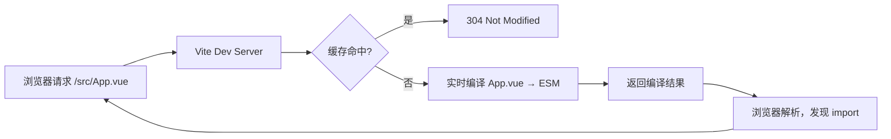

# 前端工程化核心原理与面试系统复盘

## 一、Vite vs Webpack 架构对比

### Webpack 的核心机制

Webpack 是**静态依赖图分析**的打包器。启动时，它递归分析所有入口文件的 `import/require`，构建完整依赖图，然后将所有模块打包成 Bundle。

```
入口 → 递归解析依赖 → 构建模块图 → Loader 处理 → Plugin 加工 → 输出 Bundle
```

**开发环境痛点**：每次启动都要先构建完整 Bundle，大型项目冷启动动辄几十秒。

### Vite 的核心机制

Vite 利用浏览器对 **ES Module** 的原生支持，完全规避"先打包再服务"的瓶颈：

```
启动时：仅预构建 node_modules（esbuild，速度极快）
请求时：浏览器发起 import 请求 → Vite 按需编译单文件 → 返回 ESM
```



### 关键差异对比

| 维度 | Webpack | Vite |
|------|---------|------|
| 冷启动 | 慢（全量打包）| 快（按需编译）|
| HMR 速度 | O(n)，依赖模块越多越慢 | O(1)，只更新改动文件 |
| 底层编译器 | JS 实现（babel/terser）| Go/Rust（esbuild/rollup）|
| 生产构建 | Webpack | Rollup（tree-shaking 更优）|
| 配置复杂度 | 高 | 低（约定优于配置）|
| 生态成熟度 | 极成熟 | 成熟且快速增长 |

## 二、Tree Shaking：原理与失效场景

### 基础原理

Tree Shaking 依赖 **ESM 的静态结构**（`import/export` 在编译期可确定依赖关系），通过**标记未使用的导出，在压缩阶段删除**实现。

```javascript
// utils.js
export function add(a, b) { return a + b }   // 被使用 ✓
export function sub(a, b) { return a - b }   // 未被 import，会被摇掉 ✗

// main.js
import { add } from './utils'
```

**CommonJS 无法 Tree Shake** 的根本原因：`require()` 是运行时的函数调用，编译期无法静态分析。

### 常见失效场景

**1. 副作用导入（Side Effects）**
```javascript
// polyfill.js
Array.prototype.flat = ...  // 修改全局原型，不能摇掉

// package.json 中声明副作用
{ "sideEffects": ["./src/polyfills.js", "*.css"] }
// 没有副作用的库可设置：
{ "sideEffects": false }
```

**2. 使用 CommonJS 导入 ESM 模块时的间接引用**
```javascript
const utils = require('./utils')  // 整个 utils 对象被引用，无法分析用了哪些
```

**3. 动态导入（dynamic require）**
```javascript
const fn = require('./utils/' + name)  // 运行时才知道加载什么，无法静态分析
```

**4. 编译工具将 ESM 转为 CJS**（常见于老版 Babel 配置）
```json
// .babelrc 中这个选项会破坏 Tree Shaking
{ "presets": [["@babel/preset-env", { "modules": "commonjs" }]] }
// 应改为：
{ "presets": [["@babel/preset-env", { "modules": false }]] }
```

## 三、HMR（热模块替换）原理

### 工作流程

```
1. 文件变化 → Vite/Webpack 文件监听器感知
2. 重新编译变化模块
3. 通过 WebSocket 推送更新通知（含模块路径和 hash）
4. 客户端 HMR runtime 接收通知
5. 动态 import 新版本模块
6. 执行模块注册的 accept 回调替换旧模块
7. 若无 accept 或更新失败 → fallback 到全页刷新
```

### Vite HMR vs Webpack HMR 的速度差异

- **Webpack**：需要重新打包受影响的**整个 Bundle chunk**，chunk 越大越慢
- **Vite**：只需重新编译**单个变化的模块**，通过 ESM 的模块边界精确替换

### Vue 组件的 HMR

Vue 的 SFC 文件经过编译后，template/script/style 分别对应独立的虚拟模块：
- 只改 `<style>` → 只注入新 CSS，不触发组件重渲染（状态保留）
- 只改 `<template>` → 重新生成 render 函数，组件实例保留状态
- 改 `<script setup>` → 完整重新挂载，状态丢失

## 四、代码分割（Code Splitting）

### 分割策略

```javascript
// 1. 动态 import（最常用）
const LazyPage = () => import('./pages/LazyPage.vue')

// 2. Vite manualChunks
// vite.config.js
export default {
  build: {
    rollupOptions: {
      output: {
        manualChunks: {
          vendor: ['vue', 'vue-router'],       // 第三方库单独 chunk
          utils: ['lodash-es', 'date-fns'],    // 工具库合并
        }
      }
    }
  }
}

// 3. 基于路由的自动分割（配合 Vue Router）
const router = createRouter({
  routes: [
    { path: '/dashboard', component: () => import('./Dashboard.vue') }
  ]
})
```

### 分割粒度的权衡

| 粒度 | 优点 | 缺点 |
|------|------|------|
| 过粗（一个 Bundle）| HTTP 请求少 | 首屏慢，改动全量缓存失效 |
| 过细（每个文件一个 chunk）| 按需加载 | HTTP 请求多，并发开销 |
| 合理分割（路由级 + 第三方 vendor）| 平衡 | 需要人工维护 manualChunks |

## 五、Monorepo 工程化

### 主流方案对比

| 工具 | 特点 | 适用 |
|------|------|------|
| pnpm workspace | 原生 pnpm 支持，硬链接节省磁盘 | 中小型 Monorepo |
| Turborepo | 智能缓存，任务编排，增量构建 | 大型 CI/CD 密集项目 |
| Nx | 全功能，支持多语言，依赖图分析 | 企业级全栈 Monorepo |
| Lerna + yarn/pnpm | 经典方案，发版管理成熟 | 多包 npm 库发布 |

### pnpm workspace 的核心优势

```yaml
# pnpm-workspace.yaml
packages:
  - 'packages/*'
  - 'apps/*'
```

- **内容寻址存储**：相同依赖只在磁盘存一份（通过硬链接引用），节省大量空间
- **依赖隔离**：每个包的 node_modules 只包含它明确声明的依赖（幽灵依赖问题）
- **workspace 协议**：`"@myorg/utils": "workspace:*"` 直接引用本地包

## 六、模块联邦（Module Federation）

模块联邦（Webpack 5 / Vite 插件）允许**运行时跨应用共享模块**，是微前端的重要实现方式之一。

```javascript
// Host 应用 webpack 配置
new ModuleFederationPlugin({
  name: 'host',
  remotes: {
    shop: 'shop@http://cdn.example.com/shop/remoteEntry.js',
  },
})

// 使用远程模块（运行时动态加载）
const ShopCart = React.lazy(() => import('shop/Cart'))
```

**与传统 npm 包的区别**：
- npm 包是构建时确定版本，需要重新构建才能更新
- 模块联邦是运行时加载，无需重新构建即可热更新远程模块

---

## 📝 面试题自测

### Q1 [single]
Vite 开发环境极快的根本原因是什么？
A. 使用了比 Node.js 更快的 Bun 运行时
B. 利用浏览器原生 ESM 按需编译，跳过了全量打包步骤
C. 缓存了上次的编译结果，避免重复工作
D. 使用了多线程并行编译所有文件
答案：B
解析：
💡 它解决了什么问题：
解决了在传统构建工具（如 Webpack）下，随着前端应用规模急剧膨胀带来的冷启动（Cold Start）慢和模块热替换（HMR）慢等开发者体验瓶颈问题。

🔍 核心原理解析（防拷打）：
1. 原生 ESM 的按需加载：Vite 开发服务器利用了现代浏览器原生支持 ESM 的特性。当浏览器遇到 `import` 语句时，会主动向服务器发起静态资源请求。Vite 开发服务器无需提前进行整体的依赖图解析和 Bundle 打包，仅在接收到具体文件的 HTTP 请求时，才进行即时转换（On-demand compilation），从而实现了 $O(1)$ 的项目冷启动速度。
2. 双引擎架构取舍：Vite 采用了“依赖预构建（esbuild）+ 源码即时转换”的双引擎设计。对于庞大且极少变动的 node_modules 依赖，使用 Go 编写的 esbuild 进行预打包，将成百上千的 ESM 细碎文件合并并统一转化为标准 ESM 格式；对于业务源码，直接交给 Vite 服务器动态编译返回，开发体验极为流畅。
3. 极限边界追问：虽然 ESM 按需编译极快，但在巨型项目中，若首屏动态导入了数千个 ESM 模块，浏览器并发发起数千个 HTTP 请求仍会使网络吞吐到达瓶颈，导致首屏加载缓慢（即 Connection Waterflow 问题）。大厂通常在 Vite 配置中采用合并预打包路由、优化动态导入链路或本地启用 HTTP/2 协议来克服此痛点。

### Q2 [single]
Tree Shaking 为什么不能对 CommonJS 模块生效？
A. CommonJS 不支持导出函数
B. require() 是运行时函数调用，编译期无法静态分析哪些导出被使用
C. CommonJS 模块没有 default export
D. Node.js 不支持 Tree Shaking
答案：B
解析：
💡 它解决了什么问题：
解决了传统 CommonJS 模块由于其高度动态特性导致构建工具无法在编译阶段安全地摇掉（Tree Shake）未使用代码，从而造成最终生产包体积臃肿、代码大量冗余的问题。

🔍 核心原理解析（防拷打）：
1. ESM 的静态依赖分析（Static Analysis）：ESM 的设计理念是“编译时确定”。其 `import` 和 `export` 必须处于模块顶层，不能出现在 `if` 条件分支中，且路径必须是字符串字面量。打包工具（如 Rollup/Webpack）可在不运行代码的前提下，构建出确定性的 AST（抽象语法树），标记导出变量的引用关系。
2. CommonJS 的运行时动态绑定：CommonJS 的 `require` 是一个普通的 JS 函数调用，可以被赋值、在运行时动态拼接路径（如 `require('./utils/' + name)`）或者放在 `try-catch/if` 分支内执行。这意味着只有当代码实际运行起来后，才能得知加载了哪些模块，因此构建工具在编译期必须保守假设所有导出都被引用，无法做死代码删除（DCE）。
3. 追问与取舍：即使 ESM 具备静态特性，如果代码中包含隐式副作用（Side Effects，如往 window 挂载变量或修改原型链），构建工具仍不敢将其摇掉。因此，组件库通常需要配合 `sideEffects: false` 显式声明来辅助构建器进行极致剪枝。

### Q3 [judgment]
在 Babel 编译与前端构建打包优化中，将 `@babel/preset-env` 的 `modules` 选项设为 `commonjs` 会破坏 Tree Shaking。
答案：对
解析：
💡 它解决了什么问题：
解决了在前端构建流水线中，由于 Babel 或其他编译插件对模块规范处理不当（将 ESM 悄悄转换为了 CommonJS），导致下游打包器无法进行 Tree Shaking 优化，使得无用代码被大量打包进生产产物的工程痛点。

🔍 核心原理解析（防拷打）：
1. 模块转换截断：Tree Shaking 的工作链路通常是 `Babel (转译) -> Bundler (依赖分析并摇树) -> Minimizer (物理删除)`。若 `@babel/preset-env` 配置了 `modules: 'commonjs'`，Babel 会在打包器拦截之前，将 ESM 的 `import/export` 全部重写为 `require` 和 `exports.xxx = ...`。
2. 打包器解析退化：一旦打包器接收到的 AST 全是 CommonJS 规范的代码，其静态分析链路立刻退化失效，无法标记 `unused exports`。
3. 业界最佳实践与避坑：现代工程通常在 Babel 配置中显式声明 `modules: false`（交给打包工具自己处理模块化规范），或者采用现代编译工具（如 esbuild、SWC），它们在将 TS/JS 转译为底层语法的过程中默认保留 ESM 格式，直至最后由 Rollup/Webpack 进行统一的打包摇树。

### Q4 [multiple]
在使用 Webpack 或 Rollup 等打包工具时，以下哪些场景会导致 Tree Shaking（摇树优化）失效？
A. 库的 package.json 中未设置 `sideEffects: false`
B. 使用动态 require() 加载模块
C. 使用具名 import（import { fn } from 'lib'）
D. 全局 polyfill 修改了 Array.prototype
答案：ABD
解析：
💡 它解决了什么问题：
解决了打包优化中，因代码书写习惯或第三方包的配置遗漏导致构建工具无法安全剪枝，造成生产包混入无用依赖、首屏 JS加载体积暴涨的问题。

🔍 核心原理解析（防拷打）：
1. 隐式全局副作用（Side Effects）：如果一个模块包含修改全局对象（如 `Array.prototype.flat = ...` 或往 `window` 上挂载属性）的行为，即使该模块没有被任何其他模块显式 `import`，它也在运行时改变了全局环境。若没有 package.json 中的 `sideEffects` 声明来强制隔离，打包工具出于安全考虑，必须完整保留该模块。
2. 动态依赖的无法识别：使用动态 `require()` 或动态拼接路径，使得依赖关系依赖于运行时的入参，打包工具无法静态推导其依赖图。
3. 具名 import 的契约：只有使用静态的具名导入 `import { fn } from 'lib'` 且目标库也是以符合 ESM 格式输出时，打包器才可通过静态分析精准过滤掉 `lib` 中未导出的其他多余方法。

### Q5 [single]
Vite 的 HMR 速度比 Webpack 快的核心原因是？
A. Vite 使用了更快的网络协议
B. Vite 只需重新编译变化的单个模块，不需要重新打包整个 chunk
C. Vite 禁用了 source map 所以更快
D. Vite 把 HMR 逻辑放在了 Service Worker 中
答案：B
解析：
💡 它解决了什么问题：
解决了传统构建打包模式下，模块热替换（HMR）耗时随着项目体积增加（模块数量增加）呈线性增长（$O(n)$）的痛点，彻底消除了大型项目开发过程中修改一行代码需要等待数秒甚至数十秒的等待期。

🔍 核心原理解析（防拷打）：
1. 模块热替换粒度的本质区别：Webpack 每次修改文件时，会重新以该文件为入口出发，将其依赖链路上的所有相关模块重新执行一遍 AST 分析并打包，合并生成一个新的虚拟 Chunk（或 Bundle）。项目越庞大，需要合并和重新编码的 JS 体积就越大。
2. ESM 模块边界与 Websocket 通信：Vite 基于浏览器原生的模块图（Module Graph）进行局部更新。当修改某文件时，Vite 的 HMR 运行时仅通过 WebSockets 向浏览器推送被修改模块 of 标识，浏览器只重新请求这一个被修改的模块文件（以及接受该变更的父模块），其他未发生变更的模块直接命中浏览器缓存。
3. 追问——HMR 的传播机制：HMR 的核心是“冒泡机制”。如果一个模块被修改，它必须调用 `import.meta.hot.accept()` 声明自己如何处理更新。如果它没有处理，更新会向上冒泡到引入它的父模块，直至被捕获。如果一路冒泡到根节点（如入口 main.js）仍未被 accept，则直接 fallback 为全量页面刷新。

### Q6 [multiple]
在 Vue 单文件组件（SFC）配合 Vite 的 HMR（模块热替换）运行机制中，以下哪些说法是正确的？
A. 只修改 `<style>` 不会触发组件重新挂载，状态保留
B. 修改 `<template>` 会触发 render 函数更新，状态保留
C. 修改 `<script setup>` 通常会导致组件重新挂载，状态丢失
D. HMR 更新失败时，Vite 会自动回滚到上一个版本
答案：ABC
解析：
💡 它解决了什么问题：
解决了在单文件组件（SFC）开发联调中，组件源码改动后导致页面全量刷新、局部状态（如表单输入值、滚动条位置、展开收起状态）丢失而极度影响调试效率的痛点。

🔍 核心原理解析（防拷打）：
1. SFC 的编译拆解：Vue 单文件组件（.vue）并不是被浏览器直接执行，而是被 `@vitejs/plugin-vue` 拆解为 script、template、style 等多个独立的 JS 子模块进行编译。
2. 精确的状态保持（Preserve State）：当样式改动时，Vite 只需要热替换 CSS（通过修改 `<link>` 标签路径或重新插入 `<style>` 标签），无需改动 DOM；当模版（template）改动时，由于 script 逻辑未变，Vite 仅替换 render 函数并触发 Vue 实例的组件重渲染，状态依然得以完美保留。
3. 破坏性更改与全量刷新：当 script 本身发生变化时，由于组件内部的 setup 生命周期、变量作用域和状态响应式闭包已被完全修改，无法无损替换，因此 HMR runtime 必须销毁旧组件实例并重新挂载（Unmount & Remount），这会导致状态重置。若 HMR runtime 发生未捕获的报错，则必须 fallback 到浏览器全页刷新。

### Q7 [single]
pnpm workspace 最核心的磁盘优化机制是？
A. 压缩存储所有 node_modules
B. 使用内容寻址存储 + 硬链接，相同版本的包在磁盘只存一份
C. 只在根目录维护一份 node_modules
D. 删除未使用的依赖包
答案：B
解析：
💡 它解决了什么问题：
解决了传统 NPM 扁平化布局（如 npm 3+ 和 yarn v1）在 Monorepo 或多仓项目中，因重复安装相同依赖导致的“磁盘黑洞”问题，同时规避了非声明依赖被非法引入的“幽灵依赖（Ghost Dependencies）”供应链风险。

🔍 核心原理解析（防拷打）：
1. 内容寻址存储（CAS）与全局 Store：pnpm 在全局拥有一个统一的文件 store（通常在 `~/.pnpm-store`）。对于任意版本的 npm 包，其物理文件只会在此 store 下下载、解压并存储一次。
2. 硬链接（Hard Links）技术：在具体的项目 node_modules 下，pnpm 通过操作系统的“硬链接”将其指向全局 store 对应的物理文件。这既不占用额外磁盘空间，又保证了文件加载速度。
3. 嵌套的符号链接（Symlinks）防御幽灵依赖：NPM 扁平化设计将所有子依赖全部提升到主 node_modules 下，导致业务可以 `require` 一个并未在 package.json 声明的包。而 pnpm 采用严苛的软链组织形式，只有在 dependencies 中声明的包才会被软链至主 node_modules，隐藏了深层嵌套的子依赖，从根本上杜绝了幽灵依赖。

### Q8 [judgment]
在前端构建打包与性能优化中，代码分割粒度越细越好，每个组件单独一个 chunk 可以最大化按需加载效率。
答案：错
解析：
💡 它解决了什么问题：
解决了前端静态资源部署与加载策略中，由于代码分割（Code Splitting）策略走向极端（颗粒度过细），导致运行时产生海量 HTTP 请求与 network 瓶颈，反而拖累首屏性能的工程痛点。

🔍 核心原理解析（防拷打）：
1. 细粒度分包的网络开销：虽然 HTTP/2 拥有多路复用（Multiplexing）和头部压缩（HPACK）技术，看似无惧请求数量，但实际上每个 TCP 连接或流在浏览器端依然有并发队列处理上限。此外，数千个微小 chunk 会产生大量的 TCP 握手开销、浏览器解析耗时，以及严重的“依赖请求瀑布流”问题。
2. 缓存命中率与首屏载入的权衡（Trade-off）：代码分割的本质是用“少量的网络开销换取高额的缓存命中率”。若合并成一个大 bundle，任何一行代码修改都会导致全量强缓存失效；若分割太细，虽然缓存命中率高，但首屏会因网络排队卡死。
3. 最佳实践分包策略：通常采用路由级分割（Route-based splitting）确保当前路由仅加载必要代码，同时将几乎不发生变动的三方依赖（如 Vue/React 运行时）合并提取为独立的 `vendor-[hash].js`，再将低频更新的公共工具库提取为 `common-[hash].js`，在资源加载数量和缓存复用率之间取得完美平衡。

### Q9 [single]
模块联邦（Module Federation）与传统 npm 包最关键的区别是？
A. 模块联邦只能在同一公司的项目间使用
B. 传统 npm 包是构建时确定，模块联邦是运行时动态加载，无需重新构建即可更新
C. 模块联邦不支持共享 React/Vue 等框架
D. 模块联邦必须使用 Webpack，不支持其他打包工具
答案：B
解析：
💡 它解决了什么问题：
解决了跨团队、跨项目组件/模块共享时，通过 NPM 发包模式带来的发布流程冗长、编译重复、版本分散以及无法在多个微前端应用间进行跨容器运行时热更新的问题。

🔍 核心原理解析（防拷打）：
1. 运行时模块注入与全局加载：模块联邦打破了构建时（Build-time）的物理边界。它引入了 remote（提供方）和 host（消费方）的概念。消费方在构建阶段只生成一个轻量级的动态代理指针，在运行时通过加载 remote 端的 `remoteEntry.js`，动态拉取并执行对方最新的 ESM 产物。
2. 运行时依赖共享（Shared Dependencies）：模块联邦支持配置 `shared` 字段。例如，当 remote 和 host 都声明共享 `react` 时，host 容器在运行时会检测当前页面是否已加载了 react，若有则直接复用，避免重复下载多个 react 运行时。
3. 极端边界与沙箱阻碍：大厂微前端在落地模块联邦时，最大的挑战是全局样式污染与 JS 全局变量冲突。通常需要额外引入 CSS scoped 隔离插件，并结合 iframe 或 proxy 沙箱对 window 对象进行劫持，防止 remote 模块破坏宿主环境的安全。

### Q10 [multiple]
关于 Vite 生产构建，以下哪些说法正确？
A. Vite 生产构建底层使用 Rollup 而不是 esbuild
B. Rollup 对 ESM 的 Tree Shaking 支持优于 Webpack
C. Vite 开发和生产使用不同的构建工具可能导致行为不一致
D. esbuild 用于生产构建可以获得比 Rollup 更好的产物质量
答案：ABC
解析：
💡 它解决了什么问题：
揭示了 Vite 为了保证开发环境的响应速度而在开发期（esbuild 编译）与生产期（Rollup 打包）选择不同底层编译器带来的“环境双轨制”隐患。

🔍 核心原理解析（防拷打）：
1. 编译与打包的双重分裂：开发期，为了追求极致速度，Vite 采用 esbuild 对模块进行转换和预构建。但 esbuild 目前在代码分割（Code Splitting）、CSS 提取、以及高级 Tree Shaking 上的精细度尚不足以生成工业级的最佳生产产物。因此，生产构建时 Vite 退回到基于 Rollup 的打包管线。
2. 差异隐患与 bug 逃逸：esbuild 和 Rollup 在处理非标准 CommonJS/ESM 混用模块、循环依赖分析、以及对语法容错度上表现并不一致。这意味着极有可能发生“本地跑得好好的，打包时 Rollup 报错”或者“打包成功但上线后运行时白屏”的故障。
3. 工业化规避手段：大厂在 CI/CD 中必须强制在构建流水线前段运行 `npm run build && vite preview`（或集成 E2E 自动化测试），在模拟的生产环境下对产物进行验证，并且尽可能避免在代码中混用高度不合规的非标准 ESM 依赖。

### Q11 [judgment]
在 `package.json` 中设置 `"sideEffects": false` 后，CSS 文件也会被 Tree Shake 掉。
答案：对
解析：
💡 它解决了什么问题：
解决了前端 Tree Shaking 中“误伤样式文件”的痛点。如果不理解 sideEffects 的机制而将其暴力设置为 false，构建工具在摇树时会认为那些被 JS `import './style.css'` 但未显式消费变量的 CSS 模块完全无用，从而将其强力剔除，造成线上白屏或样式全部丢失。

🔍 核心原理解析（防拷打）：
1. JS 视角下的“无用”导入：从 AST 依赖图分析，`import './index.css'` 并没有在 JS 中导出任何对象或方法（即未被 `usedExports` 关联）。根据摇树逻辑，这类既没有导出、又未被调用的模块是可以安全移除的死代码。
2. 副作用的本质：CSS 的引入会在全局的 HTML DOM 中插入样式，从而改变页面的渲染呈现，这在构建学上被定义为“副作用”。
3. 安全标记方案：为了告诉构建器“虽然我没有从 index.css 导出任何变量，但请千万不要把我删掉”，我们必须在 package.json 的 `sideEffects` 数组中明确声明 CSS 样式文件的匹配 glob 模式，例如：`"sideEffects": ["*.css", "*.scss"]`。

### Q12 [single]
Webpack 5 的持久化缓存（Persistent Cache）主要解决了什么问题？
A. 减少了运行时 Bundle 体积
B. 将构建结果缓存到磁盘，二次构建跳过未变化模块，大幅降低冷启动时间
C. 让 HMR 速度与文件数量无关
D. 自动合并重复的 chunk
答案：B
解析：
💡 它解决了什么问题：
解决了大型前端项目随着源文件和依赖数量增加，在 CI/CD 或本地冷启动时打包时间越变越长，每次重新构建都要做大量重复的编译工作、浪费算力与交付时效的致命缺陷。

🔍 核心原理解析（防拷打）：
1. 基于磁盘的持久化快照：Webpack 5 引入了 `cache: { type: 'filesystem' }` 机制。它不仅在内存中缓存模块，还会在构建完成时将模块的 AST 结构、编译后的物理产物以及依赖图关系持久化写入本地磁盘文件（通常在 `.yarn/cache` 或 `node_modules/.cache` 下）。
2. 三重 Hash 校验（Invalidation）：在下一次构建启动时，Webpack 会通过计算输入文件的 content hash、构建配置对象的 hash、以及包管理器 lockfile 的 hash。如果均未改变，则直接从磁盘缓存中读取打包片段，直接跳过 expensive 的 AST 转换和 Loader 转译管线。
3. 边界场景（幽灵缓存）：在极少数情况下（如手动修改了 node_modules 里的源码但没有更新 lockfile 或 package.json 版本），校验哈希可能失效，导致构建器继续采用错误的旧磁盘缓存。此时需要清理 `.cache` 目录以强制进行冷启动编译。

### Q13 [multiple]
实现"公共组件库按需引入"（如 Element Plus）通常需要哪些配合？
A. 组件库使用 ESM 格式发布并设置 sideEffects
B. 使用 unplugin-vue-components 等自动导入插件
C. 在应用代码中通过具名 import 引入具体组件
D. 必须手动在 vite.config.js 配置 manualChunks
答案：ABC
解析：
💡 它解决了什么问题：
解决了引入大型第三方 UI 组件库时，如果全量引入会导致最终部署的静态文件包体积巨大，但如果纯手工去编写繁琐的“单组件引入 + 样式单独引入”代码，又会严重伤害开发者开发效率和体验的工程两难境地。

🔍 核心原理解析（防拷打）：
1. 产物端 ESM 输出契约：组件库本身必须具备 Tree Shaking 友好性。这要求它在 npm 发布阶段输出按需的 ESM 结构（即每个组件为独立的物理 JS，主入口使用 `export` 暴露），并且 package.json 的 `sideEffects` 必须精准配置（不可误摇样式，也不可阻碍 JS 被摇）。
2. 消费端 AST 自动重写：像 `unplugin-vue-components` 这样的工具，其原理是在编译阶段作为 Bundler 的插件拦截应用源码的 AST 树，当发现页面中使用了 `<el-button>` 时，自动将代码在顶层重写为 `import { ElButton } from 'element-plus'; import 'element-plus/es/components/button/style/css'`，从而免去了手动写 import 的工作。
3. 动态导入与解析边界：在这种机制下，组件库和自动引入插件紧密配合，既让开发者写代码时像“全量引入”一样便捷，又让最终构建产物达到了“按需剪枝”的极致体积。

### Q14 [single]
在 Webpack 配置中，以下哪个选项最直接影响 Tree Shaking 效果？
A. `optimization.minimize`
B. `optimization.usedExports` 配合 `mode: production`
C. `output.filename`
D. `resolve.alias`
答案：B
解析：
💡 它解决了什么问题：
解决了构建工具将代码标记为“未使用”后，如何安全且物理地将其从输出的物理 Bundle 文件中删除，从而完成体积剪枝闭环的核心痛点。

🔍 核心原理解析（防拷打）：
1. 摇树的两阶段管线：Tree Shaking 的落地必须经过两个角色的配合：一是**打包器（Bundler）**，二是**压缩器（Minimizer/Terser）**。
2. 标记（Marking）阶段：在 `mode: production` 下，Webpack 默认启用 `optimization.usedExports: true`。它会扫描模块依赖图，当发现某模块的导出未被使用时，它不会直接删除它，而是在生成的代码片段中注入特殊的注释标记（如 `/* unused harmony export */`）。
3. 擦除（Pruning）与 DCE 阶段：随后，压缩工具（如 Terser 或 esbuild）介入，它在执行死代码删除（Dead Code Elimination）算法时，会识别这些特殊的注释和无引用变量，将其对应的物理代码从 AST 中彻底剪除，进而减小产物体积。如果不配置 minimize 流程，摇树优化的体积缩减就无法真正落地。

### Q15 [judgment]
在基于 pnpm/yarn 的 Monorepo（单仓多包）多项目关联结构中，公共包每次本地修改都需要发布到 npm 才能被其他子包消费和使用。
答案：错
解析：
💡 它解决了什么问题：
解决了传统多包管理模式下（如多个 Git 仓库或非 Workspace Monorepo），内部依赖包修改后，必须经过 `npm run build -> npm publish -> 主应用 npm install` 的逆天长链路才能联调的工程痛点，极大地提高了多模块并行开发的协同效率。

🔍 核心原理解析（防拷打）：
1. Workspace 本地软链重定向：在 pnpm / yarn workspace 下，当子包 A 依赖子包 B（版本号声明为 `workspace:*` ），包管理器在执行 install 时，不会去远程 registry 下载 B 包，而是在 A 包的 `node_modules` 中建立一个指向本地 B 包物理源码目录的软链接（Symlink）。
2. 构建监听联动：当 B 包源码被修改并触发重新编译（或在本地启动 watch 模式）后，由于 A 包直接引用的是其本地构建产物，B 的最新变更立刻实时反映在 A 中，不需要经历任何向 NPM 服务器发包的步骤。
3. 幽灵依赖与安全陷阱：使用软链需要警惕，本地软链的解析路径在主应用构建时可能导致 node_modules 的查找路径偏离预期，或在发布阶段忘记将 `workspace:*` 替换为真实的 SemVer，从而导致外部消费者下载时报错。

### Q16 [single]
Vite 为什么在开发环境预构建（Pre-bundling）第三方依赖，而不是也按需编译？
A. 第三方依赖通常是 CommonJS 格式，需要转为 ESM
B. 第三方依赖更新频繁，需要单独缓存
C. 预构建可以减少浏览器的内存占用
D. 只有预构建后才能使用 TypeScript
答案：A
解析：
💡 它解决了什么问题：
解决了开发环境下，由于浏览器直接加载第三方 NPM 依赖包时会产生的大量 HTTP 网络拥堵（瀑布流请求）以及由于 CommonJS 模块格式不兼容导致浏览器无法执行的致命阻塞。

🔍 核心原理解析（防拷打）：
1. 模块格式的一致性归一（Format Normalization）：尽管现代浏览器支持 ESM，但在 NPM 生态中仍有大量历史包采用 CommonJS 格式。Vite 的依赖预构建利用 Go 编写的 esbuild，将这些 CJS 或 UMD 格式的包物理转译并统一输出为标准的 ESM 产物，使浏览器可以直接通过 `import` 加载。
2. 物理文件合并（Module Consolidation）：许多 ESM 包（如 `lodash-es`）内部结构极其细碎，含有数百个小 JS 文件。如果直接按需加载，会导致浏览器并发发起数百个 HTTP 请求，造成严重的浏览器线程卡死和首屏白屏。esbuild 会将这些包提前物理打包合并为一个或少数几个物理 JS bundle 文件，一次请求即可拉取完毕。
3. 动态扫描机制：Vite 会在首次启动时对项目源码进行 AST 扫描，找出所有的第三方 `import` 入口，汇总成一份预构建清单，并在后台调用 esbuild 进行打包并放入 `node_modules/.vite` 目录下缓存，极大地降低了后续运行的开销。
