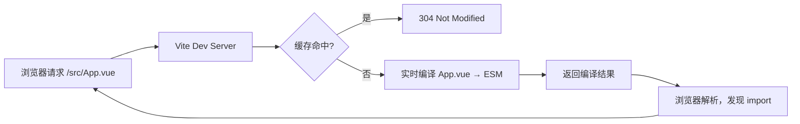

# 前端工程化核心原理与面试系统复盘

## 一、Vite vs Webpack 架构对比

### Webpack 的核心机制

Webpack 是**静态依赖图分析**的打包器。启动时，它递归分析所有入口文件的 `import/require`，构建完整依赖图，然后将所有模块打包成 Bundle。

```
入口 → 递归解析依赖 → 构建模块图 → Loader 处理 → Plugin 加工 → 输出 Bundle
```

**开发环境痛点**：每次启动都要先构建完整 Bundle，大型项目冷启动动辄几十秒。

### Vite 的核心机制

Vite 利用浏览器对 **ES Module** 的原生支持，完全规避"先打包再服务"的瓶颈：

```
启动时：仅预构建 node_modules（esbuild，速度极快）
请求时：浏览器发起 import 请求 → Vite 按需编译单文件 → 返回 ESM
```



### 关键差异对比

| 维度 | Webpack | Vite |
|------|---------|------|
| 冷启动 | 慢（全量打包）| 快（按需编译）|
| HMR 速度 | O(n)，依赖模块越多越慢 | O(1)，只更新改动文件 |
| 底层编译器 | JS 实现（babel/terser）| Go/Rust（esbuild/rollup）|
| 生产构建 | Webpack | Rollup（tree-shaking 更优）|
| 配置复杂度 | 高 | 低（约定优于配置）|
| 生态成熟度 | 极成熟 | 成熟且快速增长 |

## 二、Tree Shaking：原理与失效场景

### 基础原理

Tree Shaking 依赖 **ESM 的静态结构**（`import/export` 在编译期可确定依赖关系），通过**标记未使用的导出，在压缩阶段删除**实现。

```javascript
// utils.js
export function add(a, b) { return a + b }   // 被使用 ✓
export function sub(a, b) { return a - b }   // 未被 import，会被摇掉 ✗

// main.js
import { add } from './utils'
```

**CommonJS 无法 Tree Shake** 的根本原因：`require()` 是运行时的函数调用，编译期无法静态分析。

### 常见失效场景

**1. 副作用导入（Side Effects）**
```javascript
// polyfill.js
Array.prototype.flat = ...  // 修改全局原型，不能摇掉

// package.json 中声明副作用
{ "sideEffects": ["./src/polyfills.js", "*.css"] }
// 没有副作用的库可设置：
{ "sideEffects": false }
```

**2. 使用 CommonJS 导入 ESM 模块时的间接引用**
```javascript
const utils = require('./utils')  // 整个 utils 对象被引用，无法分析用了哪些
```

**3. 动态导入（dynamic require）**
```javascript
const fn = require('./utils/' + name)  // 运行时才知道加载什么，无法静态分析
```

**4. 编译工具将 ESM 转为 CJS**（常见于老版 Babel 配置）
```json
// .babelrc 中这个选项会破坏 Tree Shaking
{ "presets": [["@babel/preset-env", { "modules": "commonjs" }]] }
// 应改为：
{ "presets": [["@babel/preset-env", { "modules": false }]] }
```

## 三、HMR（热模块替换）原理

### 工作流程

```
1. 文件变化 → Vite/Webpack 文件监听器感知
2. 重新编译变化模块
3. 通过 WebSocket 推送更新通知（含模块路径和 hash）
4. 客户端 HMR runtime 接收通知
5. 动态 import 新版本模块
6. 执行模块注册的 accept 回调替换旧模块
7. 若无 accept 或更新失败 → fallback 到全页刷新
```

### Vite HMR vs Webpack HMR 的速度差异

- **Webpack**：需要重新打包受影响的**整个 Bundle chunk**，chunk 越大越慢
- **Vite**：只需重新编译**单个变化的模块**，通过 ESM 的模块边界精确替换

### Vue 组件的 HMR

Vue 的 SFC 文件经过编译后，template/script/style 分别对应独立的虚拟模块：
- 只改 `<style>` → 只注入新 CSS，不触发组件重渲染（状态保留）
- 只改 `<template>` → 重新生成 render 函数，组件实例保留状态
- 改 `<script setup>` → 完整重新挂载，状态丢失

## 四、代码分割（Code Splitting）

### 分割策略

```javascript
// 1. 动态 import（最常用）
const LazyPage = () => import('./pages/LazyPage.vue')

// 2. Vite manualChunks
// vite.config.js
export default {
  build: {
    rollupOptions: {
      output: {
        manualChunks: {
          vendor: ['vue', 'vue-router'],       // 第三方库单独 chunk
          utils: ['lodash-es', 'date-fns'],    // 工具库合并
        }
      }
    }
  }
}

// 3. 基于路由的自动分割（配合 Vue Router）
const router = createRouter({
  routes: [
    { path: '/dashboard', component: () => import('./Dashboard.vue') }
  ]
})
```

### 分割粒度的权衡

| 粒度 | 优点 | 缺点 |
|------|------|------|
| 过粗（一个 Bundle）| HTTP 请求少 | 首屏慢，改动全量缓存失效 |
| 过细（每个文件一个 chunk）| 按需加载 | HTTP 请求多，并发开销 |
| 合理分割（路由级 + 第三方 vendor）| 平衡 | 需要人工维护 manualChunks |

## 五、Monorepo 工程化

### 主流方案对比

| 工具 | 特点 | 适用 |
|------|------|------|
| pnpm workspace | 原生 pnpm 支持，硬链接节省磁盘 | 中小型 Monorepo |
| Turborepo | 智能缓存，任务编排，增量构建 | 大型 CI/CD 密集项目 |
| Nx | 全功能，支持多语言，依赖图分析 | 企业级全栈 Monorepo |
| Lerna + yarn/pnpm | 经典方案，发版管理成熟 | 多包 npm 库发布 |

### pnpm workspace 的核心优势

```yaml
# pnpm-workspace.yaml
packages:
  - 'packages/*'
  - 'apps/*'
```

- **内容寻址存储**：相同依赖只在磁盘存一份（通过硬链接引用），节省大量空间
- **依赖隔离**：每个包的 node_modules 只包含它明确声明的依赖（幽灵依赖问题）
- **workspace 协议**：`"@myorg/utils": "workspace:*"` 直接引用本地包

## 六、模块联邦（Module Federation）

模块联邦（Webpack 5 / Vite 插件）允许**运行时跨应用共享模块**，是微前端的重要实现方式之一。

```javascript
// Host 应用 webpack 配置
new ModuleFederationPlugin({
  name: 'host',
  remotes: {
    shop: 'shop@http://cdn.example.com/shop/remoteEntry.js',
  },
})

// 使用远程模块（运行时动态加载）
const ShopCart = React.lazy(() => import('shop/Cart'))
```

**与传统 npm 包的区别**：
- npm 包是构建时确定版本，需要重新构建才能更新
- 模块联邦是运行时加载，无需重新构建即可热更新远程模块

---

## 📝 面试题自测

### Q1 [single]
Vite 开发环境极快的根本原因是什么？
A. 使用了比 Node.js 更快的 Bun 运行时
B. 利用浏览器原生 ESM 按需编译，跳过了全量打包步骤
C. 缓存了上次的编译结果，避免重复工作
D. 使用了多线程并行编译所有文件
答案：B
解析：Vite 不需要在启动时构建完整 Bundle，而是等浏览器发起请求时才实时编译对应模块，这才是速度快的根本。

### Q2 [single]
Tree Shaking 为什么不能对 CommonJS 模块生效？
A. CommonJS 不支持导出函数
B. require() 是运行时函数调用，编译期无法静态分析哪些导出被使用
C. CommonJS 模块没有 default export
D. Node.js 不支持 Tree Shaking
答案：B
解析：Tree Shaking 依赖 ESM 的静态分析能力（import/export 是关键字，编译期可确定），CommonJS 的 require 是普通函数，调用时机在运行时，无法静态推断。

### Q3 [judgment]
将 `@babel/preset-env` 的 `modules` 选项设为 `commonjs` 会破坏 Tree Shaking。
答案：对
解析：该选项会将 ESM 的 import/export 转为 CommonJS 的 require/module.exports，使打包工具无法进行静态分析，从而无法 Tree Shake。

### Q4 [multiple]
以下哪些场景会导致 Tree Shaking 失效？
A. 库的 package.json 中未设置 `sideEffects: false`
B. 使用动态 require() 加载模块
C. 使用具名 import（import { fn } from 'lib'）
D. 全局 polyfill 修改了 Array.prototype
答案：ABD
解析：C 是正确的 Tree Shaking 写法，不会导致失效；A 可能导致打包工具保守处理不敢摇，B 和 D 是典型失效场景。

### Q5 [single]
Vite 的 HMR 速度比 Webpack 快的核心原因是？
A. Vite 使用了更快的网络协议
B. Vite 只需重新编译变化的单个模块，不需要重新打包整个 chunk
C. Vite 禁用了 source map 所以更快
D. Vite 把 HMR 逻辑放在了 Service Worker 中
答案：B
解析：Webpack 的 HMR 需要重建受影响的整个 chunk；Vite 基于 ESM 模块边界，只编译变化的文件即可，速度与项目大小无关。

### Q6 [multiple]
在 Vue 单文件组件（SFC）的 HMR 中，以下哪些说法正确？
A. 只修改 `<style>` 不会触发组件重新挂载，状态保留
B. 修改 `<template>` 会触发 render 函数更新，状态保留
C. 修改 `<script setup>` 通常会导致组件重新挂载，状态丢失
D. HMR 更新失败时，Vite 会自动回滚到上一个版本
答案：ABC
解析：D 错误，HMR 失败时 Vite 会 fallback 到全页刷新，不是回滚。

### Q7 [single]
pnpm workspace 最核心的磁盘优化机制是？
A. 压缩存储所有 node_modules
B. 使用内容寻址存储 + 硬链接，相同版本的包在磁盘只存一份
C. 只在根目录维护一份 node_modules
D. 删除未使用的依赖包
答案：B
解析：pnpm 的全局 store 使用内容寻址存储，每个包只存一份，各项目通过硬链接引用，可节省大量磁盘空间。

### Q8 [judgment]
代码分割粒度越细越好，每个组件单独一个 chunk 可以最大化按需加载效率。
答案：错
解析：过细的分割会导致大量 HTTP 请求，且 HTTP/2 也有并发和 HPACK 开销的上限；合理的分割粒度应该是路由级别 + 第三方库 vendor 合并。

### Q9 [single]
模块联邦（Module Federation）与传统 npm 包最关键的区别是？
A. 模块联邦只能在同一公司的项目间使用
B. 传统 npm 包是构建时确定，模块联邦是运行时动态加载，无需重新构建即可更新
C. 模块联邦不支持共享 React/Vue 等框架
D. 模块联邦必须使用 Webpack，不支持其他打包工具
答案：B
解析：这是模块联邦的核心价值：Host 应用无需重新构建，Remote 应用独立部署更新后，Host 下次加载时即获得新版本。

### Q10 [multiple]
关于 Vite 生产构建，以下哪些说法正确？
A. Vite 生产构建底层使用 Rollup 而不是 esbuild
B. Rollup 对 ESM 的 Tree Shaking 支持优于 Webpack
C. Vite 开发和生产使用不同的构建工具可能导致行为不一致
D. esbuild 用于生产构建可以获得比 Rollup 更好的产物质量
答案：ABC
解析：Vite 生产用 Rollup（更好的产物优化），开发用 esbuild（极速预构建），两者差异确实可能引发不一致问题。D 错误，esbuild 虽快但产物优化不如 Rollup。

### Q11 [judgment]
在 `package.json` 中设置 `"sideEffects": false` 后，CSS 文件也会被 Tree Shake 掉。
答案：对
解析：CSS 文件通常有副作用（修改全局样式），需要在 sideEffects 数组中显式声明，否则设置 false 后 CSS 导入可能被错误地移除。

### Q12 [single]
Webpack 5 的持久化缓存（Persistent Cache）主要解决了什么问题？
A. 减少了运行时 Bundle 体积
B. 将构建结果缓存到磁盘，二次构建跳过未变化模块，大幅降低冷启动时间
C. 让 HMR 速度与文件数量无关
D. 自动合并重复的 chunk
答案：B
解析：Webpack 5 的 cache: { type: 'filesystem' } 将模块编译结果缓存到磁盘，二次构建只处理变化部分，冷启动时间接近热启动。

### Q13 [multiple]
实现"公共组件库按需引入"（如 Element Plus）通常需要哪些配合？
A. 组件库使用 ESM 格式发布并设置 sideEffects
B. 使用 unplugin-vue-components 等自动导入插件
C. 在应用代码中通过具名 import 引入具体组件
D. 必须手动在 vite.config.js 配置 manualChunks
答案：ABC
解析：按需引入的核心是 ESM + Tree Shaking（A、C），自动导入插件（B）则是开发体验优化。D 不是必须的。

### Q14 [single]
以下 Webpack 配置项中，哪个最直接影响 Tree Shaking 效果？
A. `optimization.minimize`
B. `optimization.usedExports` 配合 `mode: production`
C. `output.filename`
D. `resolve.alias`
答案：B
解析：`usedExports: true` 告诉 Webpack 标记哪些导出被使用，配合 Terser 压缩时才真正删除未使用代码。mode: production 默认开启此选项。

### Q15 [judgment]
Monorepo 中的公共包每次修改都需要发布到 npm 才能被其他包使用。
答案：错
解析：Monorepo 的核心价值之一就是本地引用（pnpm 的 `workspace:*` 协议），包修改后其他包立即可见，无需发布。发布只在对外发布时才需要。

### Q16 [single]
Vite 为什么在开发环境预构建（Pre-bundling）第三方依赖，而不是也按需编译？
A. 第三方依赖通常是 CommonJS 格式，需要转为 ESM
B. 第三方依赖更新频繁，需要单独缓存
C. 预构建可以减少浏览器的内存占用
D. 只有预构建后才能使用 TypeScript
答案：A
解析：大量 npm 包是 CommonJS 格式，浏览器无法直接消费；且一些 ESM 包会有数百个子模块（如 lodash-es），预构建合并成一个文件可避免数百次 HTTP 请求。
