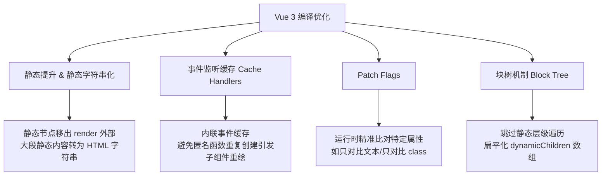

# Vue 2 与 Vue 3 核心性能提升对比

在现代中高级前端面试以及大型项目技术架构升级中，“Vue 3 为什么比 Vue 2 快”是一个极具深度且考察底层功底的问题。Vue 3 的性能提升不是单纯的微小补丁，而是从**响应式机制**、**编译期优化**到**运行时算法**的全方位重构。

---

## 一、 响应式机制：defineProperty 递归拦截 vs Proxy 动态懒代理

响应式系统的重构是 Vue 3 性能跃升与内存暴降的基石。

### 1. Vue 2 的性能痛点（递归初始化）
在 Vue 2 中，响应式是基于 `Object.defineProperty` 实现的。
*   **全量初始化递归**：为了实现深层响应式，Vue 2 在组件实例化时，必须**深度遍历**整个 `data` 对象的所有属性，并为它们逐一调用 `defineProperty` 转化为 getter 和 setter。
*   **内存开销巨大**：即便某些数据在首屏没有被渲染，或者属于极少被访问的“深层冷数据”，也必须提前在内存中为它们创建对应的依赖收集器 (Dep) 闭包实例，导致巨额内存占用。
*   **无法动态追踪**：无法拦截对象属性的新增和删除，以及数组索引的赋值，必须提供 `$set` 和 `$delete` 补丁，增加了运行时的防御性代码体积。

### 2. Vue 3 的懒代理 (Lazy Proxy)
Vue 3 全面采用 ES6 `Proxy`，其核心优势是**“动态拦截”**而非“改写属性”。
*   **首屏 O(1) 开销**：`Proxy` 仅代理对象的外层。初始化时，无论对象层级多深，都只需要为第一层包裹 Proxy。
*   **惰性求值 (Lazy Reactivity)**：只有当用户在视图或代码中真正访问到深层属性（触发 `get`）时，Vue 3 才会动态为下一层对象包裹 Proxy。这使得大型项目的初始化和首屏加载时间成倍缩短。
*   **原生的动态操作拦截**：Proxy 能拦截属性的新增（`set`）、删除（`deleteProperty`）以及数组索引修改，省去了多余的 hack 逻辑。

### 3. Vue 3.5 的前沿重构：基于双向链表 (Bidirectional Linked List) 的依赖追踪
如果想在面试中展现对 Vue 响应式底层最新演进的敏锐洞察，可以阐述 Vue 3.5 对依赖追踪引擎的里程碑式重构：
*   **重构背景**：在 Vue 3.4 及以前，响应式系统内部的依赖存储结构高度依赖于 ES6 `Map` 和 `Set` 的双向关联（即每个响应式对象拥有 `depsMap`，每个属性又对应着一个存储 `ReactiveEffect` 的 `dep` 集合）。当组件系统非常庞大、依赖关系高频解绑与重组时，这会产生频繁的 `Set` 实例创建，造成明显的 GC（垃圾回收）内存分配损耗。
*   **双向链表机制**：Vue 3.5 彻底摒弃了原先的 `Set` 实例，转而使用一个轻量级的双向链表结构来构建 `Dep` 与 `ReactiveEffect` 的映射链条。
*   **性能飞跃**：该项底层重构使 Vue 3.5 的响应式引擎**内存占用暴降 56%**，在计算属性 (computed) 依赖重新追踪 (re-track) 与求值阶段的执行速度提升了数倍，内存抖动和 GC 卡顿被几乎彻底消除。

| 特性 | Vue 2 (defineProperty) | Vue 3 (Proxy) |
| :--- | :--- | :--- |
| **初始化开销** | O(N) (N 为数据字段总数，需要深度递归) | O(1) (只包裹最外层 Proxy) |
| **内存占用** | 极高 (为所有字段创建 Dep 闭包对象) | 极低 (动态惰性生成 Proxy，没有闭包开销) |
| **新增/删除属性** | 不支持 (必须调用 `$set` / `$delete`) | 原生支持 (拦截 `set` / `deleteProperty`) |

---

## 二、 编译期优化：静态提升、Patch Flags、Event Cache 与块树 (Block Tree) 机制

“动静分离”是 Vue 3 编译期 (Compiler) 最精妙的性能突破。

### 1. 静态提升 (Static Hoisting) 与静态内容字符串化 (Static Stringification)
在 Vue 2 中，组件只要重新渲染，整个 VNode 树就会全量重新创建一遍，包括那些永远不会改变的静态标签（例如一段文案、一个静态 header）。这会产生频繁的临时对象创建，造成垃圾回收 (GC) 开销。Vue 3 在此基础上进行了双重突破：
*   **静态节点提升**：编译器能分析出完全静态的节点，并将其**提升到渲染函数之外**。在运行时重新渲染时，直接复用同一个提升后的静态 VNode 引用，避免了重复创建对象带来的内存分配与 GC 压力。
*   **静态内容字符串化 (Static Stringification)**：当编译器检测到连续多个静态节点（或单个特别庞大的静态子树，通常在 5 个以上）时，Vue 3 会更进一步。它不会生成繁琐的多个 `createVNode` 虚拟节点调用，而是直接将整棵子树编译为一个纯 HTML 字符串。在运行时通过 `createStaticVNode` 直接一次性注入 DOM（底层使用原生 `innerHTML`，其渲染与解析速度直接逼近浏览器渲染极限），极大地减少了 JS 文件体积和运行时虚拟节点创建开销。

### 2. 事件侦听器缓存 (Cache Handlers)
在写 Vue 模板时，我们常写内联事件：`<button @click="handleClick">`。
*   在 Vue 2 中，每次重新渲染，都会为此事件创建一个新的函数引用，这会导致子组件被错误判定为 “props 已改变”，进而引发子组件的不必要重新渲染 (Rerender)。
*   Vue 3 会将这些事件监听器**缓存到 `_cache` 数组**中，后续渲染读取缓存函数引用，避免子组件无效重绘。

### 3. Patch Flags
这是运行时精准对比的“向导”。
*   Vue 3 会在编译时对含有响应式数据的动态节点贴上 `PatchFlag`（数字位标志），标记它到底是“文本动态”（TEXT=1）、“Class 动态”（CLASS=2）还是“属性动态”（PROPS=8）。
*   运行时更新 Diff 时，不再全量字段瞎猜对比，而是**根据 PatchFlag 精准地只比对对应的属性**，大幅缩短单次 VNode patch 的时间。

### 4. 块树机制 (Block Tree)
传统的 VNode 对比必须沿着树状结构层层向下递归，即便中间有一百层静态 `
` 包裹，也必须递归到底。
*   Vue 3 引入了 **Block Tree**：在编译时将每个结构稳定的模板段（以 `v-if` 或 `v-for` 为边界）视为一个 **Block**。
*   块根节点 (Block VNode) 会在编译期将它内部**所有动态节点扁平化收集到 `dynamicChildren` 数组中**。
*   在运行时 `patch` 时，直接遍历这个扁平的动态子节点数组，一举跳过了中间 100 层静态节点，时间复杂度由“树整体节点数”降为了**“只与动态绑定数量相关”**。

---

## 三、 运行时优化：双端 Diff 与最长递增子序列 (LIS)

在列表乱序、节点发生复杂移动的极限场景下，Vue 3 对比算法的效率取得了关键突破。

*   **Vue 2 的双端 Diff**：使用四个指针从头部和尾部向中间聚拢对比。遇到乱序的子节点队列时，需要通过建立 `key-index` 的映射表来暴力查找，存在较多 DOM 节点的不必要移动操作。
*   **Vue 3 的快速 Diff (Fast Diff)**：
    1.  首先执行**预处理**：从头比对头、从尾比对尾，找出两端完全相同的节点并直接进行 patch，快速缩减未处理的乱序区间。
    2.  对剩下的无序中间队列，利用最长递增子序列 (Longest Increasing Subsequence) 算法，计算出不需要移动的“最大稳定节点链”。
    3.  最终只移动不在子序列中的非稳定节点，从而把真实的 **DOM 移动操作数量降到了物理极限**，保证了长列表修改顺序时的渲染性能。

---

## 四、 网络与加载性能：模块化解耦与 Tree Shaking

除了“执行快”，首屏的“加载快”也是核心性能指标，Vue 3 对此进行了面向未来的重构。

*   **Vue 2 的全量打包痛点**：Vue 2 的许多全局 API（如 `Vue.nextTick`、`Vue.set`、`Vue.delete`、`Vue.observable`）均直接挂载在 `Vue` 构造函数的原型或静态属性上。这导致打包工具（如 Webpack 或 Rollup）在构建时，无法通过 **Tree Shaking** 剔除未使用的 API 逻辑。即便你只开发一个极其简单的组件，整套 Vue 运行时的大部分机制都会被打包进 bundle 中。
*   **Vue 3 的命名导出 (Named Exports) 与模块解耦**：Vue 3 彻底将所有 API 重构为独立导出的函数。例如 `nextTick`、`reactive`、`computed`、`watch` 均需要通过类似 `import { nextTick, reactive } from 'vue'` 的方式按需引入。如果某些高级或不常用的 API 在项目中没有被引入，它们就会在打包构建时被彻底剔除。
*   **轻量级内核**：得益于 Tree Shaking 的融入，一个最简的 Vue 3 核心运行时在打包压缩后，体积能够控制在 **10KB - 13KB** (gzipped) 左右，比起 Vue 2 基础体积显著缩减，为移动端设备和弱网环境下的 FCP（首次内容绘制）提供了关键加速。

---

## 五、 📝 面试题自测

### Q1 [single]
Vue 3 响应式系统引入了 Proxy 替代 Vue 2 的 Object.defineProperty，关于两者性能差异，以下说法正确的是？
A. Proxy 初始化时仍然需要深度递归遍历整个对象的所有属性并添加拦截
B. Object.defineProperty 在数据被访问时表现为惰性初始化拦截
C. Proxy 的动态懒代理机制实现了首屏响应式初始化开销为 O(1)
D. Vue 3 放弃 defineProperty 是因为 Proxy 在所有古董浏览器（如 IE 9/10）中都支持完美降级
答案：C
解析：
💡 它解决了什么问题：
如果不引入懒代理，在面对大型项目的大表单或复杂嵌套结构数据时，Vue 在初始化阶段会消耗大量 CPU 时间去遍历全部属性并为其创建依赖订阅器 (Dep)，严重拖慢首屏渲染时间，并且冷数据也会平白浪费内存。

🔍 核心原理解析（防拷打）：
1. Vue 3 使用 Proxy 仅代理第一层属性。只有当外部代码（如模板渲染或 computed）读取到对象的嵌套属性时，Vue 3 在 Proxy 的 `get` 拦截器中检测到返回值是对象，才会在那一刻触发 `toReactive(res)`，进行惰性递归包裹代理。
2. 局限性：由于 Proxy 是原生 ES6 规范，在 JavaScript 引擎中由底层实现拦截，无法通过 polyfill 被完全降级模拟。因此 Vue 3 彻底放弃了对不兼容 Proxy 的 IE 等老旧浏览器的支持。

### Q2 [single]
在 Vue 3 编译期优化中，静态提升 (Static Hoisting) 的最核心价值是？
A. 将静态节点的元素类型从 VNode 直接替换为真实的 DOM 元素以节省渲染耗时
B. 在渲染更新时避免对静态节点进行重复创建，从而减少 GC（垃圾回收）频率和开销
C. 让运行时能够通过 static-flag 定向跳过对静态节点的组件依赖触发
D. 在服务端渲染时直接将静态节点转为 base64 图像加速首屏加载
答案：B
解析：
💡 它解决了什么问题：
在 Vue 2 中，只要组件有任何微小的属性变更引发 rerender，所有的 VNode 就会全部重新创建一次（即便 90% 是静态 HTML），这会在 V8 引擎中频繁触发小内存垃圾回收 (GC)，造成短暂的运行卡顿。

🔍 核心原理解析（防拷打）：
1. 静态提升属于编译期优化手段。编译器会在编译时检测出完全不含动态绑定的节点树，并生成独立于 `render` 函数之外的 hoisted 常量定义。
2. 每次执行 `render` 函数时，直接传入被提升常量 vnode 的引用。这样该 VNode 对象只会在首次加载时被创建一次，后续 patch 时直接复用同一对象，从根本上减小了运行时的垃圾回收开销。

### Q3 [single]
Vue 3 引入了 Block Tree（块树）机制。关于 Block Tree 在 Patch（更新）阶段的工作原理，以下说法正确的是？
A. 它通过在组件初始化时对所有静态节点进行深拷贝，来实现无 Diff 式直接替换
B. 它让运行时更新的复杂度只与模板中的“动态绑定数量”相关，而与模板大小和嵌套深度无关
C. 它要求 v-for 循环中的每一项都必须开启 disableTracking 并将其孩子拍平收集为静态节点
D. 它是通过把整个组件的 vnode 树扁平化为一个全局的一维数组来直接 patch 静态层级的
答案：B
解析：
💡 它解决了什么问题：
如果依然按照传统的树状结构递归 diff，当遇到只有一处动态绑定的多层嵌套静态节点模板时，运行时不得不挨个遍历每层 div，导致了大量不必要的节点扫描损耗。

🔍 核心原理解析（防拷打）：
1. Block Tree 将结构稳定的模板区间划分成嵌套 block。块根 VNode 在编译期通过 `openBlock()` 和 `createBlock()`，自动收集块内部所有带有 `patchFlag` 的动态子 vnode 存入 `dynamicChildren` 扁平数组。
2. 运行时在 `patchElement` 中一旦检测到 `dynamicChildren` 存在，会通过 `patchBlockChildren` 线性遍历这两个一维扁平数组进行 patch，直接跳过了没有 patchFlag 的全部静态树级。
3. 追问：什么情况下会退出 Block Tree？当使用 v-for 循环渲染列表时，因为列表子节点的顺序与数量是动态变化的，结构并不稳定。因此，v-for 的 Fragment 本身会使用 `openBlock(true)` 传入 `disableTracking = true` 来临时阻断对子节点的 dynamicChildren 收集（避免因扁平化导致线性比对发生错位）。在 v-for 列表这一层级，运行时会降级使用基于最长递增子序列 (LIS) 的快速 Diff 算法来比对子节点，但每个子项内部仍然是独立的 Block 并享受 Block Tree 的线性 Patch 优化。

### Q4 [multiple]
关于 Vue 3 相对 Vue 2 在编译期 (Compiler) 所做的性能优化，以下哪些说法是正确的？
A. 静态提升 (Static Hoisting) 将不包含动态绑定的节点提取到 Render 函数外，使每次渲染时复用 VNode
B. 事件监听器缓存 (Cache Handlers) 避免了每次组件重新渲染时内联事件处理函数的重新创建
C. PatchFlags 将动态节点标以特定位标志（如 TEXT、CLASS、PROPS），使运行时 Patch 可以按需比对指定属性
D. 编译期静态分析自动将所有的 class 属性和 inline style 都转化为 CSS 变量，免去了运行时样式解析成本
答案：ABC
解析：
💡 它解决了什么问题：
在 Vue 2 中，由于缺乏编译时和运行时的信息传递，VNode 更新时表现得盲目，不仅要深入静态节点，还得对无改动的事件处理函数进行销毁再重建，损耗了运行时算力。

🔍 核心原理解析（防拷打）：
1. 静态提升与 Patch Flags 从“对象创建”和“更新范围”两个方向给 Diff 减负；
2. 事件侦听器缓存通过 `_cache[idx]` 数组缓存事件回调函数，使得在比对 Props 时旧事件引用恒等于新事件引用（`prevHandler === nextHandler`），防止因为匿名函数每次地址不同导致子组件无效 patch。
3. D 选项错误，编译期并不会自动将 class 样式强制转为 CSS 变量，样式依旧通过标准 class 匹配或 style 样式映射解析。

### Q5 [judgment]
在 Vue 3 的运行阶段，如果一个父节点被判定为 Block，那么当它重新渲染并进行 `patch` 时，它会彻底不访问任何静态子节点。
答案：对
解析：
💡 它解决了什么问题：
如果运行时仍然去“看一眼”静态子节点（哪怕只是快速跳过），在具有海量静态 HTML 的页面中，调用栈的深度依然会导致一定的执行开销。

🔍 核心原理解析（防拷打）：
在 `renderer.ts` 的 `patchElement` 阶段，如果检测到新 vnode 含有 `dynamicChildren` 扁平动态节点列表，程序会直奔 `patchBlockChildren` 去按序迭代这两个数组，根本不会进入传统的 `patchChildren` 逻辑。因而静态子树节点在更新对比全链路上完全是被**屏蔽**的，连 `patch` 函数的门都不会进。

### Q6 [judgment]
在极小页面且响应式数据极少、没有任何多层深度嵌套的超轻量应用场景下，Vue 2 的数据读取与初始化开销绝对不可能比 Vue 3 更小。
答案：错
解析：
💡 它解决了什么问题：
在中高级面试中，要避免陷入“新版本绝对全方位超越旧版本”的绝对化思维。理解不同数据结构在底层的实际内存占用与微步运行时开销，是架构师级别的重要素养。

🔍 核心原理解析（防拷打）：
在极简应用且没有层级嵌套时，Vue 3 的 `reactive` 依然需要实例化对应的 Proxy 对象并建立 WeakMap 依赖存储映射，并且在进行属性依赖收集时，Vue 3 的 `ReactiveEffect` 与双链表结构 (Vue 3.5) 会引入额外的闭包和对象节点创建开销。而 Vue 2 只是简单的在初始化时重写属性的 descriptor，其读写拦截逻辑相对简纯。因此在极窄极小的非深度结构应用中，Vue 2 初始化的内存与读取微步开销可能微弱地小于 Vue 3（虽然在普通 Web 项目中完全不可察觉）。

### Q7 [single]
关于 Vue 3 支持 Tree Shaking 从而优化首屏加载性能的底层设计，以下说法正确的是？
A. Vue 3 依然把所有 API 挂载在 Vue 构造函数的原型上，但通过打包工具的 AST 分析实现了按需提取
B. Vue 3 彻底将全局 API 重构为命名导出 (Named Exports) 函数，使打包工具能静态分析并剔除未使用代码
C. 只要引入了 `import Vue from 'vue'`，打包工具就会自动将其进行单向依赖 tree-shaking 过滤
D. Tree Shaking 的优势仅仅体现在开发环境的热更新 (HMR) 速度中，对生产包体积没有任何影响
答案：B
解析：
💡 它解决了什么问题：
如果像 Vue 2 一样采用全局对象挂载 API 的方式，那么打包器将无法分辨对象上的哪些属性在运行期不会被访问。这导致即使项目从未使用过 `$set` 或 `$delete` 等方法，这部分冗余的框架代码也会被打包进生产文件，无端增大了加载体积。

🔍 核心原理解析（防拷打）：
1. Vue 3 重构了代码目录组织（采用 Monorepo 组织划分了独立包），并将所有框架 API 统一设计为 ES 模块导出。例如 `import { nextTick, ref } from 'vue'`。
2. 现代打包工具（如 Rollup, Vite, Webpack）在进行生产构建时，会基于 ES6 模块的静态结构进行静态依赖分析 (Static Relation Analysis)，对于未被 import 引入的导出项，直接在生成 bundle 时将其代码树枝裁剪掉。
3. 追问：如果开发者手写了 `import * as Vue from 'vue'` 会发生什么？这会导致打包工具判定开发者需要使用全部导出属性，从而失去 Tree Shaking 的效果。因此在大厂的最佳实践里，强烈建议使用显式的按需命名引入。
