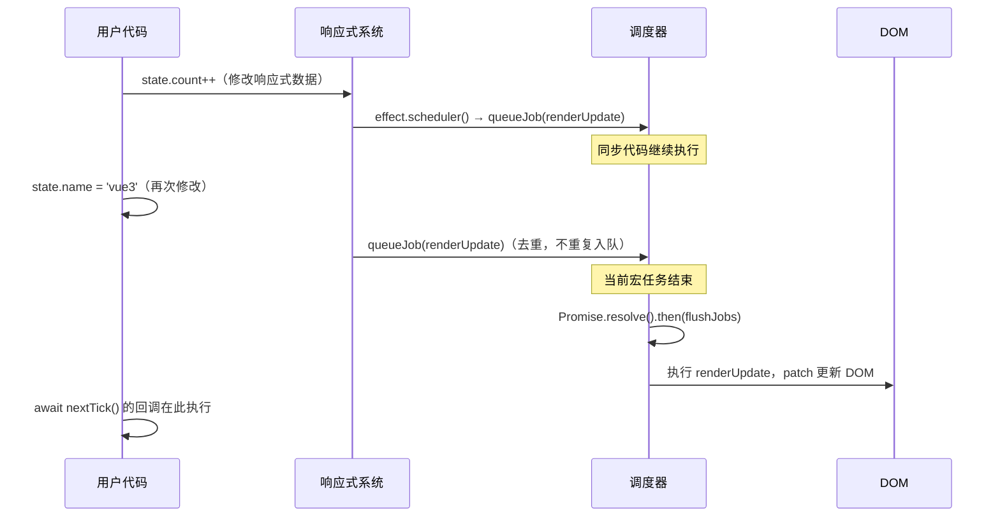

# Vue3 computed 原理与调度器深度解析

## 一、computed 的本质：惰性副作用 + 缓存

`computed` 看起来像一个"派生值"，但在 Vue 3 内部，它本质上是一个带有特殊调度器（scheduler）的 `ReactiveEffect`，同时兼具**消费者**（订阅其他 dep）和**生产者**（作为其他 effect 的依赖源）双重角色。

### 核心数据结构 ComputedRefImpl

```typescript
// packages/reactivity/src/computed.ts（简化）
export class ComputedRefImpl<T = any> implements Subscriber {
  _value: any = undefined
  readonly dep: Dep = new Dep(this)  // 作为"生产者"暴露给外部
  flags: EffectFlags = EffectFlags.DIRTY  // 初始状态为脏

  // Subscriber 接口：作为"消费者"订阅其他 dep
  deps?: Link
  depsTail?: Link

  constructor(
    public fn: ComputedGetter<T>,   // getter 函数
    private readonly setter: ComputedSetter<T> | undefined,
    isSSR: boolean,
  ) {}

  get value(): T {
    const link = this.dep.track()      // 1. 将当前 effect 收集到 computed 的 dep 中
    refreshComputed(this)              // 2. 如果脏了就重新计算
    if (link) {
      link.version = this.dep.version // 3. 同步版本号（优化脏检查）
    }
    return this._value
  }
}
```

### 三个核心特性

| 特性 | 说明 | 实现机制 |
|------|------|---------|
| **惰性求值** | 只在读取 `.value` 时才执行 getter | `DIRTY` 标记 + `refreshComputed` |
| **结果缓存** | 依赖未变则返回缓存值 | version counting（3.5+） |
| **自动追踪** | getter 执行时自动收集依赖 | 复用 `ReactiveEffect` 的 `run()` 机制 |

## 二、脏检查：从 dirty flag 到 version counting

### Vue 3.4 及之前：DIRTY 标记

```
依赖变化 → 打 DIRTY 标记 → 下次读取 .value → 重新计算 getter → 清除 DIRTY
```

这种方式足够简单，但有一个问题：**computed 的依赖再依赖可能形成级联**，会出现"明明值没变，却触发了不必要的重新计算"。

### Vue 3.5：version counting

每个 `Dep` 有一个 `version` 字段，每次 `trigger` 时递增。`Link` 节点保存了上次读取时的 `dep.version`：

```typescript
// refreshComputed 简化逻辑
function refreshComputed(computed: ComputedRefImpl): void {
  if (computed.flags & EffectFlags.DIRTY) {
    // 先用全局版本号做粗筛
    if (computed.globalVersion === globalVersion) return

    // 逐依赖检查版本，跳过未变化的
    if (!checkDirty(computed.deps)) {
      computed.flags &= ~EffectFlags.DIRTY  // 实际没变，清除脏标记
      return
    }

    // 真的脏了，重新计算
    const prevValue = computed._value
    computed._value = computed.fn()
    computed.dep.version++  // 通知下游
  }
}
```

**关键优化**：如果 computed 的所有依赖版本都没变，即使被标记了 DIRTY，也不会重新执行 getter。这对"computed 嵌套 computed"的场景性能提升显著。

## 三、computed 的双重角色

```
┌─────────────────────────────────────────────────────┐
│                   computed 的位置                    │
│                                                     │
│  reactive.a ──dep──▶ computed  ──dep──▶ renderEffect│
│  reactive.b ──dep──▶ (既是订阅者，也是被订阅的 dep) │
└─────────────────────────────────────────────────────┘
```

**作为消费者（Subscriber）**：
- `computed.deps` 链表存储它所依赖的所有 reactive 属性
- reactive 属性变化时，会通知 computed 的 `notify()` 方法 → 标记 DIRTY

**作为生产者（Dep 宿主）**：
- `computed.dep` 是一个 `Dep` 实例
- 其他 effect 读取 `computed.value` 时，会把自己注册到 `computed.dep`
- computed 重新计算后，`computed.dep.version++` 触发下游 effect

## 四、调度器（Scheduler）架构全图

Vue 的调度系统分两层：

```
响应式通知层                      运行时调度层
─────────────                    ────────────────
dep.notify()                     queueJob()
  │                                │
  ▼                                ▼
batch / startBatch / endBatch    queue: SchedulerJob[]
  │                                │
  ▼                                ▼
ReactiveEffect.notify()          queueFlush()
  │                                │
  ▼                                ▼
endBatch 统一放行                 Promise.resolve().then(flushJobs)
  │                                │
  ▼                                ▼
effect.trigger()                 flushJobs() 按 id 升序执行
  │
  ▼
effect.scheduler() ──────────────▶ queueJob(update)  ← 组件渲染 effect 走这里
```

### queueJob：组件更新去重与排序

```typescript
export function queueJob(job: SchedulerJob): void {
  // 去重：同一个 job 在一次 flush 内不重复入队
  if (
    !queue.length ||
    !queue.includes(job, isFlushing && job.allowRecurse ? flushIndex + 1 : flushIndex)
  ) {
    if (job.id == null) {
      queue.push(job)
    } else {
      // 按 id 升序插入，确保父组件先于子组件更新
      queue.splice(findInsertionIndex(job.id), 0, job)
    }
    queueFlush()
  }
}

function queueFlush(): void {
  if (!isFlushing && !isFlushPending) {
    isFlushPending = true
    currentFlushPromise = resolvedPromise.then(flushJobs)
  }
}
```

**为什么父 id < 子 id**：父组件先创建，渲染 effect 的 id 更小，保证父先于子更新，子不会收到已过时的 props。

### flushJobs：按序执行并处理子组件嵌套更新

```typescript
function flushJobs(seen?: CountMap): void {
  isFlushPending = false
  isFlushing = true

  // 按 id 升序排序（保险）
  queue.sort(comparator)

  try {
    for (flushIndex = 0; flushIndex < queue.length; flushIndex++) {
      const job = queue[flushIndex]
      if (job && job.active !== false) {
        callWithErrorHandling(job, null, ErrorCodes.SCHEDULER)
      }
    }
  } finally {
    flushIndex = 0
    queue.length = 0
    // 执行 post 队列（onMounted / onUpdated 等生命周期回调）
    flushPostFlushCbs(seen)
    isFlushing = false
    currentFlushPromise = null
    // 如果执行期间又入队了新 job，继续 flush
    if (queue.length || pendingPostFlushCbs.length) {
      flushJobs(seen)
    }
  }
}
```

## 五、nextTick 的原理

```typescript
const resolvedPromise = Promise.resolve() as Promise<any>
let currentFlushPromise: Promise<void> | null = null

export function nextTick<T = void>(
  this: T,
  fn?: (this: T) => void
): Promise<void> {
  const p = currentFlushPromise || resolvedPromise
  return fn ? p.then(this ? fn.bind(this) : fn) : p
}
```

**精髓**：
- 如果当前正在 flush，`nextTick` 挂在 `currentFlushPromise.then()` 上 → **在本次 flush 完成后执行**
- 如果没有正在进行的 flush，挂在 `resolvedPromise.then()` 上 → **在下一个微任务时执行**

两种情况都保证了回调在 DOM 更新后执行。

### 完整链路时序



## 六、watch / watchEffect 的调度策略

```typescript
// 简化的 doWatch 核心
function doWatch(source, cb, { flush = 'pre' } = {}) {
  let scheduler: EffectScheduler

  if (flush === 'sync') {
    scheduler = job  // 同步触发，数据一变立即执行
  } else if (flush === 'post') {
    scheduler = () => queuePostFlushCb(job)  // DOM 更新后执行
  } else {
    // 默认 'pre'：在组件更新前执行
    job.pre = true
    if (instance) job.id = instance.uid
    scheduler = () => queueJob(job)
  }

  const effect = new ReactiveEffect(getter, NOOP, scheduler)
  // ...
}
```

| flush 值 | 执行时机 | 适用场景 |
|----------|---------|---------|
| `'pre'`（默认）| 组件更新**前** | 大多数场景 |
| `'post'` | 组件更新**后**，DOM 已刷新 | 需要访问更新后的 DOM |
| `'sync'` | 同步立即执行 | ⚠️ 危险，可能触发多次，性能差 |

## 七、面试常见误区

### 误区一：computed 依赖变化后立即重新计算

**实际**：只打 DIRTY 标记，**下次读取时才真正执行 getter**（惰性）。

### 误区二：每次 reactive 数据变化都触发一次组件更新

**实际**：`queueJob` 有**去重**机制，同一个组件的更新任务在一次微任务内只执行一次。

### 误区三：nextTick 等于 setTimeout(fn, 0)

**实际**：nextTick 使用 `Promise.then()`（微任务），而 setTimeout 是宏任务，执行时机完全不同。

### 误区四：watch 和 watchEffect 都是同步的

**实际**：默认都是异步（`flush: 'pre'`），通过 `queueJob` 放入微任务队列统一执行。

---

## 📝 面试题自测

### Q1 [single]
Vue 3 中 `computed` 最核心的两个特征是？
A. 同步计算 + 深度监听
B. 惰性求值 + 结果缓存
C. 立即执行 + 依赖收集
D. 浅层追踪 + 手动刷新
答案：B
解析：computed 只在读取时计算（惰性），依赖未变时返回缓存值，这是与普通 method 的根本区别。

### Q2 [single]
Vue 3.5 中 `computed` 改用 version counting 替代单纯的 dirty flag，主要解决什么问题？
A. 减少 Proxy 创建数量
B. 避免多层 computed 嵌套时不必要的 getter 重新执行
C. 让 computed 支持异步 getter
D. 让 computed 可以有多个返回值
答案：B
解析：version counting 使得"依赖值实际未变"的情况下，computed 不会重新执行 getter，解决了级联脏标记导致的无效计算。

### Q3 [judgment]
向 computed 所依赖的 reactive 属性赋相同的值，computed 的 getter 一定不会重新执行。
答案：对
解析：Vue 在 trigger 时会做 hasChanged 检查，值相同则不 trigger；即使标记了 DIRTY，version counting 也能阻止无效重算。

### Q4 [single]
`queueJob` 的去重机制保证了什么？
A. 同一组件在一次微任务内只更新一次
B. 不同组件按字母顺序更新
C. 子组件一定先于父组件更新
D. watch 回调一定晚于 computed 更新
答案：A
解析：queueJob 会检查 queue 中是否已存在相同 job，避免同一组件在一轮 flush 内被重复执行。

### Q5 [multiple]
关于 Vue 3 的调度器，以下哪些说法正确？
A. queueJob 将组件更新任务放入微任务队列
B. 父组件 job.id 小于子组件，保证父先更新
C. flushJobs 执行期间如有新任务入队，flush 结束后会再次 flush
D. nextTick 本质是 setTimeout(fn, 0) 的包装
答案：ABC
解析：nextTick 使用 Promise.then（微任务），不是 setTimeout（宏任务），D 错误。

### Q6 [single]
`watch` 的 `flush: 'post'` 选项的作用是什么？
A. 让回调同步执行
B. 在组件 DOM 更新后才执行回调，可访问最新 DOM
C. 仅执行一次，之后自动停止
D. 让回调在 requestAnimationFrame 中执行
答案：B
解析：flush: 'post' 通过 queuePostFlushCb 将回调排在 DOM 更新之后，适合需要访问更新后 DOM 的场景。

### Q7 [judgment]
`nextTick` 返回的 Promise 一定在当前宏任务中的所有微任务执行完后才 resolve。
答案：错
解析：nextTick 挂在 currentFlushPromise 或 resolvedPromise 上，属于微任务。它在 flushJobs 完成后执行，但仍属于同一轮微任务队列，不会等到宏任务结束。

### Q8 [single]
以下代码，`console.log` 会输出什么？
```js
const count = ref(0)
const double = computed(() => count.value * 2)
count.value = 5
console.log(double.value)
```
A. 0（computed 是异步的，未来才更新）
B. 10（computed 是惰性的，读取时才计算）
C. undefined（需要 await nextTick）
D. 2（缓存了旧值）
答案：B
解析：computed 是惰性的，count.value = 5 只是标记 DIRTY，读取 double.value 时才重新执行 getter，返回 10。

### Q9 [multiple]
`watch(source, cb, { flush: 'sync' })` 有哪些潜在问题？
A. 数据频繁变化时回调被多次同步触发，可能引发性能问题
B. 在 cb 内部修改响应式数据可能导致无限递归
C. 无法获取新旧值
D. 不支持停止监听
答案：AB
解析：flush: 'sync' 绕过了批处理，每次 trigger 立即执行，频繁变化时性能很差，且没有递归防护容易出现死循环。

### Q10 [single]
computed 在 Vue 3 内部被实现为什么类型？
A. 普通的 reactive 对象
B. 带特殊 scheduler 的 ReactiveEffect + 暴露一个 dep 的 Subscriber
C. 仅是一个函数的包装（Wrapper），无响应式功能
D. 和 ref 完全相同的结构
答案：B
解析：ComputedRefImpl 实现了 Subscriber 接口（消费者角色），同时内部持有一个 dep（生产者角色），并通过 refreshComputed 实现惰性 + 缓存。

### Q11 [judgment]
同一事件循环内连续执行 5 次 `state.count++`，组件最终只会重新渲染一次。
答案：对
解析：每次修改触发 queueJob，但 queueJob 的去重逻辑保证同一个渲染 job 只进队一次，flushJobs 只执行一次更新。

### Q12 [single]
`watchEffect` 和 `watch` 的本质区别在于？
A. watchEffect 不能返回停止函数
B. watch 需要明确指定数据源，watchEffect 在回调执行时自动追踪用到的依赖
C. watchEffect 只能同步执行
D. watch 不支持 flush 选项
答案：B
解析：watchEffect 的 getter 就是回调本身，依赖在执行时自动收集；watch 则需要显式指定 source，回调仅在依赖变化时才触发。

### Q13 [multiple]
以下关于 `nextTick` 的说法哪些是正确的？
A. nextTick 返回一个 Promise
B. 在 nextTick 回调中可以访问更新后的 DOM
C. nextTick 等同于 setTimeout(fn, 0)
D. 多个 nextTick 调用按注册顺序在同一批微任务中执行
答案：ABD
解析：nextTick 使用 Promise.then（微任务），C 错误；B 正确因为挂在 flushJobs 完成后；A、D 均正确。

### Q14 [single]
computed 为什么不直接在依赖变化时同步执行 getter，而是标记 DIRTY 等待读取？
A. 避免未被读取的 computed 浪费计算资源
B. 方便序列化到 localStorage
C. 为了兼容 SSR 环境
D. 因为 getter 必须是异步函数
答案：A
解析：惰性求值的核心价值：如果一个 computed 没有被任何模板/effect 读取，它的依赖变化时完全不需要重新计算，节省资源。

### Q15 [judgment]
Vue 3 中，父组件的渲染 effect id 一定小于其子组件的渲染 effect id。
答案：对
解析：父组件先创建（挂载），渲染 effect 先创建，id 更小。flushJobs 按 id 升序执行，确保父先更新，子组件收到正确的 props。

### Q16 [single]
如果在 `watch` 回调中用 `onCleanup` 注册了清理函数，该清理函数何时执行？
A. 只在组件卸载时执行
B. 在下一次 watch 回调执行前，或组件卸载时执行
C. 在 nextTick 之后执行
D. 在每次依赖变化时立即执行
答案：B
解析：onCleanup 注册的函数在下一次 watch 触发前调用（用于取消上一次异步操作），组件卸载时也会调用一次。这是处理异步竞态的标准方案。
