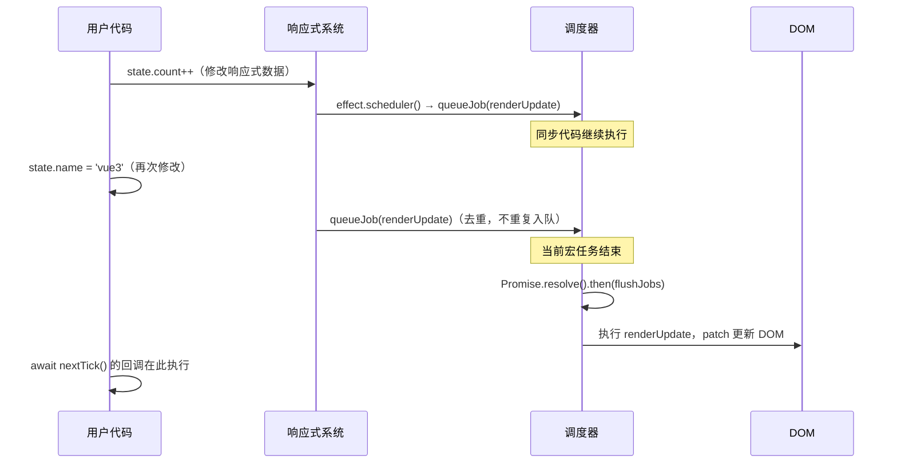

# Vue3 computed 原理与调度器深度解析

## 一、computed 的本质：惰性副作用 + 缓存

`computed` 看起来像一个"派生值"，但在 Vue 3 内部，它本质上是一个带有特殊调度器（scheduler）的 `ReactiveEffect`，同时兼具**消费者**（订阅其他 dep）和**生产者**（作为其他 effect 的依赖源）双重角色。

### 核心数据结构 ComputedRefImpl

```typescript
// packages/reactivity/src/computed.ts（简化）
export class ComputedRefImpl<T = any> implements Subscriber {
  _value: any = undefined
  readonly dep: Dep = new Dep(this)  // 作为"生产者"暴露给外部
  flags: EffectFlags = EffectFlags.DIRTY  // 初始状态为脏

  // Subscriber 接口：作为"消费者"订阅其他 dep
  deps?: Link
  depsTail?: Link

  constructor(
    public fn: ComputedGetter<T>,   // getter 函数
    private readonly setter: ComputedSetter<T> | undefined,
    isSSR: boolean,
  ) {}

  get value(): T {
    const link = this.dep.track()      // 1. 将当前 effect 收集 to computed 的 dep 中
    refreshComputed(this)              // 2. 如果脏了就重新计算
    if (link) {
      link.version = this.dep.version // 3. 同步版本号（优化脏检查）
    }
    return this._value
  }
}
```

### 三个核心特性

| 特性 | 说明 | 实现机制 |
|------|------|---------|
| **惰性求值** | 只在读取 `.value` 时才执行 getter | `DIRTY` 标记 + `refreshComputed` |
| **结果缓存** | 依赖未变则返回缓存值 | version counting（3.5+） |
| **自动追踪** | getter 执行时自动收集依赖 |复用 `ReactiveEffect` 的 `run()` 机制 |

## 二、脏检查：从 dirty flag 到 version counting

### Vue 3.4 及之前：DIRTY 标记

```
依赖变化 → 打 DIRTY 标记 → 下次读取 .value → 重新计算 getter → 清除 DIRTY
```

这种方式足够简单，但有一个问题：**computed 的依赖再依赖可能形成级联**，会出现"明明值没变，却触发了不必要的重新计算"。

### Vue 3.5：version counting

每个 `Dep` 有一个 `version` 字段，每次 `trigger` 时递增。`Link` 节点保存了上次读取时的 `dep.version`：

```typescript
// refreshComputed 简化逻辑
function refreshComputed(computed: ComputedRefImpl): void {
  if (computed.flags & EffectFlags.DIRTY) {
    // 先用全局版本号做粗筛
    if (computed.globalVersion === globalVersion) return

    // 逐依赖检查版本，跳过未变化的
    if (!checkDirty(computed.deps)) {
      computed.flags &= ~EffectFlags.DIRTY  // 实际没变，清除脏标记
      return
    }

    // 真的脏了，重新计算
    const prevValue = computed._value
    computed._value = computed.fn()
    computed.dep.version++  // 通知下游
  }
}
```

**关键优化**：如果 computed 的所有依赖版本都没变，即使被标记了 DIRTY，也不会重新执行 getter。这对"computed 嵌套 computed"的场景性能提升显著。

## 三、computed 的双重角色

```
┌─────────────────────────────────────────────────────┐
│                   computed 的位置                    │
│                                                     │
│  reactive.a ──dep──▶ computed  ──dep──▶ renderEffect│
│  reactive.b ──dep──▶ (既是订阅者，也是被订阅的 dep) │
└─────────────────────────────────────────────────────┘
```

**作为消费者（Subscriber）**：
- `computed.deps` 链表存储它所依赖的所有 reactive 属性
- reactive 属性变化时，会通知 computed 的 `notify()` 方法 → 标记 DIRTY

**作为生产者（Dep 宿主）**：
- `computed.dep` 是一个 `Dep` 实例
- 其他 effect 读取 `computed.value` 时，会把自己注册到 `computed.dep`
- computed 重新计算后，`computed.dep.version++` 触发下游 effect

## 四、调度器（Scheduler）架构全图

Vue 的调度系统分两层：

```
响应式通知层                      运行时调度层
─────────────                    ────────────────
dep.notify()                     queueJob()
  │                                │
  ▼                                ▼
batch / startBatch / endBatch    queue: SchedulerJob[]
  │                                │
  ▼                                ▼
ReactiveEffect.notify()          queueFlush()
  │                                │
  ▼                                ▼
endBatch 统一放行                 Promise.resolve().then(flushJobs)
  │                                │
  ▼                                ▼
effect.trigger()                 flushJobs() 按 id 升序执行
  │
  ▼
effect.scheduler() ──────────────▶ queueJob(update)  ← 组件渲染 effect 走这里
```

### queueJob：组件更新去重与排序

```typescript
export function queueJob(job: SchedulerJob): void {
  // 去重：同一个 job 在一次 flush 内不重复入队
  if (
    !queue.length ||
    !queue.includes(job, isFlushing && job.allowRecurse ? flushIndex + 1 : flushIndex)
  ) {
    if (job.id == null) {
      queue.push(job)
    } else {
      // 按 id 升序插入，确保父组件先于子组件更新
      queue.splice(findInsertionIndex(job.id), 0, job)
    }
    queueFlush()
  }
}

function queueFlush(): void {
  if (!isFlushing && !isFlushPending) {
    isFlushPending = true
    currentFlushPromise = resolvedPromise.then(flushJobs)
  }
}
```

**为什么父 id < 子 id**：父组件先创建，渲染 effect 的 id 更小，保证父先于子更新，子不会收到已过时的 props。

### flushJobs：按序执行并处理子组件嵌套更新

```typescript
function flushJobs(seen?: CountMap): void {
  isFlushPending = false
  isFlushing = true

  // 按 id 升序排序（保险）
  queue.sort(comparator)

  try {
    for (flushIndex = 0; flushIndex < queue.length; flushIndex++) {
      const job = queue[flushIndex]
      if (job && job.active !== false) {
        callWithErrorHandling(job, null, ErrorCodes.SCHEDULER)
      }
    }
  } finally {
    flushIndex = 0
    queue.length = 0
    // 执行 post 队列（onMounted / onUpdated 等生命周期回调）
    flushPostFlushCbs(seen)
    isFlushing = false
    currentFlushPromise = null
    // 如果执行期间又入队了新 job，继续 flush
    if (queue.length || pendingPostFlushCbs.length) {
      flushJobs(seen)
    }
  }
}
```

## 五、nextTick 的原理

```typescript
const resolvedPromise = Promise.resolve() as Promise<any>
let currentFlushPromise: Promise<void> | null = null

export function nextTick<T = void>(
  this: T,
  fn?: (this: T) => void
): Promise<void> {
  const p = currentFlushPromise || resolvedPromise
  return fn ? p.then(this ? fn.bind(this) : fn) : p
}
```

**精髓**：
- 如果当前正在 flush，`nextTick` 挂在 `currentFlushPromise.then()` 上 → **在本次 flush 完成后执行**
- 如果没有正在进行的 flush，挂在 `resolvedPromise.then()` 上 → **在下一个微任务时执行**

两种情况都保证了回调在 DOM 更新后执行。

### 完整链路时序



## 六、watch / watchEffect 的调度策略

```typescript
// 简化的 doWatch 核心
function doWatch(source, cb, { flush = 'pre' } = {}) {
  let scheduler: EffectScheduler

  if (flush === 'sync') {
    scheduler = job  // 同步触发，数据一变立即执行
  } else if (flush === 'post') {
    scheduler = () => queuePostFlushCb(job)  // DOM 更新后执行
  } else {
    // 默认 'pre'：在组件更新前执行
    job.pre = true
    if (instance) job.id = instance.uid
    scheduler = () => queueJob(job)
  }

  const effect = new ReactiveEffect(getter, NOOP, scheduler)
  // ...
}
```

| flush 值 | 执行时机 | 适用场景 |
|----------|---------|---------|
| `'pre'`（默认）| 组件更新**前** | 大多数场景 |
| `'post'` | 组件更新**后**，DOM 已刷新 | 需要访问更新后的 DOM |
| `'sync'` | 同步立即执行 | ⚠️ 危险，可能触发多次，性能差 |

## 七、面试常见误区

### 误区一：computed 依赖变化后立即重新计算

**实际**：只打 DIRTY 标记，**下次读取时才真正执行 getter**（惰性）。

### 误区二：每次 reactive 数据变化都触发一次组件更新

**实际**：`queueJob` 有**去重**机制，同一个组件的更新任务在一次微任务内只执行一次。

### 误区三：nextTick 等于 setTimeout(fn, 0)

**实际**：nextTick 使用 `Promise.then()`（微任务），而 setTimeout 是宏任务，执行时机完全不同。

### 误区四：watch 和 watchEffect 都是同步的

**实际**：默认都是异步（`flush: 'pre'`），通过 `queueJob` 放入微任务队列统一执行。

---

## 📝 面试题自测

### Q1 [single]
Vue 3 中 `computed` 最核心的两个特征是？
A. 同步计算 + 深度监听
B. 惰性求值 + 结果缓存
C. 立即执行 + 依赖收集
D. 浅层追踪 + 手动刷新
答案：B
解析：
💡 它解决了什么问题：
如果不引入惰性求值与缓存机制，只要响应式依赖发生任何微小改变，所有的计算属性都会立即同步执行 getter。当页面中大量读取该计算属性或者有复杂的嵌套计算时，会导致严重的重复计算，甚至在首屏加载时执行大量未被渲染的计算，拖慢首帧渲染性能。

🔍 核心原理解析（防拷打）：
1. `ComputedRefImpl` 内部持有 `dirty`（在 3.5 中升级为 flags 状态与依赖版本检测）。当依赖变更时，只会通过触发计算属性的 `scheduler` 将其标记为脏，并不立即求值；只有当外部（如模板渲染或其他 effect）主动读取 `.value` 时，才会运行 `refreshComputed` 进行求值。
2. 设计取舍：相较于“数据一变立即重新计算”的暴利方案，Vue 选择将计算延迟到真正“被读取”的瞬间，并通过内部变量缓存上次求值结果。若依赖未变，直接返回缓存值，实现了 O(1) 的高频读取开销。
3. 进一步拓展大厂面试追问：如果计算属性被多个外部副作用同时读取，Vue 是如何收集它们的？由于 `ComputedRefImpl` 实现了 `Dep`（生产者角色），在其 `get value()` 被触发时，会调用 `this.dep.track()`，把当前的消费者（例如渲染 effect）收集到 computed 自身的订阅列表中；当重新求值导致值改变时，再通过 `this.dep.trigger()` 触发下游更新。

### Q2 [single]
Vue 3.5 中 `computed` 改用 version counting 替代单纯的 dirty flag，主要解决什么问题？
A. 减少 Proxy 创建数量
B. 避免多层 computed 嵌套时不必要的 getter 重新执行
C. 实现对计算属性底层依赖 Link 双向关联节点的动态销毁
D. 绕过微任务队列，强制以同步宏任务形式执行数据合并
答案：B
解析：
💡 它解决了什么问题：
如果不引入版本计数，当存在 `computed A -> computed B -> reactive C` 的嵌套链时，如果修改了 `C` 的值，但最终通过计算得到的 `B` 的值实际上并没有改变（例如 `B = A % 2` 且值依然为 `0`），下游的 `B` 和相关的渲染 effect 依然会被打上 `DIRTY` 标记，导致不必要的 getter 重新执行和页面无效重绘。

🔍 核心原理解析（防拷打）：
1. 在 Vue 3.5 中，每个 `Dep` 维护了一个全局递增的版本号 `version`。`Link` 双向依赖链节点记录了上一次读取时的 `dep.version`。在 `refreshComputed` 阶段，计算属性会首先粗筛 `globalVersion`，再调用 `checkDirty` 检查其所依赖的所有依赖链（Link）上的版本号。如果发现没有任何依赖的版本号发生更新，即使外部标记了 `DIRTY` 也会被直接清除脏标记并返回缓存，避免执行 getter。
2. 设计取舍：在 3.4 之前，只能采用粗暴 of dirty flag 级联标记，导致了“依赖的值没变，计算属性依然重新计算”的性能痛点。3.5 采用更精细的双链表和全局/局部版本比对，虽然增加了一点点 Link 结构上的维护开销，但对于大型项目中嵌套 Computed 的求值效率提升了数倍。
3. 进一步拓展大厂面试追问：如果 computed 的 getter 返回一个全新的对象（例如 `{ count: obj.count }`），即使 count 没变，由于引用改变，下游的版本计数依然会递增，进而触发重算吗？是的，值比对仅支持基本类型和相同引用的对象。因此，computed 中返回的对象结构应当尽量保持稳定。

### Q3 [judgment]
在 Vue 3 中，向 computed 所依赖的 reactive 属性赋相同的值，computed 的 getter 一定不会重新执行。
答案：对
解析：
💡 它解决了什么问题：
如果向 reactive 属性赋予完全相同的值时依然会触发依赖它的所有 computed 重新计算，那么在频繁的用户输入或数据轮询场景中，由于大部分数据没有发生实质变化，系统会不断产生无效的重算风暴，严重损耗 CPU。

🔍 核心原理解析（防拷打）：
1. 响应式系统的第一道防线在 setter：当修改 Proxy 的属性值时，Vue 的 `set` 拦截器会通过 `hasChanged(value, oldValue)` 比对新旧值。如果值未变，则直接拦截并返回，根本不会触发 `trigger` 派发更新。
2. 即使绕过了 setter（例如通过某些底层操作强行触发了 trigger），Vue 3.5 的第二道防线——`version counting` 机制——在 `checkDirty` 进行依赖链比对时，也会发现依赖项的版本号未变，从而在 `refreshComputed` 中直接清除脏标记，坚决不执行 getter。
3. 进一步拓展大厂面试追问：在面对 NaN 或者复杂的嵌套 Proxy 结构时，`hasChanged` 是如何工作的？Vue 内部使用 `Object.is` 来判断值是否改变，从而能够正确处理 `NaN` 的比对；此外，若赋的值是原始对象而非 Proxy，Vue 会先将其 `toRaw` 后再做对比，确保响应式一致性。

### Q4 [single]
在 Vue 3 的调度器（Scheduler）中，`queueJob` 的去重机制保证了什么？
A. 同一组件在一次微任务内只更新一次
B. 不同组件按字母顺序更新
C. 子组件一定先于父组件更新
D. watch 回调一定晚于 computed 更新
答案：A
解析：
💡 它解决了什么问题：
如果不进行 Job 去重，当用户在同步代码中连续执行 `count++`、`name.value = 'xxx'` 等多次状态变更时，每一次变更都会将一个渲染更新 Job 塞入队列。微任务执行时，组件会连续重新 patch 数次，造成极高的 DOM 开销和显而易见的白屏闪烁。

🔍 核心原理解析（防拷打）：
1. 每一个组件的渲染副作用都有一个唯一的 `id`（即组件实例的 `uid`）。在 `queueJob(job)` 入队时，调度器会使用 `queue.includes(job)` 或在 flushing 期间根据 id 索引进行比对。如果发现相同的 job 已经在队列中，则直接跳过入队操作。
2. 设计取舍：如果不设去重，频繁的渲染更新会导致浏览器整个处于阻塞状态。通过在内存队列中进行去重，Vue 将所有的组件重绘合并在当前宏任务结束后的第一轮微任务中进行，实现了完美的“批处理更新”。
3. 进一步拓展大厂面试追问：如果组件更新 job 在执行过程中，又由于子组件的副作用导致自身再次入队，会发生什么？如果在 flush 阶段 job 被重复推入，且没有防无限循环守卫，会导致死循环。Vue 调度器使用了一个 `seen` Map 计数器来限制同一个 job 被调度的次数，默认超过 100 次即会报错，以防应用彻底卡死。

### Q5 [multiple]
关于 Vue 3 的调度器，以下哪些说法正确？
A. queueJob 将组件更新任务放入微任务队列
B. 父组件 job.id 小于子组件，保证父先更新
C. flushJobs 执行期间如有新任务入队，flush 结束后会再次 flush
D. nextTick 本质是 setTimeout(fn, 0) 的包装
答案：ABC
解析：
💡 它解决了什么问题：
如果调度器在合并微任务、组件更新排序（父先于子）以及级联 flush 方面没有做精细处理，会导致子组件先于父组件更新，随后又收到父组件传来的新 props 导致二次渲染，或在渲染期间产生的新任务被遗漏，导致视图渲染不完整。

🔍 核心原理解析（防拷打）：
1. `queueJob` 利用微任务机制，将渲染任务合并到 `Promise.resolve().then(flushJobs)` 中执行。
2. 排序机制：在 `flushJobs` 中，队列会先按照 `job.id` 升序排列。由于父组件比子组件先创建，其 job.id 更小，这保证了父组件必定先更新。这样，父组件更新时传递给子组件的 props 已经是最新的，子组件便无需在同一轮循环中渲染两次。
3. 级联 flush：在 `finally` 块中，如果发现 `queue.length > 0`，说明在执行 job 的过程中又有新 job 入队，调度器会再次调用 `flushJobs` 递归消化，保证所有更新在这一轮微任务中彻底完成。
4. 进一步拓展大厂面试追问：`nextTick` 为什么不是 setTimeout 封装？因为微任务（Promise.then）的执行时机是紧随当前 JavaScript 调用栈清空之后、在渲染（Paint）和宏任务（Macrotask）执行之前。如果改用 setTimeout（宏任务），会让更新推迟到下一轮事件循环，期间可能产生用户可见的界面闪烁或交互延迟。

### Q6 [single]
在 Vue 3 的 watch 监听器中，`flush: 'post'` 选项的作用是什么？
A. 让回调同步执行
B. 在组件 DOM 更新后才执行回调，可访问最新 DOM
C. 仅执行一次，之后自动停止
D. 让回调在 requestAnimationFrame 中执行
答案：B
解析：
💡 它解决了什么问题：
默认情况下，watch 的回调是在组件更新“前”执行的（`flush: 'pre'`）。如果开发者在 watch 回调中需要通过 `ref` 访问 DOM 元素的尺寸、样式或者子组件实例的状态，拿到的将是更新前的旧 DOM，从而导致位置计算偏差或依赖最新 DOM 的逻辑失效。

🔍 核心原理解析（防拷打）：
1. 当设置 `flush: 'post'` 时，调度器不会把该 watch 的 job 放入 `queueJob` 队列，而是调用 `queuePostFlushCb(job)` 将其注册到专用的 `pendingPostFlushCbs` 队列中。
2. 执行顺序：在微任务阶段，调度器首先通过 `flushJobs` 清空组件更新队列，此时 DOM patch 已经完成。接着，在 `finally` 块中调用 `flushPostFlushCbs()` 执行所有 post 队列中的回调，此时 DOM 已是最新状态。
3. 进一步拓展大厂面试追问：如果在一个 post watch 回调里再次修改了响应式状态，会发生什么？这会重新将渲染 job 塞入 `queue`，并在 post 阶段结束后触发新一轮的 `flushJobs` 递归，导致重新渲染。频繁的在 post 监听中修改状态是不被推荐的，因为会导致渲染链路变长。

### Q7 [judgment]
在 Vue 3 中，`nextTick` 返回的 Promise 一定在当前宏任务中的所有微任务执行完后才 resolve。
答案：错
解析：
💡 它解决了什么问题：
如果不理解 nextTick 属于微任务且在 flushJobs 结束后立即 resolve，可能会在复杂的异步逻辑中误认为 nextTick 会等待下一个 setTimeout 宏任务，导致代码执行顺序不符合预期，甚至由于逻辑错位引发难以排查的异步 bug。

🔍 核心原理解析（防拷打）：
1. `nextTick` 的实现机制非常轻量：它直接返回 `currentFlushPromise || resolvedPromise`，这里的 `currentFlushPromise` 指向的是调度器当前正在调度的、包含 `flushJobs` 的那个微任务 Promise。
2. 因此，`nextTick` 的回调仅仅是被排在了本轮微任务队列中 `flushJobs`（也就是 DOM 更新）的后面。当 DOM 更新完成后，当前微任务继续向下执行并 resolve，仍然在同一轮微任务队列中，并不会让出 CPU 去等待其他的宏任务。
3. 进一步拓展大厂面试追问：如果有两个连续的 `await nextTick()`，它们会在不同的微任务中吗？如果在一轮 DOM 更新执行期间，第一个 `await nextTick()` 会在当前 flush 结束时被 resolve。由于此时 `currentFlushPromise` 还没有被重置为 `null`，第二个 `nextTick()` 依然会挂载在同一个 Promise 上，但它们会作为微任务队列中的先后步骤顺序执行。

### Q8 [single]
在以下 Vue 3 代码段中，`console.log` 最终会输出什么？
```js
const count = ref(0)
const double = computed(() => count.value * 2)
count.value = 5
console.log(double.value)
```
A. 0（computed 是异步的，未来才更新）
B. 10（computed 是惰性的，读取时才计算）
C. undefined（需要 await nextTick）
D. 2（缓存了旧值）
答案：B
解析：
💡 它解决了什么问题：
如果 computed 不是惰性求值而是异步求值，或者是不做拦截，那么在修改依赖的下一行代码同步读取该 computed 时，将会拿到旧值或未定义的值，从而极大地破坏了 JavaScript 的同步直觉。

🔍 核心原理解析（防拷打）：
1. `count.value = 5` 会触发 `count` 的 `dep.trigger()`。由于 `double` 作为订阅者订阅了它，其 scheduler 触发，将 `double` 内部的 flags 标记为脏（DIRTY）。
2. 关键点在于，此时 getter 并不会立即执行，`double._value` 依然是旧值。但在下一行代码调用 `double.value` 时，触发了它的 `get` 拦截器，内部执行 `refreshComputed(this)`。由于脏标记存在，计算属性会立即同步执行它的 getter 函数（`count.value * 2`），得出最新值 `10` 并缓存起来，最后返回。
3. 进一步拓展大厂面试追问：如果此时没有任何地方读取 `double.value`，且 `double` 也没有被模板使用，那么它的 getter 在整个过程中会被调用吗？绝对不会。这就是“惰性求值”的精髓，它避免了未被使用的派发值在后台进行无谓的计算。

### Q9 [multiple]
在 Vue 3 中，使用同步监听器 `watch(source, cb, { flush: 'sync' })` 可能会带来哪些潜在问题？
A. 数据频繁变化时回调被多次同步触发，可能引发性能问题
B. 在 cb 内部修改响应式数据可能导致无限递归
C. 无法获取新旧值
D. 不支持停止监听
答案：AB
解析：
💡 它解决了什么问题：
如果一律使用同步监听器，在数据频繁变动时，每一次变动都会立即阻塞主线程去同步执行 watch 的复杂回调，不仅无法享受微任务合并（batching）带来的去重红利，还会因为同步调用导致组件被提前或重复更新，造成严重的性能问题。

🔍 核心原理解析（防拷打）：
1. `flush: 'sync'` 意味着在数据被 set 拦截并执行 `trigger` 时，该监听器的 `scheduler` 并不是把更新任务推入异步队列，而是直接同步调用回调函数。
2. 缺点一：频繁执行。如果循环执行 100 次修改，回调就会被同步触发 100 次；缺点二：死循环风险。如果在同步 watch 的回调内部，又同步修改了被监听的数据源本身，会立即触发下一次回调执行，形成经典的无限递归死循环。
3. 进一步拓展大厂面试追问：那在什么场景下才适合使用 `flush: 'sync'` 呢？只有在一些对时效性要求极高、必须在状态变更的物理第一时刻进行干预（如同步拦截输入框非法字符输入、或同步更新底层 non-Vue 变量以防外部读取出错）的罕见边界场景，才应谨慎使用。

### Q10 [single]
computed 在 Vue 3 内部被实现为什么类型？
A. 普通的 reactive 对象
B. 带特殊 scheduler 的 ReactiveEffect + 暴露一个 dep 的 Subscriber
C. 仅是一个函数的包装（Wrapper），无响应式功能
D. 和 ref 完全相同的结构
答案：B
解析：
💡 它解决了什么问题：
如果 computed 仅仅是一个普通 Proxy 或普通 Ref，它就无法做到既能订阅别人（当别人变了自己变脏），又能被别人订阅（当自己被读取时收集别人，当自己真的变了通知别人），从而无法融入响应式双向链路中，使得计算属性在复杂依赖链中失效。

🔍 核心原理解析（防拷打）：
1. `ComputedRefImpl` 实现了 `Subscriber` 接口，它内部持有一个 `ReactiveEffect` 用于运行其 getter 函数。当 getter 执行时，它作为消费者通过该 effect 订阅其他响应式属性的 dep。
2. 另一方面，它自身也是一个 `Dep`（或持有 `dep` 实例），扮演着生产者的角色。当外部（如 render effect）访问它的 `.value` 时，它会作为 dep 收集这个外部 effect；当其依赖改变触发其 scheduler 时，它会通知下游的订阅者。
3. 进一步拓展大厂面试追问：如果在计算属性内部又嵌套了其他计算属性，这条依赖链路是如何串联的？这依然是通过它的双重身份：下游 computed 在求值时读取上游 computed 的 value，触发上游的 `track()` 收集自身。3.5 引入的双向链表（Link）更是将这种订阅关系以极低内存开销的方式在内存中完美串联起来。

### Q11 [judgment]
在 Vue 3 中，若在同一事件循环（同一轮微任务）内连续执行 5 次响应式状态变更如 `state.count++`，组件最终只会重新渲染一次。
答案：对
解析：
💡 它解决了什么问题：
如果每次数据变更都同步触发组件的 patch 渲染，那么渲染效率会呈灾难性下跌。对于一个包含上百个节点的组件，在单次交互中连续修改 5 次状态将导致组件重建并渲染 5 次，产生巨大的性能损耗和卡顿。

🔍 核心原理解析（防拷打）：
1. 组件的更新被包装为一个 `job`（即渲染 effect 的 `scheduler`）。当 `state.count++` 触发依赖通知时，它会将该 job 送往调度器的 `queueJob`。
2. `queueJob` 内部第一步就是去重检查：如果队列中已经存在该组件的 job，则直接拦截不入队。所以，无论我们在同步代码中调用多少次 `count++`，渲染 job 在队列中始终只有一个。
3. 当同步任务执行完毕，微任务 Promise 触发 `flushJobs` 时，该 job 只会运行一次，完成一次批量的 DOM 更新。
4. 进一步拓展大厂面试追问：如果在组件渲染（patch）的过程中，子组件又因为某种副作用修改了父组件的状态，会发生什么？这会导致父组件的 job 再次入队，并在当前 flushJobs 结束后继续 flush 下一轮。但由于是在同一轮微任务期间，用户依然看不到中间状态的闪烁，且 Vue 同样会进行去重和环检测。

### Q12 [single]
在 Vue 3 中，`watchEffect` 和 `watch` 的本质区别在于？
A. watchEffect 不能返回停止函数
B. watch 需要明确指定数据源，watchEffect 在回调执行时自动追踪用到的依赖
C. watchEffect 只能同步执行
D. watch 不支持 flush 选项
答案：B
解析：
💡 它解决了什么问题：
如果不提供这两种变体，开发者就必须手动维护复杂的依赖关系。在依赖项很多且动态变化时，使用 watch 将不得不书写超长的数组；而在只需要追踪特定几个属性、不想受其他动态属性干扰时，使用 watchEffect 又会导致过度响应。

🔍 核心原理解析（防拷打）：
1. `watchEffect` 的核心在于它直接将用户的 `effect` 回调作为 ReactiveEffect 的执行函数。在首次同步执行回调时，读取的任何响应式数据都会通过 Proxy 的 `get` 自动被收集为依赖。
2. `watch` 则在内部构建了一个包装 getter（根据传入的 source，可以是 ref, reactive, getter 函数等），它只会在运行这个包装 getter 时进行依赖收集，回调函数（cb）则被隔离在依赖收集范围之外。只有当指定源变化时，才触发回调。
3. 进一步拓展大厂面试追问：如果 `watch` 监听一个 `reactive` 对象，为什么必须是深度监听的？因为传入 reactive 对象时，如果不对其进行深度遍历（deep traversal），就无法触发其深层属性的 get 拦截，从而无法收集深层属性的依赖。所以 Vue 默认会对 reactive 对象的监听开启 `deep: true`。

### Q13 [multiple]
在 Vue 3 中，以下关于 `nextTick` 的说法哪些是正确的？
A. nextTick 返回一个 Promise
B. 在 nextTick 回调中可以访问更新后的 DOM
C. nextTick 等同于 setTimeout(fn, 0)
D. 多个 nextTick 调用按注册顺序在同一批微任务中执行
答案：ABD
解析：
💡 它解决了什么问题：
如果不掌握 nextTick 的微任务本质及其执行顺序，在编写 DOM 更新后的操作时，可能会误将其写在同步代码中（此时获取不到最新 DOM），或者误认为它与宏任务 setTimeout(fn, 0) 同等优先级，导致与其他微任务（如 Promise.then）的时序发生混乱。

🔍 核心原理解析（防拷打）：
1. `nextTick` 返回一个 `Promise`（如果没有传回调），支持 async/await 语法。
2. 其回调函数在 DOM 更新（即 `flushJobs` 运行完毕）后执行，因为它直接挂载在 `currentFlushPromise` 的 `.then()` 链条上。
3. 由于它是微任务，多个 nextTick 会在当前宏任务结束后的同一轮微任务执行队列中，按照它们被注册的顺序依次执行。
4. 进一步拓展大厂面试追问：如果在 nextTick 内部又调用了 nextTick，会怎样？这依然是注册微任务。由于当前的微任务队列正在被消费，新的微任务会被追加到当前队列 of 末尾，并在同一轮微任务中继续被消费，而不会被推迟到下一个宏任务。

### Q14 [single]
在 Vue 3 中，`computed` 计算属性为什么不直接在依赖变化时同步执行 getter，而是先标记 DIRTY 等待下一次读取时再计算？
A. 避免未被读取的 computed 浪费计算资源
B. 方便序列化到 localStorage
C. 为了兼容 SSR 环境
D. 因为 getter 必须是异步函数
答案：A
解析：
💡 它解决了什么问题：
如果 computed 在其依赖改变时立即同步执行，而在实际业务中，该 computed 并没有被渲染到模板中，也没有被任何 watch 监听（即它是个孤立节点），那么每一次的数据变更都会强行在后台执行无意义的计算，极大浪费了 CPU。

🔍 核心原理解析（防拷打）：
1. 计算属性的设计哲学是“按需计算”。依赖改变时，它的 `scheduler` 仅仅是简单快速地将其状态标记为脏（flags 包含 DIRTY），这是一个 O(1) 的轻量操作。
2. 直到真的有消费者去读取 `computed.value` 时，才执行 getter 并缓存。如果该值在后续一直未被读取，那它在整个生命周期内就永远不会重新计算，节省了计算资源。
3. 进一步拓展大厂面试追问：为什么如果 computed 被模板使用时，每次依赖变了它好像在“主动”更新？因为模板渲染本身是一个 `render effect`。渲染时读取了 computed，computed 的 dep 收集了 render effect。当依赖变化时，computed 被标记为脏，同时它会把这个“脏信号”继续传递（trigger）给下游 of render effect，从而将渲染 job 加入更新队列。

### Q15 [judgment]
Vue 3 中，父组件的渲染 effect id 一定小于其子组件的渲染 effect id。
答案：对
解析：
💡 它解决了什么问题：
如果父子组件的渲染 id 没有顺序约束，或者子组件先于父组件更新，那么子组件在 patch 时会先使用旧的 props 渲染一次，接着父组件更新又将最新的 props 传给子组件，导致子组件不得不进行第二次 patch。这造成了严重的重复渲染损耗。

🔍 核心原理解析（防拷打）：
1. Vue 在挂载组件树时，是按照深度优先遍历（DFS）的顺序，从父组件开始逐层创建并挂载子组件。因此，父组件的渲染 effect 必然比子组件更早被实例化，分发的全局 effect ID 也就更小。
2. 调度器在 `flushJobs` 阶段执行 `queue.sort((a, b) => a.id - b.id)`，确保了父组件先于子组件进行更新。
3. 进一步拓展大厂面试追问：除了保证 props 渲染的单次正确性，按 id 排序还有什么工程价值？它还保证了：如果在父组件更新期间该子组件被销毁（卸载）了，那么子组件的更新任务在队列中可以直接被跳过，避免了对已销毁组件进行无意义的 patch 操作。

### Q16 [single]
在 Vue 3 中，如果在 `watch` 监听器回调中通过 `onCleanup` 注册了清理函数，该清理函数何时执行？
A. 只在组件卸载时执行
B. 在下一次 watch 回调执行前，或组件卸载时执行
C. 在 nextTick 之后执行
D. 在每次依赖变化时立即执行
答案：B
解析：
💡 它解决了什么问题：
如果无法在下一次回调执行前清理上一次的异步状态，在并发请求（如高频输入检索）场景中，多次异步请求返回的时间是不确定的，晚发出的请求可能会比早发出的请求先返回，导致早发出请求的陈旧数据最终覆盖了新数据（即 Race Condition 问题）。

🔍 核心原理解析（防拷打）：
1. `watch` 内部会维护一个 `cleanup` 局部变量。当 watch 的 ReactiveEffect 准备重新调度回调时，如果之前已经注册过 cleanup 函数，会首先同步调用它以释放资源，然后再执行新的回调。
2. 设计取舍：Vue 将异步清理的时机精准地收拢在“下一次回调开始前”和“整个生命周期结束时”。这符合闭包容器的清理直觉，保证了前一次执行的遗留副作用能够被安全扼杀。
3. 进一步拓展大厂面试追问：除了用来取消请求，`onCleanup` 还有哪些常见用途？它常用于注销上一次回调中绑定的全局事件监听器、清除定时器、释放外部非 Vue 资源（如 Leaflet 地图实例），防止多次绑定导致事件累积或内存泄漏。
