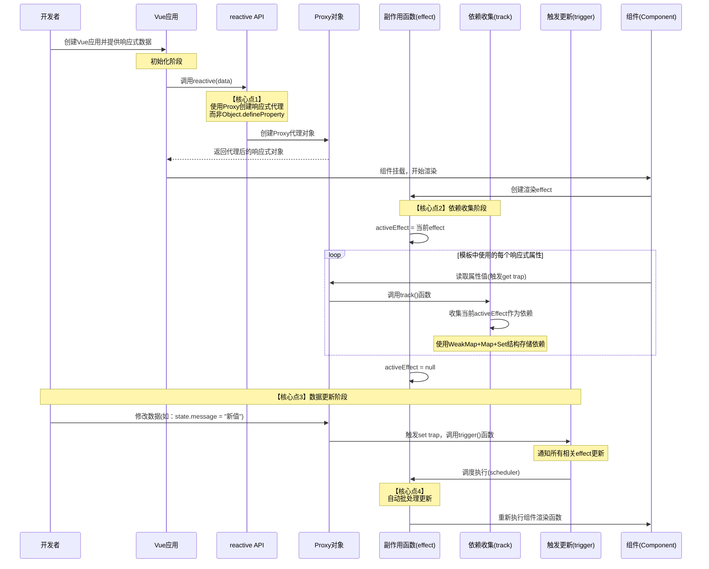
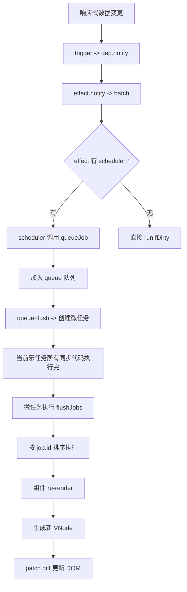

# Vue 3响应式原理源码解析


***
2026 年 2 月 27 日 Claude 4.6 opus 增强现有内容深度和补充拷打面试题
2026 年 4 月 21 日 codex 5.4 thinking 查看 GitHub 源码进行补充

***
#task

在查看源码后，发现Vue 3的响应式系统代码主要位于packages/reactivity/src目录下，包含以下核心文件：

1. [reactive.ts](https://github.com/vuejs/core/blob/main/packages/reactivity/src/reactive.ts) - 创建响应式对象的主要API
2. [effect.ts](https://github.com/vuejs/core/blob/main/packages/reactivity/src/effect.ts) - 副作用函数的实现
3. [ref.ts](https://github.com/vuejs/core/blob/main/packages/reactivity/src/ref.ts) - ref相关API的实现
4. [dep.ts](https://github.com/vuejs/core/blob/main/packages/reactivity/src/dep.ts) - 依赖收集系统
5. [baseHandlers.ts](https://github.com/vuejs/core/blob/main/packages/reactivity/src/baseHandlers.ts) - 基本类型的代理处理器
6. [computed.ts](https://github.com/vuejs/core/blob/main/packages/reactivity/src/computed.ts) - 计算属性实现

让我们一步步分析Vue 3响应式系统的核心原理：

Vue3的响应式和vue2的原理一致：都基于发布订阅的模式在读写数据的时候，触发对应的函数，做依赖收集和触发更新

vue3 同vue2 重点不同的内容在于：

1. 使用 Proxy 替代了 Object.defineProperty，支持监听属性新增/删除、数组索引变化等
2. 使用 effect 函数创建响应式副作用，它在内部执行时会自动收集依赖，当依赖变化时自动重新执行；对应的作用类似vue2的watcher
3. 响应式系统独立为 `@vue/reactivity` 包，可脱离 Vue 框架单独使用
4. 依赖收集从 Vue 2 的 Dep + Watcher 双向链表，升级为基于双向链表 Link 节点的订阅模型（Vue 3.5+），并引入了版本计数（version counting）做脏检查优化
5. 引入 effectScope 管理副作用生命周期，batch 批处理机制优化更新调度

Vue 3响应式原理时序图与部分原理源码记录如下：

## Vue 3 响应式原理时序图



官网对响应式的说明：
<https://cn.vuejs.org/guide/extras/reactivity-in-depth.html>

现在让我们开始分析源码实现：

## 二、创建响应式对象 ([reactive.ts](https://github.com/vuejs/core/blob/main/packages/reactivity/src/reactive.ts))

从源码中可以看到，Vue 3提供了几种创建响应式对象的API:

1. `reactive` - 深度响应式
2. `shallowReactive` - 浅响应式
3. `readonly` - 只读响应式
4. `shallowReadonly` - 浅只读响应式

它们都是通过`createReactiveObject`函数实现的，核心代码如下：

```javascript
function createReactiveObject(
  target: Target,
  isReadonly: boolean,
  baseHandlers: ProxyHandler<any>,
  collectionHandlers: ProxyHandler<any>,
  proxyMap: WeakMap<Target, any>,
) {
  // 如果目标不是对象，则直接返回
  if (!isObject(target)) {
    return target
  }
  
  // 如果目标已经是Proxy，直接返回
  if (target[ReactiveFlags.RAW] && !(isReadonly && target[ReactiveFlags.IS_REACTIVE])) {
    return target
  }
  
  // 已经有对应的Proxy，则直接返回
  const existingProxy = proxyMap.get(target)
  if (existingProxy) {
    return existingProxy
  }
  
  // 创建新的Proxy
  const proxy = new Proxy(
    target,
    targetType === TargetType.COLLECTION ? collectionHandlers : baseHandlers,
  )
  proxyMap.set(target, proxy)
  return proxy
}
```

这里最关键的部分是使用了JavaScript的**Proxy**对象来创建响应式对象，它允许我们拦截对象的基本操作。不同类型的响应式对象使用不同的handlers来处理对象操作。

让我们来看看handlers是如何实现的：

## 三、Proxy处理器实现（[baseHandlers.ts](https://github.com/vuejs/core/blob/main/packages/reactivity/src/baseHandlers.ts)）

从源码中可以看到，Vue 3使用了不同的处理器来处理不同类型的响应式对象：

1. `mutableHandlers` - 可变响应式处理器
2. `readonlyHandlers` - 只读响应式处理器
3. `shallowReactiveHandlers` - 浅层可变响应式处理器
4. `shallowReadonlyHandlers` - 浅层只读响应式处理器

这些处理器都继承自`BaseReactiveHandler`，关键的实现有：

### 1. get 拦截器

```javascript
get(target: Target, key: string | symbol, receiver: object): any {
  // ...特殊标志处理...
  
  // 非只读模式下跟踪依赖
  if (!isReadonly) {
    track(target, TrackOpTypes.GET, key)
  }
  
  // 浅层模式直接返回
  if (isShallow) {
    return res
  }
  
  // 自动解包ref对象
  if (isRef(res)) {
    return targetIsArray && isIntegerKey(key) ? res : res.value
  }
  
  // 对象类型递归转换
  if (isObject(res)) {
    return isReadonly ? readonly(res) : reactive(res)
  }
  
  return res
}
```

这里的关键点是：

- 通过`track`函数收集依赖
- 自动解包ref类型
- 对于对象类型值，递归转换为响应式

### 2. set 拦截器

```javascript
set(target: Record<string | symbol, unknown>, key: string | symbol, value: unknown, receiver: object): boolean {
  let oldValue = target[key]
  // ...处理value...
  
  const hadKey = isArray(target) && isIntegerKey(key) ? Number(key) < target.length : hasOwn(target, key)
  const result = Reflect.set(target, key, value, receiver)
  
  // 触发更新
  if (target === toRaw(receiver)) {
    if (!hadKey) {
      // 新增属性
      trigger(target, TriggerOpTypes.ADD, key, value)
    } else if (hasChanged(value, oldValue)) {
      // 设置属性
      trigger(target, TriggerOpTypes.SET, key, value, oldValue)
    }
  }
  
  return result
}
```

关键点是：

- 使用`trigger`函数在属性变化时触发更新
- 区分ADD和SET操作

让我们继续看依赖收集和触发更新的实现：

## 四、依赖收集和触发更新([dep.ts](https://github.com/vuejs/core/blob/main/packages/reactivity/src/dep.ts))

在[`dep.ts`](https://github.com/vuejs/core/blob/main/packages/reactivity/src/dep.ts)文件中，我们可以看到Vue 3响应式系统的依赖收集和触发更新的具体实现：

### 1. 核心数据结构

```javascript
// 存储依赖关系的核心WeakMap
export const targetMap: WeakMap<object, KeyToDepMap> = new WeakMap()
```

这个结构非常关键，它使用WeakMap来存储所有的依赖关系：

- key: 响应式对象
- value: 该对象的依赖Map(key -> dep)

### 2. 依赖收集方法 track

```javascript
export function track(target: object, type: TrackOpTypes, key: unknown): void {
  if (shouldTrack && activeSub) {
    let depsMap = targetMap.get(target)
    if (!depsMap) {
      targetMap.set(target, (depsMap = new Map()))
    }
    let dep = depsMap.get(key)
    if (!dep) {
      depsMap.set(key, (dep = new Dep()))
      dep.map = depsMap
      dep.key = key
    }
    dep.track()
  }
}
```

这个函数在属性被访问时调用，进行依赖收集：

1. 获取目标对象的依赖Map，不存在则创建
2. 获取特定key的Dep实例，不存在则创建
3. 调用dep.track()将当前活动的effect收集为依赖

### 3. 触发更新方法 trigger

```javascript
export function trigger(
  target: object,
  type: TriggerOpTypes,
  key?: unknown,
  newValue?: unknown,
  oldValue?: unknown,
  oldTarget?: Map<unknown, unknown> | Set<unknown>,
): void {
  const depsMap = targetMap.get(target)
  if (!depsMap) {
    return
  }

  // 根据不同的操作类型触发相应的依赖更新
  if (type === TriggerOpTypes.CLEAR) {
    // 清空集合，触发所有依赖
    depsMap.forEach(run)
  } else {
    // 处理SET、ADD、DELETE操作
    if (key !== void 0) {
      run(depsMap.get(key))
    }
    
    // 特殊处理数组和集合类型
    // ...
  }
}
```

这个函数在属性被修改时调用，触发依赖更新：

1. 获取目标对象的依赖Map
2. 根据操作类型(ADD/SET/DELETE/CLEAR)找到相关的依赖
3. 调用这些依赖执行更新

接下来，让我们看一下effect的实现，这是整个响应式系统的另一个核心部分：

## 五、副作用函数 ([effect.ts](https://github.com/vuejs/core/blob/main/packages/reactivity/src/effect.ts))

[effect.ts](https://github.com/vuejs/core/blob/main/packages/reactivity/src/effect.ts)文件包含了Vue 3响应式系统中副作用函数的实现，这是整个响应式系统的核心。

### 1. effect函数

```javascript
export function effect<T = any>(
  fn: () => T,
  options?: ReactiveEffectOptions,
): ReactiveEffectRunner<T> {
  // 创建ReactiveEffect实例
  const e = new ReactiveEffect(fn)
  
  // 合并选项
  if (options) {
    extend(e, options)
  }
  
  // 首次执行
  try {
    e.run()
  } catch (err) {
    e.stop()
    throw err
  }
  
  // 返回绑定了this的runner函数
  const runner = e.run.bind(e) as ReactiveEffectRunner
  runner.effect = e
  return runner
}
```

这个函数:

1. 创建一个`ReactiveEffect`实例，传入要执行的函数
2. 立即执行一次该函数(e.run())，触发依赖收集
3. 返回一个runner函数，可以手动触发该effect

### 2. ReactiveEffect类

```javascript
export class ReactiveEffect<T = any> implements Subscriber, ReactiveEffectOptions {
  // ...

  constructor(public fn: () => T) {
    if (activeEffectScope && activeEffectScope.active) {
      activeEffectScope.effects.push(this)
    }
  }

  run(): T {
    if (!(this.flags & EffectFlags.ACTIVE)) {
      return this.fn()
    }

    this.flags |= EffectFlags.RUNNING
    cleanupEffect(this)
    prepareDeps(this)
    const prevEffect = activeSub
    const prevShouldTrack = shouldTrack
    activeSub = this
    shouldTrack = true

    try {
      return this.fn()
    } finally {
      cleanupDeps(this)
      activeSub = prevEffect
      shouldTrack = prevShouldTrack
      this.flags &= ~EffectFlags.RUNNING
    }
  }

  notify(): void {
    if (
      this.flags & EffectFlags.RUNNING &&
      !(this.flags & EffectFlags.ALLOW_RECURSE)
    ) {
      return
    }
    if (!(this.flags & EffectFlags.NOTIFIED)) {
      batch(this)
    }
  }

  trigger(): void {
    if (this.flags & EffectFlags.PAUSED) {
      pausedQueueEffects.add(this)
    } else if (this.scheduler) {
      this.scheduler()
    } else {
      this.runIfDirty()
    }
  }
}
```

核心方法是`run()`，它会：

1. 设置当前活动的副作用函数为自身
2. 允许依赖追踪
3. 执行包装的函数，在执行过程中会访问响应式数据，从而触发依赖收集
4. 恢复之前的环境状态

#### 为什么需要  const prevEffect = activeSub 存储上一个activeSub？？

在vue.js 设计与实现这本书上有以下说明：

这是在副作用函数嵌套的时候使用的一个全局参数，拿 vue.js 来说，实际上Vue.js 的渲染函数就是在一个 effect 中执行的：

```JavaScript
const Foo = {
  render() {
    return ......
  }
}

// 其实上面的代码对应的如下：
effect(()=> {
  Foo.render()
})
```

组件是嵌套的，那么就会遇到下面的情况：

```js
const user = reactive({ name: '张三', age: 18 })

// 子组件 Bar：只展示年龄
const Bar = {
  render() {
    return h('span', user.age)   // ← 读取 user.age
  }
}

// 父组件 Foo：展示姓名，并渲染子组件 Bar
const Foo = {
  render() {
    return h('div', [
      h('p', user.name),  // ← 读取 user.name
      h(Bar),             // ← 渲染子组件
    ])
  }
}
```

Vue 为每个组件各创建一个渲染 effect：`FooEffect` 和 `BarEffect`。

**关键问题：BarEffect 是什么时候执行的？**

当 `FooEffect` 运行到 `h(Bar)` 的时候，Vue 会同步地挂载子组件 Bar，挂载过程中就会立刻执行 `BarEffect.run()`。这就是嵌套的发生时机——**BarEffect 是在 FooEffect 执行过程中被触发的**，等价于：

```js
// FooEffect 执行时，内部发生了这些事：
activeSub = FooEffect                 // 1. FooEffect 开始，设置当前活跃 effect
user.name                             // 2. 读取 user.name → 收集 FooEffect 为依赖
// 遇到 h(Bar)，开始挂载子组件 ↓
  activeSub = BarEffect               // 3. BarEffect 开始，覆盖了 FooEffect ！
  user.age                            // 4. 读取 user.age → 收集 BarEffect 为依赖
  activeSub = ???                     // 5. BarEffect 结束，但 FooEffect 丢了
// 子组件挂载完成，回到父组件 ↑
// 此时 activeSub 已经不是 FooEffect，依赖收集就会出错
```

这就是问题所在：**activeSub 只能存一个值**，BarEffect 的执行覆盖了 FooEffect，等 Bar 渲染完回到 Foo 的渲染流程时，`activeSub` 已经是错的了。

照理来说，`user.name` 变化只应触发 `FooEffect`，`user.age` 变化只应触发 `BarEffect`，两者不应相互影响。

为了解决这个问题，需要一个副作用函数栈 effectStack（设计思路，真实使用的是 prevEffect），在收集依赖前保存外层effect，收集完成之后，恢复到原状态。这样就能做到 **一个响应式数据只会收集直接读取其值的副作用函数**

书中说明的原理非常简单

而源码是实现依靠的是 const prevEffect = activeSub 保存当前活跃的副作用函数(effect)，以便在当前effect执行完毕后能正确恢复上下文环境

在ReactiveEffect的run方法中，执行流程是：

1. 保存当前活跃的effect(prevEffect = activeSub)
2. 设置当前effect为活跃effect(activeSub = this)
3. 执行当前effect的函数体(this.fn())
4. 在finally中恢复之前保存的effect(activeSub = prevEffect)

这种设计确保了即使在嵌套的Effect的情况下，每个Effect执行完毕后都能正确恢复到之前的执行上下文，避免副作用追踪混乱

***
**看看源码哪里出现的嵌套Effect：**

源码中嵌套组件就会产生如此的情况：vue中renderEffect的创建在：[packages/runtime-core/src/renderer.ts](https://github.com/vuejs/core/blob/main/packages/runtime-core/src/renderer.ts) 的 setupRenderEffect 中，里面会执行下面代码去创建渲染 effect

```js
function componentUpdateFn = ()=>{
  //...
  const subTree = (instance.subTree = renderComponentRoot(instance))

  patch(
    null, 
    subTree,
    container,
    anchor,
    instance,
    parentSuspense,
    namespace,
  )
}
// ...

 const effect = (instance.effect = new ReactiveEffect(componentUpdateFn))
```

而componentUpdateFn中又会调用 renderComponentRoot 生成组件子树 vNode ，然后调用patch渲染子组件。对于子组件，会重复上面的过程，创建新的渲染effect，嵌套的Effect就出现了

#### 关于 Vue.js 设计与实现 书中提到的 无限循环问题

在《vue.js 设计与实现》一书中有提到下面的例子

```js
const data = reactive({
  count: 0
})

effect(()=>{
  data.count++
})
```

这段代码中，effect 中的回调函数会先读取data.count的值，然后触发 track 操作将当前副作用函数收集到targetMap中。接着将data中的count值加1，此时会触发proxy中 set 拦截器里面的 trigger 操作，把当前副作用函数从targetMap中拿出来执行。当前副作用函数未有执行完成，就又触发了track操作，如果处理不当，就会导致无限循环，最终**栈溢出爆错**

因为分析问题发现，读取和设置操作都是在同一个副作用函数中执行的。此时无论是收集依赖的track操作，还是触发更新的trigger操作，获取的全局唯一变量 activeEffect 都是同一个。基于此，可以**添加守卫条件：如果trigger触发执行的副作用函数与当前执行的副作用函数相同，则不触发执行**：

书中的解决方案是：

```js
function trigger(target, key) {
  const depsMap = targetMap.get(target)
  if(!depsMap) return
  const effects = depsMap.get(key)

  const effectsToRun = new Set()
  effects && effects.forEach(effect => {
    // 如果trigger触发执行的副作用函数与当前执行的副作用函数相同，则不触发执行，其中全局变量activeEffect是（在源码中是activeSub）当前正在执行的副作用函数
    if(effect !== activeEffect) {
      effectsToRun.add(effect)
    }
  })

  effectsToRun.forEach(effect => effect())
}
```

原理非常简单，那么对应源码中是如何实现的呢？：

***

当响应式对象的属性被修改时（例如 `data.count++`），会触发以下流程：

1. 首先调用 [`packages/reactivity/src/baseHandlers.ts`](https://github.com/vuejs/core/blob/main/packages/reactivity/src/baseHandlers.ts) 中的 `set` 拦截器
2. `set` 拦截器会调用 `trigger(target, TriggerOpTypes.SET, key, value, oldValue)` 方法

3. 在 [`packages/reactivity/src/dep.ts`](https://github.com/vuejs/core/blob/main/packages/reactivity/src/dep.ts) 中的 `trigger` 函数执行以下步骤：

   ```javascript
   export function trigger(
     target: object,
     type: TriggerOpTypes,
     key?: unknown,
     newValue?: unknown,
     oldValue?: unknown,
     oldTarget?: Map<unknown, unknown> | Set<unknown>,
   ): void {
     const depsMap = targetMap.get(target)
     if (!depsMap) {
       // 如果没有被跟踪，直接返回
       globalVersion++
       return
     }

     const run = (dep: Dep | undefined) => {
       if (dep) {
         // 调用每个依赖对象的 trigger 方法
         dep.trigger()
       }
     }

     // ... 根据不同的操作类型（ADD/SET/DELETE等）找到相关的依赖
     
     // 对于 SET 操作，会调用:
     run(depsMap.get(key))
     
     // ... 其他相关依赖的处理
   }
   ```

4. 每个依赖（Dep 实例）的 `trigger` 方法会执行：

   ```javascript
   trigger(debugInfo?: DebuggerEventExtraInfo): void {
     this.version++         // 更新版本号
     globalVersion++        // 更新全局版本号
     this.notify(debugInfo) // 调用 notify 方法通知所有订阅者
   }
   ```

5. `Dep.notify` 方法会遍历所有订阅该依赖的订阅者（即 effect），并调用它们的 `notify` 方法：

   ```javascript
   notify(debugInfo?: DebuggerEventExtraInfo): void {
     startBatch()
     try {
       // ... 开发环境下的调试代码
       
       // 遍历所有订阅者并调用它们的 notify 方法
       for (let link = this.subs; link; link = link.prevSub) {
         if (link.sub.notify()) {
           // 如果是计算属性，还需要通知计算属性的依赖
           (link.sub as ComputedRefImpl).dep.notify()
         }
       }
     } finally {
       endBatch()
     }
   }
   ```

6. 最终会调用到 `ReactiveEffect` 实例的 `notify` 方法，这里就是关键的避免递归循环的逻辑：

   ```javascript
   notify(): void {
     if (
       this.flags & EffectFlags.RUNNING &&
       !(this.flags & EffectFlags.ALLOW_RECURSE)
     ) {
       return; // 如果当前effect正在运行且不允许递归，直接返回
     }
     if (!(this.flags & EffectFlags.NOTIFIED)) {
       batch(this);
     }
   }
   ```

7. 如果 effect 没有被标记为 `RUNNING` 或被允许递归(`ALLOW_RECURSE`)，则会通过 `batch` 函数将其加入到批处理队列中等待执行

8. `batch` 函数将 effect 标记为 `NOTIFIED` 并加入到批处理队列：

   ```javascript
   export function batch(sub: Subscriber, isComputed = false): void {
     sub.flags |= EffectFlags.NOTIFIED
     if (isComputed) {
       sub.next = batchedComputed
       batchedComputed = sub
       return
     }
     sub.next = batchedSub
     batchedSub = sub
   }
   ```

9. 在批处理结束时（通过 `endBatch`），所有收集的 effect 会被触发：

   ```javascript
   export function endBatch(): void {
     // ... 处理计算属性

     let error: unknown
     while (batchedSub) {
       let e: Subscriber | undefined = batchedSub
       batchedSub = undefined
       while (e) {
         const next: Subscriber | undefined = e.next
         e.next = undefined
         e.flags &= ~EffectFlags.NOTIFIED
         if (e.flags & EffectFlags.ACTIVE) {
           try {
             // ACTIVE flag is effect-only
             (e as ReactiveEffect).trigger()
           } catch (err) {
             if (!error) error = err
           }
         }
         e = next
       }
     }

     if (error) throw error
   }
   ```

10. 最终会调用 effect 的 `trigger` 方法，这个方法会根据情况决定如何触发 effect：

    ```javascript
    trigger(): void {
      if (this.flags & EffectFlags.PAUSED) {
        pausedQueueEffects.add(this)
      } else if (this.scheduler) {
        this.scheduler()
      } else {
        this.runIfDirty()
      }
    }
    ```

总结来说，当你执行 `data.count++` 操作时：

1. 触发 `set` 拦截器
2. 调用 `trigger` 函数
3. `trigger` 函数找到与 `count` 相关的所有依赖(Dep)
4. 对每个依赖调用 `dep.trigger()`，增加版本号并调用 `dep.notify()`
5. `dep.notify()` 遍历所有订阅此依赖的 effect，调用它们的 `notify()` 方法
6. 在 effect 的 `notify()` 方法中，检查 effect 是否正在运行且不允许递归
   - 如果正在运行且不允许递归，直接返回，阻止无限循环
   - 否则将 effect 加入批处理队列
7. 批处理结束后触发所有排队的 effect

关键就在第6步，如果 effect 正在运行(`RUNNING`标志)且没有被允许递归(`ALLOW_RECURSE`标志)，就会跳过当前的通知，从而避免无限递归循环

> 各种位运算，真是让头头大；其实结果就两种，0 和 1，0 表示当前effect未运行，1 表示当前effect正在运行

## 六、计算属性实现 ([computed.ts](https://github.com/vuejs/core/blob/main/packages/reactivity/src/computed.ts))

计算属性是Vue中非常重要的特性，从源码中可以看到它的实现原理：

```javascript
export function computed<T>(
  getterOrOptions: ComputedGetter<T> | WritableComputedOptions<T>,
  debugOptions?: DebuggerOptions,
  isSSR = false,
) {
  let getter: ComputedGetter<T>
  let setter: ComputedSetter<T> | undefined

  // 支持函数形式和对象形式
  if (isFunction(getterOrOptions)) {
    getter = getterOrOptions
  } else {
    getter = getterOrOptions.get
    setter = getterOrOptions.set
  }

  // 创建ComputedRefImpl实例
  const cRef = new ComputedRefImpl(getter, setter, isSSR)
  
  return cRef as any
}
```

核心是`ComputedRefImpl`类的实现：

```javascript
export class ComputedRefImpl<T = any> implements Subscriber {
  _value: any = undefined
  readonly dep: Dep = new Dep(this)
  readonly __v_isRef = true
  
  // 依赖收集相关属性
  deps?: Link = undefined
  depsTail?: Link = undefined
  flags: EffectFlags = EffectFlags.DIRTY
  
  constructor(
    public fn: ComputedGetter<T>,
    private readonly setter: ComputedSetter<T> | undefined,
    isSSR: boolean,
  ) {
    this[ReactiveFlags.IS_READONLY] = !setter
    this.isSSR = isSSR
  }
  
  get value(): T {
    // 收集当前计算属性作为依赖
    const link = this.dep.track()
    // 重新计算值（如果脏了）
    refreshComputed(this)
    // 同步版本
    if (link) {
      link.version = this.dep.version
    }
    return this._value
  }
  
  set value(newValue) {
    if (this.setter) {
      this.setter(newValue)
    } else if (__DEV__) {
      warn('Write operation failed: computed value is readonly')
    }
  }
}
```

计算属性的核心实现：

1. 创建一个特殊的Ref对象，带有getter和可选的setter
2. 当访问value属性时，收集依赖并返回计算结果
3. 当依赖项变化时，标记计算属性为"脏"
4. 下次访问时重新计算值

## 七、Ref实现（[ref.ts](https://github.com/vuejs/core/blob/main/packages/reactivity/src/ref.ts)）

### Ref实现（[ref.ts](https://github.com/vuejs/core/blob/main/packages/reactivity/src/ref.ts)）

```javascript
export function ref(value?: unknown) {
  return createRef(value, false)
}

function createRef(rawValue: unknown, shallow: boolean) {
  if (isRef(rawValue)) {
    return rawValue
  }
  return new RefImpl(rawValue, shallow)
}
```

核心是`RefImpl`类的实现：

```javascript
class RefImpl<T = any> {
  _value: T
  private _rawValue: T
  dep: Dep = new Dep()
  public readonly [ReactiveFlags.IS_REF] = true

  constructor(value: T, isShallow: boolean) {
    this._rawValue = isShallow ? value : toRaw(value)
    this._value = isShallow ? value : toReactive(value)
    this[ReactiveFlags.IS_SHALLOW] = isShallow
  }

  get value() {
    this.dep.track()
    return this._value
  }

  set value(newValue) {
    const oldValue = this._rawValue
    // 处理新值
    newValue = useDirectValue ? newValue : toRaw(newValue)
    if (hasChanged(newValue, oldValue)) {
      this._rawValue = newValue
      this._value = useDirectValue ? newValue : toReactive(newValue)
      this.dep.trigger()
    }
  }
}
```

从源码可以看出：

1. `ref`是一个包装对象，提供了`.value`属性的读写访问
2. 在访问`.value`时会调用`track`收集依赖
3. 在设置`.value`时会调用`trigger`触发更新
4. 如果值是对象，会被转换为响应式对象(非浅层模式)

## 八、响应式系统的工作流程总结

现在，让我们综合上面的源码分析，梳理出Vue 3响应式系统的工作流程：

### 1. 创建响应式对象

- 通过`reactive`、`ref`等API创建响应式对象
- `reactive`使用`Proxy`拦截对象操作
- `ref`则使用getter/setter实现

### 2. 依赖收集

当组件渲染或计算属性计算时：

- 创建`effect`实例
- 执行组件渲染或计算函数
- 在过程中访问响应式对象的属性
- 触发Proxy的`get`或ref的`get value`
- 通过`track`函数收集当前`effect`作为依赖

### 3. 更新触发

当响应式数据变更时：

- 触发Proxy的`set`或ref的`set value`
- 通过`trigger`函数找到相关依赖
- 将这些依赖加入更新队列
- 调度执行这些依赖

### 4. 批量更新优化

- 使用`startBatch`和`endBatch`函数来批量处理更新
- 避免同一个effect被多次触发
- 确保更新顺序正确

## 九、Vue 3响应式系统的设计亮点

从源码分析中，我们可以看到Vue 3响应式系统的几个亮点：

1. **使用Proxy替代Object.defineProperty**
   - 可以监听整个对象，包括属性的添加和删除
   - 可以监听数组的变化，不需要特殊处理

2. **分包设计**
   - 将响应式系统作为独立的包`@vue/reactivity`
   - 可以单独使用，不依赖于Vue的其他部分

3. **更精确的依赖收集**
   - 使用`WeakMap + Map`的数据结构存储依赖关系
   - 对于数组和集合类型有特殊优化

4. **更好的类型支持**
   - 使用TypeScript编写，提供了完善的类型定义
   - 支持泛型，提高了代码的类型安全性

## 十、Vue 3的响应式系统与Vue 2的对比

Vue 3 响应式系统相比Vue 2有很多改进：

1. **性能更好**
   - Proxy比Object.defineProperty更高效
   - 更精确的依赖收集减少了不必要的更新

2. **功能更强**
   - 可以监听对象属性的添加和删除
   - 可以正确监听数组索引和长度的变化

3. **API更丰富**
   - 提供了`reactive`、`ref`、`computed`、`effect`等更丰富的API
   - 支持`readonly`、`shallowReactive`等更多选项

4. **更好的类型支持**
   - 使用TypeScript编写，提供了完善的类型定义
   - 支持泛型，提高了代码的类型安全性

***

## 十一、高级主题：Vue 3.5+ 的依赖收集架构升级（双向链表 Link）

> 这是腾讯高级前端岗位面试可能深挖的知识点。Vue 3.5 对响应式系统做了一次重大重构，理解这里是区分中级和高级的关键。

### 1. 从 Set 到双向链表

Vue 3.4 及之前版本，Dep 内部用 `Set<ReactiveEffect>` 存储订阅者。每次 effect 重新执行时需要完全清除旧依赖再重新收集（`cleanup` 操作），产生大量 Set 的 add/delete 操作。

Vue 3.5 引入了 **Link 节点的双向链表** 结构：

```javascript
// 每个 Link 节点连接一个 Dep 和一个 Subscriber
interface Link {
  dep: Dep           // 指向依赖（某个响应式属性）
  sub: Subscriber    // 指向订阅者（effect / computed）
  
  // Dep 维度的链表（同一个 Dep 的所有订阅者）
  prevSub: Link | undefined
  nextSub: Link | undefined
  
  // Subscriber 维度的链表（同一个 effect 的所有依赖）
  prevDep: Link | undefined
  nextDep: Link | undefined
  
  version: number    // 版本号，用于脏检查
}
```

这种结构形成了一个**十字交叉链表**：
- 横向：一个 effect 订阅的所有 dep（通过 prevDep/nextDep 遍历）
- 纵向：一个 dep 的所有订阅者（通过 prevSub/nextSub 遍历）

### 2. 版本计数（Version Counting）机制

这是 Vue 3.5 引入的核心优化——用版本号替代清除+重建依赖：

```javascript
class Dep {
  version = 0        // 每次 trigger 时递增
  // ...
  track() {
    // 如果已存在 link 且版本匹配，跳过重复收集
    if (link && link.version === this.version) {
      return link
    }
    // ...
  }
  
  trigger() {
    this.version++   // 版本递增
    globalVersion++
    this.notify()
  }
}
```

对比 Vue 3.4：每次 effect 重新运行时，先 `cleanupEffect` 删除所有旧依赖（O(n)），再重新 track（O(n)）。这在依赖稳定的场景下做了大量无用功。

Vue 3.5 的做法：effect 运行前调用 `prepareDeps`（标记所有 link 为待验证），运行中 track 时复用已有 link（只更新 version），运行后调用 `cleanupDeps`（移除不再需要的 link）。

**性能提升**：依赖不变时，track 为 O(1) 操作；仅在依赖发生变化时才调整链表——这对大型应用性能提升显著。

### 3. 为什么用双向链表而不用数组或 Set？

| 数据结构 | 插入 | 删除 | 遍历 | 内存 |
|---------|------|------|------|------|
| Array   | O(1) push | O(n) splice | O(n) | 连续内存 |
| Set     | O(1) | O(1) | O(n) | 哈希表开销 |
| 双向链表 | O(1) | O(1) 已知节点 | O(n) | 每节点额外2指针 |

链表的优势：**删除已知节点时 O(1)，不产生垃圾回收压力**。在响应式场景下，频繁的订阅/取消订阅操作正好命中链表的优势。

## 十二、高级主题：effectScope 副作用作用域

effectScope 是 Vue 3.2 引入的 API，用于批量管理和销毁副作用函数。这在组件卸载、SSR、状态管理库中至关重要。

### 1. 核心实现

```javascript
export class EffectScope {
  active = true
  effects: ReactiveEffect[] = []
  cleanups: (() => void)[] = []
  scopes: EffectScope[] | undefined  // 子scope
  parent: EffectScope | undefined
  
  run<T>(fn: () => T): T | undefined {
    if (this.active) {
      const currentEffectScope = activeEffectScope
      try {
        activeEffectScope = this
        return fn()
      } finally {
        activeEffectScope = currentEffectScope
      }
    }
  }
  
  stop(fromParent?: boolean): void {
    if (this.active) {
      // 停止所有 effect
      for (const effect of this.effects) {
        effect.stop()
      }
      // 执行所有清理函数
      for (const cleanup of this.cleanups) {
        cleanup()
      }
      // 递归停止子 scope
      if (this.scopes) {
        for (const scope of this.scopes) {
          scope.stop(true)
        }
      }
      this.active = false
    }
  }
}
```

### 2. 为什么需要 effectScope？

最典型的场景是 **Pinia 等状态管理库**。store 中可能创建多个 computed、watch，当 store 需要被销毁时，必须一次性清除所有副作用：

```javascript
const scope = effectScope()

scope.run(() => {
  const doubled = computed(() => counter.value * 2)
  
  watch(doubled, () => console.log(doubled.value))
  
  watchEffect(() => console.log('Count: ', doubled.value))
})

// 一次性停止所有 effect、computed、watch
scope.stop()
```

### 3. 与组件生命周期的关系

每个 Vue 组件在 setup 执行时，内部都会创建一个 effectScope。组件卸载时（`unmount`），调用 `scope.stop()` 自动清理该组件内的所有响应式副作用。源码在 [`packages/runtime-core/src/component.ts`](https://github.com/vuejs/core/blob/main/packages/runtime-core/src/component.ts)：

```javascript
instance.scope = new EffectScope(true /* detached */)
```

## 十三、高级主题：watch / watchEffect 底层实现

watch 和 watchEffect 都是基于 `ReactiveEffect` 实现的，但调度策略不同：

### 1. watchEffect 的实现

```javascript
export function watchEffect(effect: WatchEffect, options?: WatchOptionsBase) {
  return doWatch(effect, null, options)
}
```

### 2. watch 的实现

```javascript
export function watch<T>(
  source: WatchSource<T> | WatchSource<T>[],
  cb: WatchCallback<T>,
  options?: WatchOptions
) {
  return doWatch(source, cb, options)
}
```

### 3. 核心 doWatch 函数

```javascript
function doWatch(source, cb, options) {
  // 1. 根据 source 类型构造 getter
  let getter: () => any
  if (isRef(source)) {
    getter = () => source.value
  } else if (isReactive(source)) {
    getter = () => reactiveGetter(source)  // 深度遍历收集依赖
  } else if (isFunction(source)) {
    getter = source
  }
  
  // 2. 构造调度器 scheduler
  const scheduler = () => {
    if (cb) {
      // watch: 对比新旧值，调用回调
      const newValue = effect.run()
      if (hasChanged(newValue, oldValue)) {
        cb(newValue, oldValue, onCleanup)
        oldValue = newValue
      }
    } else {
      // watchEffect: 直接重新执行
      effect.run()
    }
  }
  
  // 3. 创建底层 effect，创建了一个订阅者
  const effect = new ReactiveEffect(getter, NOOP, scheduler)
  
  // 4. 首次执行
  if (cb) {
    if (options?.immediate) {
      scheduler()
    } else {
      oldValue = effect.run()
    }
  } else {
    effect.run() // run 的时候会执行副作用逻辑，在这里是 **getter函数收集依赖**
  }
  
  // 5. 返回停止函数
  return () => effect.stop()
}
```

### 4. watch 的 flush 调度策略

- **`flush: 'pre'`**（默认）：在组件更新**之前**执行回调，通过 `queueJob` 放入微任务队列
- **`flush: 'post'`**：在组件更新**之后**执行，通过 `queuePostFlushCb` 放入后置队列
- **`flush: 'sync'`**：同步执行，数据变化立即触发回调——**危险，可能导致性能问题**

```javascript
// 简化的调度逻辑
if (flush === 'sync') {
  scheduler = job  // 同步执行
} else if (flush === 'post') {
  scheduler = () => queuePostFlushCb(job)
} else {
  // 默认 pre
  scheduler = () => queueJob(job)
}
```

> 面试关键点：watch 的回调为什么默认是异步的？因为同一事件循环内可能多次修改数据，使用 `queueJob` 会去重（相同 id 的 job 只执行一次），避免重复执行回调。

## 十四、高级主题：响应式 API 边界场景深度分析

### 1. reactive 的局限性（面试高频）

```javascript
// ❌ 问题1：解构丢失响应式
const state = reactive({ count: 0, name: 'vue' })
let { count } = state  // count 变成普通变量，失去响应式

// ✅ 解决：使用 toRefs
const { count, name } = toRefs(state)

// ❌ 问题2：替换整个对象丢失响应式
let state = reactive({ count: 0 })
state = reactive({ count: 1 })  // 组件不会更新，因为丢了对旧 proxy 的引用

// ❌ 问题3：原始类型无法用 reactive
const count = reactive(0) // ⚠️ 直接返回 0，不是响应式的
```

### 2. toRef / toRefs 的原理

```javascript
// toRef 创建一个 ObjectRefImpl，指向 reactive 对象的某个 key
class ObjectRefImpl<T extends object, K extends keyof T> {
  public readonly [ReactiveFlags.IS_REF] = true
  
  constructor(
    private readonly _object: T,
    private readonly _key: K,
  ) {}
  
  get value() {
    const val = this._object[this._key]
    return val  // 读取时触发 reactive 对象的 get trap -> track
  }
  
  set value(newVal) {
    this._object[this._key] = newVal  // 设置时触发 reactive 对象的 set trap -> trigger
  }
}
```

关键点：`toRef` **不复制值**，而是创建一个引用，读写都代理到原始 reactive 对象上

### 3. shallowRef 与 triggerRef

```javascript
const state = shallowRef({ nested: { count: 0 } })

// ❌ 不会触发更新 —— shallowRef 只追踪 .value 的变化
state.value.nested.count++

// ✅ 手动触发
state.value.nested.count++
triggerRef(state)  // 强制触发依赖更新

// ✅ 或者替换整个 .value
state.value = { nested: { count: 1 } }
```

在大型列表等性能敏感场景下，`shallowRef` + 手动 `triggerRef` 可以避免深层 Proxy 的开销。

### 4. customRef —— 自定义响应式

```javascript
function useDebouncedRef(value, delay = 200) {
  let timeout
  return customRef((track, trigger) => ({
    get() {
      track()    // 手动收集依赖
      return value
    },
    set(newValue) {
      clearTimeout(timeout)
      timeout = setTimeout(() => {
        value = newValue
        trigger()  // 手动触发更新
      }, delay)
    }
  }))
}
```

customRef 暴露了 track/trigger 的控制权，可以实现防抖、节流等自定义响应式行为。这是面试中展示高级能力的好例子。

## 十五、高级主题：集合类型的响应式处理（Map/Set/WeakMap/WeakSet）

Vue 3 对 `Map`、`Set`、`WeakMap`、`WeakSet` 使用了单独的 `collectionHandlers`，因为集合类型不能用普通的 get/set trap：

```javascript
// [reactive.ts](https://github.com/vuejs/core/blob/main/packages/reactivity/src/reactive.ts) 中的判断
const proxy = new Proxy(
  target,
  targetType === TargetType.COLLECTION ? collectionHandlers : baseHandlers,
)
```

### Map 的响应式实现要点

```javascript
// collectionHandlers.ts 简化
const mutableInstrumentations = {
  get(key) {
    track(target, TrackOpTypes.GET, key)  // 收集依赖
    return wrap(target.get(key))           // 对返回值也做响应式包装
  },
  set(key, value) {
    const had = target.has(key)
    const oldValue = target.get(key)
    target.set(key, toRaw(value))
    if (!had) {
      trigger(target, TriggerOpTypes.ADD, key, value)
    } else if (hasChanged(value, oldValue)) {
      trigger(target, TriggerOpTypes.SET, key, value, oldValue)
    }
  },
  has(key) {
    track(target, TrackOpTypes.HAS, key)
    return target.has(key)
  },
  forEach(callback, thisArg) {
    track(target, TrackOpTypes.ITERATE, ITERATE_KEY)
    return target.forEach((value, key) => {
      callback.call(thisArg, wrap(value), wrap(key), observed)
    })
  },
  // ... size, delete, clear, 迭代器等
}
```

关键实现细节：
- `size` 属性通过 `ITERATE_KEY` 追踪，当 add/delete 时触发
- 迭代器操作（`for...of`、`entries`、`keys`、`values`）也通过 `ITERATE_KEY` 追踪
- `forEach` 追踪 `ITERATE_KEY`，因此任何增删改都会触发重新遍历

## 十六、高级主题：响应式系统与调度器的协作

### 1. nextTick 的实现原理

```javascript
const resolvedPromise = Promise.resolve()
let currentFlushPromise: Promise<void> | null = null

export function nextTick(fn?: () => void): Promise<void> {
  const p = currentFlushPromise || resolvedPromise
  return fn ? p.then(fn) : p
}
```

nextTick 本质就是把回调放在当前微任务队列之后。关键是 `currentFlushPromise` —— 当有 flush 正在进行时，nextTick 会等待其完成。

### 2. queueJob 去重机制

```javascript
export function queueJob(job: SchedulerJob): void {
  if (
    !queue.length ||
    !queue.includes(job, isFlushing && job.allowRecurse ? flushIndex + 1 : flushIndex)
  ) {
    if (job.id == null) {
      queue.push(job)
    } else {
      queue.splice(findInsertionIndex(job.id), 0, job)  // 按 id 排序插入
    }
    queueFlush()
  }
}
```

- 同一个 job 在一次 flush 周期内不会被重复加入
- job 按 `id` **升序排列**：父组件 id < 子组件 id，保证**父先更新，再更新子**
- 这就是为什么连续修改多个响应式数据，组件只重新渲染一次

### 3. 完整的更新调度流程图



### 4. `batch` 到底做了什么：它不是 `queueJob`

如果只看一句话：

> `batch` 不是微任务队列，也不是组件更新队列；它只是响应式层在一次 `notify` 过程中，先把要触发的订阅者临时收集起来，等这轮通知结束后再统一放行。

#### 1. 它具体做了什么

当 `set` 触发到 `trigger()`，再走到 `dep.notify()` 时，Vue 会先进入批处理上下文：`startBatch()` 让 `batchDepth++`。这表示“当前正在一轮通知里，先别把订阅者立刻层层递归跑完”。

接着 `dep.notify()` 会遍历当前 `dep` 的订阅者：

- 普通 effect 的 `notify()` 最终会调用 `batch(this)`
- computed 的 `notify()` 会调用 `batch(this, true)`

`batch()` 做的事情非常克制：

- 给订阅者打上 `NOTIFIED` 标记，避免重复加入
- 普通订阅者挂到 `batchedSub` 临时链表
- computed 挂到 `batchedComputed` 临时链表

也就是说，这一步只是“先登记，稍后统一处理”，不是直接执行组件更新。

#### 2. 这个“合并”到底合并了什么

它合并的不是 DOM 更新，也不是多个组件 job。

它合并的是：

- 同一轮依赖通知里，哪些 subscriber 需要后续处理
- 同一个 subscriber 不要重复进入这轮批处理
- 先把 computed 和普通订阅者分开收集

所以 `batch` 解决的是 **reactivity 层的通知风暴**，不是 runtime 层的渲染调度。

#### 3. 它什么时候真正“放行”

在 `notify()` 结束后会调用 `endBatch()`。`endBatch()` 先做 `--batchDepth`：

- 如果结果还大于 0，说明外层还有嵌套 batch，先不处理
- 只有最外层 batch 结束，才会真正清空批处理链表

源码里的处理顺序也很值得记：

- 先清 `batchedComputed`
- 再处理 `batchedSub`

对普通 effect 来说，`endBatch()` 最终会调用它们的 `trigger()`；到这里才算真正“放行”。

#### 4. 它和后面的 `scheduler -> queueJob` 是什么关系

这里最容易混淆，直接拆成两层：

- `batch`：响应式层，负责“先收集 subscriber，再统一放行”
- `queueJob`：运行时调度层，负责“把组件更新 job 放进队列，去重、按 id 排序，并在微任务里 flush”

也就是说，`batch` 是 `queueJob` 之前的一层“订阅者收口”。

有些 subscriber 在 `endBatch()` 被放行后，会走自己的调度逻辑；如果这个 subscriber 对应的是组件渲染 effect，它的 `scheduler` 才会进一步调用 `queueJob(update)`，进入你常说的微任务队列。

#### 5. 面向面试的精简版

你可以直接这样答：

> `batch` 是 Vue 3 响应式层的一次通知合并机制。`dep.notify()` 时先进入 `startBatch()`，把本轮要处理的 subscriber 临时挂到 `batchedComputed / batchedSub` 链表里，并用 `NOTIFIED` 防重；等 `endBatch()` 时再统一放行。它解决的是依赖通知阶段的重复触发和深递归问题，不等于后面的 `queueJob` 微任务调度。后者才是组件更新队列。

#### 6. 把这条链路准确拆开

```text
set
→ trigger
→ dep.notify
→ startBatch
→ 收集 subscriber 到 batchedComputed / batchedSub
→ endBatch 统一放行 subscriber
→ 如果 subscriber 是组件渲染 effect，则其 scheduler 调用 queueJob
→ queueJob 进入微任务队列
→ flushJobs
→ patch
→ 更新 DOM
```

所以你原来那条链路里，`batch` 这一段的本质是“收集并延后放行 subscriber”，它还没进入真正的组件 job 队列。

#### 7. 面试版本的速答

> `batch` 是响应式层的通知合并：`dep.notify()` 时先收集并去重 subscriber，`endBatch()` 再统一放行。它不等于组件更新队列；组件渲染 effect 被放行后，才会继续走 `scheduler -> queueJob -> flushJobs`。

## 十七、Vue 3 与 Vue 2 响应式的深度对比表

| 维度 | Vue 2 | Vue 3 |
|------|-------|-------|
| 拦截方式 | `Object.defineProperty` | `Proxy` |
| 对象属性新增 | 需要 `Vue.set()` / `$set()` | 直接赋值即可 |
| 数组索引赋值 | 需要 `Vue.set()` | 直接赋值即可 |
| 数组 length 修改 | 无法监听 | 可以监听 |
| Map/Set 支持 | ❌ 不支持 | ✅ 完整支持 |
| 懒代理 | ❌ 初始化时递归转换整个对象 | ✅ 访问时才转换（get 时 lazy reactive） |
| 依赖存储 | `Dep` 实例 + `Watcher` 实例 | `WeakMap → Map → Dep (Link 链表)` |
| 依赖清理 | 无自动清理 | 每次 effect 运行自动清理过期依赖 |
| 批处理 | `nextTick` + `watcher queue` | `startBatch/endBatch` + `scheduler queue` |
| 副作用管理 | Watcher（render/computed/user） | `ReactiveEffect` + `effectScope` |
| 计算属性脏检查 | dirty flag | version counting（3.5+） |
| 独立使用 | ❌ 和 Vue 耦合 | ✅ `@vue/reactivity` 独立可用 |

> 面试高频：Vue 2的 `Object.defineProperty` 是在**初始化时**递归遍历所有属性并转换，而 Vue 3的 Proxy 是**懒转换**——只在 get 时才对嵌套对象调用 `reactive()`。这对初始化性能有重大影响。

---

## 十八、腾讯高级前端面试 —— 响应式相关拷打题

### 🔥 第一部分：原理深度题

### Q1：请详细说明 Vue 3 响应式的依赖收集和触发更新的完整流程，从数据定义到视图更新

#### 回答思路

> 按「定义 → 读取 → 收集 → 修改 → 触发 → 调度 → 渲染」七步链路展开，重点讲 track 的三层存储（WeakMap → Map → Dep）和 trigger → dep.notify → batch → scheduler → queueJob → flushJobs 的调度链。

#### 💬 一句话速答

> **reactive 创建 Proxy，get 时 track 将 effect 通过 Link 节点挂到 Dep 上（WeakMap → Map → Dep 三层存储），set 时 trigger → dep.notify → batch 合并 → scheduler → queueJob 微任务队列 → flushJobs 按组件 id 排序执行 → patch 更新 DOM。**

> 期望回答深度：能说清 reactive → Proxy → get trap → track → targetMap/depsMap/Dep → Link 节点 → effect.notify → batch → endBatch → scheduler → queueJob → flushJobs → component update → patch 的完整链路

### Q2：Vue 3.5 的响应式系统相比 3.4 做了哪些重大改变？为什么要做这些改变？

#### 回答思路

> 从三个核心改变展开：① 依赖存储从 Set 变为 Link 双向链表（O(1) 插入/删除）；② 引入版本计数（version counting）替代 cleanup + 重新收集；③ computed 脏检查优化。每个改变都对比旧方案的性能问题。

#### 💬 一句话速答

> **Vue 3.5 用 Link 双向链表替代 Set 存储依赖（O(1) 增删不产生 GC 压力），引入版本计数（version counting）替代 cleanup + 重新收集的 O(2n) 操作，依赖稳定时 track 降为 O(1)。**

> 期望：说清双向链表 Link 结构、版本计数机制、性能对比。能说出旧的 cleanup + 重新收集 vs 新的 version 比较的优劣

### Q3：`reactive` 和 `ref` 的区别是"一个用 Proxy 一个用 getter/setter"这么简单吗？深层区别是什么？

#### 回答思路

> 不能只答表面的 Proxy vs getter/setter。从五个深层维度展开：引用语义（Proxy 代理同一对象 vs RefImpl 是新容器）、类型支持（reactive 只对象 vs ref 任意类型）、对象值内部关系（ref(obj) 内部也走 reactive）、解构响应式保持、模板自动解包。

#### 💬 一句话速答

> **reactive 是 Proxy 代理原始对象（同一引用，不能处理原始类型和替换整个对象），ref 是 RefImpl 容器（.value 入口，包对象时内部也调 toReactive()），解构时 reactive 丢失响应式而 ref 不会，模板中 ref 自动解包省略 .value。**

期望回答：
- `reactive` 返回的是 Proxy 包装的原始对象，是**同一个引用代理**
- `ref` 创建了一个新的 `RefImpl` 对象，`.value` 是入口
- `ref(对象)` 内部会对 `.value` 调用 `toReactive()`，所以 ref 包对象时内部也是 reactive
- `reactive` 不能处理原始类型，不能替换整个对象
- `ref` 解构不丢失响应式（因为取的是 .value 引用），`reactive` 解构丢失
- 模板自动解包 ref：Vue 编译器处理了 `.value` 的省略

### Q4：请解释 Vue 3 中 Proxy 的 `get` trap 里面 `Reflect.get` 的作用，为什么不直接 `target[key]`？

#### 回答思路

> 核心是 receiver 参数保证 this 指向。用原型链继承 getter 的场景举例说明：target[key] 导致 getter 内 this 指向原始对象（绕过 Proxy），Reflect.get 的 receiver 能强制 this 指向代理对象从而正确 track。

#### 💬 一句话速答

> **Reflect.get 的 receiver 参数确保当 target 有继承 getter 时，getter 内部的 this 指向代理对象而非原始对象，否则 getter 中的属性访问会绕过 Proxy、导致响应式追踪失败。**

期望回答：
```javascript
// ✅ 正确做法
const res = Reflect.get(target, key, receiver)

// ❌ 不推荐
const res = target[key]
```
- `Reflect.get` 的第三个参数 `receiver` 确保了 `this` 指向是代理对象而不是原始对象
- 如果 target 有继承的 getter（通过原型链），`target[key]` 会让 getter 内部的 `this` 指向原始对象，导致响应式追踪失败
- 配合 `Reflect` 还能正确处理 `receiver` 在继承链中的传递

### Q5：Vue 3 如何处理数组的响应式？`push`、`pop` 等方法如何触发更新？

#### 回答思路

> 先说数组也走 Proxy，再讲 push 的问题（触发两次 trap：set 索引 + set length，length 读取会收集不必要依赖），解决方案是 pauseTracking/resetTracking 暂停追踪。最后提查找方法（includes 等）的双重查找机制。

#### 💬 一句话速答

> **数组也通过 Proxy 代理，push 等变异方法执行时用 pauseTracking 暂停追踪避免 length 被收集为依赖，查找方法（includes/indexOf）被重写为先查代理对象再查原始对象。**

期望回答：
- 数组也是通过 Proxy 代理
- `push` 操作会触发两次 trap：一次 set（新索引），一次 set（length）
- Vue 3 在 `baseHandlers` 中对数组方法做了特殊处理：在执行 `push` 等方法时会暂停依赖追踪（`pauseTracking`），避免 length 的读取导致不必要的依赖收集
- 数组的 `includes`、`indexOf`、`lastIndexOf` 等查找方法被重写，先在代理对象上查找，找不到再在原始对象上查找

```javascript
// 源码 [baseHandlers.ts](https://github.com/vuejs/core/blob/main/packages/reactivity/src/baseHandlers.ts) 中对数组的特殊处理
const arrayInstrumentations: Record<string, Function> = {}

;(['push', 'pop', 'shift', 'unshift', 'splice'] as const).forEach(key => {
  arrayInstrumentations[key] = function (this: unknown[], ...args: unknown[]) {
    pauseTracking()   // 暂停追踪，避免 length 被收集为依赖
    pauseScheduling()
    const res = (toRaw(this) as any)[key].apply(this, args)
    resetScheduling()
    resetTracking()
    return res
  }
})
```

### Q6：computed 的缓存是如何实现的？什么时候重新计算？

#### 回答思路

> 讲 ComputedRefImpl 的 DIRTY 标记 + 惰性求值机制：依赖变化只标记 dirty 不计算，读取 .value 时才 refreshComputed。Vue 3.5 用 version counting 优化。最后强调 computed 的双重角色（既是消费者也是生产者）。

#### 💬 一句话速答

> **computed 内部通过 DIRTY 标记实现缓存——依赖变化时只标记 dirty 不立即计算，读取 .value 时才执行 getter（惰性求值），Vue 3.5 用 version counting 替代 dirty flag，computed 同时是消费者和生产者的双重角色。**

期望回答：
- 计算属性内部是一个 `ComputedRefImpl`，初始状态 flags 为 `DIRTY`
- 第一次访问 `.value` 时执行 `refreshComputed`，计算结果缓存在 `_value` 中
- 依赖变化时，Dep 通过 Link 链表通知 computed 的 `notify` 方法，将 flags 标记为 `DIRTY`
- 但不立即重新计算！而是等到下次访问 `.value` 时才重新计算（**惰性求值**）
- Vue 3.5 使用 version counting：每次 track 时记录 dep.version 到 link.version，computed 读取时会先走 refreshComputed，先用 globalVersion 做全局对比，再用 link.dep.version !== link.version 做依赖级精确判脏，只有命中脏检查时才重新执行 getter
- 计算属性同时是 **消费者**（订阅其他 dep）和 **生产者**（自身也是一个 dep）


#### 回答思路

> 用条件分支（v-if）的场景举例说明为什么需要清理旧依赖，再讲 prepareDeps（标记待验证）→ effect 执行（重新标记有效）→ cleanupDeps（移除无效 link）的三步流程。

#### 💬 一句话速答

> **prepareDeps 标记所有现有 link 为待验证，effect 执行时重新标记有效的 link，cleanupDeps 移除无效 link——确保条件分支切换后不再追踪旧依赖，避免无效更新。**

期望回答：
```javascript
// 场景：条件分支导致依赖变化
const show = ref(true)
const a = ref(1)
const b = ref(2)

effect(() => {
  if (show.value) {
    console.log(a.value)
  } else {
    console.log(b.value)
  }
})
```
- 当 `show` 从 `true` 变为 `false` 时，`a` 不应该再收集该 effect 为依赖
- `prepareDeps`：标记所有现有 link 节点为"待验证"
- effect 执行过程中，被访问到的 dep 的 link 被重新标记为"有效"
- `cleanupDeps`：移除那些没有被重新标记的 link（即本次执行没有访问到的 dep）
- 这确保了**依赖列表始终反映当前执行路径的实际依赖**，避免无效更新

### 🔥 第二部分：实战场景题

### Q8：以下代码为什么无法正常工作？如何修复？

#### 回答思路

> 分场景破解 reactive 的局限性：场景 1 是修改 Proxy 对象的属性（有效）；场景 2 是直接替换整个变量导致丢失指向旧 Proxy 的引用（模板仍绑定旧 Proxy）；场景 3 是对象解构导致属性变成普通值脱离 Proxy 拦截。给出 toRefs 或 ref 的修复方案。

#### 💬 一句话速答

> **reactive 变量直接赋新值会切断对旧 Proxy 的引用导致模板不更新（应改用 ref 或覆盖属性），解构 reactive 对象会导致属性丧失 Proxy 拦截变成普通变量（需用 toRefs 处理）。**

```javascript
const state = reactive({ list: [1, 2, 3] })

// 场景1：替换数组
function reset() {
  state.list = [4, 5, 6]  // ✅ 可以工作，因为是对 reactive 对象的属性重新赋值
}

// 场景2：
let list = reactive([1, 2, 3])
function reset2() {
  list = reactive([4, 5, 6])  // ❌ 模板不更新！丢失了对原始 proxy 的引用
}

// 场景3：
function setup() {
  const data = reactive({ count: 0 })
  return { ...data }  // ❌ 展开后丢失响应式
}
```

### Q9：以下代码的输出顺序是什么？为什么？

#### 回答思路

> 按同步执行和微任务队列分析：同步阶段 effect 初始化执行一次输出 start，两次 count++ 触发 computed（惰性求值，此时不打印）和 effect 更新（入 scheduler 微任务队列）。同步代码走完打印 end，微任务队列清空时执行 effect，从而读取 computed 打印 computed，最后打印 effect 新值。

#### 💬 一句话速答

> **顺序为 `effect 0 -> start -> end -> computed -> effect 4`。因为 effect 的两次 trigger 被 scheduler 批处理去重放入微任务队列，等同步代码（start/end）执行完后，微任务触发 effect 重新运行，读取 computed 时才真正执行 getter（惰性求值）。**

```javascript
const count = ref(0)
const double = computed(() => {
  console.log('computed')
  return count.value * 2
})

effect(() => {
  console.log('effect', double.value)
})

console.log('start')
count.value++
count.value++
console.log('end')
```

> 这道题考察批处理、computed 惰性求值、effect scheduler 的综合理解

**详细分析** → [[vue3这个computed运行输出结果]]

### Q10：如何在不使用 Vue 组件的情况下，利用 `@vue/reactivity` 包构建一个极简的状态管理？

#### 回答思路

> 说明 @vue/reactivity 是独立无框架依赖的。利用 reactive 包裹 state，用 computed 包裹 getters，将 actions 的 this 绑定到包含 state 和 getters 的上下文。这是简版 Pinia 的核心依据。

#### 💬 一句话速答

> **由于 `@vue/reactivity` 解耦了虚拟 DOM，可直接通过 `reactive(state)` 创建状态，遍历 getters 用 `computed()` 包装，再将 actions 绑定 this 上下文，即可实现类似 Pinia 的简易 Store。**

```javascript
import { reactive, effect, computed } from '@vue/reactivity'

function createStore(options) {
  const state = reactive(options.state())
  
  const getters = {}
  for (const [key, fn] of Object.entries(options.getters || {})) {
    getters[key] = computed(() => fn(state, getters))
  }
  
  const actions = {}
  for (const [key, fn] of Object.entries(options.actions || {})) {
    actions[key] = (...args) => fn.call({ state, getters }, ...args)
  }
  
  return { state, getters, actions }
}

// 使用
const store = createStore({
  state: () => ({ count: 0 }),
  getters: {
    double: (state) => state.count * 2
  },
  actions: {
    increment() { this.state.count++ }
  }
})
```

> 这道题考察对响应式系统独立使用的理解，也是 Pinia 的简化版原理

### Q11：Vue 3 的响应式系统是如何避免 Proxy 性能陷阱的？

#### 回答思路

> 面试必杀技之一。不只说一个点，要说出体系：懒代理（最大的提升）+ 缓存（proxyMap）+ 逃生舱（markRaw/freeze）+ 浅层代理（shallow*）+ 调度批处理（startBatch/queueJob）+ 数组优化（pauseTracking）。

#### 💬 一句话速答

> **Vue 3 靠懒代理（get 时才代理深层嵌套）避免初始化全量开销，用 WeakMap 缓存已代理对象，提供 markRaw/shallowReactive 作为性能逃生舱，并在运行时通过批处理和数组遍历暂停追踪（pauseTracking）来压缩开销。**

期望回答至少覆盖以下几点：
1. **懒代理**：嵌套对象在 get 时才转换为 reactive，而不是初始化时递归
2. **proxyMap 缓存**：同一个原始对象不会被重复代理（WeakMap 缓存）
3. **`markRaw` / `Object.freeze`**：标记不需要响应式的对象，跳过 Proxy 包装
4. **`shallowReactive` / `shallowRef`**：只代理第一层，减少 Proxy 层数
5. **批处理**：startBatch/endBatch 合并多次 trigger 为一次 flush
6. **数组方法暂停追踪**：`push` 等方法执行期间暂停 tracking，避免 length 被收集

### Q12：以下代码会触发几次更新？为什么？

#### 回答思路

> 区分 effect 有无 scheduler。原生 effect 默认无 scheduler，每次 trigger 同步执行。而在 Vue 组件生命周期内的渲染 effect 有 queueJob 作为 scheduler，会开启微任务去重。

#### 💬 一句话速答

> **原生 `effect` 会同步触发 3 次更新（因无 scheduler）；但在 Vue 组件内部修改只会触发 1 次，因为组件的渲染 effect 自带由 queueJob 控制的异步批处理去重机制。**

```javascript
const state = reactive({ a: 1, b: 2, c: 3 })

effect(() => {
  console.log(state.a + state.b + state.c)
})

// 问题1：以下操作触发几次 effect？
state.a = 10
state.b = 20
state.c = 30
```

> 答案：3次。因为 `effect` 默认没有 scheduler，每次 set 都会同步触发 `runIfDirty`。但在组件中使用时只触发1次，因为组件的渲染 effect 有 scheduler（`queueJob`），三次 trigger 只会入队一次。

### Q13：`readonly(reactive(obj))` 和 `reactive(readonly(obj))` 的区别是什么？

#### 回答思路

> 考察对 Proxy 多层包装机制的理解。方式1先响应再只读，外层readonly拦截修改但内部通过原始引用依然可变响应；方式2 createReactiveObject 会检测 `__v_isReadonly` 标记，发现已经是只读直接返回，等同于 readonly(obj)。

#### 💬 一句话速答

> **`readonly(reactive(obj))` 包装了双层 Proxy，既是只读又是响应式的；而 `reactive()` 内部会检查 `__v_isReadonly` 标记，若本身已是 readonly 则直接返回自身，因此 `reactive(readonly(obj))` 等同于单层 readonly。**

```javascript
const obj = { count: 0 }

// 方式1
const r1 = readonly(reactive(obj))
// 方式2  
const r2 = reactive(readonly(obj))

r1.count++  // ⚠️ 警告：Set operation on key "count" failed: target is readonly
r2.count++  // ⚠️ 什么效果？
```

> `readonly(reactive(obj))`：返回一个只读的 Proxy，底层是 reactive 的 Proxy，修改会被 readonly 层拦截并警告。
> `reactive(readonly(obj))`：由于 readonly 已经是一个 Proxy（有 `__v_isReadonly` 标记），`createReactiveObject` 会检测到已是 reactive/readonly 对象并直接返回，所以等同于 `readonly(obj)`。

### 🔥 第三部分：设计思想题

### Q14：为什么 Vue 3 选择 Proxy 方案而不是像 Solid.js 那样的 Signal / 细粒度响应？这两种方案各自的优缺点是什么？

#### 回答思路

> 先直接抛出 Proxy 胜在"心智负担低+生态兼容"，Signal 胜在"极致性能"。然后从心智模型（原生对象 vs `.get()`）、更新粒度（组件级 vs 节点级）、编译依赖三个维度做对比。最后强调 Vue 的 VDOM 架构最适配 Proxy。

#### 💬 一句话速答

> **Vue 选择 Proxy 是因为心智模型极低（接近原生 JS 对象操作）且与现有 VDOM 架构最匹配；而 Signal 虽然实现了无 VDOM 的 DOM 节点级细粒度更新（性能极高），但严重依赖编译时优化且破坏了原生对象操作的直觉。**

| 维度 | Vue 3 (Proxy) | Solid.js (Signal) |
|------|-------------|-----------|
| 心智模型 | 接近原生 JS 对象操作 | 必须显式 `.get()` / `.set()` |
| 编译器依赖 | 低（模板编译器可选优化） | 高（依赖编译器优化性能） |
| 更新粒度 | 组件级（需 diff） | DOM 节点级（无需 diff） |
| 嵌套对象 | 自动深度代理 | 需要手动 `createSignal` 每个值 |
| 运行时开销 | Proxy 有基础开销 | Signal 读写更轻量 |
| 调试体验 | 代理对象在控制台看着不直观 | Signal 值直观 |

Vue 3 选择 Proxy 的核心原因：
1. 与 Vue 2 的迁移成本最低：对象的使用方式几乎不变
2. 更低的心智模型：开发者操作的是普通对象，不需要到处 `.value`
3. Vue 的 Virtual DOM + diff 架构已经成熟，Proxy 方案是最匹配的

### Q15：如果让你从零设计一个响应式系统，你会如何设计？请说出你的技术选型和思考过程

#### 回答思路

> 这是个开放架构题。按四大模块搭建：① 拦截层（选 Proxy 因为支持 Map/Set/各种操作）；② 依赖存储（必须选 WeakMap 防内存泄漏）；③ 依赖收集器（如何处理嵌套，选择懒代理）；④ 调度器（微任务批处理防止多频触发）。展示系统设计的全局观。

#### 💬 一句话速答

> **我会分四层设计：用 Proxy 做全类型拦截，用 WeakMap→Map→Set/Link 结构防内存泄漏存储依赖，用「懒执行」模式处理深度嵌套以保证初始化性能，最后引入微任务 Scheduler 实现批量更新防抖。**

> 这道题没有标准答案，考察架构思考能力。期望候选人能讨论：
> 1. 选择拦截机制（Proxy vs getter/setter vs 编译时转换）
> 2. 依赖存储结构（Map vs WeakMap，为什么用 WeakMap 防内存泄漏）
> 3. 如何处理嵌套对象（递归 vs 懒代理）
> 4. 更新调度策略（同步 vs 批处理 vs 微任务队列）
> 5. 如何是循环依赖和无限递归
> 6. 计算属性是 push 模型还是 pull 模型（Vue 3 是 pull —— 惰性求值）

### Q16：请解释 Vue 3 响应式中 `WeakMap → Map → Dep` 这个三层结构的设计考量

#### 回答思路

> 讲清每一层的为什么。第一层 WeakMap 为什么用它（防止对象销毁时产生内存泄漏），第二层 Map 为什么用它（因为属性键可能是 Symbol），第三层 Dep 为什么用它（存储响应副作用）。

#### 💬 一句话速答

> **三层结构是为了防内存泄漏和精细化追踪：首层 WeakMap 确保 target 销毁时依赖自动释放；中间 Map 支持 string/symbol 属性名；最内层 Dep（3.5 升级为双向链表）负责绑定并触发该属性能影响到的所有 effect。**

```
targetMap: WeakMap<target, Map<key, Dep>>
```

- **第一层 WeakMap**：key 是原始对象。使用 WeakMap 确保当原始对象被 GC 回收时，其对应的依赖映射也会被自动回收，**防止内存泄漏**
- **第二层 Map**：key 是对象的属性名。使用 Map 因为属性名可能是 string 或 symbol
- **第三层 Dep**：存储所有订阅该属性的 effect。Vue 3.5 中用 Link 双向链表实现

> 追问：为什么第一层不用 Map？   
> 如果用 Map，即使组件销毁、响应式对象不再被引用，Map 仍然持有对 target 的强引用，导致 target 无法被垃圾回收——这就是内存泄漏

### Q17：请分析以下代码存在的性能问题，并提出优化方案

#### 回答思路

> 识别出 `reactive` 包装含有数万条深层嵌套对象的数组会导致严重的初始化卡顿。给出三大逃生优化：`shallowRef` 替换外层，`markRaw` 或 `Object.freeze` 冻结不需要响应式的内层原始数据，以及最终的虚拟滚动手段。

#### 💬 一句话速答

> **深层 reactive 处理万条嵌套数据会导致巨量的 Proxy 实例化及递归开销；应改为外层用 `shallowRef` 只追踪数组层，内层静态不需要响应式的数据用 `markRaw` 标记或 `Object.freeze` 冻结。**

```javascript
// 一个大型列表组件
const bigList = reactive(
  Array.from({ length: 10000 }, (_, i) => ({
    id: i,
    name: `Item ${i}`,
    details: { 
      description: `Description for item ${i}`,
      metadata: { created: Date.now(), tags: ['a', 'b'] }
    }
  }))
)

// 在模板中只展示 name
// <div v-for="item in bigList" :key="item.id">{{ item.name }}</div>
```

期望优化方案：
1. 使用 `shallowRef` 替代 `reactive`，因为只需要追踪列表引用变化
2. 对不需要响应式的深层数据使用 `markRaw`
3. 考虑虚拟滚动（virtual scroll），只渲染可视区域
4. 如果 details 不在模板中使用，用 `shallowReactive` 避免深层代理
5. 列表项内部数据不变的部分可以用 `Object.freeze` 跳过代理

```javascript
// 优化后
const bigList = shallowRef(
  Array.from({ length: 10000 }, (_, i) => 
    markRaw({
      id: i,
      name: `Item ${i}`,
      details: Object.freeze({ 
        description: `Description for item ${i}`,
        metadata: { created: Date.now(), tags: ['a', 'b'] }
      })
    })
  )
)
```

> 📝 **详细讨论**：[[vue3大数组性能优化]] —— 完整分析 Vue 3 处理超大型数组的原理与优化方案

### 🔥 第四部分：源码级追问

### Q18：Vue 3 的 `batch` 机制是如何工作的？

#### 回答思路

> 核心思路是全局计数器。`startBatch` 计数 +1，中间先把要处理的 subscriber 收集起来；`endBatch` 计数 -1，等计数归零时（代表最外层 batch 结束）再统一放行。注意这里放行的还只是响应式层订阅者，不等于直接执行 `flushJobs`；如果是组件渲染 effect，后面才会经由 `scheduler` 进入 `queueJob`。主要为了防止联动更新导致重复通知和深递归问题。

#### 💬 一句话速答

> **`batch` 靠全局计数器 `batchDepth` 工作：`startBatch` 计数加一并在期间只收集 subscriber，`endBatch` 计数减一，当计数归零才统一放行；它解决的是响应式通知阶段的合并，不等于后面的 `queueJob / flushJobs` 组件更新队列。**

```javascript
startBatch()
// 多次 trigger
state.a = 1
state.b = 2
endBatch()  // 这里才真正统一放行本轮收集的 subscriber
```

- `startBatch` 增加全局计数器 `batchDepth++`
- `endBatch` 减少计数器，当 `batchDepth` 归零时，才真正统一放行本轮收集的 subscriber
- `dep.notify` 中调用 `startBatch/endBatch`，这意味着一次 `trigger` 通知多个 effect 时，不会立刻层层递归执行，而是先收集再统一放行
- 被 `endBatch` 放行后，组件渲染 effect 才会通过自己的 `scheduler` 继续走到 `queueJob -> flushJobs`
- 这避免了级联更新：A trigger → B 更新 → B trigger → C 更新（可能导致中间状态不一致）

### Q19：`effectScope` 嵌套时是如何管理父子关系的？子 scope 停止时会发生什么？

#### 回答思路

> 考察依赖管理树型结构。讲创建时的自动挂载（挂载到 activeEffectScope.scopes），讲调用 `stop()` 时的不同边界（父停子全停，子停只清理自己）。提及用 `detached: true` 脱离父子关系。

#### 💬 一句话速答

> **子 scope 创建时会自动被推入父 scope 的 `scopes` 数组中挂载；父 `stop()` 会递归停止所有子，而子 `stop()` 仅清理自身及其包含的 effect，若想脱离父控制可创建时传入 `detached: true`。**

```javascript
const parent = effectScope()
parent.run(() => {
  const child = effectScope()
  child.run(() => {
    effect(() => { /* ... */ })
  })
  
  // 只停止子scope
  child.stop()  // 只清理 child 内的 effect
})

// 停止父scope
parent.stop()  // 清理 parent 内的所有 effect + 递归停止所有子 scope
```

- 创建子 scope 时自动注册到父 scope 的 `scopes` 数组中
- `scope.stop()` 递归停止所有子 scope
- 若子 scope 设置了 `detached: true`，则不注册到父 scope，需要手动管理生命周期

### Q20：为什么 `Reflect.set` 的之后要加 `target === toRaw(receiver)` 的判断？

#### 回答思路

> 深入到继承陷阱。举例原型链继承：子和父都是 Proxy，给子赋值触发子 set（拦截成功），引擎去原型找也会触发父 set。没有这个判断会导致同一个修改触发两次 trigger。判等确保只触发最初的调用者。

#### 💬 一句话速答

> **为解决原型链继承导致两次触发的问题。如果子和父对象都是 Proxy 且子继承自父，向子赋值会先后触发子与父的 set 陷阱；此判断确保只有当前操作的真实目标（子对象）才触发依赖更新。**

```javascript
set(target, key, value, receiver) {
  const result = Reflect.set(target, key, value, receiver)
  
  // 这个判断非常关键
  if (target === toRaw(receiver)) {
    // 只在这里 trigger
  }
  
  return result
}
```

> 这个判断是为了处理**原型链继承**的场景：

```javascript
const parent = reactive({ foo: 1 })
const child = reactive({})
Object.setPrototypeOf(child, parent)

child.foo = 2
// 不加判断：child 的 set trap 和 parent 的 set trap 都会触发 trigger，导致 effect 执行两次
// 加了判断：只有 child 的 set trap 满足 target === toRaw(receiver)，parent 不满足，从而只触发一次
```

这是面试中区分"看过源码"和"真正理解源码"的杀手级问题。

---

## 总结

源码复杂，以此为记，持续学习。

本文从源码角度完整分析了 Vue 3 响应式系统的实现原理，涵盖：
- **核心机制**：Proxy 拦截、依赖收集（track）、触发更新（trigger）
- **关键类**：ReactiveEffect、Dep、ComputedRefImpl、RefImpl
- **高级架构**：Link 双向链表（3.5+）、版本计数、effectScope、batch 批处理
- **调度系统**：scheduler、queueJob、nextTick 的协作
- **面试拷打**：20 道覆盖原理深度、实战场景、设计思想、源码细节的高频面试题

掌握这些内容，足以应对腾讯等大厂高级前端岗位关于 Vue 响应式的一切追问。

## 尾部补充：`batch` 面试版本速答

如果面试官追问：

> 你说的 `set -> trigger -> dep.notify -> batch -> scheduler -> queueJob` 这条链里，`batch` 到底做了什么？

你可以直接这样答：

> **`batch` 是 Vue 3 响应式层的一次通知合并机制。`dep.notify()` 时会先 `startBatch()`，把本轮需要处理的 subscriber 临时收集到 `batchedComputed / batchedSub` 链表里，并用 `NOTIFIED` 标记防止重复加入；等 `endBatch()` 时再统一放行。它合并的是依赖通知，不是组件更新 job。真正进入微任务队列的是后面的 `scheduler -> queueJob -> flushJobs`。**

如果只剩 10 秒，可以再压成一句：

> **`batch` 只负责“收集并延后放行 subscriber”，`queueJob` 才负责组件更新队列。**

把链路再背成一行就是：

```text
set -> trigger -> dep.notify -> startBatch -> 收集 subscriber -> endBatch -> scheduler -> queueJob -> flushJobs -> patch -> 更新 DOM
```

## 作业

1. 用 `reactive`、`effect`、`computed` 写一个最小响应式 demo，标注 track / trigger / scheduler 的触发位置。
2. 阅读 Vue core 中 `reactive.ts`、`effect.ts`、`dep.ts`，画出 `WeakMap -> Map -> Dep` 的依赖结构。
3. 解释 `ref`、`reactive`、`computed` 在依赖收集和触发更新上的差异，并给出适用场景。
4. 写一段会造成无效响应式更新的代码，并用 `computed`、拆分 state 或 shallow API 优化。

## 📝 面试题自测

### Q1 [single]
在 Vue 3 的响应式系统中，`reactive` 创建响应式对象的核心底层拦截机制是基于什么实现的？
A. Object.defineProperty
B. Proxy
C. Reflect.preventExtensions
D. JSON.stringify
答案：B
解析：
💡 它解决了什么问题：
解决了 Vue 2 中 `Object.defineProperty` 无法监听对象“新增属性”、“删除属性”以及“数组索引与长度变化”的缺陷。避免了在复杂业务中必须频繁调用 `Vue.set` / `this.$set` 的心智负担，以及多层级嵌套对象在初始化时需要全量深度递归劫持造成的首屏性能瓶颈。

🔍 核心原理解析（防拷打）：
1. `reactive` 基于 ES6 `Proxy` 对目标对象进行拦截。它通过 Handler（主要是 `MutableReactiveHandler`）重写了 `get`、`set`、`deleteProperty`、`has` 以及 `ownKeys` 等捕获器，实现对对象读取、写入、属性删除、`in` 操作符和 `Object.keys` 等全方位行为的劫持。
2. 性能与心智设计的精妙取舍：`Proxy` 并非在初始化时深度递归对象，而是在 `get` 收集依赖时，通过 `isObject(res) ? reactive(res) : res` 实现“惰性深度代理”。这极大优化了初始化渲染性能，只有用户真正访问到的子属性才会动态创建 `Proxy` 实例。
3. 进一步拓展大厂面试追问：`reactive` 的局限性及边界在哪里？因为 `Proxy` 是针对引用的代理，直接解构（如 `const { x } = state`）或者将变量整体重新赋值（如 `state = reactive(...)`）会使属性从代理对象上剥离，导致响应式丢失。此外，`Proxy` 无法直接拦截原始值（Number、String等），这也是为什么 Vue 3 需要设计基于对象包裹和 `Reflect` 读写的 `ref` 机制。

### Q2 [multiple]
关于 Vue 3.5+ 响应式依赖模型，以下哪些描述是正确的？
A. Dep 触发时会维护版本号用于脏检查
B. 依赖结构可通过 Link 节点构成双向关联
C. 每次 effect 运行都必须完整删除并重建所有依赖
D. 依赖稳定时可复用已有关系以减少无效操作
答案：ABD
解析：
💡 它解决了什么问题：
解决了 Vue 3.4 及以前版本在每次副作用（Effect）重新执行时，必须进行“全量依赖清理（cleanup）与全量重新收集”所带来的巨大 CPU 算力与垃圾回收（GC）内存开销。在多依赖、高频触发场景下，由于 Set 结构的频繁增删，极易产生内存抖动与长任务卡顿。

🔍 核心原理解析（防拷打）：
1. Vue 3.5 抛弃了基于 `Set` 存储依赖的传统方案，转而引入了双向链表结构（由 `Link` 节点连接 `Subscriber` 与 `Dep`）。当副作用重新运行时，通过“版本计数与链表复用”算法，仅对发生改变的依赖进行增量更新。
2. 优化设计的精妙取舍：引入双向链表后，虽然每次收集需要创建与修改 `Link` 对象的指针，带来微小的链表遍历开销，但相比于高频触发下不断创建和销毁 `Set`，其内存分配次数大幅降低。同时，版本计数（Version Check）允许依赖判定在 O(1) 或极低开销下完成。
3. 进一步拓展大厂面试追问：在 3.5 版本中，嵌套 Effect 以及 computed 计算属性是如何通过链表避免脏检查的？Vue 3.5 引入了全局的 `sub` 版本计数和 `dep` 变更版本计数，通过对比版本号判定依赖是否“真正”变脏（Dirty Check）。这避免了级联计算属性在中间值未变时导致的“幽灵触发”，在复杂表单与大列表渲染场景中，响应式引擎的运行开销降低了 50% 以上。

### Q3 [judgment]
【判断题】在 Vue 3 响应式系统中，当 `effect` 嵌套时，如果不恢复上一个活跃的 effect (active effect)，依赖收集上下文可能会出现错乱。
答案：对
解析：
💡 它解决了什么问题：
解决了当组件发生嵌套渲染（例如父组件渲染过程中触发了子组件的渲染）或者用户在一个副作用函数中嵌套调用了另一个副作用时，依赖收集的“调用上下文（Context）丢失与串台”问题。如果不能正确恢复父副作用的上下文，后续的响应式属性读取就会被错误地归属于子副作用，导致父副作用无法在后续更新中被正确触发。

🔍 核心原理解析（防拷打）：
1. Vue 3 内部维护了一个全局指针（如 `activeSub` / `activeEffect`）指向当前正在执行的副作用实例。在执行任何副作用的 `run` 方法前，系统必须记录下当前的 `activeSub` 实例（即 `this.parent = activeSub` 构成嵌套栈指针链）。
2. 在副作用函数执行完毕后，执行 `activeSub = this.parent` 将活跃副作用指针安全地恢复为上一层上下文。这种基于调用栈的“压栈/退栈”或“双向链表父子指针指针保存法”是处理树形组件树嵌套渲染的标准手段。
3. 进一步拓展大厂面试追问：如果在副作用中存在异步操作（如 `setTimeout` 或 `await api()`），依赖收集还安全吗？不安全。因为 `activeSub` 的保存和恢复只能在同步调用栈中工作。一旦代码进入微任务或宏任务队列，全局的 `activeSub` 早已退栈并被置空（或被其他组件渲染覆盖）。因此，在 `await` 之后的响应式变量读取是无法被收集进该副作用的，这也是为什么 Vue 3 核心规范中强烈建议不要在异步段中进行同步响应式依赖收集。

### Q4 [single]
在 Vue 3 的计算属性 `computed` 底层设计中，下面哪一项最符合其核心特征？
A. 每次依赖变更都立即重新计算并立刻执行 getter
B. 不缓存结果，只做透传
C. 惰性求值并缓存，依赖变化后标记为脏
D. 只能用于模板中，不能在 JS 中访问
答案：C
解析：
💡 它解决了什么问题：
解决了高频访问复杂计算逻辑时的“重复计算开销”痛点。比如在列表过滤、排序等开销极大的场景中，若无缓存机制，每次页面刷新或任何微小状态变动都会重复触发 getter 计算，极易造成页面帧率劣化和卡顿。

🔍 核心原理解析（防拷打）：
1. `computed` 计算属性本质上是一个特殊的副作用（`ComputedRefImpl` 内部持有 `Effect`）。它具备两个核心标志位：`_dirty`（标记是否需要重新求值）和缓存值 `_value`。
2. 它的“懒执行（Lazy）”特征体现为：在初始化或依赖变更时，并不立即执行其 getter，而仅仅是将其 `_dirty` 设为 true。只有当外界真正读取 `computed.value` 时，若发现 `_dirty` 为 true，才会执行 getter 求值并更新 `_value` 缓存，随后将 `_dirty` 置为 false。
3. 进一步拓展大厂面试追问：如果 `computed` 的依赖发生了变化，它是如何通知依赖它的外部副作用（如组件渲染 effect）进行更新的？`ComputedRefImpl` 既是订阅者（订阅它自身的依赖），也是发布者（拥有自己的 `dep`，供外层 Effect 订阅）。当其自身依赖变化触发 trigger 时，计算属性的 scheduler 会被调用。在这个 scheduler 里，它不会重新求值，而是将 `_dirty` 设为 true，并同步调用自己的 `trigger` 链，通知外层订阅者（如 render effect）进入调度队列。外层 Effect 在执行时重新读取 `computed.value`，从而完成最新值的求值与视图更新。

### Q5 [multiple]
在 Vue 3 及其核心响应式库中，以下哪些 API 或机制与副作用（Effect）的生命周期管理直接相关？
A. effectScope
B. scope.stop()
C. WeakMap targetMap
D. watchEffect 返回的停止函数
答案：ABD
解析：
💡 它解决了什么问题：
解决了动态创建副作用（如在自定义 hook 或 Pinia Store 中动态使用 watch/computed）时，因为缺乏统一归口管理，当外部上下文（如组件）销毁时，这些副作用仍在后台存活并继续监听，从而导致严重“内存泄漏”和“幽灵响应”的痛点。

🔍 核心原理解析（防拷打）：
1. `effectScope` 允许在组件外部创建一个“作用域范围”。在该 scope 内部创建的所有副作用（`computed`、`watch`、`effect` 等）都会自动将自身实例注册到 scope 的 `effects` 数组中。
2. 当执行 `scope.stop()` 时，它会遍历并调用所有注册副作用的 `stop` 方法（如清空依赖链表、解绑事件监听），从而实现“一键垃圾回收”，防止产生游离副作用。组件在 setup 执行时，Vue 内部也会默认隐式为其关联一个 effectScope。
3. 进一步拓展大厂面试追问：在开发复杂状态库（如 Pinia）或跨组件通信机制时，如何实现副作用的嵌套管理与分离？`effectScope` 支持嵌套（创建 `detached` 模式的子 scope）。默认情况下，子 scope 会被父 scope 捕获并随父 scope 一同销毁；但如果指定为 `detached: true`，子 scope 将独立存在，不会随着父 scope 的销毁而被 stop。这在动态缓存、单例全局 store 缓存管理中是非常关键的高级原语。

### Q6 [single]
在 Vue 3 的底层响应式触发链路中，为了合并通知并避免同轮数据变更重复触发副作用，使用的是哪种机制？
A. track
B. batch/startBatch/endBatch
C. toRaw
D. readonly
答案：B
解析：
💡 它解决了什么问题：
解决了一轮同步代码中对响应式数据进行多次修改（例如 `count.value++; flag.value = true;`）时，依赖这些数据的同一个副作用被高频重复触发多次，导致界面不必要的无效渲染或冗余计算，从而引发严重的性能退化问题。

🔍 核心原理解析（防拷打）：
1. `batch`（`startBatch` / `endBatch`）是在响应式核心层实现的“防抖放行”机制。在 `startBatch()` 被调用后，所有的 `trigger` 通知并不会立即派发给副作用的 scheduler 执行，而是将其缓存在批处理队列中。
2. 直到同步代码执行完毕，配对的 `endBatch()` 被调用，批处理机制才会统一把收集到的副作用实例放行给其对应的 scheduler 调度器。
3. 进一步拓展大厂面试追问：`batch` 和 Vue 组件更新队列中的 `nextTick` 有什么本质区别？两者的层次不同：`batch` 是底层响应式（Reactivity）库的设计，旨在合并依赖通知；而 `nextTick` 结合 `queueJob` 是 runtime-core 层的组件渲染调度器（Scheduler），它使用微任务队列（Promise.resolve().then()）对组件的 render effect 进行排重和异步刷新。也就是说，响应式变更首先在同步的 `batch` 内完成合并，然后通过 scheduler 调度进入微任务队列，最终在微任务中一次性完成组件的 DOM 更新。

### Q7 [judgment]
【判断题】在 Vue 3 中，由 `reactive` 创建的响应式对象在被解构后仍然天然保持响应式，不需要任何额外处理。
答案：错
解析：
💡 它解决了什么问题：
解决了在书写 Composition API 代码时，为了保持代码整洁直接使用 ES6 解构赋值导致组件“UI 不再更新”这一最经典、最常见的新手心智痛点。

🔍 核心原理解析（防拷打）：
1. `reactive` 的底层原理是基于对“目标对象本身”的 `Proxy` 拦截。当执行解构 `const { name } = state` 时，实际上是将 Proxy 代理对象上的属性值直接取出并赋值给一个普通的局部变量。
2. 如果属性是原始类型（如 String、Number），解构出的变量就完全成了一个没有 Proxy 包装的普通值，后续对其读取或修改完全无法触发 Proxy 的 `get` / `set` 捕获器，依赖收集链路就此切断。
3. 进一步拓展大厂面试追问：`toRefs` 是如何恢复响应式连接的，其底层有什么设计取舍？`toRefs` 会遍历响应式对象，将其每一个属性包装成一个特殊的 `ObjectRefImpl` 实例。这个 Ref 实例的 `.value` getter 会在内部代理式地读取原 Proxy 对象的对应 Key。它的本质是一种“读写代理转发（Ref-Proxy Bridge）”。这样做并不会真正复制对象，而只是包装了一层代理指针，保证了对解构后变量的 `.value` 访问依然能穿透回原响应式对象。

### Q8 [single]
在 Vue 3 响应式系统中，当某个副作用 effect 正在运行且其配置为不允许递归时，再次触发 `notify` 的处理策略通常是？
A. 立即递归再执行一次
B. 直接跳过本次触发，避免循环
C. 抛出致命错误
D. 强制进入同步队列
答案：B
解析：
💡 它解决了什么问题：
解决了副作用在运行中无意中修改了自身正在收集的依赖，从而引发“自身触发自身 -> 重新执行 -> 再次修改 -> 再次触发”的死循环，最终导致调用栈溢出（Maximum call stack size exceeded）白屏崩溃的痛点。

🔍 核心原理解析（防拷打）：
1. 在 Vue 3 内部，当一个副作用 `activeEffect` 正在运行时，它所触发的任何依赖收集或属性修改都会进行“递归安全性检查（recursion check）”。
2. 在 trigger 阶段，如果发现即将被触发执行的副作用（subscriber）恰好就是当前的 `activeSub` / `activeEffect`，且该副作用没有显式允许递归配置，引擎会直接跳过（skip）该副作用的本次调度派发，从而在根源上打破无限递归死循环。
3. 进一步拓展大厂面试追问：在哪些合法的业务场景下，我们反而需要允许副作用递归？或者说，为什么 `watch` 默认允许在特定环境下重入？当副作用在执行时，若修改的数据虽然是其收集的依赖，但修改后在 getter 中存在明确的边界收敛条件（例如根据父级算子层层递归递增组件树级深度），或者在 `watch` 的回调函数中需要根据旧状态再次更新新状态时，可以通过特定参数强制放行。但这也要求开发者有极高的代码控制力，确保存在明确的递归终止条件。

### Q9 [single]
在 Vue 3 响应式系统底层的依赖存储中，`targetMap` 采用 WeakMap 作为第一层容器的核心工程价值是？
A. 提高 JSON 序列化速度
B. 避免 target 被强引用导致内存泄漏
C. 让 key 只能是字符串
D. 提升 TypeScript 推导能力
答案：B
解析：
💡 它解决了什么问题：
解决了单页应用（SPA）长时间运行中的“内存泄漏（Memory Leak）”隐患。若使用普通的 Map 存储对象与依赖的关系，只要系统未手动解绑，这些对象就会被依赖映射表强引用，即使组件被销毁或业务逻辑不再使用它们，垃圾回收器（GC）也永远无法回收它们，导致系统内存持续膨胀直至崩溃。

🔍 核心原理解析（防拷打）：
1. Vue 3 核心依赖关系存储结构为：`WeakMap<Target, Map<Key, Dep>>`。`WeakMap` 的 Key 是弱引用的（Weak Reference），这意味着它不被计入垃圾回收器的引用计数。
2. 一旦业务代码中对响应式对象（Target）的外部强引用全部丢失（例如组件卸载、变量被置空），即使 `WeakMap` 的 Key 里还指向该 Target，垃圾回收机制也会视其为垃圾，在下一次 GC 时自动将其从内存中清除，连同其对应的整个依赖 `Map` 树也一并回收。
3. 进一步拓展大厂面试追问：为什么 `WeakMap` 的 Key 不能是原始值（Primitive Types）？WeakMap 底层的垃圾回收检测是基于“引用地址的唯一性”。原始类型（如 `string`、`number`）在 JS 运行时是按值进行传递和比较的，无法通过内存地址的引用计数来判断其“生死状态”。因此，WeakMap 规范严格要求 Key 必须是对象或系统唯一 Symbol，这正是为了保证弱引用检测机制的技术可行性。

### Q10 [multiple]
关于 Vue 3 的监听器 `watch` 与副作用监听器 `watchEffect`，以下哪些说法是正确的？
A. watch 需要明确数据源，可拿到新旧值
B. watchEffect 会自动收集回调中用到的依赖
C. watch 一定是同步执行，不能调度到微任务
D. 两者都可以返回或提供停止监听的能力
答案：ABD
解析：
💡 它解决了什么问题：
解决了根据业务需求灵活进行副作用控制的痛点。对于需要精确控制“依赖变化前后新旧值比对（如防抖提交）”的场景，以及需要“自动追踪并按需执行副作用（如根据 ID 自动发请求）”的场景，分别提供了最具工程合理性的 API，避免了繁琐的手动依赖声明或复杂的旧值缓存维护。

🔍 核心原理解析（防拷打）：
1. `watch` 采用惰性依赖收集（除非配置 `immediate`）。它在初始化时需要明确指定数据源，通过执行 getter 函数获取初值并建立依赖关系。在触发更新时，能够从 scheduler 中取出新值与旧值传递给回调。
2. `watchEffect` 则采用非惰性依赖收集。在初始化时会立刻运行回调函数，此时所有在回调函数中被同步读取的响应式属性都会被自动收集为它的依赖。它不维护旧值，只管在依赖变更时重新运行回调。
3. 进一步拓展大厂面试追问：在处理 DOM 渲染联动的副作用时，`flush: 'post'`、`flush: 'pre'` 和 `flush: 'sync'` 在底层的微任务执行时序有何本质区别？`flush: 'pre'` 是默认值，当响应式数据变更时，副作用任务会先被放入 scheduler 的 pre-queue 中，在组件 DOM 更新之前被消费；`flush: 'post'` 则将任务调度到 post-queue 中，在组件 patch 完成（DOM 更新已完毕）后才执行，这对于需要获取最新 DOM 宽高的逻辑至关重要；`flush: 'sync'` 则跳过一切异步队列调度，在 trigger 时同步阻塞式执行，这可能会在同轮高频数据变更时造成严重的阻塞和卡顿。

### Q11 [judgment]
【判断题】在 Vue 3 中，对 `shallowRef` 的深层属性进行修改默认不会触发响应式更新，但在必要时可以配合 `triggerRef` 手动触发更新。
答案：对
解析：
💡 它解决了什么问题：
解决了在处理大体量数据（如大型图表配置、巨型三维场景对象、复杂三方类库实例或上万条结构复杂的表格数据）时，如果使用默认的深度响应式 `ref` / `reactive`，会造成极为严重的递归劫持性能损耗与内存泄露。

🔍 核心原理解析（防拷打）：
1. `shallowRef` 在底层只对其 `.value` 属性进行拦截（基于 `ShallowRefImpl` 的 `get` 和 `set`）。它并不对赋给 `.value` 的深层对象属性进行任何 Proxy 代理。因此，直接修改其深层属性（如 `state.value.nested.prop = x`）是不会触发依赖收集与 trigger 的。
2. 当我们确实修改了深层属性，又不想通过重新赋值 `.value = { ...state.value }` 来产生多余的垃圾回收（GC）开销时，可以通过手动调用 `triggerRef(state)`，强行触发该 ref 实例上的依赖列表 `dep.trigger()`，直接通知视图进行更新。
3. 进一步拓展大厂面试追问：在开发复杂组件库时，为什么我们常常见到 `shallowRef` 与 `triggerRef` 配合作为自定义状态容器的首选，而不是 `reactive`？因为许多三方复杂对象（如 WebGL 实例、Monaco Editor 实例）内部包含大量的循环引用与私有属性，对其进行 Proxy 代理会导致不可预知的运行时报错。使用 `shallowRef` 能够实现“对非响应式复杂对象的响应式包装”，既保证了外层引用的安全受控，又完全规避了深层代理的性能损耗与崩坏隐患。

### Q12 [single]
在 Vue 3 的组件嵌套渲染场景中，父子渲染副作用 (render effect) 的正确关系和执行策略应该是？
A. 子 effect 永远覆盖父 effect，不需要恢复
B. 通过保存/恢复前一个 active effect 保证上下文正确
C. 父子共享同一个 effect 实例
D. 父 effect 在子 effect 创建后会永久失效
答案：B
解析：
💡 它解决了什么问题：
解决了 Vue 渲染树形组件结构（如父组件嵌套多层子组件）时，渲染副作用（Render Effect）的依赖收集上下文混乱。如果没有这套出入栈机制，子组件在渲染完毕后，父组件尚未完成渲染的后续模板中读取的响应式数据，其依赖会被错误地记录在子组件的 Effect 上，导致父组件局部状态变更时视图不更新。

🔍 核心原理解析（防拷打）：
1. Vue 组件的挂载和更新是深度优先遍历（DFS）过程。每个组件都有自己的 `ReactiveEffect`（即组件更新副作用）。在渲染父组件时，`activeEffect` 指向父 render effect；当遇到子组件并进入其挂载阶段时，开始运行子 render effect，此时通过栈式机制，将子 effect 设为当前的 `activeEffect`，并把父 effect 保存在其 parent 指针中。
2. 当子组件的 render 结束，控制权交回父组件继续渲染时，子 effect 的退栈逻辑会将 `activeEffect` 还原为 `parent`（即父 effect），保证接下来的渲染依赖安全、准确地收集到父组件上。
3. 进一步拓展大厂面试追问：在 KeepAlive 缓存组件渲染，或者 Suspense 异步组件渲染的场景中，这种嵌套 effect 上下文的保存和还原会有什么挑战？在这些高级特性中，组件可能并不会按照标准的同步 DFS 调用栈去挂载。例如，Suspense 中的子组件在解析完成前是异步挂起的。这需要 runtime-core 引入额外的上下文控制（如通过 `currentInstance` 的切换以及将更新任务调度到 scheduler 中控制其同步时序），在微任务异步流中正确隔离并维护渲染副作用的层级关系，否则极易导致计算属性在异步过渡期“依赖丢失”。

### Q13 [single]
在前端开发高频业务场景中，以下哪个场景最适合用来说明“异步校验竞态”（Race Conditions）问题？
A. CSS 动画掉帧
B. 用户名唯一性校验旧请求覆盖新输入结果
C. 图片懒加载闪烁
D. 路由 Hash 变化
答案：B
解析：
💡 它解决了什么问题：
解决了当用户频繁触发异步操作（如在搜索框快速输入关键字、高频点击分页标签）时，由于网络波动导致“后发起的请求先返回，先发起的请求后返回（竞态条件）”，导致最终页面展示了旧请求的结果，破坏了数据一致性与用户体验的痛点。

🔍 核心原理解析（防拷打）：
1. 网络请求是异步微任务。当用户连续发起请求 A 和 B 时，如果请求 A 的网络传输延时较长，请求 B 的延时较短，浏览器会先接收到 B 的响应，将页面更新为 B 状态；随后 A 响应到达，如果代码中没有做防竞态控制，页面会被强行回填为 A 的旧状态，造成“数据显示错乱”。
2. 核心解决思路有三种：① 唯一标识符法：每次发起请求维护一个全局单调递增的 `id`，在回调中判断只有当前返回的 `id` 与最新发起的 `id` 一致才进行赋值；② `AbortController` 机制：在发起新请求前，手动调用上一次请求的 `controller.abort()`，从浏览器底层撤销请求以阻断其响应；③ watch 专用的 `onCleanup` 竞态清理设计。
3. 进一步拓展大厂面试追问：Vue 3 的 `watch` / `watchEffect` 回调中提供了一个 `onCleanup`（或 `cleanup`）函数，它是如何优雅解决竞态问题的？`onCleanup` 的执行时序非常精妙：它并不是在当前副作用执行完毕后立即执行，而是在下一次该 watch 副作用被重新触发“之前”，或者在该 watch 被 stop（销毁）时执行。我们可以在 watch 中发起异步请求，并将 `AbortController` 的 abort 方法或一个“已被废弃”的布尔状态标志位通过 `onCleanup` 注册。当依赖快速变化触发新 watch 时，上一次注册 of `onCleanup` 会被同步调用，将旧请求标记为废弃或直接终止，完美实现了副作用自清理。

### Q14 [multiple]
关于 Vue 3 中 `reactive` 与 `ref` 的使用边界和特性，以下哪些描述是正确的？
A. reactive 主要面向对象类型
B. ref 可包装原始值并通过 `.value` 访问
C. reactive 变量直接整体替换通常不会影响已有引用绑定
D. reactive 解构后常需 toRefs/toRef 保持响应式连接
答案：ABD
解析：
💡 它解决了什么问题：
解决了在开发中管理复杂状态数据源时，因为随意选择 `ref` / `reactive` 或错误地对其进行重赋值、解构，导致“组件不更新”、“响应式意外丢失”、“组件属性传递失效”等一系列技术隐患与维护成本。

🔍 核心原理解析（防拷打）：
1. `ref` 用于声明原始数据类型（如 number、string 等）或复杂数据类型，它通过创建一个具有 `.value` getter/setter 拦截的 `RefImpl` 实例来实现响应式。对 `ref` 的整体重赋值（如 `refVar.value = newValue`）是安全的，因为它只改变了 `.value` 属性的值，拦截器依然健在。
2. `reactive` 只能用于对象类型，它直接包装原对象产生 Proxy。直接对 `reactive` 变量整体重赋值（如 `state = reactive({ ... })`）会直接将原本保存代理对象的局部变量指针指向一个新地址，从而导致原本绑定了老 Proxy 对象的订阅者（比如模板渲染函数）失去响应连接。
3. 进一步拓展大厂面试追问：在性能敏感的复杂表单或者全局共享状态管理中，应当如何制定 `ref` 和 `reactive` 的技术选型规范？一般来说，为了在团队协作中统一心智模型，建议全面使用 `ref` 作为基本单位。因为 `ref` 在 TS 类型推导中具有天然的显式包裹性，并且通过 `.value` 能强制开发者保持对响应式包装的敏感。而在特别强调“内聚对象模型”或需要规避大量 `.value` 视觉噪音的复杂表格/大表单场景中，可以使用 `reactive`，但必须严禁直接解构或整体重赋值，且在需要传递单属性时使用 `toRef` / `toRefs` 进行包装转发。

### Q15 [judgment]
【判断题】在 Vue 3 响应式高级 API 中，`effectScope` 的主要价值之一是支持在组件或自定义模块销毁时集中清理多个副作用。
答案：对
解析：
💡 它解决了什么问题：
解决了一系列独立于组件生命周期的第三方工具库（如 Pinia 状态管理库、自定义路由器 Router、自定义复合 Hooks）在动态创建大量计算属性（computed）和监听器（watch）时，由于没有关联组件的 setup 上下文，无法在逻辑销毁或 store 卸载时自动注销这些副作用，导致长期驻留后台导致系统性能崩溃的问题。

🔍 核心原理解析（防拷打）：
1. 在 Vue 组件 setup 执行时，框架内部会默认调用 `recordInstanceBoundEffect` 将当前组件渲染与更新的 effect 绑定到该组件实例上，在卸载时自动调用 `stop()`。
2. 而对于非组件环境（如独立的 JS 模块或全局 store），这些副作用无法与具体组件绑定。`effectScope` 提供了一个独立的“副作用容器”。在该容器中创建的所有 Effect 都会注册到该 scope 下，只需调用 `scope.stop()` 便可一并将其中的所有副作用（包括 computed 中的 effect）注销清理，彻底避免了因逐个手动收集并调用 `stop` 的高额心智与维护负担。
3. 进一步拓展大厂面试追问：为什么在开发大型单页应用的“热插拔”微前端架构或动态按需加载模块时，`effectScope` 是不可或缺的底层基础设施？因为在微前端中，子应用随时会被动态加载和卸载。子应用内部可能使用了大量的全局副作用进行跨模块通信或数据同步。如果不通过 `effectScope` 将子应用在挂载期产生的所有副作用进行隔离并在卸载期集中 stop，极易导致子应用虽然从页面上消失，但后台依然有成百上千个 watch 任务被不断唤醒，严重污染主应用的运行时环境。

### Q16 [single]
在 Vue 3 源码机制中，如果需要区分 `batch`（批处理合并）和 `queueJob`（异步任务队列），更准确的回答是？
A. 两者完全等价，都是组件队列
B. batch 在响应式通知层合并 subscriber，queueJob 在运行时调度组件更新任务
C. batch 只用于 SSR，queueJob 只用于 CSR
D. queueJob 仅用于 watch，不用于组件渲染
答案：B
解析：
💡 它解决了什么问题：
解决了对 Vue 底层运行机制理解模糊的问题，明确区分了“响应式（Reactivity）系统的依赖触发合并”与“运行时（Runtime-Core）系统的视图异步更新队列”在不同层级所扮演的角色，避免了在性能调优或复杂调度器定制时因概念混淆而产生错误的优化设计。

🔍 核心原理解析（防拷打）：
1. `batch`（包含 `startBatch` 和 `endBatch`）工作在最底层的**响应式模块**中。它用于控制 `Dep` 对 `Subscriber`（如组件的 Render Effect 或 Watch 副作用）通知的“开闸放水”。它的作用是在同步操作内拦截并去重相同的 subscriber，确保在 `endBatch()` 之前，这些副作用的 `scheduler` 不会被触发。
2. `queueJob` 则工作在**组件更新队列/渲染模块**（Runtime Core）中。当响应式通知合并放行后，它执行的是组件渲染 effect 的 scheduler。这个 scheduler 会将组件更新任务（Job）推入一个微任务队列中。在当前的微任务清空阶段，主线程通过 `flushJobs` 会将这些任务进行排序（保证父组件先更新、子组件后更新，并过滤已销毁组件），最终在下一帧绘制前一次性完成 DOM 渲染。
3. 进一步拓展大厂面试追问：在自定义渲染器（Custom Renderer，如 canvas 渲染引擎或小程序桥接）中，如何将自定义的绘制逻辑与 Vue 的 scheduler 队列完美契合？Vue 的 `nextTick` 允许传入自定义的回调，它会被排在 `queueJob` 之后被执行。如果需要实现高度自定义的时序控制，可以实现自定义的 scheduler。将组件更新任务代理给自定义的 RAF（requestAnimationFrame）队列，在浏览器绘制前合并自定义的渲染逻辑，以达到最优的混合渲染性能。
