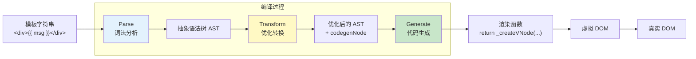
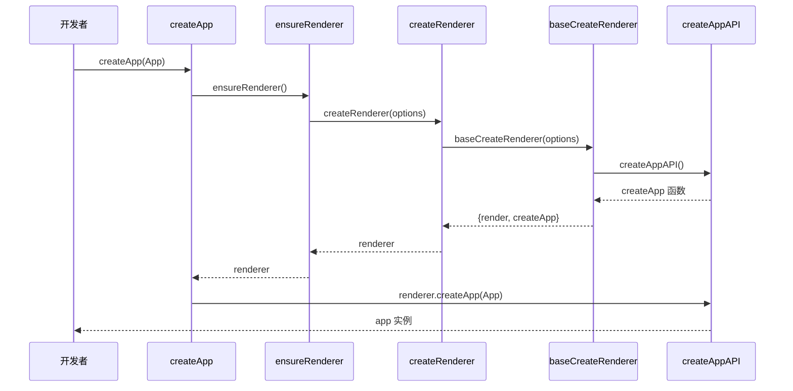
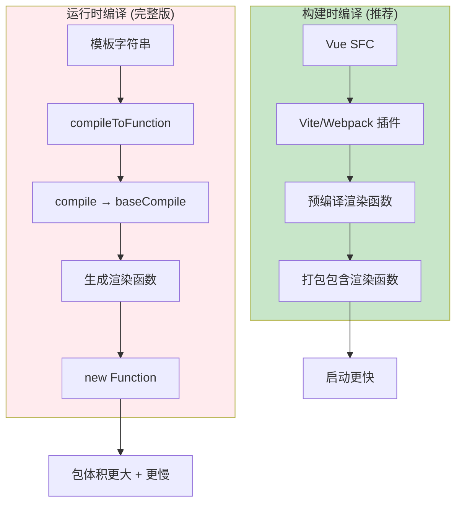
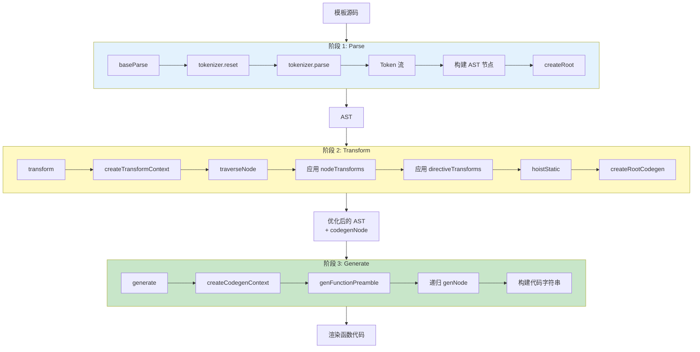

# Vue3 从模板到 Render 函数的完整转换过程

记录一下阅读的vue3源码中，Vue3从模板到Render函数的完整转换过程

## 一、整体流程概述

Vue3 从模板到 Render 函数的转换流程主要包含以下步骤：

1. 创建应用 (createApp)
2. 挂载应用 (app.mount)
3. 编译模板 (如需)：parse → transform → generate
4. 生成 render 函数
5. 执行 render 函数创建虚拟 DOM
6. 渲染虚拟 DOM 到实际 DOM

模板编译的三个核心阶段：

1. **解析（Parse）**：将模板字符串解析成抽象语法树（AST）
2. **转换（Transform）**：对 AST 进行一系列优化和转换
3. **代码生成（Generate）**：将优化后的 AST 转换为可执行的渲染函数



## 二、应用创建与挂载过程

### 1. 创建应用入口：createApp

当我们调用`createApp()`函数时，整个流程开始：

```javascript
const app = createApp(App)
app.mount('#app')
```

调用栈：

1. **`createApp`函数** (位于`packages/runtime-dom/src/index.ts`)

   ```typescript
   export const createApp = ((...args) => {
     const app = ensureRenderer().createApp(...args)
     // ...省略其他代码
     return app
   }) as CreateAppFunction<Element>
   ```

2. **`ensureRenderer`函数** (位于`https://github.com/vuejs/core/blob/main/packages/runtime-dom/src/index.ts`)

   ```typescript
   function ensureRenderer() {
     return (
       renderer ||
       (renderer = createRenderer<Node, Element | ShadowRoot>(rendererOptions))
     )
   }
   ```

3. **`createRenderer`函数** (位于`https://github.com/vuejs/core/blob/main/packages/runtime-core/src/renderer.ts`)

   ```typescript
   export function createRenderer<HostNode, HostElement>(options) {
     return baseCreateRenderer<HostNode, HostElement>(options)
   }
   ```

4. **`baseCreateRenderer`函数** (位于`https://github.com/vuejs/core/blob/main/packages/runtime-core/src/renderer.ts`)
   - 完成渲染器创建
   - 返回包含`render`和`createApp`方法的对象

5. **`createAppAPI`函数** (创建应用API)
   - 返回实际的`createApp`函数实现



### 2. 挂载过程：app.mount

当调用`app.mount('#app')`时：

1. **自定义`mount`方法** (位于`https://github.com/vuejs/core/blob/main/packages/runtime-dom/src/index.ts`)

   ```typescript
   app.mount = (containerOrSelector) => {
     const container = normalizeContainer(containerOrSelector)
     
     // 关键：如果组件没有render函数和template，就使用容器的innerHTML作为模板
     if (!isFunction(component) && !component.render && !component.template) {
       component.template = container.innerHTML
     }
     
     // 调用核心mount方法
     const proxy = mount(container, false, resolveRootNamespace(container))
     return proxy
   }
   ```

2. **原始`mount`方法** (位于`https://github.com/vuejs/core/blob/main/packages/runtime-core/src/apiCreateApp.ts`)

   ```typescript
   mount(rootContainer, isHydrate, namespace) {
     if (!isMounted) {
       // 创建虚拟节点
       const vnode = createVNode(rootComponent, rootProps)

       // 渲染vnode到容器
       render(vnode, rootContainer, namespace)

       isMounted = true
       return getComponentPublicInstance(vnode.component!)
     }
   }
   ```

```mermaid
flowchart TD
    Start[app.mount('#app')] --> Normalize[规范化容器]
    Normalize --> CheckTemplate{有 render<br/>或 template?}

    CheckTemplate -->|否| UseInner[使用 container.innerHTML<br/>作为模板]
    CheckTemplate -->|是| CreateVNode
    UseInner --> CreateVNode[createVNode<br/>创建根虚拟节点]

    CreateVNode --> Render[render 函数<br/>渲染 VNode 到容器]
    Render --> Mount[mountComponent]
    Mount --> Setup[setupComponent]
    Setup --> Effect[setupRenderEffect]
    Effect --> FirstRender[首次渲染]

    style CheckTemplate fill:#fff9c4
    style CreateVNode fill:#e3f2fd
    style Effect fill:#c8e6c9
```

3. **`render`函数** (位于`https://github.com/vuejs/core/blob/main/packages/runtime-core/src/renderer.ts`)
   - 负责将虚拟DOM渲染到容器中

### 3. 组件挂载与渲染

1. **`mountComponent`函数** (渲染器内部函数)

   ```typescript
   const mountComponent = (initialVNode, container, ...) => {
     // 创建组件实例
     const instance = (initialVNode.component = createComponentInstance(...))
     
     // 设置组件
     setupComponent(instance)
     
     // 设置渲染效果
     setupRenderEffect(instance, initialVNode, container, ...)
   }
   ```

2. **`setupComponent`函数** (位于`https://github.com/vuejs/core/blob/main/packages/runtime-core/src/component.ts`)
   - 处理组件初始化、props、slots等

3. **`setupRenderEffect`函数** (位于`https://github.com/vuejs/core/blob/main/packages/runtime-core/src/renderer.ts`)
   - 创建响应式更新机制

   ```typescript
   const setupRenderEffect = (instance, initialVNode, container, ...) => {
     // 定义组件更新函数
     const componentUpdateFn = () => {
       // 首次渲染
       if (!instance.isMounted) {
         // 调用render函数生成子树
         const subTree = (instance.subTree = renderComponentRoot(instance))
         
         // 挂载子树
         patch(null, subTree, container, anchor, instance, parentSuspense, namespace)
         
         initialVNode.el = subTree.el
       } 
       // 更新
       else {
         // 生成新的子树
         const nextTree = renderComponentRoot(instance)
         const prevTree = instance.subTree
         
         // 更新组件实例的子树引用
         instance.subTree = nextTree
         
         // 更新 DOM
         patch(prevTree, nextTree, ...)
       }
     }
     
     // 创建reactive effect使组件能够响应式更新
     const effect = (instance.effect = new ReactiveEffect(...))
     
     // 触发首次渲染
     if (vnode.el && hydrateNode) { /* hydration逻辑 */ } 
     else { componentUpdateFn() }
   }
   ```

## 三、模板编译过程详解

模板编译可以发生在两个时间点：

### 1. 构建时编译 (通过工具如Vue CLI、Vite等)

这是推荐的方式，编译发生在构建阶段，性能更好。

### 2. 运行时编译 (当使用完整版Vue时)

如果使用带编译器的Vue版本，并且直接传入template选项，则会在运行时进行编译。



#### 编译调用栈

1. **`compileToFunction`函数** (位于`https://github.com/vuejs/core/blob/main/packages/vue/src/index.ts`)

   ```typescript
   function compileToFunction(template, options) {
     // 检查缓存
     const key = genCacheKey(template, options)
     const cached = compileCache[key]
     if (cached) return cached
     
     // 编译模板
     const { code } = compile(template, options)
     
     // 生成渲染函数
     const render = new Function('Vue', code)(runtimeDom)
     
     // 缓存并返回
     return (compileCache[key] = render)
   }
   ```

2. **`compile`函数** (位于`https://github.com/vuejs/core/blob/main/packages/compiler-dom/src/index.ts`)

   ```typescript
   export function compile(src, options = {}) {
     return baseCompile(
       src,
       extend({}, parserOptions, options, {
         nodeTransforms: [
           ignoreSideEffectTags,
           ...DOMNodeTransforms,
           ...(options.nodeTransforms || []),
         ],
         directiveTransforms: extend(
           {},
           DOMDirectiveTransforms,
           options.directiveTransforms || {},
         ),
         transformHoist: __BROWSER__ ? null : stringifyStatic,
       }),
     )
   }
   ```

3. **`baseCompile`函数** (位于`https://github.com/vuejs/core/blob/main/packages/compiler-core/src/compile.ts`)

   ```typescript
   export function baseCompile(source, options = {}) {
     // 1. 解析模板为AST
     const ast = isString(source) ? baseParse(source, resolvedOptions) : source

     // 2. 转换AST
     transform(
       ast,
       extend({}, resolvedOptions, {
         nodeTransforms: [...nodeTransforms, ...(options.nodeTransforms || [])],
         directiveTransforms: extend({}, directiveTransforms, options.directiveTransforms || {}),
       }),
     )

     // 3. 生成代码
     return generate(ast, resolvedOptions)
   }
   ```



### 3. 解析阶段：baseParse

解析阶段由 `baseParse` 函数完成（位于 `https://github.com/vuejs/core/blob/main/packages/compiler-core/src/parser.ts`）：

```typescript
export function baseParse(input: string, options?: ParserOptions): RootNode {
  // 重置解析状态
  reset()
  
  // 设置当前输入和选项
  currentInput = input
  currentOptions = extend({}, defaultParserOptions, options)
  
  // 创建 tokenizer 对象进行词法分析
  tokenizer.reset(input, currentOptions)
  
  // 开始解析
  tokenizer.parse()
  
  // 返回根节点
  return createRoot(nodes, source, currentOptions.parseMode)
}
```

解析过程中的调用栈：

- `baseParse` → `tokenizer.parse()` → 各种 token 处理函数 → 构建 AST 节点

### 4. 转换阶段：transform

转换阶段由 `transform` 函数完成（位于 `https://github.com/vuejs/core/blob/main/packages/compiler-core/src/transform.ts`）：

```typescript
export function transform(root: RootNode, options: TransformOptions): void {
  // 创建转换上下文
  const context = createTransformContext(root, options)
  
  // 遍历并转换节点
  traverseNode(root, context)
  
  // 静态提升
  if (options.hoistStatic) {
    hoistStatic(root, context)
  }
  
  // 创建根节点的代码生成节点
  if (!options.ssr) {
    createRootCodegen(root, context)
  }
  
  // 设置根节点的辅助函数、组件和指令信息
  root.helpers = [...context.helpers.keys()]
  root.components = [...context.components]
  root.directives = [...context.directives]
  root.imports = context.imports
  root.hoists = context.hoists
  root.temps = context.temps
  root.cached = context.cached
}
```

转换过程中的调用栈：

- `transform` → `traverseNode` → 各种转换函数（`transformElement`, `transformText` 等）

在转换阶段，Vue3 会应用一系列转换器，处理不同类型的节点和指令。这些转换器有两种类型：

1. **NodeTransform**：处理特定类型的节点，如元素、文本等
2. **DirectiveTransform**：处理特定的指令，如 v-if, v-for, v-model 等

转换器在 `https://github.com/vuejs/core/blob/main/packages/compiler-core/src/compile.ts` 中的 `getBaseTransformPreset` 函数中定义：

```typescript
export function getBaseTransformPreset(
  prefixIdentifiers?: boolean,
): TransformPreset {
  return [
    [
      transformOnce,
      transformIf,
      transformMemo,
      transformFor,
      ...(__COMPAT__ ? [transformFilter] : []),
      ...(!__BROWSER__ && prefixIdentifiers
        ? [trackVForSlotScopes, transformExpression]
        : []),
      transformSlotOutlet,
      transformElement,
      trackSlotScopes,
      transformText,
    ],
    {
      on: transformOn,
      bind: transformBind,
      model: transformModel,
    },
  ]
}
```

### 5. 代码生成阶段：generate

代码生成阶段由 `generate` 函数完成（位于 `https://github.com/vuejs/core/blob/main/packages/compiler-core/src/codegen.ts`）：

```typescript
export function generate(
  ast: RootNode,
  options: CodegenOptions = {},
): CodegenResult {
  // 创建代码生成上下文
  const context = createCodegenContext(ast, options)
  
  // 生成函数前导代码
  if (options.mode === 'function') {
    genFunctionPreamble(ast, context)
  } else {
    genModulePreamble(ast, context)
  }
  
  // 生成渲染函数体
  const functionName = ssr ? `ssrRender` : `render`
  const args = ssr ? ['_ctx', '_push', '_parent', '_attrs'] : ['_ctx', '_cache']
  
  context.push(`function ${functionName}(${args.join(', ')}) {`)
  context.indent()
  
  // 生成 VNode 树构建代码
  if (ast.codegenNode) {
    genNode(ast.codegenNode, context)
  } else {
    context.push(`return null`)
  }
  
  context.deindent()
  context.push('}')
  
  // 返回结果
  return {
    ast,
    code: context.code,
    preamble: context.preamble,
    map: context.map ? context.map.toJSON() : undefined
  }
}
```

代码生成过程中的调用栈：

- `generate` → `genFunctionPreamble`/`genModulePreamble` → `genNode` → 各种节点生成函数

## 四、一个完整的编译示例

假设我们有一个简单模板：

```html
<div>
  <span v-if="show">{{ message }}</span>
</div>
```

### 1. 解析阶段：生成 AST

```js
{
  type: NodeTypes.ROOT,
  children: [
    {
      type: NodeTypes.ELEMENT,
      tag: 'div',
      props: [],
      children: [
        {
          type: NodeTypes.ELEMENT,
          tag: 'span',
          props: [
            {
              type: NodeTypes.DIRECTIVE,
              name: 'if',
              exp: {
                type: NodeTypes.SIMPLE_EXPRESSION,
                content: 'show',
                isStatic: false
              }
            }
          ],
          children: [
            {
              type: NodeTypes.INTERPOLATION,
              content: {
                type: NodeTypes.SIMPLE_EXPRESSION,
                content: 'message',
                isStatic: false
              }
            }
          ]
        }
      ]
    }
  ]
}
```

### 2. 转换阶段：处理节点和指令

转换后的 AST 会包含 `codegenNode` 属性，用于代码生成：

```js
{
  type: NodeTypes.ROOT,
  children: [...],
  codegenNode: {
    type: NodeTypes.ELEMENT,
    tag: 'div',
    props: [],
    children: [
      {
        type: NodeTypes.IF,
        branches: [
          {
            condition: { type: NodeTypes.SIMPLE_EXPRESSION, content: 'show' },
            children: [
              {
                type: NodeTypes.ELEMENT,
                tag: 'span',
                props: [],
                children: [
                  {
                    type: NodeTypes.TEXT_CALL,
                    content: { type: NodeTypes.SIMPLE_EXPRESSION, content: 'message' }
                  }
                ]
              }
            ]
          }
        ]
      }
    ]
  }
}
```

### 3. 代码生成阶段：生成渲染函数

```js
import { createElementVNode as _createElementVNode, toDisplayString as _toDisplayString, openBlock as _openBlock, createElementBlock as _createElementBlock } from "vue"

export function render(_ctx, _cache, $props, $setup, $data, $options) {
  return (_openBlock(), _createElementBlock("div", null, [
    (_ctx.show)
      ? _createElementVNode("span", null, _toDisplayString(_ctx.message), 1 /* TEXT */)
      : _createCommentVNode("v-if", true)
  ]))
}
```

## 五、Vue3 编译优化

Vue3 在编译过程中加入了许多优化策略：

### 1. 静态提升 (Static Hoisting)

静态节点会被提升到渲染函数外部，避免重复创建：

```js
// 编译前
<div>
  <span>静态文本</span>
  <p>{{ message }}</p>
</div>

// 编译后
const _hoisted_1 = /*#__PURE__*/_createElementVNode("span", null, "静态文本", -1 /* HOISTED */)

function render() {
  return _createElementVNode("div", null, [
    _hoisted_1,
    _createElementVNode("p", null, _toDisplayString(_ctx.message), 1 /* TEXT */)
  ])
}
```

它的优化核心点在于：**缓存**静态节点

### 2. Patch Flag (补丁标记)

Vue3 会为动态节点添加补丁标记，指明哪些部分需要更新：

```js
_createElementVNode("p", null, _toDisplayString(_ctx.message), 1 /* TEXT */)
//                                                              ^ PatchFlag
```

常见的 PatchFlag 值：

- 1: 动态文本内容
- 2: 动态类
- 4: 动态样式
- 8: 其他动态属性
- 16: 需要完整 diff 的节点
- ...等等

### 3. Block Tree

Block 是一种特殊的 VNode，用于跟踪其内部的动态节点：

```js
// 使用 Block 的渲染函数
function render() {
  return (_openBlock(), _createElementBlock("div", null, [
    _createElementVNode("p", null, _toDisplayString(_ctx.message), 1 /* TEXT */)
  ]))
}
```

Block Tree 优化允许 Vue3：

- 跳过静态节点的比较
- 直接定位到需要更新的动态节点
- 减少虚拟 DOM 的比较开销

## 六、编译器核心实现

### 1. Tokenizer

Tokenizer 负责将模板字符串转换为标记(Token)序列：

```typescript
export default class Tokenizer {
  parse() {
    // 解析模板的主循环
    while (this.state !== State.End) {
      this.step()
    }
  }
  
  step() {
    // 根据当前状态调用不同的处理函数
    switch (this.state) {
      case State.Content:
        this.parseContent()
        break
      case State.TagOpen:
        this.parseTagOpen()
        break
      // ...更多状态处理
    }
  }
}
```

### 2. 转换器实现

以 `v-if` 指令的转换器为例：

```typescript
export const transformIf = createStructuralDirectiveTransform(
  /^(if|else|else-if)$/,
  (node, dir, context) => {
    return processIf(node, dir, context, (ifNode, branch, isRoot) => {
      // 处理子节点
      const siblings = context.parent!.children
      let i = siblings.indexOf(ifNode)
      let key = 0
      
      // 创建 IF 类型的代码生成节点
      return () => {
        if (isRoot) {
          ifNode.codegenNode = createCodegenNodeForBranch(
            branch,
            key,
            context
          )
        }
      }
    })
  }
)
```

### 3. 代码生成器实现

代码生成器中的 `genNode` 函数根据节点类型调用不同的生成函数：

```typescript
function genNode(node: CodegenNode | symbol | string, context: CodegenContext) {
  if (isString(node)) {
    context.push(node)
    return
  }
  
  if (isSymbol(node)) {
    context.push(context.helper(node))
    return
  }
  
  switch (node.type) {
    case NodeTypes.ELEMENT:
      genElement(node, context)
      break
    case NodeTypes.TEXT:
      genText(node, context)
      break
    case NodeTypes.IF:
      genIf(node, context)
      break
    // ...更多节点类型处理
  }
}
```

## 总结

Vue3 从模板到 Render 函数的转换过程是一个精密的系统，通过以下步骤完成：

1. **解析阶段**：通过词法分析和语法分析将模板转换为 AST
2. **转换阶段**：应用一系列转换器对 AST 进行优化和转换
3. **代码生成阶段**：将优化后的 AST 转换为可执行的渲染函数

Vue3 编译器的设计具有高度的模块化和可扩展性，通过插件机制可以轻松添加新的转换器和优化。同时，编译器引入了静态提升、PatchFlag 和 Block Tree 等优化策略，大大提高了运行时性能

这些优化使 Vue3 在处理大型应用和复杂组件时，性能表现优于 Vue2，特别是对于包含大量静态内容的页面，优化效果更为显著

---

## 作业

1. 把一个包含文本插值、动态 class、事件绑定的模板手动改写成简化 render 函数。
2. 用 Vue SFC Playground 查看编译输出，标注 patch flag、hoist 和 block 的位置。
3. 解释 parse、transform、generate 三阶段分别解决什么问题。
4. 找一个模板优化失效案例，说明它为什么退化为更保守的运行时更新。

## 📝 面试题自测

### Q1 [single]
在 Vue 3 的模板编译（Compiler）机制中，编译器处理模板并生成渲染函数的三个核心阶段的执行顺序是？
A. Transform → Parse → Generate
B. Parse → Generate → Transform
C. Parse → Transform → Generate
D. Generate → Transform → Parse
答案：C
解析：固定顺序：Parse（模板字符串 → AST）→ Transform（优化转换 AST，生成 codegenNode）→ Generate（AST → 渲染函数代码字符串）。

### Q2 [multiple]
在 Vue 3 模板编译的 Parse 阶段（解析阶段），以下关于其工作原理和 AST 的描述中哪些是正确的？
A. Parse 阶段使用 Tokenizer 进行词法分析，将模板拆分为 Token 序列
B. Parse 阶段的产物是抽象语法树（AST）
C. Parse 阶段直接生成可执行的 render 函数
D. `baseParse` 最终调用 `createRoot` 返回根节点
答案：ABD
解析：C 错误，Parse 只生成 AST，render 函数是 Generate 阶段的产物。

### Q3 [single]
在 Vue 3 模板编译的 Transform 阶段（转换阶段），其核心产物是什么？
A. 最终的 render 函数字符串
B. 带有 `codegenNode` 属性的优化 AST
C. 经过 Minify 压缩的代码
D. 虚拟 DOM 节点
答案：B
解析：Transform 在原始 AST 每个节点上附加 codegenNode（代码生成节点），包含静态提升信息、PatchFlag 等，供 Generate 阶段使用。

### Q4 [judgment]
【判断题】在 Vue 3 中，调用 `app.mount()` 挂载应用时，如果根组件既没有提供渲染函数 `render` 也没有提供 `template` 模板选项，Vue 在任何运行模式下都会直接抛出致命错误。
答案：错
解析：Vue 会用 `container.innerHTML` 作为模板，通过运行时编译器将其编译为 render 函数，然后再挂载。

### Q5 [multiple]
在 Vue 3 模板编译优化中，静态提升（Static Hoisting）的核心价值和运作机制是什么？
A. 将不依赖响应式数据的静态节点提升到渲染函数外部，只创建一次
B. 被提升的节点的 PatchFlag 值为 -1（HOISTED）
C. 每次重新渲染时跳过静态节点的 diff
D. 静态提升只对文本节点有效，不对元素节点有效
答案：ABC
解析：D 错误，静态提升对静态元素节点同样有效。被提升的节点在 _hoisted_xxx 变量中只创建一次，重新渲染时复用。

### Q6 [single]
在 Vue 3 的编译优化和 PatchFlag 机制中，当 VNode 的 PatchFlag 值为二进制 `1` (即 `PatchFlags.TEXT`) 时，代表该节点包含什么类型的动态绑定？
A. 动态 class
B. 动态文本内容（TEXT）
C. 动态样式
D. 需要完整 diff
答案：B
解析：PatchFlag 是编译期标记：1 = TEXT（动态文本），2 = CLASS，4 = STYLE，8 = PROPS，-1 = HOISTED（静态提升），-2 = BAIL（退出优化）。

### Q7 [multiple]
在 Vue 3 渲染引擎和编译优化中，Block Tree 的引入起到了哪些核心的优化作用？
A. 跟踪 Block 内部所有动态子节点，存放在 dynamicChildren 数组中
B. diff 时可以直接遍历 dynamicChildren，跳过静态节点的比较
C. 减少虚拟 DOM 的比较范围，从树级 diff 降低为靶向 diff
D. Block Tree 使 v-for 和 v-if 内部的节点永远不需要 diff
答案：ABC
解析：D 错误，v-for 和 v-if 涉及结构变化（节点增删），仍需要完整 diff 处理其内部变化，它们会产生新的 Block。

### Q8 [single]
在 Vue 3 的组件挂载和运行时更新流程中，组件实例方法 `setupRenderEffect` 的核心职责是什么？
A. 编译模板为 AST
B. 初始化组件的 props 和 slots
C. 创建响应式的 ReactiveEffect，建立组件更新与响应式数据之间的联系
D. 将 VNode 转换为真实 DOM
答案：C
解析：setupRenderEffect 创建以 componentUpdateFn 为 fn 的 ReactiveEffect，首次执行时完成依赖收集，之后数据变化通过 scheduler → queueJob 触发更新。

### Q9 [judgment]
【判断题】在 Vue 3 生产环境构建时（如配合 Vite 或 Webpack 使用 SFC），模板的解析与编译通常是在浏览器运行时（Runtime）中进行的。
答案：错
解析：推荐（也是默认）模式是构建时编译（编译器只在构建工具中运行），打包产物只包含运行时（runtime-core），不包含编译器，体积更小，启动更快。

### Q10 [single]
在 Vue 3 运行时编译器 `compileToFunction` 的底层实现中，使用 `new Function('Vue', code)(runtimeDom)` 这行代码的主要作用是？
A. 创建一个 Web Worker 执行编译代码
B. 将 generate 产出的代码字符串动态创建为可执行函数
C. 将 AST 序列化为 JSON
D. 注册全局组件
答案：B
解析：generate 输出的是字符串形式的函数体，通过 `new Function` 将字符串转为真正的函数对象，并传入 runtimeDom 作为 Vue 运行时依赖，这是运行时编译的最后一步。

### Q11 [multiple]
在 Vue 3 模板编译的 Transform 阶段中，编译器主要处理了以下哪些转换工作？
A. 处理 v-if、v-for 等结构性指令，转为对应的代码生成节点
B. 对静态节点进行标记，为 hoistStatic 做准备
C. 将模板字符串切分为 Token
D. 处理 v-model、v-on 等指令，生成对应的 props
答案：ABD
解析：C 是 Parse 阶段（Tokenizer）的工作，不属于 Transform。

### Q12 [single]
关于 Vue 3 从模板字符串到渲染函数的运行时编译过程，以下哪个调用链准确描述了其核心路径？
A. compileToFunction → baseCompile → baseParse + transform + generate
B. baseCompile → compileToFunction → baseParse
C. baseParse → compileToFunction → generate
D. transform → baseParse → generate → compileToFunction
答案：A
解析：完整调用链：compileToFunction（缓存层）→ compile（平台适配层）→ baseCompile（核心层）→ baseParse + transform + generate（三阶段）。

### Q13 [judgment]
【判断题】在 Vue 3 模板编译的 Transform 阶段中，NodeTransform（节点转换器）和 DirectiveTransform（指令转换器）属于同一类转换器，在编写自定义编译插件时可以无缝互换使用。
答案：错
解析：两者职责不同。NodeTransform 处理元素、文本等节点类型；DirectiveTransform 专门处理 v-model、v-on、v-bind 等指令，返回该指令对应的 props 信息。

### Q14 [multiple]
关于 Vue 3 挂载应用从 `createApp` 初始化到首屏 `mount` 的整体渲染流程，以下哪些描述是正确的？
A. createApp 内部调用 ensureRenderer()，懒创建渲染器（只创建一次）
B. app.mount 内部调用 createVNode 创建根 VNode，再调用 render 渲染
C. mountComponent → setupComponent → setupRenderEffect 是组件挂载的核心调用链
D. render 函数直接操作真实 DOM，不经过虚拟 DOM
答案：ABC
解析：D 错误，render 函数通过 patch 将 VNode 转换为 DOM，整个过程经由虚拟 DOM diff 再更新真实 DOM。

### Q15 [single]
在 Vue 3 的编译优化方案中，主要是通过哪个核心机制将运行时的虚拟 DOM diff 从“全树递归比较”转变为“扁平数组的靶向更新”？
A. 静态提升
B. PatchFlag + Block Tree（dynamicChildren 靶向 diff）
C. v-once 指令
D. Composition API
答案：B
解析：Block Tree 让每个 Block 节点记录内部所有动态子孙节点（dynamicChildren），diff 时只需遍历这个扁平数组，直接跳过静态节点，时间复杂度从 O(n) 降到接近 O(动态节点数)。

### Q16 [judgment]
【判断题】在 Vue 3 编译后的代码中，`_createElementBlock` 与 `_createElementVNode` 所创建的虚拟节点（VNode）在底层数据结构上完全相同，它们在运行时 diff 过程中没有区别。
答案：错
解析：createElementBlock 创建的是 Block VNode，会开启一个新的动态节点追踪上下文（openBlock），收集其内部的动态子节点到 dynamicChildren；createElementVNode 创建的是普通 VNode，不具备追踪能力。
