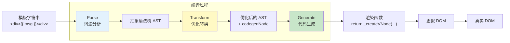
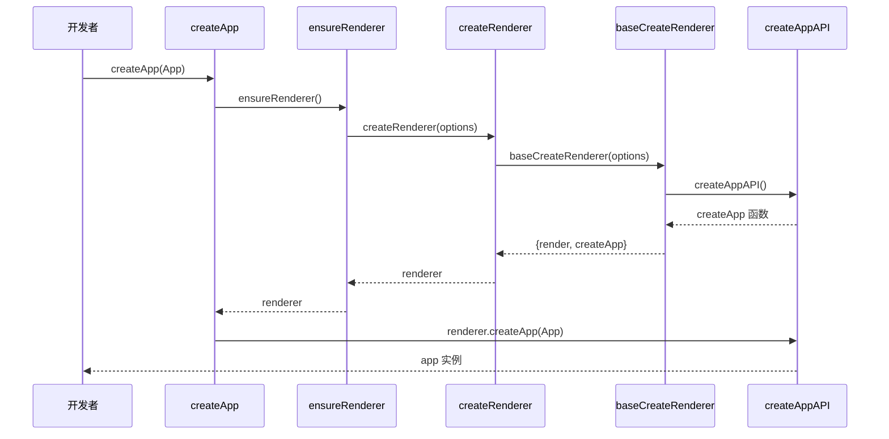
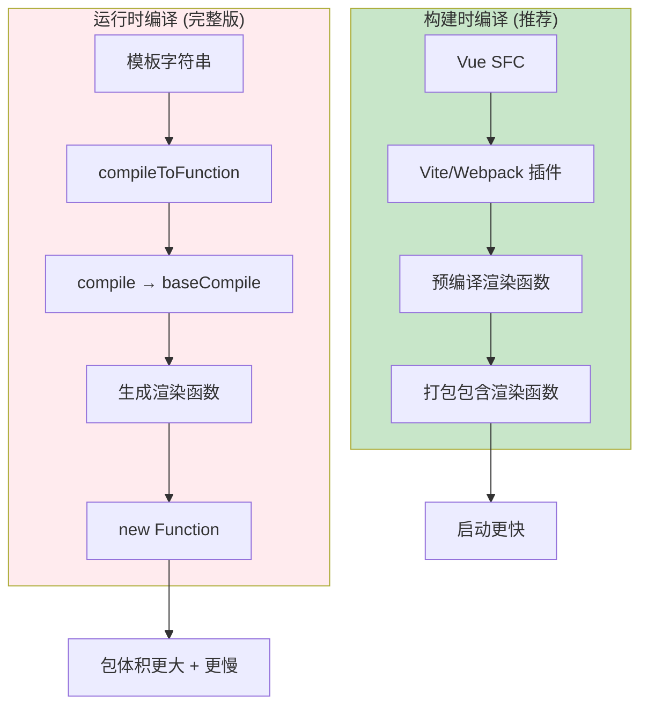
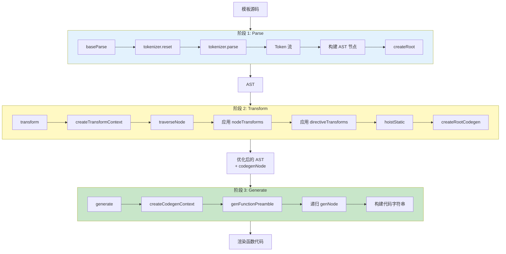

# Vue3 从模板到 Render 函数的完整转换过程

记录一下阅读的vue3源码中，Vue3从模板到Render函数的完整转换过程

## 一、整体流程概述

Vue3 从模板到 Render 函数的转换流程主要包含以下步骤：

1. 创建应用 (createApp)
2. 挂载应用 (app.mount)
3. 编译模板 (如需)：parse → transform → generate
4. 生成 render 函数
5. 执行 render 函数创建虚拟 DOM
6. 渲染虚拟 DOM 到实际 DOM

模板编译的三个核心阶段：

1. **解析（Parse）**：将模板字符串解析成抽象语法树（AST）
2. **转换（Transform）**：对 AST 进行一系列优化和转换
3. **代码生成（Generate）**：将优化后的 AST 转换为可执行的渲染函数



## 二、应用创建与挂载过程

### 1. 创建应用入口：createApp

当我们调用`createApp()`函数时，整个流程开始：

```javascript
const app = createApp(App)
app.mount('#app')
```

调用栈：

1. **`createApp`函数** (位于`packages/runtime-dom/src/index.ts`)

   ```typescript
   export const createApp = ((...args) => {
     const app = ensureRenderer().createApp(...args)
     // ...省略其他代码
     return app
   }) as CreateAppFunction<Element>
   ```

2. **`ensureRenderer`函数** (位于`https://github.com/vuejs/core/blob/main/packages/runtime-dom/src/index.ts`)

   ```typescript
   function ensureRenderer() {
     return (
       renderer ||
       (renderer = createRenderer<Node, Element | ShadowRoot>(rendererOptions))
     )
   }
   ```

3. **`createRenderer`函数** (位于`https://github.com/vuejs/core/blob/main/packages/runtime-core/src/renderer.ts`)

   ```typescript
   export function createRenderer<HostNode, HostElement>(options) {
     return baseCreateRenderer<HostNode, HostElement>(options)
   }
   ```

4. **`baseCreateRenderer`函数** (位于`https://github.com/vuejs/core/blob/main/packages/runtime-core/src/renderer.ts`)
   - 完成渲染器创建
   - 返回包含`render`和`createApp`方法的对象

5. **`createAppAPI`函数** (创建应用API)
   - 返回实际的`createApp`函数实现



### 2. 挂载过程：app.mount

当调用`app.mount('#app')`时：

1. **自定义`mount`方法** (位于`https://github.com/vuejs/core/blob/main/packages/runtime-dom/src/index.ts`)

   ```typescript
   app.mount = (containerOrSelector) => {
     const container = normalizeContainer(containerOrSelector)
     
     // 关键：如果组件没有render函数和template，就使用容器的innerHTML作为模板
     if (!isFunction(component) && !component.render && !component.template) {
       component.template = container.innerHTML
     }
     
     // 调用核心mount方法
     const proxy = mount(container, false, resolveRootNamespace(container))
     return proxy
   }
   ```

2. **原始`mount`方法** (位于`https://github.com/vuejs/core/blob/main/packages/runtime-core/src/apiCreateApp.ts`)

   ```typescript
   mount(rootContainer, isHydrate, namespace) {
     if (!isMounted) {
       // 创建虚拟节点
       const vnode = createVNode(rootComponent, rootProps)

       // 渲染vnode到容器
       render(vnode, rootContainer, namespace)

       isMounted = true
       return getComponentPublicInstance(vnode.component!)
     }
   }
   ```

```mermaid
flowchart TD
    Start[app.mount('#app')] --> Normalize[规范化容器]
    Normalize --> CheckTemplate{有 render<br/>或 template?}

    CheckTemplate -->|否| UseInner[使用 container.innerHTML<br/>作为模板]
    CheckTemplate -->|是| CreateVNode
    UseInner --> CreateVNode[createVNode<br/>创建根虚拟节点]

    CreateVNode --> Render[render 函数<br/>渲染 VNode 到容器]
    Render --> Mount[mountComponent]
    Mount --> Setup[setupComponent]
    Setup --> Effect[setupRenderEffect]
    Effect --> FirstRender[首次渲染]

    style CheckTemplate fill:#fff9c4
    style CreateVNode fill:#e3f2fd
    style Effect fill:#c8e6c9
```

3. **`render`函数** (位于`https://github.com/vuejs/core/blob/main/packages/runtime-core/src/renderer.ts`)
   - 负责将虚拟DOM渲染到容器中

### 3. 组件挂载与渲染

1. **`mountComponent`函数** (渲染器内部函数)

   ```typescript
   const mountComponent = (initialVNode, container, ...) => {
     // 创建组件实例
     const instance = (initialVNode.component = createComponentInstance(...))
     
     // 设置组件
     setupComponent(instance)
     
     // 设置渲染效果
     setupRenderEffect(instance, initialVNode, container, ...)
   }
   ```

2. **`setupComponent`函数** (位于`https://github.com/vuejs/core/blob/main/packages/runtime-core/src/component.ts`)
   - 处理组件初始化、props、slots等

3. **`setupRenderEffect`函数** (位于`https://github.com/vuejs/core/blob/main/packages/runtime-core/src/renderer.ts`)
   - 创建响应式更新机制

   ```typescript
   const setupRenderEffect = (instance, initialVNode, container, ...) => {
     // 定义组件更新函数
     const componentUpdateFn = () => {
       // 首次渲染
       if (!instance.isMounted) {
         // 调用render函数生成子树
         const subTree = (instance.subTree = renderComponentRoot(instance))
         
         // 挂载子树
         patch(null, subTree, container, anchor, instance, parentSuspense, namespace)
         
         initialVNode.el = subTree.el
       } 
       // 更新
       else {
         // 生成新的子树
         const nextTree = renderComponentRoot(instance)
         const prevTree = instance.subTree
         
         // 更新组件实例的子树引用
         instance.subTree = nextTree
         
         // 更新 DOM
         patch(prevTree, nextTree, ...)
       }
     }
     
     // 创建reactive effect使组件能够响应式更新
     const effect = (instance.effect = new ReactiveEffect(...))
     
     // 触发首次渲染
     if (vnode.el && hydrateNode) { /* hydration逻辑 */ } 
     else { componentUpdateFn() }
   }
   ```

## 三、模板编译过程详解

模板编译可以发生在两个时间点：

### 1. 构建时编译 (通过工具如Vue CLI、Vite等)

这是推荐的方式，编译发生在构建阶段，性能更好。

### 2. 运行时编译 (当使用完整版Vue时)

如果使用带编译器的Vue版本，并且直接传入template选项，则会在运行时进行编译。



#### 编译调用栈

1. **`compileToFunction`函数** (位于`https://github.com/vuejs/core/blob/main/packages/vue/src/index.ts`)

   ```typescript
   function compileToFunction(template, options) {
     // 检查缓存
     const key = genCacheKey(template, options)
     const cached = compileCache[key]
     if (cached) return cached
     
     // 编译模板
     const { code } = compile(template, options)
     
     // 生成渲染函数
     const render = new Function('Vue', code)(runtimeDom)
     
     // 缓存并返回
     return (compileCache[key] = render)
   }
   ```

2. **`compile`函数** (位于`https://github.com/vuejs/core/blob/main/packages/compiler-dom/src/index.ts`)

   ```typescript
   export function compile(src, options = {}) {
     return baseCompile(
       src,
       extend({}, parserOptions, options, {
         nodeTransforms: [
           ignoreSideEffectTags,
           ...DOMNodeTransforms,
           ...(options.nodeTransforms || []),
         ],
         directiveTransforms: extend(
           {},
           DOMDirectiveTransforms,
           options.directiveTransforms || {},
         ),
         transformHoist: __BROWSER__ ? null : stringifyStatic,
       }),
     )
   }
   ```

3. **`baseCompile`函数** (位于`https://github.com/vuejs/core/blob/main/packages/compiler-core/src/compile.ts`)

   ```typescript
   export function baseCompile(source, options = {}) {
     // 1. 解析模板为AST
     const ast = isString(source) ? baseParse(source, resolvedOptions) : source

     // 2. 转换AST
     transform(
       ast,
       extend({}, resolvedOptions, {
         nodeTransforms: [...nodeTransforms, ...(options.nodeTransforms || [])],
         directiveTransforms: extend({}, directiveTransforms, options.directiveTransforms || {}),
       }),
     )

     // 3. 生成代码
     return generate(ast, resolvedOptions)
   }
   ```



### 3. 解析阶段：baseParse

解析阶段由 `baseParse` 函数完成（位于 `https://github.com/vuejs/core/blob/main/packages/compiler-core/src/parser.ts`）：

```typescript
export function baseParse(input: string, options?: ParserOptions): RootNode {
  // 重置解析状态
  reset()
  
  // 设置当前输入和选项
  currentInput = input
  currentOptions = extend({}, defaultParserOptions, options)
  
  // 创建 tokenizer 对象进行词法分析
  tokenizer.reset(input, currentOptions)
  
  // 开始解析
  tokenizer.parse()
  
  // 返回根节点
  return createRoot(nodes, source, currentOptions.parseMode)
}
```

解析过程中的调用栈：

- `baseParse` → `tokenizer.parse()` → 各种 token 处理函数 → 构建 AST 节点

### 4. 转换阶段：transform

转换阶段由 `transform` 函数完成（位于 `https://github.com/vuejs/core/blob/main/packages/compiler-core/src/transform.ts`）：

```typescript
export function transform(root: RootNode, options: TransformOptions): void {
  // 创建转换上下文
  const context = createTransformContext(root, options)
  
  // 遍历并转换节点
  traverseNode(root, context)
  
  // 静态提升
  if (options.hoistStatic) {
    hoistStatic(root, context)
  }
  
  // 创建根节点的代码生成节点
  if (!options.ssr) {
    createRootCodegen(root, context)
  }
  
  // 设置根节点的辅助函数、组件和指令信息
  root.helpers = [...context.helpers.keys()]
  root.components = [...context.components]
  root.directives = [...context.directives]
  root.imports = context.imports
  root.hoists = context.hoists
  root.temps = context.temps
  root.cached = context.cached
}
```

转换过程中的调用栈：

- `transform` → `traverseNode` → 各种转换函数（`transformElement`, `transformText` 等）

在转换阶段，Vue3 会应用一系列转换器，处理不同类型的节点和指令。这些转换器有两种类型：

1. **NodeTransform**：处理特定类型的节点，如元素、文本等
2. **DirectiveTransform**：处理特定的指令，如 v-if, v-for, v-model 等

转换器在 `https://github.com/vuejs/core/blob/main/packages/compiler-core/src/compile.ts` 中的 `getBaseTransformPreset` 函数中定义：

```typescript
export function getBaseTransformPreset(
  prefixIdentifiers?: boolean,
): TransformPreset {
  return [
    [
      transformOnce,
      transformIf,
      transformMemo,
      transformFor,
      ...(__COMPAT__ ? [transformFilter] : []),
      ...(!__BROWSER__ && prefixIdentifiers
        ? [trackVForSlotScopes, transformExpression]
        : []),
      transformSlotOutlet,
      transformElement,
      trackSlotScopes,
      transformText,
    ],
    {
      on: transformOn,
      bind: transformBind,
      model: transformModel,
    },
  ]
}
```

### 5. 代码生成阶段：generate

代码生成阶段由 `generate` 函数完成（位于 `https://github.com/vuejs/core/blob/main/packages/compiler-core/src/codegen.ts`）：

```typescript
export function generate(
  ast: RootNode,
  options: CodegenOptions = {},
): CodegenResult {
  // 创建代码生成上下文
  const context = createCodegenContext(ast, options)
  
  // 生成函数前导代码
  if (options.mode === 'function') {
    genFunctionPreamble(ast, context)
  } else {
    genModulePreamble(ast, context)
  }
  
  // 生成渲染函数体
  const functionName = ssr ? `ssrRender` : `render`
  const args = ssr ? ['_ctx', '_push', '_parent', '_attrs'] : ['_ctx', '_cache']
  
  context.push(`function ${functionName}(${args.join(', ')}) {`)
  context.indent()
  
  // 生成 VNode 树构建代码
  if (ast.codegenNode) {
    genNode(ast.codegenNode, context)
  } else {
    context.push(`return null`)
  }
  
  context.deindent()
  context.push('}')
  
  // 返回结果
  return {
    ast,
    code: context.code,
    preamble: context.preamble,
    map: context.map ? context.map.toJSON() : undefined
  }
}
```

代码生成过程中的调用栈：

- `generate` → `genFunctionPreamble`/`genModulePreamble` → `genNode` → 各种节点生成函数

## 四、一个完整的编译示例

假设我们有一个简单模板：

```html
<div>
  <span v-if="show">{{ message }}</span>
</div>
```

### 1. 解析阶段：生成 AST

```js
{
  type: NodeTypes.ROOT,
  children: [
    {
      type: NodeTypes.ELEMENT,
      tag: 'div',
      props: [],
      children: [
        {
          type: NodeTypes.ELEMENT,
          tag: 'span',
          props: [
            {
              type: NodeTypes.DIRECTIVE,
              name: 'if',
              exp: {
                type: NodeTypes.SIMPLE_EXPRESSION,
                content: 'show',
                isStatic: false
              }
            }
          ],
          children: [
            {
              type: NodeTypes.INTERPOLATION,
              content: {
                type: NodeTypes.SIMPLE_EXPRESSION,
                content: 'message',
                isStatic: false
              }
            }
          ]
        }
      ]
    }
  ]
}
```

### 2. 转换阶段：处理节点和指令

转换后的 AST 会包含 `codegenNode` 属性，用于代码生成：

```js
{
  type: NodeTypes.ROOT,
  children: [...],
  codegenNode: {
    type: NodeTypes.ELEMENT,
    tag: 'div',
    props: [],
    children: [
      {
        type: NodeTypes.IF,
        branches: [
          {
            condition: { type: NodeTypes.SIMPLE_EXPRESSION, content: 'show' },
            children: [
              {
                type: NodeTypes.ELEMENT,
                tag: 'span',
                props: [],
                children: [
                  {
                    type: NodeTypes.TEXT_CALL,
                    content: { type: NodeTypes.SIMPLE_EXPRESSION, content: 'message' }
                  }
                ]
              }
            ]
          }
        ]
      }
    ]
  }
}
```

### 3. 代码生成阶段：生成渲染函数

```js
import { createElementVNode as _createElementVNode, toDisplayString as _toDisplayString, openBlock as _openBlock, createElementBlock as _createElementBlock } from "vue"

export function render(_ctx, _cache, $props, $setup, $data, $options) {
  return (_openBlock(), _createElementBlock("div", null, [
    (_ctx.show)
      ? _createElementVNode("span", null, _toDisplayString(_ctx.message), 1 /* TEXT */)
      : _createCommentVNode("v-if", true)
  ]))
}
```

## 五、Vue3 编译优化

Vue3 在编译过程中加入了许多优化策略：

### 1. 静态提升 (Static Hoisting)

静态节点会被提升到渲染函数外部，避免重复创建：

```js
// 编译前
<div>
  <span>静态文本</span>
  <p>{{ message }}</p>
</div>

// 编译后
const _hoisted_1 = /*#__PURE__*/_createElementVNode("span", null, "静态文本", -1 /* HOISTED */)

function render() {
  return _createElementVNode("div", null, [
    _hoisted_1,
    _createElementVNode("p", null, _toDisplayString(_ctx.message), 1 /* TEXT */)
  ])
}
```

它的优化核心点在于：**缓存**静态节点

### 2. Patch Flag (补丁标记)

Vue3 会为动态节点添加补丁标记，指明哪些部分需要更新：

```js
_createElementVNode("p", null, _toDisplayString(_ctx.message), 1 /* TEXT */)
//                                                              ^ PatchFlag
```

常见的 PatchFlag 值：

- 1: 动态文本内容
- 2: 动态类
- 4: 动态样式
- 8: 其他动态属性
- 16: 需要完整 diff 的节点
- ...等等

### 3. Block Tree

Block 是一种特殊的 VNode，用于跟踪其内部的动态节点：

```js
// 使用 Block 的渲染函数
function render() {
  return (_openBlock(), _createElementBlock("div", null, [
    _createElementVNode("p", null, _toDisplayString(_ctx.message), 1 /* TEXT */)
  ]))
}
```

Block Tree 优化允许 Vue3：

- 跳过静态节点的比较
- 直接定位到需要更新的动态节点
- 减少虚拟 DOM 的比较开销

## 六、编译器核心实现

### 1. Tokenizer

Tokenizer 负责将模板字符串转换为标记(Token)序列：

```typescript
export default class Tokenizer {
  parse() {
    // 解析模板的主循环
    while (this.state !== State.End) {
      this.step()
    }
  }
  
  step() {
    // 根据当前状态调用不同的处理函数
    switch (this.state) {
      case State.Content:
        this.parseContent()
        break
      case State.TagOpen:
        this.parseTagOpen()
        break
      // ...更多状态处理
    }
  }
}
```

### 2. 转换器实现

以 `v-if` 指令的转换器为例：

```typescript
export const transformIf = createStructuralDirectiveTransform(
  /^(if|else|else-if)$/,
  (node, dir, context) => {
    return processIf(node, dir, context, (ifNode, branch, isRoot) => {
      // 处理子节点
      const siblings = context.parent!.children
      let i = siblings.indexOf(ifNode)
      let key = 0
      
      // 创建 IF 类型的代码生成节点
      return () => {
        if (isRoot) {
          ifNode.codegenNode = createCodegenNodeForBranch(
            branch,
            key,
            context
          )
        }
      }
    })
  }
)
```

### 3. 代码生成器实现

代码生成器中的 `genNode` 函数根据节点类型调用不同的生成函数：

```typescript
function genNode(node: CodegenNode | symbol | string, context: CodegenContext) {
  if (isString(node)) {
    context.push(node)
    return
  }
  
  if (isSymbol(node)) {
    context.push(context.helper(node))
    return
  }
  
  switch (node.type) {
    case NodeTypes.ELEMENT:
      genElement(node, context)
      break
    case NodeTypes.TEXT:
      genText(node, context)
      break
    case NodeTypes.IF:
      genIf(node, context)
      break
    // ...更多节点类型处理
  }
}
```

## 总结

Vue3 从模板到 Render 函数的转换过程是一个精密的系统，通过以下步骤完成：

1. **解析阶段**：通过词法分析和语法分析将模板转换为 AST
2. **转换阶段**：应用一系列转换器对 AST 进行优化和转换
3. **代码生成阶段**：将优化后的 AST 转换为可执行的渲染函数

Vue3 编译器的设计具有高度的模块化和可扩展性，通过插件机制可以轻松添加新的转换器和优化。同时，编译器引入了静态提升、PatchFlag 和 Block Tree 等优化策略，大大提高了运行时性能

这些优化使 Vue3 在处理大型应用和复杂组件时，性能表现优于 Vue2，特别是对于包含大量静态内容的页面，优化效果更为显著

---

## 作业

1. 把一个包含文本插值、动态 class、事件绑定的模板手动改写成简化 render 函数。
2. 用 Vue SFC Playground 查看编译输出，标注 patch flag、hoist 和 block 的位置。
3. 解释 parse、transform、generate 三阶段分别解决什么问题。
4. 找一个模板优化失效案例，说明它为什么退化为更保守的运行时更新。

## 📝 面试题自测

### Q1 [single]
在 Vue 3 的模板编译（Compiler）机制中，编译器处理模板并生成渲染函数的三个核心阶段的执行顺序是？
A. Transform → Parse → Generate
B. Parse → Generate → Transform
C. Parse → Transform → Generate
D. Generate → Transform → Parse
答案：C
解析：
💡 它解决了什么问题：
解决了在运行时将 HTML 样式的模板字符串直接动态解析渲染为 DOM 所带来的巨大性能开销。通过在构建期或首屏阶段将模板结构化为 AST，并经过层层优化生成最终的 JavaScript 渲染代码，极大地提高了浏览器的执行效率。

🔍 核心原理解析（防拷打）：
1. 执行顺序解析：首先是 Parse 阶段（解析阶段），通过词法分析和语法分析，将 HTML 模板字符串转换为一棵原始的抽象语法树（AST）。
2. 其次是 Transform 阶段（转换阶段），它遍历 AST，对节点执行静态提升、PatchFlag 标记等一系列编译优化，并生成最终可用于代码生成的 codegenNode。
3. 最后是 Generate 阶段（代码生成阶段），它读取 codegenNode，利用拼接字符串的方式生成最终可执行的 JavaScript 渲染函数代码。
4. 进一步拓展大厂面试追问：在 Vite 框架的开发环境下，这三个编译阶段是在什么时候执行的？是由浏览器在运行时执行的吗？不是。Vite 的 vite-plugin-vue 插件会在 Node.js 服务端拦截对 .vue 文件的请求，利用 @vue/compiler-sfc 在构建打包阶段（Build Time）同步完成编译，直接返回给浏览器已经编译好的 JS render 函数，从而在开发环境下也实现了零浏览器编译负担。

### Q2 [multiple]
在 Vue 3 模板编译的 Parse 阶段（解析阶段），以下关于其工作原理和 AST 的描述中哪些是正确的？
A. Parse 阶段使用 Tokenizer 进行词法分析，将模板拆分为 Token 序列
B. Parse 阶段的产物是抽象语法树（AST）
C. Parse 阶段直接生成可执行的 render 函数
D. 'baseParse' 最终调用 'createRoot' 返回根节点
答案：ABD
解析：
💡 它解决了什么问题：
解决了对于各种不规则的 HTML 模板字符串，如何建立精确的、机器可理解的树形语义结构的问题，为后续的属性转换、静态标记提供核心骨架。

🔍 核心原理解析（防拷打）：
1. 解析原理：Parse 阶段首先调用词法分析器将输入的模板字符串切分成一系列有技术含义的 Token（如开始标签、属性、文本、结束标签）。
2. 然后，语法分析器（Parser）读取这些 Token，并根据 HTML 嵌套规范，利用一个辅助栈（Stack）来维护父子节点层级关系，最终将它们组装成一棵以 Root 节点为根的抽象语法树（AST）。
3. 进一步拓展大厂面试追问：如果输入的 HTML 模板存在标签未闭合的语法错误（如 <div><span></div>），Parse 阶段是如何自动纠错和容错的？Vue 的 baseParse 在解析过程中，每当遇到结束标签，会尝试在辅助栈中向上回溯寻找匹配的开始标签。如果发现未闭合，会触发编译警告（Compiler Warning），并在 AST 中自动将未闭合标签作为当前父节点的子节点进行截断闭合，确保编译过程不崩溃。

### Q3 [single]
in Vue 3 模板编译的 Transform 阶段（转换阶段），其核心产物是什么？
A. 最终的 render 函数字符串
B. 带有 'codegenNode' 属性的优化 AST
C. 经过 Minify 压缩的代码
D. 虚拟 DOM 节点
答案：B
解析：
💡 它解决了什么问题：
解决了原始 AST 仅有物理结构信息、缺乏“优化特质（如是否是静态节点、更新时比对哪些属性）”的问题。Transform 阶段负责在编译期将这些关键的“运行时优化线索”静态注入到 AST 中。

🔍 核心原理解析（防拷打）：
1. 转换职责：Transform 会对原始 AST 进行深度遍历。它运行一系列节点转换器（NodeTransforms，处理 v-if/v-for）和指令转换器（DirectiveTransforms，处理 v-model）。
2. 在遍历过程中，Transform 会在每一个需要生成代码的 VNode AST 节点上，附加上一个特殊的 'codegenNode'（代码生成节点）属性。这个节点承载了静态提升、PatchFlag 和用于生成最终 createElementVNode 代码的所有格式化元数据。
3. 进一步拓展大厂面试追问：Transform 阶段执行遍历 AST 时，为什么采用“先下沉（进入回调）、后回溯（退出回调）”的双向遍历设计？因为有些复杂的优化逻辑（如判断一个容器 Block 是否包含动态子节点）必须在它的所有子节点都处理完毕后，才能最终做出决定。因此，转换插件可以返回一个退出回调（Exit Callback），在遍历退出阶段从子节点反向向上回溯更新父节点的 codegenNode，保证了上下文信息的完整收集。

### Q4 [judgment]
【判断题】在 Vue 3 中，调用 'app.mount()' 挂载应用时，如果根组件既没有提供渲染函数 'render' 也没有提供 'template' 模板选项，Vue 在任何运行模式下都会直接抛出致命错误。
答案：错
解析：
💡 它解决了什么问题：
解决了在极简开发场景或快速原型搭建下，如果开发者仅写了一个包含 DOM 内容的 HTML 容器（如 <div id="app"><p>{{ msg }}</p></div>），Vue 能够直接“就地消费”该容器内部的 HTML 作为模板并挂载，不需要强行在 JS 中配置 template 字符串。

🔍 核心原理解析（防拷打）：
1. 兜底策略：当 mount 执行时，若发现组件缺乏 render 和 template，Vue 运行时会调用宿主环境 DOM API 获取容器的 'container.innerHTML'。
2. 并在完整构建版本（Runtime + Compiler）下，启动运行时编译器（Runtime Compiler）将这段 HTML 字符串动态编译为 render 函数，然后再执行常规挂载。
3. 进一步拓展大厂面试追问：在只包含运行时的生产版本（Runtime-only，如 Vite 默认打包产物）中，如果同样没有写 render，仅依赖 HTML 作为模板，会发生什么？会发生运行时报错。因为 Runtime-only 包为了精简 30% 的打包体积，物理去除了编译器模块。它无法在浏览器端解析 HTML 字符串，必须在打包阶段就完成 SFC 的全编译，否则无法正常渲染。

### Q5 [multiple]
在 Vue 3 模板编译优化中，静态提升（Static Hoisting）的核心价值和运作机制是什么？
A. 将不依赖响应式数据的静态节点提升到渲染函数外部，只创建一次
B. 被提升的节点的 PatchFlag 值为 -1（HOISTED）
C. 每次重新渲染时跳过静态节点的 diff
D. 静态提升只对文本节点有效，不对元素节点有效
答案：ABC
解析：
💡 它解决了什么问题：
解决了在组件重渲染时，重复执行 render 导致的大量静态 VNode（没有动态绑定）在内存中频繁重新创建并触发垃圾回收（GC）的痛点，同时消除了后续 Diff 阶段对这些静态节点的比对开销。

🔍 核心原理解析（防拷打）：
1. 提升原理：Transform 阶段如果检测到某个子树完全不依赖任何响应式状态，会将其 Codegen 标记为可提升。
2. Generate 阶段会将这些静态节点的创建代码（如 _createVNode）提取到渲染函数外部声明为全局常量。后续组件每次重新渲染时，render 函数直接引用该常量的 VNode 引用，由于新旧 VNode 引用完全一致，运行时 Diff 算法遇到它们时可以直接跳过，开销降为 O(1)。
3. 进一步拓展大厂面试追问：当静态提升遭遇包含大量文本段（如千字说明）的大型静态节点时，静态提升是否会导致 JS 代码体积膨胀？Vue 引入了“静态提升字符串化（Static Stringify）”。当检测到连续的静态节点达到 5 个以上时，编译器会直接将其合并为一个 createStaticVNode("html_string", count)，挂载时直接使用浏览器的原生 innerHTML 进行超快 DOM 创建，这大幅缩减了编译后的代码体积。

### Q6 [single]
在 Vue 3 的编译优化和 PatchFlag 机制中，当 VNode 的 PatchFlag 值为二进制 '1' (即 'PatchFlags.TEXT') 时，代表该节点包含什么类型的动态绑定？
A. 动态 class
B. 动态文本内容（TEXT）
C. 动态样式
D. 需要完整 diff
答案：B
解析：
💡 它解决了什么问题：
解决了在运行时 Diff 更新属性时，不得不全量遍历所有属性（如 id, class, style）的低效。通过明确指定“仅有文本需要比对”，将属性更新分支压缩至极致。

🔍 核心原理解析（防拷打）：
1. 精准标记：PatchFlag 是一个 32 位的二进制位整型值。不同的动态类别占用不同的二进制位（如 TEXT = 1，CLASS = 2，STYLE = 4）。
2. 在 patch 阶段，通过位与运算（patchFlag & PatchFlags.TEXT）即可快速得知该节点是否只有动态文本。如果是，直接更新其 nodeValue，免去了对其他所有 Props 属性的 Diff 和 Patch 逻辑。
3. 进一步拓展大厂面试追问：在 Vue 3 中，特殊的负数 PatchFlag（如 -1 和 -2）代表什么含义？它们为什么不参与位运算？-1 代表 HOISTED（静态提升），表示该节点完全是静态的，直接跳过更新；-2 代表 BAIL（退出优化），表示该节点是手写 render 函数或包含不稳定因素，必须退出 Block Tree 靶向更新通道，降级为全量的传统树状递归 Diff。因为它们是负数，所以不参与常规的二进制位与运算。

### Q7 [multiple]
关于 Vue 3 从模板编译到运行时的整体链路，以下哪些说法是正确的？
A. 模板首先被解析为原始 AST，此时不包含任何 CodegenNode 优化信息
B. Transform 阶段通过一系列转换插件，在 AST 节点上挂载用于代码生成的 codegenNode
C. 编译后的 render 函数中，静态节点会被提升到外部常数中，重渲染时直接复用
D. 静态提升对包含动态绑定子节点的父容器同样有效
答案：ABC
解析：
💡 它解决了什么问题：
系统性理清了 Vue 3 模板在编译期与运行期之间的通信契约。明确了编译期收集的静态与动态特征是如何安全、高效地反哺并指导运行时的精准更新的。

🔍 核心原理解析（防拷打）：
1. 链路流转：Parser 产出原始 AST，Transform 遍历并挂载 codegenNode；Generate 读取并输出渲染函数。
2. 静态提升只对完全没有动态内容的子树有效。如果一个父容器包含动态子节点，该父容器绝不能被静态提升，否则动态子节点的数据更新将无法生效。
3. 进一步拓展大厂面试追问：在开发环境热更新（HMR）时，如何保证静态提升的节点不被错误缓存导致更新不生效？开发环境下，Vite 编译器会自动在静态提升的变量名后附加时间戳或随机 HMR ID，在检测到组件变更时重新生成常量引用，从而规避了缓存不一致的 Bug。

### Q8 [single]
在 Vue 3 的组件挂载和运行时更新流程中，组件实例方法 'setupRenderEffect' 的核心职责是什么？
A. 编译模板为 AST
B. 初始化组件的 props 和 slots
C. 创建响应式的 ReactiveEffect，建立组件更新与响应式数据之间的联系
D. 将 VNode 转换为真实 DOM
答案：C
解析：
💡 它解决了什么问题：
解决了组件渲染逻辑如何感知数据变化并自动触发视图重绘的根本连接痛点。建立了响应式依赖收集与组件更新调度之间的物理通道。

🔍 核心原理解析（防拷打）：
1. 渲染副作用：'setupRenderEffect' 会为当前组件实例创建一个专用的 ReactiveEffect 实例，其执行体为 componentUpdateFn。
2. 依赖绑定：首次执行 componentUpdateFn（即挂载阶段）会调用 render 函数生成 VNode，并触发 patch 转换为 DOM。在此期间，读取响应式数据会自动 track 收集当前组件的渲染 effect。当数据后续 trigger 时，即可自动通知该 effect 重新运行。
3. 进一步拓展大厂面试追问：如果组件更新是异步合并的，为什么 setupRenderEffect 创建的 ReactiveEffect 不会在数据变化时同步立即重新 render？因为 setupRenderEffect 在创建 ReactiveEffect 时，传入了自定义的 scheduler。该 scheduler 会将组件的 update job 塞入 queueJob（异步任务队列），并在微任务中统一 flush，从而避免了多次数据修改引起重复渲染。

### Q9 [judgment]
【判断题】在 Vue 3 生产环境构建时（如配合 Vite 或 Webpack 使用 SFC），模板的解析与编译通常是在浏览器运行时（Runtime）中进行的。
答案：错
解析：
💡 它解决了什么问题：
纠正了对单文件组件（SFC）构建流程的本质认知，防止开发人员将大体积的编译模块引入生产环境，从而浪费了用户的首屏加载带宽和冷启动 CPU 耗时。

🔍 核心原理解析（防拷打）：
1. 编译前置：在现代前端工程中，Vue SFC（.vue 文件）的解析、编译、静态提升、PatchFlag 注入全都是在打包构建阶段（Build Time）由 @vue/compiler-sfc 等构建工具离线完成的。
2. 最终输出的 JS bundle 已经全量转换为了可执行的 render 纯函数。因此，生产环境部署的 Vue 运行时包（vue.runtime.esm-bundler.js）不需要包含任何 Parser 和 Compiler 代码，体积减少了 30% 以上，且首屏无需在浏览器端进行昂贵的 HTML 字符串解析与编译。
3. 进一步拓展大厂面试追问：如果在生产环境中，业务必须从后端数据库动态读取一段 HTML 模板并现场编译渲染，Runtime-only 的包能支持吗？如何处理？不能支持。此时必须手动引入包含编译器的完整版 Vue（如 vue/dist/vue.esm-browser.js）。但由于运行时编译存在一定的性能损耗及 XSS 安全风险，在大厂开发中应极力避免此种动态编译设计。

### Q10 [single]
在 Vue 3 运行时编译器 'compileToFunction' 的底层实现中，使用 'new Function('Vue', code)(runtimeDom)' 这行代码的主要作用是？
A. 创建一个 Web Worker 执行编译代码
B. 将 generate 产出的代码字符串动态创建为可执行函数
C. 将 AST 序列化为 JSON
D. 注册全局组件
答案：B
解析：
💡 它解决了什么问题：
解决了 Generate 阶段产出的“字符串化渲染代码”如何安全、高效地在浏览器内存中转换为可执行的 JavaScript 函数的瓶颈。

🔍 核心原理解析（防拷打）：
1. 动态生成函数：Generate 阶段生成的产物是字符串形式的代码（如 'return function render(_ctx, _cache) { ... }'）。
2. 在浏览器运行时，为了将其执行，compileToFunction 会使用 'new Function' 构造函数，将这段字符串动态创建为内存中的 JS 函数，并将平台的运行时依赖（如 runtimeDom）作为参数传入该闭包中，返回最终的 render 函数。
3. 进一步拓展大厂面试追问：如果在极其严格的生产环境内容安全策略（CSP）中，开启了禁止 'unsafe-eval'，这行代码会怎么样？怎么解决？浏览器会直接拦截 'new Function' 的执行并抛出安全异常。这就是为什么生产环境必须使用 Runtime-only 构建、在构建阶段完成编译，彻底规避运行时 new Function 调用的原因。

### Q11 [multiple]
在 Vue 3 模板编译的 Transform 阶段中，编译器主要处理了以下哪些转换工作？
A. 处理 v-if、v-for 等结构性指令，转为对应的代码生成节点
B. 对静态节点进行标记，为 hoistStatic 做准备
C. 将模板字符串切分为 Token
D. 处理 v-model、v-on 等指令，生成对应的 props
答案：ABD
解析：
💡 它解决了什么问题：
明晰了 Transform 阶段作为编译器“大脑”的核心职责，防止将其与 Parse 阶段的词法切片相混淆，指导开发者编写正确的自定义 Transform 插件。

🔍 核心原理解析（防拷打）：
1. AST 的重塑与优化：原始 AST 仅包含 HTML 的字面含义。 Transform 阶段通过挂载各种节点转换器（NodeTransform）和指令转换器（DirectiveTransform）。
2. 将结构指令（v-if 转换为条件渲染表达式，v-for 转换为 Fragment），对静态树节点标记并提取到 hoist 列表，以及将指令翻译为对应的 Props 属性。
3. 进一步拓展大厂面试追问：如果想在模板编译阶段，自动将页面上所有的 img 标签上的图片地址根据当前环境自动加上 WebP 格式后缀以优化 LCP，应该在哪个阶段做？怎么做？应当在 Transform 阶段编写一个自定义的 NodeTransform 插件。遍历 AST 节点，一旦发现 tag === 'img' 且含有 src 属性，就修改该节点的 codegenNode，在 src 的值后动态拼接 WebP 的判断表达式。

### Q12 [single]
关于 Vue 3 从模板字符串到渲染函数的运行时编译过程，以下哪个调用链准确描述了其核心路径？
A. compileToFunction → baseCompile → baseParse + transform + generate
B. baseCompile → compileToFunction → baseParse
C. baseParse → compileToFunction → generate
D. transform → baseParse → generate → compileToFunction
答案：A
解析：
💡 它解决了什么问题：
理清了编译器的分层架构体系。通过分层设计，使 Vue 编译器核心逻辑（baseCompile）完全与平台无关，同一套 AST 转换与优化逻辑可以无缝复用于 Web、小程序和 Weex 等不同平台。

🔍 核心原理解析（防拷打）：
1. 编译架构分层：
   - 第一层：'compileToFunction'，带缓存的入口，若命中缓存则直接返回，防范高频重复编译；
   - 第二层：'compile'（平台相关，注入特有的 HTML/DOM 特性规则）；
   - 第三层：'baseCompile'（核心无状态层，执行 Parser 生成 AST，Transform 转换，Generate 产出代码）。
2. 进一步拓展大厂面试追问：在开发自定义的 Vue 小程序构建插件（如 uni-app）时，它是如何介入并替换底层的编译逻辑以生成小程序特有模板的？它会调用 baseCompile，但在它的第二个参数（options）中传入自定义的 nodeTransforms 插件列表以及小程序专用的 codegen 字符串生成器，从而实现 AST 翻译方向的定向劫持。

### Q13 [judgment]
【判断题】在 Vue 3 模板编译的 Transform 阶段中，NodeTransform（节点转换器）和 DirectiveTransform（指令转换器）属于同一类转换器，在编写自定义编译插件时可以无缝互换使用。
答案：错
解析：
💡 它解决了什么问题：
明确了节点转换与指令转换之间的架构职责边界，防止在编写高级编译器插件时由于混用转换器导致属性解析错乱或代码生成崩溃。

🔍 核心原理解析（防拷打）：
1. 转换器分工：
   - 'NodeTransform'（节点转换器）处理的是 AST 节点的“结构和类型变换”，其输入是当前节点，可以通过操作子节点列表、删除或替换节点来改写 AST 物理拓扑；
   - 'DirectiveTransform'（指令转换器）专注于单个属性指令（如 v-model、v-bind），其职责是分析该指令，返回在 Generate 阶段该指令对应的动态属性对（Property）和 PatchFlag 标记。
2. 进一步拓展大厂面试追问：如何编写一个自定义的指令 v-log 插件，使它在编译期自动向被绑定元素上挂载一个点击打点事件？需要在 compiler 选项中提供一个自定义的 DirectiveTransform，解析 v-log 指令，返回包含 onClick prop 绑定的 codegen Node，让 Generate 自动将其合入 createElementVNode 属性中。

### Q14 [multiple]
关于 Vue 3 挂载应用从 'createApp' 初始化到首屏 'mount' 的整体渲染流程，以下哪些描述是正确的？
A. createApp 内部调用 ensureRenderer()，懒创建渲染器（只创建一次）
B. app.mount 内部调用 createVNode 创建根 VNode，再调用 render 渲染
C. mountComponent → setupComponent → setupRenderEffect 是组件挂载的核心调用链
D. render 函数直接操作真实 DOM，不经过虚拟 DOM
答案：ABC
解析：
💡 它解决了什么问题：
展现了应用生命周期挂载流程的核心链条，让技术团队在排查挂载阶段首屏空白、SSR 水合失败或组件初始化报错时，能一目了然定位具体发生在哪个核心方法中。

🔍 核心原理解析（防拷打）：
1. 挂载流转分析：
   - 'ensureRenderer'：通过闭包单例，懒加载创建包含 patch 等 DOM 节点的通用渲染器（Renderer）；
   - 'createVNode'：将根组件选项转化为 VNode 虚拟节点；
   - 'render'：调用 patch 执行挂载逻辑，深度递归组件树；
   - 组件挂载核心链：在 patch 发现组件时，启动 mountComponent，接着 setupComponent 初始化组件实例的数据和 props，最后调用 setupRenderEffect 创建更新 effect，完成挂载。
2. 进一步拓展大厂面试追问：如果在 app.mount 挂载前，我们想拦截并修改根组件的渲染行为，或者做多平台自定义渲染器，应该怎么设计？应当使用自定义渲染器 API 'createRenderer(options)'。传入自定义的 nodeOps（DOM 物理操作方法），替换默认的运行时，即可实现像 canvas 渲染、App 原生控制渲染等自定义平台。

### Q15 [single]
在 Vue 3 的编译优化方案中，主要是通过哪个核心机制将运行时的虚拟 DOM diff 从“全树递归比较”转变为“扁平数组的靶向更新”？
A. 静态提升
B. PatchFlag + Block Tree（dynamicChildren 靶向 diff）
C. v-once 指令
D. Composition API
答案：B
解析：
💡 它解决了什么问题：
打破了传统虚拟 DOM “页面节点越多，更新越慢”的效率上限，将虚拟 DOM Diff 性能与模板的整体节点数量彻底解耦。

🔍 核心原理解析（防拷打）：
1. 靶向 Diff 原理：Block Tree 将虚拟 DOM 的嵌套结构在编译期转化为扁平的 dynamicChildren 列表。
2. 运行时在 Diff 阶段，遇到 Block VNode，patch 算法会直接忽略常规 children，而是以 O(1) 的复杂度一维遍历 dynamicChildren，并配合二进制的 PatchFlag 只去比对那些真正动态改变的属性，使得算法的时间复杂度仅与“动态节点的个数”相关。
3. 进一步拓展大厂面试追问：为什么包含 v-for 的 Fragment 会强行关闭父 Block 的扁平追踪、自我形成一个新的 Block 边界？因为 v-for 的子节点数量和顺序随时可能发生增加、删除或乱序。如果不将其隔离为一个独立的 Block 边界，其内部动态子节点的数量和顺序就会发生突变，导致父 Block 上的扁平 dynamicChildren 数组映射发生严重的偏离与错位，造成渲染崩溃。

### Q16 [judgment]
【判断题】在 Vue 3 编译后的代码中，'_createElementBlock' 与 '_createElementVNode' 所创建的虚拟节点（VNode）在底层数据结构上完全相同，它们在运行时 diff 过程中没有区别。
答案：错
解析：
💡 它解决了什么问题：
揭示了 Block 节点与普通虚拟 DOM 节点在数据结构上的根本差异。警告开发人员在手写 render 函数时，不能随便用普通 createVNode 冒充 Block 节点，否则会导致其下的动态节点无法被收集。

🔍 核心原理解析（防拷打）：
1. 结构差异：
   - '_createElementBlock' 创建的是一个 Block 节点，其对应的 VNode 在实例化时，其 'dynamicChildren' 属性会被初始化为一个数组，负责在 Block 追踪上下文（openBlock）中收集其内部所有的动态子 VNode；
   - '_createElementVNode' 创建的只是一个常规 VNode，不具备追踪上下文和 dynamicChildren 收集器。
2. 在更新时，patch 遇到 Block 节点会走扁平 Diff 通道，遇到普通节点则继续走全量树状递归 Diff。
3. 进一步拓展大厂面试追问：当在 template 中手写一个 v-once 节点时，编译器会如何处理该节点？它还会进入 Block 树的 dynamicChildren 吗？v-once 节点会被包裹在一个特殊的缓存中，其创建的 VNode 会被静态标记，并且不会被收集到 dynamicChildren 数组中。这确保了在后续更新中，v-once 节点被彻底当作纯静态节点跳过更新，消除了任何 Diff 的可能性。