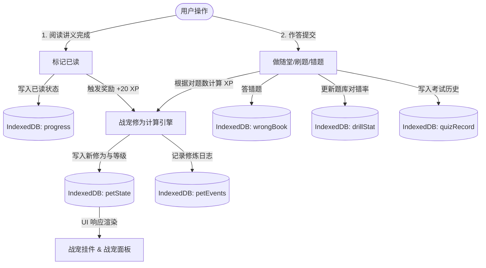

# 前端知识学习系统 · 深度需求分析与产品规格说明书 (PRD)

> 版本：v2.0  
> 日期：2026-05-23  
> 状态：正式发布  
> 平台架构：纯本地运行 (Serverless / Off-line First)

---

## 一、 产品定位与愿景

本项目是一个**纯本地运行、离线优先**的中高级前端工程化与架构学习系统。它通过沉浸式长文阅读、可视化技术地图、随堂测验、随机刷题、错题本以及创新的“修真战宠”激励体系，帮助中高级前端开发者建立系统化的前端工程化、性能优化、架构设计及交付部署的知识图谱，并能够对齐国内大厂（腾讯、阿里、字节）及国际大厂（Google、Meta）的面试与实际业务解决能力要求。

---

## 二、 系统架构与数据流动

本系统采用 `React 18` + `Vite` 作为构建与开发基础，以 `react-router-dom` 作为路由基础，核心逻辑在前端浏览器沙箱中闭环运行。

### 2.1 核心组件与页面层级

系统采用多页签/路由跳转的方式，核心页面与组件结构如下：

*   **首页 (Home)**：系统入口，集成学习进度、模块快捷访问，以及今日修炼状态（战宠卡片）。
*   **学习中心 (Learn)**：
    *   `Sidebar`：二级树状折叠侧边栏（模块 -> 讲义）。
    *   `Article`：文章渲染区域，集成 `marked.js`、`highlight.js`、`mermaid.js`，包含 TOC（目录）监听定位、沉浸式阅读模式切换。
*   **随堂作业与刷题 (Quiz)**：
    *   `QuizPage`：答题主体，包含单选、多选、判断题型的交互及选择态。
    *   `AnswerCard`：侧边答题卡，展示当前作答进度，支持快捷跳转，并支持折叠收起。
    *   `QuizResult`：答题结果页，显示正确率、得分并根据不同模式提供接续动作。
*   **错题本 (WrongBook)**：展示错题分布，按模块错题练习，消灭错题。
*   **能力地图 (Roadmap)**：根据已读讲义计算能力倾向并渲染雷达图/能力卡片。
*   **技术破冰地图 (TechBreakerMap)**：基于 Obsidian Canvas 数据源渲染的拓扑连线画布，支持拖拽、缩放、重置，支持点击节点阅读卡片与自测。
*   **学习战宠面板 (PetPanel)**：修真战宠状态展示、境界变化图表、修炼日志列表。

### 2.2 数据流动图 (Data Flow)

下面的图表展示了用户从“阅读讲义”到“做题”再到“战宠获取修为”的本地数据流：

---

## 三、 核心功能模块规格说明

### 3.1 学习模块 (Learn)
1.  **侧边栏目录导航 (`Sidebar`)**：
    *   按照“模块 -> 讲义（文章）”两级层次组织。
    *   记录并实时渲染每一篇的完成状态（使用勾选图标表示已读）。
    *   支持展开与收起，且在移动端下默认折叠。
2.  **沉浸式阅读模式 (Immersive Mode)**：
    *   用户点击“沉浸模式”按钮，系统隐藏侧边栏与顶部导航，阅读器最大化，排除干扰。
    *   支持主题切换（默认黑夜/暗色，保护视力）。
3.  **Markdown 与富文本渲染**：
    *   利用 `marked.js` 将讲义 Markdown 转换为 HTML，支持 GitHub 风格警示框（Alerts）及表格。
    *   集成 `highlight.js` 实现讲义中代码块（JavaScript/CSS/YAML 等）的语法高亮。
    *   集成 `mermaid.js` 解析讲义中的流程图、时序图等，自动渲染为 SVG 矢量图。
4.  **目录导航 (`ArticleToc`)**：
    *   页面滚动时，自动监听当前可视区域内的 H2/H3 标题，高亮 TOC 中对应条目。
    *   点击目录条目平滑滚动 (`behavior: 'smooth'`) 定位至相应位置。

### 3.2 随堂作业模块 (Doc Quiz)
1.  **触发条件**：阅读完当前讲义，点击底部“标记已读并开始随堂作业”或“做随堂作业”。
2.  **题目来源**：该讲义专属绑定的测验题目（5-10题）。
3.  **作答交互**：
    *   逐题作答，支持单选、多选、判断题。
    *   选择选项后，多选题需点击“确认选择”，单选与判断自动判定。
    *   答完立即给出官方解析，高亮显示正确答案。
4.  **答案卡片规格 (按 2026-05-14 需求变更统一)**：
    *   使用浅灰背景容器封装。
    *   内容按固定顺序排列：
        1.  `正确答案：[选项值]`（选项字母高亮）
        2.  `官方解析：[文本]`
        3.  `知识点：[标签列表]`
        4.  `关联题目：[可点击跳转的题目链接]`
    *   文本标签加粗以区分正文，链接点击行为正确。
5.  **结果展示**：展示得分、正确率、根据不同等级给予“突破/精进”评语。同时包含直接跳转下一篇讲义的快捷入口。

### 3.3 模块刷题模块 (Drill)
1.  **模式介绍**：不限单篇讲义，将整个模块（如“性能诊断”或“工程化工具链”）下的所有题目混合。
2.  **出题机制**：随机打乱题目顺序，支持限制练习题数（如 10 题、20 题或全部）。
3.  **数据沉淀**：每次练习的对错记录都将折算并写入 `drillStat` IndexedDB 表，用于更新该题的对错率统计。

### 3.4 错题本模块 (Wrong Book)
1.  **错题收集**：只要在随堂测试、随机刷题或错题重练中答错的题目，系统会自动将其插入错题本数据库。
2.  **消灭错题**：用户可以对错题发起重新训练。一旦在错题重练中回答正确，该题将自动从错题本中移出。
3.  **复习闭环**：错题解析部分展示“推荐阅读”链接（如 `模块名称 / 讲义标题`），点击可以直接跳回对应讲义的特定位置进行重读。

### 3.5 核心激励体系：修真战宠 (Pet)
本系统内置了一套创新的“修仙”成长战宠激励系统，用于提高用户的学习粘性。

1.  **修炼境界 (`PET_STAGES`)**：
    战宠共拥有 12 个成长境界，境界提升基于累计修为（XP）：
    *   `启灵` 阶段：**灵蛋初现** (XP >= 0) -> **灵纹开裂** (XP >= 60)
    *   `炼气` 阶段：**炼气入门** (XP >= 150) -> **炼气中期** (XP >= 280)
    *   `筑基` 阶段：**筑基初期** (XP >= 460) -> **筑基中期** (XP >= 700) -> **筑基圆满** (XP >= 1000)
    *   `结丹` 阶段：**结丹初期** (XP >= 1380) -> **结丹中期** (XP >= 1840) -> **结丹圆满** (XP >= 2380)
    *   `元婴` 阶段：**元婴初成** (XP >= 3000)
    *   `化神` 阶段：**化神守护** (XP >= 3720，最高圆满)

2.  **修为值 (XP) 获取规则**：
    *   **阅读文档**：读完一篇新讲义，修为 +20 XP（吸收灵气）。
    *   **随堂作业**：基础 15 XP + 答对每题 +3 XP，满分额外奖励 20 XP（小周天运行/顿悟突破）。
    *   **模块刷题**：基础 20 XP + 答对每题 +3 XP，满分额外奖励 20 XP（实战历练/顿悟突破）。
    *   **错题本重练**：基础 35 XP + 答对每题 +5 XP，满分额外奖励 20 XP（斩心魔/顿悟突破）。
    *   **破冰自测**：基础 12 XP + 答对每题 +2 XP，满分额外奖励 20 XP（破冰试炼/顿悟突破）。
    *   **闭关连修天数 (Streak)**：跨天首次学习会使 `streak` +1，并额外奖励 10 XP（连修奖励）。若中断，则连修天数重置为 1。

3.  **战宠事件与交互**：
    *   **挂件**：在系统右下角常驻显示战宠当前形态头像、境界名称及经验进度条。
    *   **战宠面板**：展示战宠高清图、详细文案、累计修为、今日所获修为、连修天数、全境界解锁路线，以及最近 12 条修炼日志（突破境界、获得经验等）。

### 3.6 可视化学习：技术破冰地图 (TechBreakerMap)
该模块是系统的特色功能，通过图形化交互展示前端全景大图。

1.  **画布机制**：
    *   系统读取 `/技术破冰/技术破冰.canvas` 文件（Obsidian 标准 Canvas 格式）。
    *   使用 SVG 渲染节点连线（贝塞尔曲线），渲染卡片节点和文本说明节点。
    *   支持使用鼠标拖拽节点坐标；支持滚轮对画布进行无限缩放；支持双击/适配按钮对准视口。
2.  **位置持久化**：
    *   拖拽后的节点坐标以及视口缩放比例 (scale)、偏移量 (x, y) 实时存入本地 `localStorage`，确保用户下次进入时保持相同视图布局。
3.  **测验联结**：
    *   点击地图上的卡片节点会触发弹窗展现其详细内容，并可以直接发起“破冰自测”。

---

## 四、 本地存储数据模型 (IndexedDB Schema)

系统基于浏览器原生 `IndexedDB` 实现了无服务持久化方案。

*   **数据库名**：`learnDb`
*   **版本**：`1`

### 4.1 数据表设计 (Object Stores)

| Store 名称 | 键 (Key Path) | 描述 | 数据项示例结构 |
| :--- | :--- | :--- | :--- |
| **`progress`** | `id` (字符串, 格式: `moduleId__docIdx`) | 讲义已读进度缓存。 | `{ id: "performance-diagnostics__0", done: true }` |
| **`quizRecord`** | `id` (自增主键) | 测验考试记录历史。 | `{ id: 1, type: "doc", moduleId: "testing-quality", docIdx: 1, score: 5, total: 5, answers: { 0: [1], 1: 0 }, timestamp: 1716382100000 }` |
| **`drillStat`** | `id` (qid, 字符串, 格式: `[module]__[doc]__[idx]`) | 刷题记录，用来统计各题对错率。 | `{ id: "security__csrf__2", correctCount: 5, wrongCount: 1, lastResult: "correct" }` |
| **`wrongBook`** | `id` (qid, 字符串) | 错题本，存储错错题数据，支持快速发起错题重练。 | `{ id: "security__csrf__2", moduleId: "security", docIdx: 1, type: "multiple", question: "...", options: [...], answer: [...], explain: "...", wrongCount: 2, userAnswers: [0], updatedAt: 1716382100000 }` |
| **`petState`** | 固定为 `"learning-pet"` | 存储战宠的当前修行基础数据。 | `{ id: "learning-pet", xp: 1200, todayXp: 120, streak: 5, lastStudyDate: "2026-05-23", updatedAt: 1716382100000 }` |
| **`petEvents`** | `id` (时间戳+随机数) | 战宠修行日志事件（如获得XP、境界突破）。最多存储 12 条。 | `{ id: "1716382100000-xyz", title: "吸收灵气", detail: "读完「CSRF防护最佳实践」，修为 +20", xp: 1220, stageIndex: 6, date: "2026-05-23", time: 1716382100000 }` |

---

## 五、 系统非功能性与工程细节

### 5.1 构建与部署规格
*   **Vite Base Path**：生产环境下 base path 设定为 `/frontend-learning-system/`，适配 GitHub Pages 托管。
*   **404.html 复制机制**：
    *   因为系统基于单页应用 (SPA) 的客户端路由渲染，刷新非根路径会导致 GitHub Pages 服务端 404。
    *   项目在 build 脚本中增加了 `node scripts/create-pages-404.mjs`。
    *   该脚本会在打包产物目录中拷贝一份 `index.html` 命名为 `404.html`，结合 `index.html` 顶部的重定向跳转脚本，实现 GitHub Pages SPA 刷新不丢失路由。

### 5.2 UI/UX 规范
*   **配色方案**：全局暗黑风格（深蓝/深灰色底 `#0f1117`、主色紫色 `#6c63ff`、辅助色青色 `#4ecdc4`）。
*   **微交互**：按钮与卡片均需包含 Hover 微放大或边框发光动效；战宠挂件具备渐显与缩放动画。
*   **多端自适应**：
    *   桌面端：三栏式布局（左侧侧边栏、中间阅读内容区、右侧 TOC/答题卡区）。
    *   移动端：隐藏侧边栏与 TOC，底部弹出轻量式折叠答题卡，优化阅读屏占比。

### 5.3 Git 提交安全规范与本地私有资源防护
为了避免个人私有资料、本地未成熟的草稿或商业敏感文档被意外推送到 GitHub 远程公开仓库，系统开发及版本迭代中必须遵守以下安全提交规范：

1.  **本地私有/排除资源界定**：
    *   **项目规划与笔记**：`需求文档/` 文件夹（包括 PRD 及排期文档）。
    *   **本地未成熟的讲义**：`学习系统/docs/博客文档/React/`、`学习系统/docs/博客文档/工程化/`、`学习系统/docs/博客文档/性能优化/` 等目录中仅存放在本地供个人阅读的素材。
    *   **开发临时资产**：各类临时的 `.ipynb` 实验代码或本地 `.env` 变量配置文件。
2.  **安全提交操作规范**：
    *   **禁止无差别提交**：严禁在未检查状态时直接执行 `git add .` 或 `git commit -a`。
    *   **精准暂存**：必须显式指定需要更新的文件，例如 `git add 学习系统/index.html`，以确保提交文件的边界是 100% 受控和安全的。
    *   **临时切换与 Stash 保护**：若需切换分支或拉取代码，对于不希望提交的本地修改，必须使用 `git stash` 临时放入堆栈，并在操作完成后通过 `git stash pop` 恢复，严禁直接将其合入主分支。
3.  **忽略机制保障 (.gitignore)**：
    *   任何不想要上线的私有资源，必须在根目录的 `.gitignore` 中声明。对于前述 1 中涉及的本地目录，开发时应确保其路径被正确过滤阻断。
